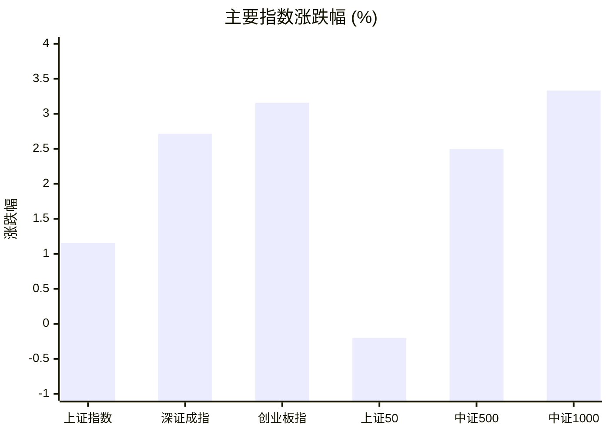
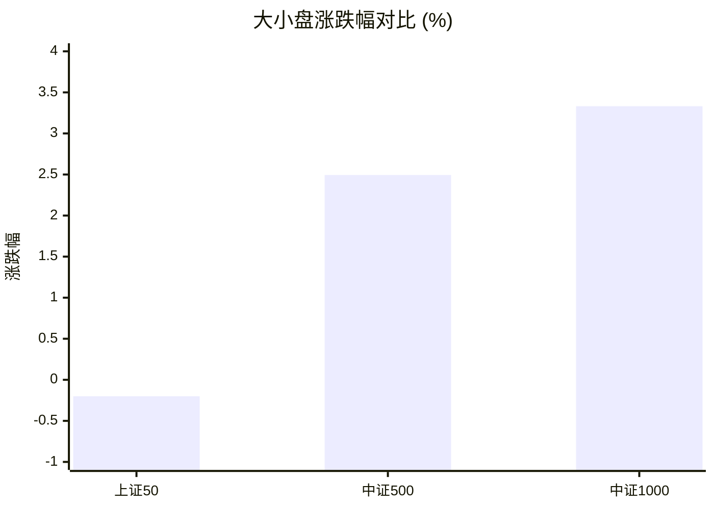
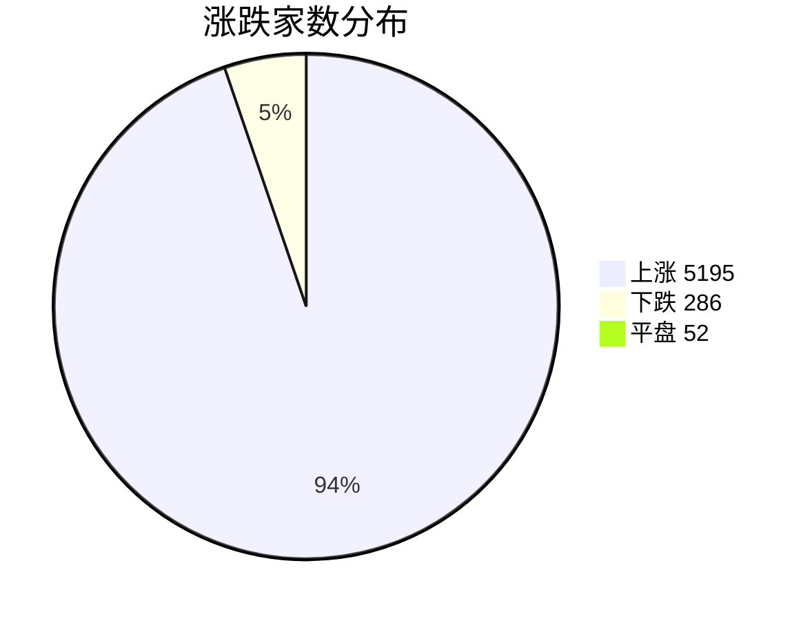
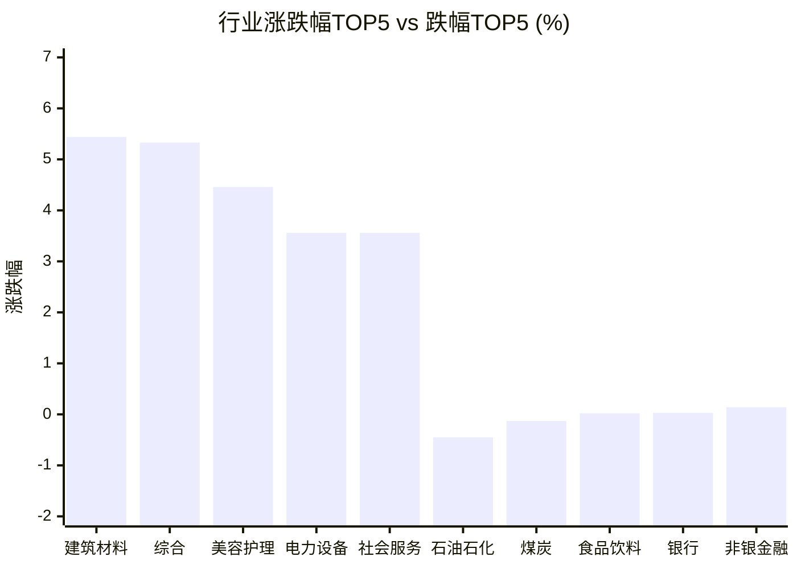

# 📊 A股收盘简报 | 2026-07-27 周一

---

## 📈 一、大盘概况

2026年07月27日 是 A 股交易日，收盘数据已可用。

### 主要指数表现

| 指数 | 收盘价 | 涨跌幅 | 涨跌点 | 成交额(亿) | 前收盘 | 开盘 | 最高 | 最低 |
|------|--------|--------|--------|-----------|--------|------|------|------|
| 上证指数 | 3858.25 | **▲+1.15%** | +44.05 | 10313.12亿 | 3814.20 | 3808.90 | 3858.31 | 3793.45 |
| 深证成指 | 14148.73 | **▲+2.72%** | +374.05 | 10453.08亿 | 13774.68 | 13768.60 | 14148.73 | 13689.01 |
| 创业板指 | 3590.79 | **▲+3.16%** | +109.92 | 4807.77亿 | 3480.87 | 3482.04 | 3592.10 | 3449.21 |
| 上证50 | 2950.43 | **▼0.20%** | -5.92 | 1740.01亿 | 2956.35 | 2976.92 | 2976.92 | 2919.46 |
| 中证500 | 7720.60 | **▲+2.49%** | +187.90 | 4056.37亿 | 7532.70 | 7512.40 | 7721.40 | 7466.54 |
| 中证1000 | 7228.78 | **▲+3.33%** | +233.09 | 3900.90亿 | 6995.69 | 6981.16 | 7228.78 | 6972.28 |

### 市场整体成交

- **沪深合计成交额**: **20766.20亿**
- **较前日放量** 1454.80亿（+7.5%）

---

## 📊 二、指数涨跌幅对比

---

## 📊 三、市值结构 — 大小盘对比

| 指数 | 涨跌幅 | 特征 |
|------|--------|------|
| 上证50 | **▼0.20%** | 超大盘 |
| 中证500 | **▲+2.49%** | 中盘 |
| 中证1000 | **▲+3.33%** | 小盘 |

> 📌 **小盘强势领跑**，中证500/中证1000涨幅远超上证50，资金向中小市值扩散。

---

## 📉 四、市场广度
### 涨跌家数分布

### 关键统计

| 指标 | 数值 |
|------|------|
| 上涨家数 | 5195 |
| 下跌家数 | 286 |
| 平盘家数 | 52 |
| 涨停家数 | 121 |
| 跌停家数 | 7 |
| 全市场中位数 | **▲+2.72%** |

---
## 🏢 五、行业表现

### 🔥 涨幅榜 TOP 10

| 排名 | 行业(申万一级) | 涨跌幅 |
|------|---------------|--------|
| 🥇 | 建筑材料(申万) | **▲+5.44%** |
| 🥈 | 综合(申万) | **▲+5.33%** |
| 🥉 | 美容护理(申万) | **▲+4.46%** |
| 4 | 电力设备(申万) | **▲+3.56%** |
| 5 | 社会服务(申万) | **▲+3.56%** |
| 6 | 传媒(申万) | **▲+3.33%** |
| 7 | 纺织服饰(申万) | **▲+3.22%** |
| 8 | 机械设备(申万) | **▲+3.00%** |
| 9 | 通信(申万) | **▲+2.85%** |
| 10 | 计算机(申万) | **▲+2.72%** |

### ❄️ 跌幅榜 TOP 10

| 排名 | 行业(申万一级) | 涨跌幅 |
|------|---------------|--------|
| 31 | 石油石化(申万) | **▼0.45%** |
| 30 | 煤炭(申万) | **▼0.13%** |
| 29 | 食品饮料(申万) | **▲+0.02%** |
| 28 | 银行(申万) | **▲+0.03%** |
| 27 | 非银金融(申万) | **▲+0.14%** |
| 26 | 公用事业(申万) | **▲+0.61%** |
| 25 | 家用电器(申万) | **▲+0.93%** |
| 24 | 交通运输(申万) | **▲+1.18%** |
| 23 | 农林牧渔(申万) | **▲+1.64%** |
| 22 | 钢铁(申万) | **▲+1.71%** |

> 📈 **行业普涨**，多数板块收红。 涨幅第一：**建筑材料(申万)**（+5.44%）。 跌幅第一：**石油石化(申万)**（-0.45%）。

---

## 💡 六、热门概念

| 概念 | 涨跌幅 |
|------|--------|
| 玻璃纤维指数 | **▲+9.19%** |
| 覆铜板指数 | **▲+7.01%** |
| 电子布指数 | **▲+6.70%** |
| 六氟化钨指数 | **▲+6.63%** |
| 脑机接口指数 | **▲+5.85%** |
| 电路板指数 | **▲+5.44%** |
| 锂电电解液指数 | **▲+5.14%** |
| 机器视觉指数 | **▲+5.13%** |
| 外骨骼机器人指数 | **▲+4.90%** |
| 半导体材料指数 | **▲+4.81%** |

> 📌 今日热门概念集中在 **玻璃纤维指数**（+9.19%） 等方向。

---

## 💰 七、资金流向

### 主力资金概况

| 指标 | 数值(亿元) |
|------|------|
| 主力资金净流入 | 801.90 |

### 资金流入行业 TOP5

| 行业 | 净流入(亿元) |
|------|--------|
| 电力设备 | 103.16 |
| 医药生物 | 91.16 |
| 机械设备 | 70.30 |
| 计算机 | 52.79 |
| 基础化工 | 48.59 |

> 🟢 **主力资金大幅净流入**，市场做多意愿强烈。

---

## 🌍 八、周边市场

| 指数 | 涨跌幅 |
|------|--------|
| 恒生指数 | **▲+1.03%** |
| 道琼斯工业平均 | **▲+0.46%** |
| 标普500 | **▲+0.05%** |
| 纳斯达克指数 | **▼0.64%** |

> 📌 全球市场多数上涨，外围情绪偏暖。

---

## 📊 九、期货市场

| 品种 | 涨跌幅 |
|------|--------|
| IC2608 | **▲+2.60%** |
| IC2609 | **▲+2.82%** |
| IC2612 | **▲+3.00%** |
| IC2703 | **▲+3.09%** |
| IF2608 | **▲+1.20%** |
| IF2609 | **▲+1.25%** |
| IF2612 | **▲+1.32%** |
| IF2703 | **▲+1.30%** |
| IH2608 | **▲+0.22%** |
| IH2609 | **▲+0.24%** |

---

## 📰 十、财经要闻

- A股收评 | 多利好助力！A股放量普涨，创指大涨超3%，5100家个股上涨
- 财联社7月27日午间新闻精选
- A股午评 | 多利好助力A股！创指涨超1%，4900家个股上涨，算力硬件走强
- 长鑫科技半日成交1221亿，暴涨531%登顶A股“新一哥”，市值超越英特尔
- 诚通证券早报 | 7月27日资讯聚焦一文全掌握

---

## 🤖 十一、盘面结论

> 分析来源：AI Agent

**一句话定性：市场呈现放量普涨、中小市值显著占优的风险偏好修复。**

- 证据：沪深合计成交额 20766.20 亿元，较前日增加 1454.80 亿元（+7.5%）；上证指数、深证成指和创业板指分别上涨 1.15%、2.72% 和 3.16%。
- 证据：5195 家上涨、286 家下跌，涨停 121 家、跌停 7 家，全市场中位数上涨 2.72%，广度与指数表现同向。
- 证据：中证500和中证1000分别上涨 2.49% 和 3.33%，强于下跌 0.20% 的上证50；建筑材料、电力设备、机械设备分别上涨 5.44%、3.56%、3.00%。

---

## 🎯 十二、主线轮动

1. **材料及电子材料方向 | 加速 | 盘面已验证**
   - 盘面证据：建筑材料上涨 5.44%；玻璃纤维、覆铜板、电子布和半导体材料概念分别上涨 9.19%、7.01%、6.70% 和 4.81%。
   - 催化验证：当日仅确认上述行业与概念的结构化涨幅，未将财经新闻标题作为上涨原因。
   - 确认条件：后续报告中建筑材料及上述电子材料概念继续位于涨幅靠前位置。
   - 失效条件：建筑材料转弱，且上述电子材料概念不再维持相对强势。

2. **新能源设备与智能制造方向 | 发酵 | 盘面已验证**
   - 盘面证据：电力设备上涨 3.56%、机械设备上涨 3.00%；锂电电解液、机器视觉和外骨骼机器人概念分别上涨 5.14%、5.13% 和 4.90%。
   - 催化验证：当日仅确认行业和概念涨幅的同向表现，未对消息面作因果归因。
   - 确认条件：后续报告中电力设备、机械设备及相关概念继续获得涨幅榜支持。
   - 失效条件：相关行业与概念同步走弱，且不再位于市场强势方向。

---

## 🔍 十三、明日关注

1. **观察对象：市场广度与成交额。** 确认信号：上涨家数继续显著多于下跌家数，且沪深成交额维持放量。失效信号：上涨家数优势收窄并伴随成交额回落。
2. **观察对象：中小市值相对强度。** 确认信号：中证500和中证1000继续强于上证50。失效信号：中证500、中证1000相对上证50的强势消失或转弱。
3. **观察对象：材料及电子材料方向。** 确认信号：建筑材料与玻璃纤维、覆铜板、电子布等概念继续处于涨幅靠前位置。失效信号：相关行业和概念整体回落，不再处于市场强势方向。

---

## 📌 数据来源与免责声明

- **数据来源**：万得 Wind 金融数据服务
- **数据日期**：2026-07-27 收盘
- **生成时间**：2026年07月27日
- **免责声明**：本简报基于 Wind 数据自动生成，AI 分析部分（如有）仅供参考，不构成任何投资建议。市场有风险，投资需谨慎。
