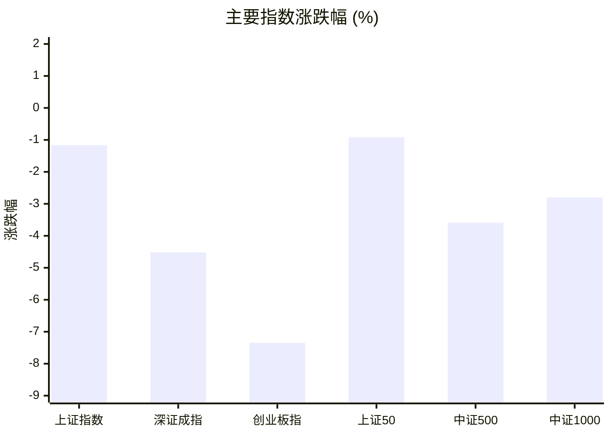
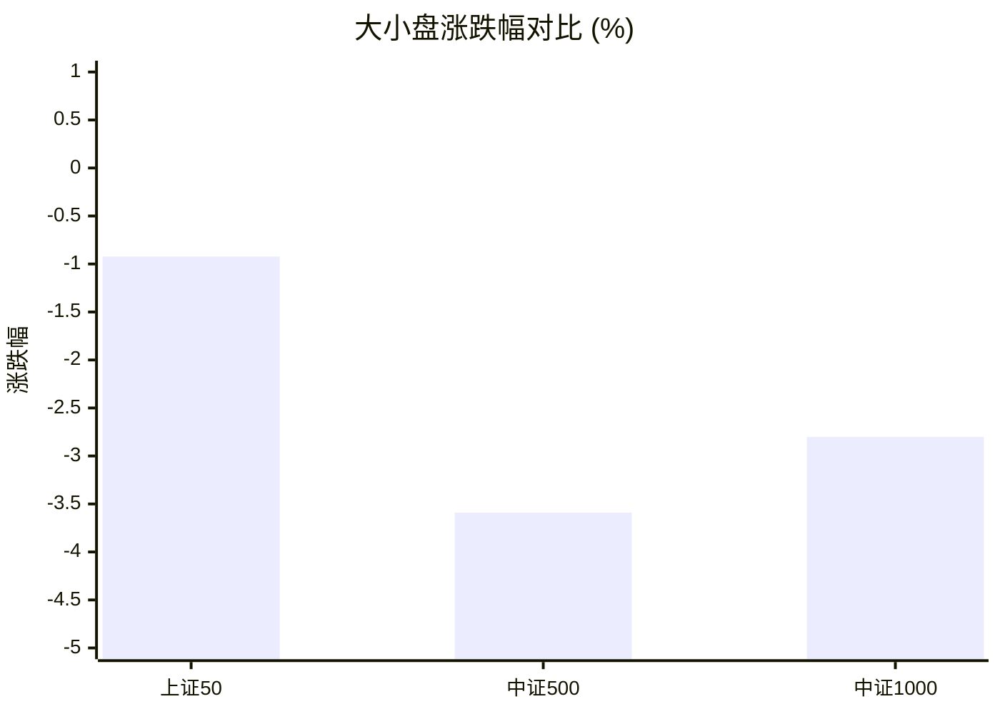
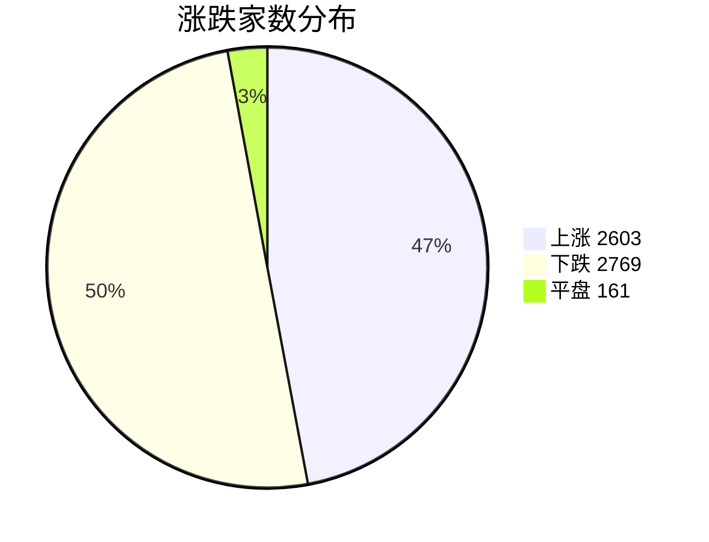
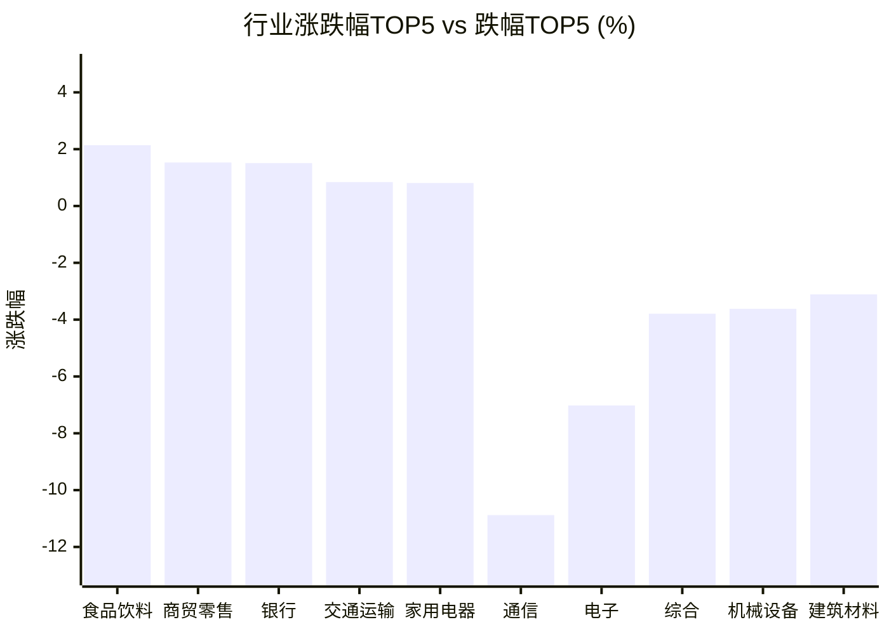

# 📊 A股收盘简报 | 2026-07-28 周二

---

## 📈 一、大盘概况

2026年07月28日 是 A 股交易日，收盘数据已可用。

### 主要指数表现

| 指数 | 收盘价 | 涨跌幅 | 涨跌点 | 成交额(亿) | 前收盘 | 开盘 | 最高 | 最低 |
|------|--------|--------|--------|-----------|--------|------|------|------|
| 上证指数 | 3813.31 | **▼1.16%** | -44.94 | 9496.83亿 | 3858.25 | 3823.13 | 3844.01 | 3797.37 |
| 深证成指 | 13509.68 | **▼4.52%** | -639.05 | 10760.98亿 | 14148.73 | 13830.35 | 13940.99 | 13470.11 |
| 创业板指 | 3327.03 | **▼7.35%** | -263.76 | 5200.80亿 | 3590.79 | 3478.86 | 3511.70 | 3312.30 |
| 上证50 | 2923.21 | **▼0.92%** | -27.22 | 1806.32亿 | 2950.43 | 2921.31 | 2931.15 | 2901.73 |
| 中证500 | 7443.43 | **▼3.59%** | -277.17 | 3898.09亿 | 7720.60 | 7589.76 | 7646.02 | 7412.63 |
| 中证1000 | 7026.28 | **▼2.80%** | -202.50 | 3937.67亿 | 7228.78 | 7135.73 | 7189.18 | 6992.94 |

### 市场整体成交

- **沪深合计成交额**: **20257.81亿**
- **较前日缩量** 508.40亿（-2.4%）

---

## 📊 二、指数涨跌幅对比

---

## 📊 三、市值结构 — 大小盘对比

| 指数 | 涨跌幅 | 特征 |
|------|--------|------|
| 上证50 | **▼0.92%** | 超大盘 |
| 中证500 | **▼3.59%** | 中盘 |
| 中证1000 | **▼2.80%** | 小盘 |

> 📌 **大盘蓝筹占优**，上证50领涨，市场偏好核心资产。

---

## 📉 四、市场广度
### 涨跌家数分布

### 关键统计

| 指标 | 数值 |
|------|------|
| 上涨家数 | 2603 |
| 下跌家数 | 2769 |
| 平盘家数 | 161 |
| 涨停家数 | 68 |
| 跌停家数 | 52 |
| 全市场中位数 | **▼0.03%** |

---
## 🏢 五、行业表现

### 🔥 涨幅榜 TOP 10

| 排名 | 行业(申万一级) | 涨跌幅 |
|------|---------------|--------|
| 🥇 | 食品饮料(申万) | **▲+2.14%** |
| 🥈 | 商贸零售(申万) | **▲+1.53%** |
| 🥉 | 银行(申万) | **▲+1.51%** |
| 4 | 交通运输(申万) | **▲+0.84%** |
| 5 | 家用电器(申万) | **▲+0.81%** |
| 6 | 纺织服饰(申万) | **▲+0.80%** |
| 7 | 社会服务(申万) | **▲+0.66%** |
| 8 | 美容护理(申万) | **▲+0.56%** |
| 9 | 房地产(申万) | **▲+0.53%** |
| 10 | 农林牧渔(申万) | **▲+0.38%** |

### ❄️ 跌幅榜 TOP 10

| 排名 | 行业(申万一级) | 涨跌幅 |
|------|---------------|--------|
| 31 | 通信(申万) | **▼10.88%** |
| 30 | 电子(申万) | **▼7.02%** |
| 29 | 综合(申万) | **▼3.79%** |
| 28 | 机械设备(申万) | **▼3.62%** |
| 27 | 建筑材料(申万) | **▼3.11%** |
| 26 | 电力设备(申万) | **▼2.63%** |
| 25 | 国防军工(申万) | **▼2.42%** |
| 24 | 有色金属(申万) | **▼2.12%** |
| 23 | 基础化工(申万) | **▼1.28%** |
| 22 | 医药生物(申万) | **▼1.20%** |

> 📊 **行业分化明显**，12涨/19跌。 涨幅第一：**食品饮料(申万)**（+2.14%）。 跌幅第一：**通信(申万)**（-10.88%）。

---

## 💡 六、热门概念

| 概念 | 涨跌幅 |
|------|--------|
| 乳业指数 | **▲+3.06%** |
| 稳定币指数 | **▲+2.76%** |
| 财税数字化指数 | **▲+2.75%** |
| 医保支付改革指数 | **▲+2.73%** |
| 跨境支付指数 | **▲+2.71%** |
| 加密货币指数 | **▲+2.50%** |
| 白酒指数 | **▲+2.31%** |
| 饮料制造精选指数 | **▲+2.30%** |
| 华为HMS指数 | **▲+2.27%** |
| 金融科技指数 | **▲+2.20%** |

> 📌 今日热门概念集中在 **乳业指数**（+3.06%） 等方向。

---

## 💰 七、资金流向

### 主力资金概况

| 指标 | 数值(亿元) |
|------|------|
| 主力资金净流入 | -649.96 |

### 资金流入行业 TOP5

| 行业 | 净流入(亿元) |
|------|--------|
| 银行 | 41.09 |
| 食品饮料 | 30.03 |
| 计算机 | 16.71 |
| 交通运输 | 12.02 |
| 传媒 | 11.24 |

> 🔴 **主力资金大幅净流出**，市场谨慎情绪升温。

---

## 🌍 八、周边市场

| 指数 | 涨跌幅 |
|------|--------|
| 道琼斯工业平均 | **▲+0.51%** |
| 恒生指数 | **▲+0.41%** |
| 标普500 | **▲+0.02%** |
| 纳斯达克指数 | **▼0.18%** |

> 📌 全球市场多数上涨，外围情绪偏暖。

---

## 📊 九、期货市场

| 品种 | 涨跌幅 |
|------|--------|
| IC2608 | **▼3.31%** |
| IC2609 | **▼3.31%** |
| IC2612 | **▼3.33%** |
| IC2703 | **▼3.50%** |
| IF2608 | **▼2.37%** |
| IF2609 | **▼2.48%** |
| IF2612 | **▼2.55%** |
| IF2703 | **▼2.52%** |
| IH2608 | **▼0.84%** |
| IH2609 | **▼0.91%** |

---

## 📰 十、财经要闻

- 【A股午间收盘快报】 沪指下跌0.98% 食品饮料、白酒走强 科技股重挫
- 陆家嘴财经早餐2026年7月28日星期二
- A股每日行情复盘（7月28日）
- 财联社7月28日午间新闻精选
- 国内股指、国债、商品期货收盘综述（7月28日）

---

## 🤖 十一、盘面结论

> 分析来源：AI Agent

一句话定性：市场呈现指数普跌下的显著结构分化，防御与消费方向相对占优，科技成长方向承压。

- 证据：六项主要指数均收跌，创业板指下跌 7.35%、深证成指下跌 4.52%，上证50仅下跌 0.92%，大盘蓝筹相对抗跌。
- 证据：全市场上涨 2603 家、下跌 2769 家，中位数下跌 0.03%，但涨停 68 家、跌停 52 家，显示个股层面并非单向普跌，分化仍在延续。
- 证据：食品饮料、商贸零售和银行分别上涨 2.14%、1.53% 和 1.51%，通信和电子分别下跌 10.88% 和 7.02%；主力资金净流出 649.96 亿元，而银行与食品饮料位居行业净流入前列。上述数据支持防御偏好抬升的判断。

---

## 🎯 十二、主线轮动

1. **消费防御（发酵/加速）**：食品饮料上涨 2.14%，乳业、白酒和饮料制造精选等概念位居热门概念涨幅前列，食品饮料行业同时录得 30.03 亿元净流入。催化验证为消费相关行业与概念继续同步居前；确认条件为食品饮料维持行业涨幅榜前列且相关概念保持强势；失效条件为食品饮料转入行业跌幅榜或相关概念不再居于涨幅前列。
2. **金融防御（待确认）**：银行上涨 1.51%，并以 41.09 亿元位居行业净流入首位，稳定币、跨境支付和金融科技等概念亦在涨幅榜。盘面已验证银行的相对强势，概念表现只能作为候选印证；确认条件为银行继续位于行业涨幅榜并保持行业资金净流入；失效条件为银行转入行业跌幅榜或出现行业资金净流出。

---

## 🔍 十三、明日关注

1. **观察对象：主要指数与成交额。**确认信号：上证50继续相对中证500和中证1000抗跌，且沪深成交额止跌回升；失效信号：上证50的相对表现转弱，同时成交额继续缩减。
2. **观察对象：食品饮料和银行。**确认信号：两者继续位于行业涨幅榜，且维持行业资金净流入；失效信号：任一方向转入行业跌幅榜或行业资金由净流入转为净流出。
3. **观察对象：通信与电子。**确认信号：跌幅收敛、脱离行业跌幅榜前列，并伴随上涨家数增加、跌停家数减少；失效信号：两行业继续居于行业跌幅榜前列，且下跌家数增加或跌停家数增加。

---

## 📌 数据来源与免责声明

- **数据来源**：万得 Wind 金融数据服务
- **数据日期**：2026-07-28 收盘
- **生成时间**：2026年07月28日
- **免责声明**：本简报基于 Wind 数据自动生成，AI 分析部分（如有）仅供参考，不构成任何投资建议。市场有风险，投资需谨慎。
