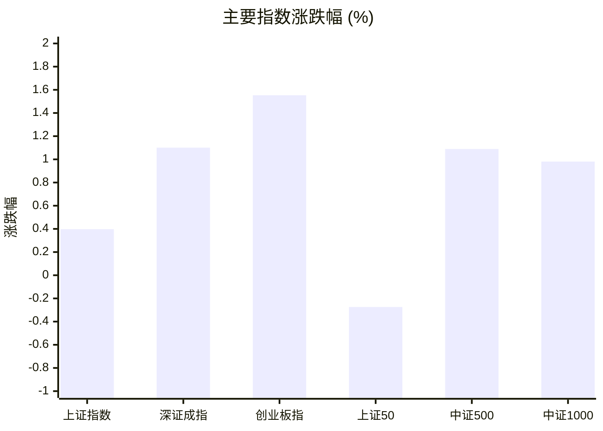
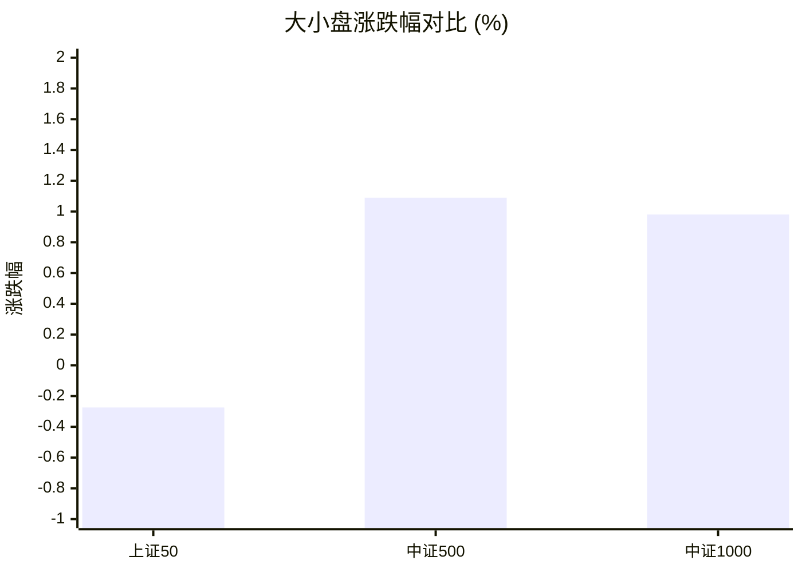
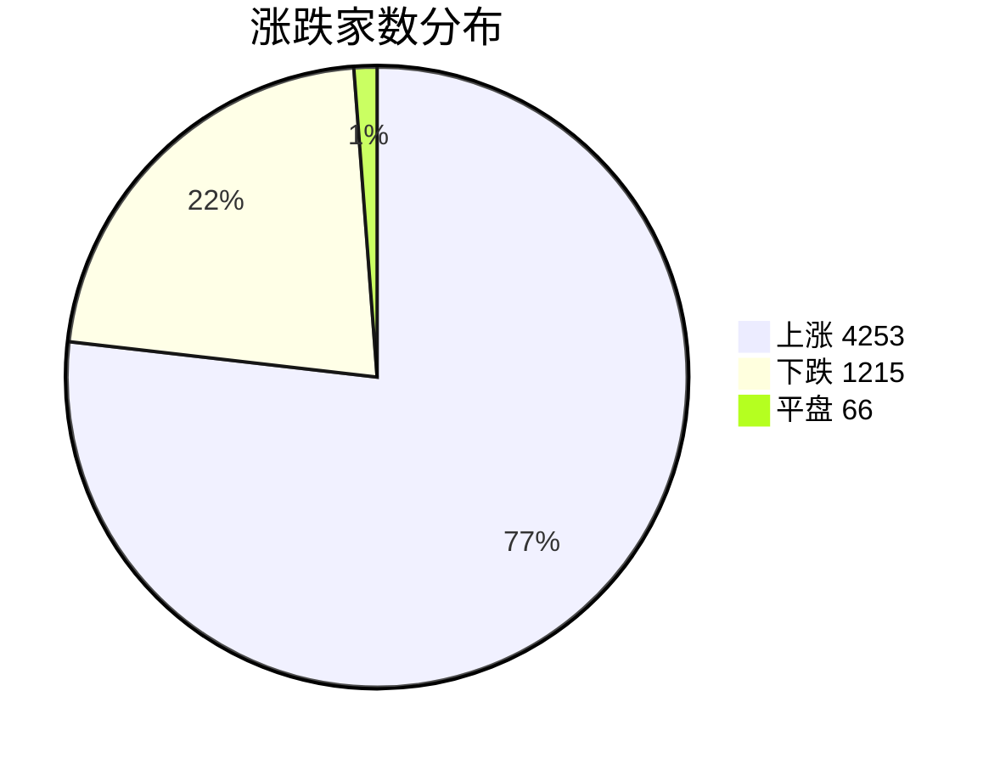
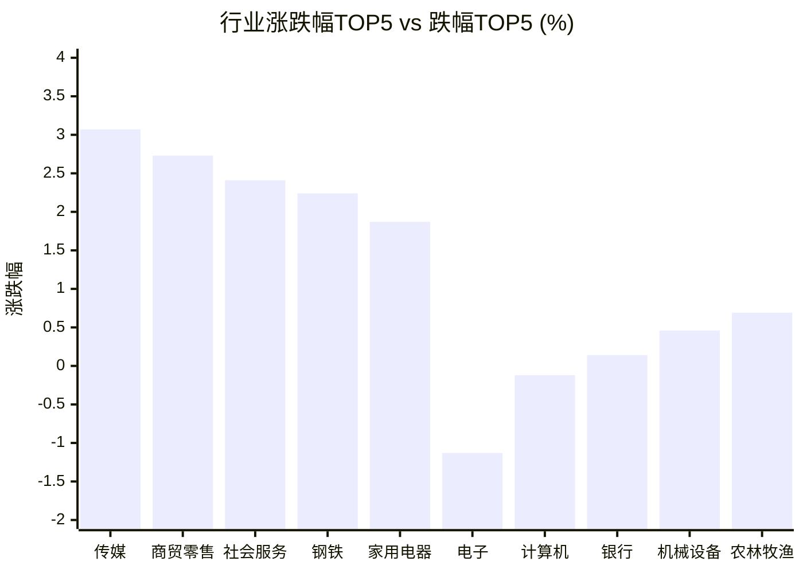

# 📊 A股收盘简报 | 2026-07-29 周三

---

## 📈 一、大盘概况

2026年07月29日 是 A 股交易日，收盘数据已可用。

### 主要指数表现

| 指数 | 收盘价 | 涨跌幅 | 涨跌点 | 成交额(亿) | 前收盘 | 开盘 | 最高 | 最低 |
|------|--------|--------|--------|-----------|--------|------|------|------|
| 上证指数 | 3828.47 | **▲+0.40%** | +15.16 | 10874.08亿 | 3813.31 | 3823.29 | 3845.77 | 3782.48 |
| 深证成指 | 13658.44 | **▲+1.10%** | +148.76 | 12091.71亿 | 13509.68 | 13498.75 | 13756.71 | 13267.64 |
| 创业板指 | 3378.70 | **▲+1.55%** | +51.67 | 5659.33亿 | 3327.03 | 3333.48 | 3411.03 | 3249.65 |
| 上证50 | 2915.19 | **▼0.27%** | -8.02 | 2199.11亿 | 2923.21 | 2948.71 | 2948.71 | 2885.19 |
| 中证500 | 7524.51 | **▲+1.09%** | +81.08 | 4513.33亿 | 7443.43 | 7444.80 | 7572.81 | 7325.36 |
| 中证1000 | 7095.19 | **▲+0.98%** | +68.91 | 4588.80亿 | 7026.28 | 7020.22 | 7132.35 | 6897.39 |

### 市场整体成交

- **沪深合计成交额**: **22965.79亿**
- **较前日放量** 2707.98亿（+13.4%）

---

## 📊 二、指数涨跌幅对比

---

## 📊 三、市值结构 — 大小盘对比

| 指数 | 涨跌幅 | 特征 |
|------|--------|------|
| 上证50 | **▼0.27%** | 超大盘 |
| 中证500 | **▲+1.09%** | 中盘 |
| 中证1000 | **▲+0.98%** | 小盘 |

> 📌 **小盘强势领跑**，中证500/中证1000涨幅远超上证50，资金向中小市值扩散。

---

## 📉 四、市场广度
### 涨跌家数分布

### 关键统计

| 指标 | 数值 |
|------|------|
| 上涨家数 | 4253 |
| 下跌家数 | 1215 |
| 平盘家数 | 66 |
| 涨停家数 | 86 |
| 跌停家数 | 12 |
| 全市场中位数 | **▲+1.57%** |

---
## 🏢 五、行业表现

### 🔥 涨幅榜 TOP 10

| 排名 | 行业(申万一级) | 涨跌幅 |
|------|---------------|--------|
| 🥇 | 传媒(申万) | **▲+3.07%** |
| 🥈 | 商贸零售(申万) | **▲+2.73%** |
| 🥉 | 社会服务(申万) | **▲+2.41%** |
| 4 | 钢铁(申万) | **▲+2.24%** |
| 5 | 家用电器(申万) | **▲+1.87%** |
| 6 | 国防军工(申万) | **▲+1.84%** |
| 7 | 汽车(申万) | **▲+1.84%** |
| 8 | 有色金属(申万) | **▲+1.80%** |
| 9 | 房地产(申万) | **▲+1.75%** |
| 10 | 食品饮料(申万) | **▲+1.42%** |

### ❄️ 跌幅榜 TOP 10

| 排名 | 行业(申万一级) | 涨跌幅 |
|------|---------------|--------|
| 31 | 电子(申万) | **▼1.13%** |
| 30 | 计算机(申万) | **▼0.12%** |
| 29 | 银行(申万) | **▲+0.14%** |
| 28 | 机械设备(申万) | **▲+0.46%** |
| 27 | 农林牧渔(申万) | **▲+0.69%** |
| 26 | 建筑装饰(申万) | **▲+0.75%** |
| 25 | 综合(申万) | **▲+0.97%** |
| 24 | 交通运输(申万) | **▲+0.98%** |
| 23 | 公用事业(申万) | **▲+1.01%** |
| 22 | 石油石化(申万) | **▲+1.05%** |

> 📈 **行业普涨**，多数板块收红。 涨幅第一：**传媒(申万)**（+3.07%）。 跌幅第一：**电子(申万)**（-1.13%）。

---

## 💡 六、热门概念

| 概念 | 涨跌幅 |
|------|--------|
| 乳业指数 | **▲+6.82%** |
| 炒股软件指数 | **▲+4.85%** |
| 汽车整车精选指数 | **▲+4.05%** |
| 盐湖提锂指数 | **▲+3.54%** |
| 水泥制造精选指数 | **▲+3.39%** |
| AI语料指数 | **▲+3.33%** |
| 网络游戏指数 | **▲+3.33%** |
| 新能源整车指数 | **▲+3.32%** |
| 锂矿指数 | **▲+3.32%** |
| 食品加工精选指数 | **▲+3.21%** |

> 📌 今日热门概念集中在 **乳业指数**（+6.82%） 等方向。

---

## 💰 七、资金流向

### 主力资金概况

| 指标 | 数值(亿元) |
|------|------|
| 主力资金净流入 | 491.53 |

### 资金流入行业 TOP5

| 行业 | 净流入(亿元) |
|------|--------|
| 电力设备 | 92.28 |
| 有色金属 | 58.78 |
| 传媒 | 45.28 |
| 非银金融 | 44.43 |
| 基础化工 | 29.95 |

> 🟢 **主力资金大幅净流入**，市场做多意愿强烈。

---

## 🌍 八、周边市场

| 指数 | 涨跌幅 |
|------|--------|
| 恒生指数 | **▲+1.77%** |
| 道琼斯工业平均 | **▲+1.03%** |
| 标普500 | **▲+0.21%** |
| 纳斯达克指数 | **▼0.22%** |
| 日经225 | **▼1.49%** |

> 📌 全球市场多数上涨，外围情绪偏暖。

---

## 📊 九、期货市场

| 品种 | 涨跌幅 |
|------|--------|
| IC2608 | **▲+1.53%** |
| IC2609 | **▲+1.76%** |
| IC2612 | **▲+2.05%** |
| IC2703 | **▲+2.23%** |
| IF2608 | **▲+0.80%** |
| IF2609 | **▲+0.88%** |
| IF2612 | **▲+0.92%** |
| IF2703 | **▲+1.03%** |
| IH2608 | **▲+0.20%** |
| IH2609 | **▲+0.09%** |

---

## 📰 十、财经要闻

- 陆家嘴财经早餐2026年7月29日星期三
- 财联社7月29日午间新闻精选
- A股午间收盘 沪指跌0.53%报3793.18点
- 7月29日证券之星午间消息汇总：回购增持！12家A股上市公司公告
- 2026年A股半年报盘点（7月29日）

---

## 🤖 十一、盘面结论

> 分析来源：AI Agent

一句话定性：市场呈现放量普涨中的风格分化，中小市值与成长指数明显强于上证50。

- 证据：六项主要指数中，深证成指上涨 1.10%、创业板指上涨 1.55%、中证500上涨 1.09%、中证1000上涨 0.98%，而上证50下跌 0.27%。这表明当日的指数表现偏向中小盘和成长端，属于盘面结构判断而非资金流向推断。
- 证据：全市场上涨 4253 家、下跌 1215 家、平盘 66 家，涨停 86 家、跌停 12 家，中位数为上涨 1.57%；行业中仅电子下跌 1.13%、计算机下跌 0.12%，广度与行业数据共同支持普涨特征。
- 证据：沪深合计成交额为 22965.79 亿元，较前日增加 2707.98 亿元（13.4%）。主力资金净流入 491.53 亿元，电力设备、有色金属和传媒分别位列行业净流入前三，显示当日成交和已列示的资金流向均偏积极。

---

## 🎯 十二、主线轮动

**消费与内容方向 | 发酵阶段**

- 盘面证据：传媒上涨 3.07%，商贸零售上涨 2.73%，社会服务上涨 2.41%；乳业指数上涨 6.82%，AI语料指数和网络游戏指数均上涨 3.33%。
- 催化验证：报告列示的行业与概念同步位于涨幅前列，盘面已验证当日强势；财经要闻未作为涨跌原因使用。
- 确认条件：下一交易日传媒、商贸零售或社会服务继续位居行业涨幅前列，且相关消费或内容概念保持强势。
- 失效条件：上述行业转入跌幅前列，且相关概念不再位居涨幅前列。

**资源与新能源制造方向 | 待确认**

- 盘面证据：有色金属上涨 1.80%，汽车上涨 1.84%；盐湖提锂指数上涨 3.54%、锂矿指数上涨 3.32%、新能源整车指数上涨 3.32%。资金流向中，电力设备净流入 92.28 亿元、有色金属净流入 58.78 亿元。
- 催化验证：行业、概念和已列示资金流向形成同向表现，但仅据单日数据，生命周期定为待确认。
- 确认条件：下一交易日有色金属或汽车继续收涨并位居行业涨幅前列，盐湖提锂、锂矿或新能源整车概念延续强势，且电力设备或有色金属继续列入资金流入行业。
- 失效条件：有色金属和汽车转入行业跌幅前列，相关概念走弱且电力设备、有色金属不再列入资金流入行业。

---

## 🔍 十三、明日关注

1. **观察对象：市场广度与成交额。** 确认信号：上涨家数继续多于下跌家数，且沪深合计成交额较前一交易日增加；失效信号：下跌家数反超上涨家数且成交额较前一交易日减少。
2. **观察对象：中小盘相对上证50的表现。** 确认信号：中证500和中证1000继续强于上证50；失效信号：上证50转为强于中证500和中证1000。
3. **观察对象：消费内容及资源新能源制造方向。** 确认信号：传媒、商贸零售、社会服务、有色金属或汽车继续位于行业涨幅前列，并有对应概念维持强势；失效信号：这些行业整体转入跌幅前列，相关概念不再位于涨幅前列。

---

## 📌 数据来源与免责声明

- **数据来源**：万得 Wind 金融数据服务
- **数据日期**：2026-07-29 收盘
- **生成时间**：2026年07月29日
- **免责声明**：本简报基于 Wind 数据自动生成，AI 分析部分（如有）仅供参考，不构成任何投资建议。市场有风险，投资需谨慎。
