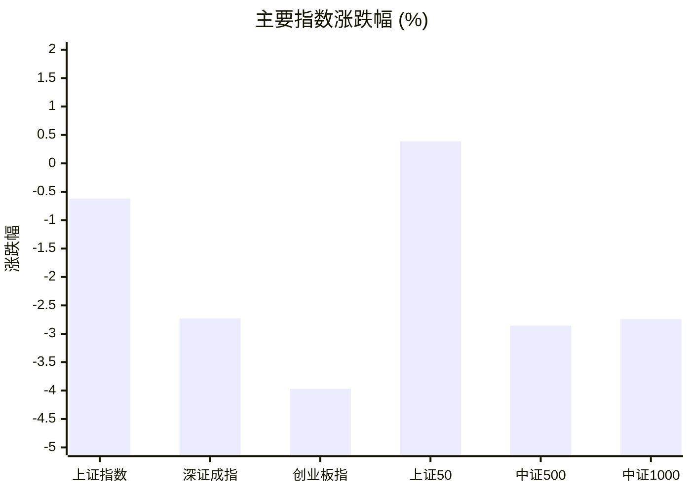
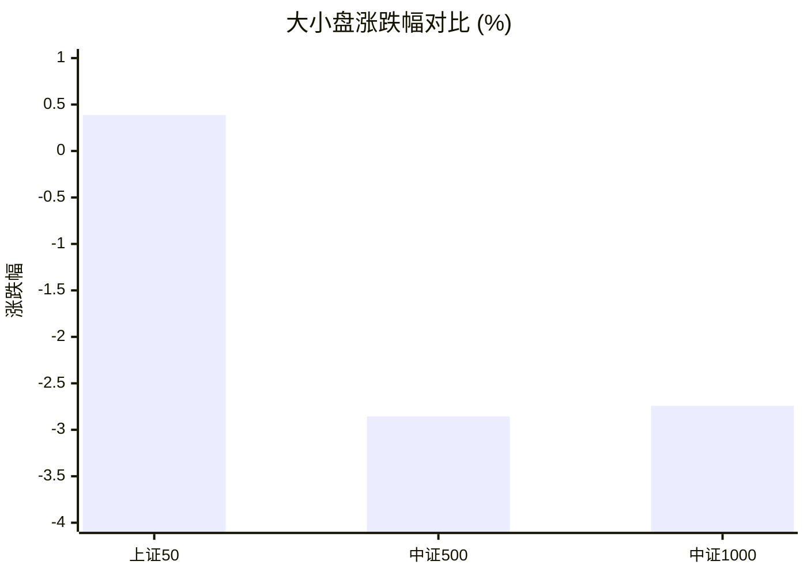
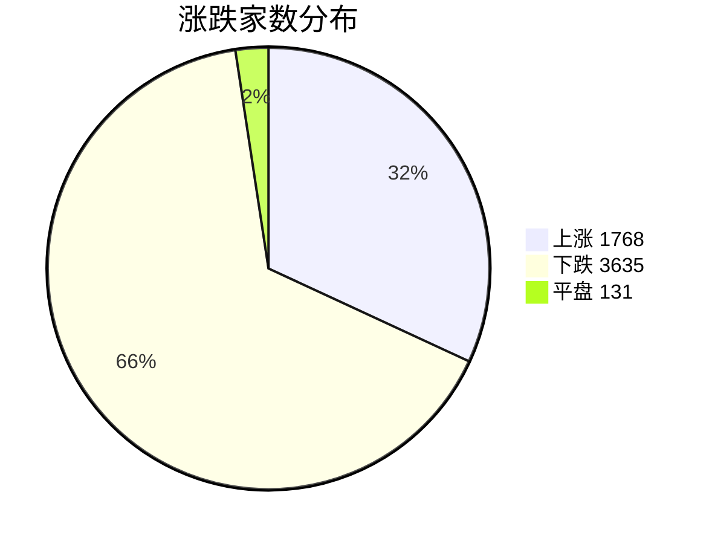
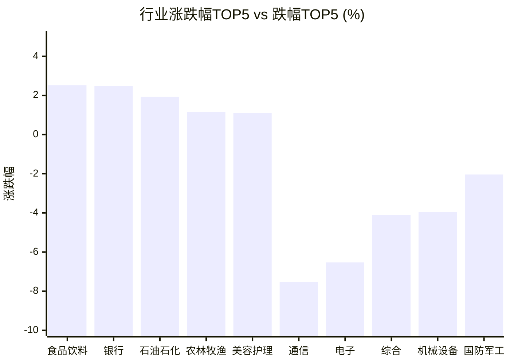

# 📊 A股收盘简报 | 2026-07-30 周四

---

## 📈 一、大盘概况

2026年07月30日 是 A 股交易日，收盘数据已可用。

### 主要指数表现

| 指数 | 收盘价 | 涨跌幅 | 涨跌点 | 成交额(亿) | 前收盘 | 开盘 | 最高 | 最低 |
|------|--------|--------|--------|-----------|--------|------|------|------|
| 上证指数 | 3804.69 | **▼0.62%** | -23.78 | 11064.77亿 | 3828.47 | 3812.11 | 3839.34 | 3767.50 |
| 深证成指 | 13285.80 | **▼2.73%** | -372.64 | 12363.32亿 | 13658.44 | 13531.07 | 13619.03 | 13068.56 |
| 创业板指 | 3244.62 | **▼3.97%** | -134.08 | 5984.75亿 | 3378.70 | 3331.32 | 3353.81 | 3158.14 |
| 上证50 | 2926.48 | **▲+0.39%** | +11.29 | 2378.12亿 | 2915.19 | 2902.38 | 2932.72 | 2881.52 |
| 中证500 | 7309.58 | **▼2.86%** | -214.93 | 4599.96亿 | 7524.51 | 7477.31 | 7536.49 | 7221.95 |
| 中证1000 | 6900.66 | **▼2.74%** | -194.53 | 4362.32亿 | 7095.19 | 7053.09 | 7121.52 | 6841.75 |

### 市场整体成交

- **沪深合计成交额**: **23428.09亿**

---

## 📊 二、指数涨跌幅对比

---

## 📊 三、市值结构 — 大小盘对比

| 指数 | 涨跌幅 | 特征 |
|------|--------|------|
| 上证50 | **▲+0.39%** | 超大盘 |
| 中证500 | **▼2.86%** | 中盘 |
| 中证1000 | **▼2.74%** | 小盘 |

> 📌 **大盘蓝筹占优**，上证50领涨，市场偏好核心资产。

---

## 📉 四、市场广度
### 涨跌家数分布

### 关键统计

| 指标 | 数值 |
|------|------|
| 上涨家数 | 1768 |
| 下跌家数 | 3635 |
| 平盘家数 | 131 |
| 涨停家数 | 56 |
| 跌停家数 | 83 |
| 全市场中位数 | **▼1.15%** |

---
## 🏢 五、行业表现

### 🔥 涨幅榜 TOP 10

| 排名 | 行业(申万一级) | 涨跌幅 |
|------|---------------|--------|
| 🥇 | 食品饮料(申万) | **▲+2.52%** |
| 🥈 | 银行(申万) | **▲+2.48%** |
| 🥉 | 石油石化(申万) | **▲+1.93%** |
| 4 | 农林牧渔(申万) | **▲+1.16%** |
| 5 | 美容护理(申万) | **▲+1.11%** |
| 6 | 家用电器(申万) | **▲+0.99%** |
| 7 | 交通运输(申万) | **▲+0.96%** |
| 8 | 非银金融(申万) | **▲+0.74%** |
| 9 | 钢铁(申万) | **▲+0.62%** |
| 10 | 煤炭(申万) | **▲+0.39%** |

### ❄️ 跌幅榜 TOP 10

| 排名 | 行业(申万一级) | 涨跌幅 |
|------|---------------|--------|
| 31 | 通信(申万) | **▼7.52%** |
| 30 | 电子(申万) | **▼6.53%** |
| 29 | 综合(申万) | **▼4.11%** |
| 28 | 机械设备(申万) | **▼3.95%** |
| 27 | 国防军工(申万) | **▼2.04%** |
| 26 | 计算机(申万) | **▼1.86%** |
| 25 | 环保(申万) | **▼1.80%** |
| 24 | 建筑材料(申万) | **▼1.56%** |
| 23 | 轻工制造(申万) | **▼1.33%** |
| 22 | 电力设备(申万) | **▼1.14%** |

> 📊 **行业分化明显**，12涨/19跌。 涨幅第一：**食品饮料(申万)**（+2.52%）。 跌幅第一：**通信(申万)**（-7.52%）。

---

## 💡 六、热门概念

| 概念 | 涨跌幅 |
|------|--------|
| 饮料制造精选指数 | **▲+4.51%** |
| 白酒指数 | **▲+4.30%** |
| 新能源整车指数 | **▲+3.27%** |
| 汽车整车精选指数 | **▲+3.24%** |
| 品牌龙头指数 | **▲+2.64%** |
| 央企银行指数 | **▲+2.57%** |
| 银行精选指数 | **▲+1.99%** |
| 饲料精选指数 | **▲+1.94%** |
| 白色家电精选指数 | **▲+1.59%** |
| 动物保健精选指数 | **▲+1.57%** |

> 📌 今日热门概念集中在 **饮料制造精选指数**（+4.51%） 等方向。

---

## 💰 七、资金流向

### 主力资金概况

| 指标 | 数值(亿元) |
|------|------|
| 主力资金净流入 | -210.51 |

### 资金流入行业 TOP5

| 行业 | 净流入(亿元) |
|------|--------|
| 银行 | 77.76 |
| 食品饮料 | 39.19 |
| 电力设备 | 29.76 |
| 汽车 | 17.66 |
| 交通运输 | 17.24 |

> 🔴 **主力资金大幅净流出**，市场谨慎情绪升温。

---

## 🌍 八、周边市场

| 指数 | 涨跌幅 |
|------|--------|
| 日经225 | **▲+0.71%** |
| 恒生指数 | **▼0.03%** |
| 标普500 | **▼1.52%** |
| 纳斯达克指数 | **▼1.74%** |
| 道琼斯工业平均 | **▼2.19%** |

> 📌 全球市场多数下跌，外围情绪偏弱。

---

## 📊 九、期货市场

| 品种 | 涨跌幅 |
|------|--------|
| IC2608 | **▼2.54%** |
| IC2609 | **▼2.60%** |
| IC2612 | **▼2.60%** |
| IC2703 | **▼2.43%** |
| IF2608 | **▼0.92%** |
| IF2609 | **▼0.81%** |
| IF2612 | **▼0.80%** |
| IF2703 | **▼0.93%** |
| IH2608 | **▲+0.29%** |
| IH2609 | **▲+0.22%** |

---

## 📰 十、财经要闻

- 陆家嘴财经早餐2026年7月30日星期四
- 科创50指数跌超5%，中际旭创成交额597亿元刷新纪录，德明利盘中直线封板，食品饮料方向涨幅居前丨A股收盘
- 财联社7月30日午间新闻精选
- A股收盘综述：创业板指跌近4%，算力硬件产业链持续调整
- 热门财讯播报（2026年7月30日）

---

## 🤖 十一、盘面结论

> 分析来源：AI Agent

**一句话定性：市场呈现显著的大小盘分化式调整，权重防御方向相对占优，但风险偏好仍在收缩。**

- **证据：**创业板指下跌 3.97%、深证成指下跌 2.73%，而上证50上涨 0.39%，中小盘代表的中证500和中证1000分别下跌 2.86%和 2.74%。这是大盘蓝筹相对占优的结构性表现。
- **证据：**全市场 1768 家上涨、3635 家下跌，中位数为 -1.15%；跌停 83 家多于涨停 56 家，表明下跌扩散度高于上涨扩散度。
- **证据：**食品饮料、银行、石油石化分别上涨 2.52%、2.48%和 1.93%，通信和电子则分别下跌 7.52%和 6.53%；当日主力资金净流出 210.51 亿元。Agent 判断，防御性行业的相对强势尚不足以扭转整体偏谨慎的盘面。

---

## 🎯 十二、主线轮动

1. **消费与金融防御方向 | 生命周期：发酵。**盘面已验证的证据是食品饮料和银行位列申万行业涨幅前二，饮料制造精选指数、白酒指数、央企银行指数也在热门概念榜居前；银行与食品饮料同时位列行业资金流入前列。催化解释暂不作事实认定。确认条件是下一交易日食品饮料、银行继续保持行业相对强势，相关概念仍居涨幅前列；失效条件是两者转为弱于主要指数，且不再获得行业资金流入支持。

2. **通信电子等成长方向 | 生命周期：退潮待确认。**盘面证据是通信和电子分别位居行业跌幅前二，创业板指跌幅也显著大于上证50。Agent 判断，这反映成长风格承压，但尚不能据此认定调整已结束或形成新的上行主线。催化解释未验证；确认条件是通信、电子不再位列行业跌幅前列且创业板相对表现修复；失效条件是两行业继续处于跌幅前列，同时市场下跌家数和跌停家数维持高位。

---

## 🔍 十三、明日关注

1. **观察对象：大小盘风格。**确认信号：上证50继续相对强于中证500、中证1000，且权重行业维持涨幅领先；失效信号：上证50转弱、而中小盘指数相对修复。
2. **观察对象：食品饮料与银行防御方向。**确认信号：两行业继续位居行业涨幅前列，并在行业资金流入榜保持靠前；失效信号：两行业跌出涨幅前列且资金流入优势消失。
3. **观察对象：通信、电子的调整扩散度。**确认信号：两行业不再居行业跌幅前列，市场下跌家数和跌停家数同步收敛；失效信号：两行业继续领跌，且下跌家数、跌停家数进一步增加。

---

## 📌 数据来源与免责声明

- **数据来源**：万得 Wind 金融数据服务
- **数据日期**：2026-07-30 收盘
- **生成时间**：2026年07月30日
- **免责声明**：本简报基于 Wind 数据自动生成，AI 分析部分（如有）仅供参考，不构成任何投资建议。市场有风险，投资需谨慎。
