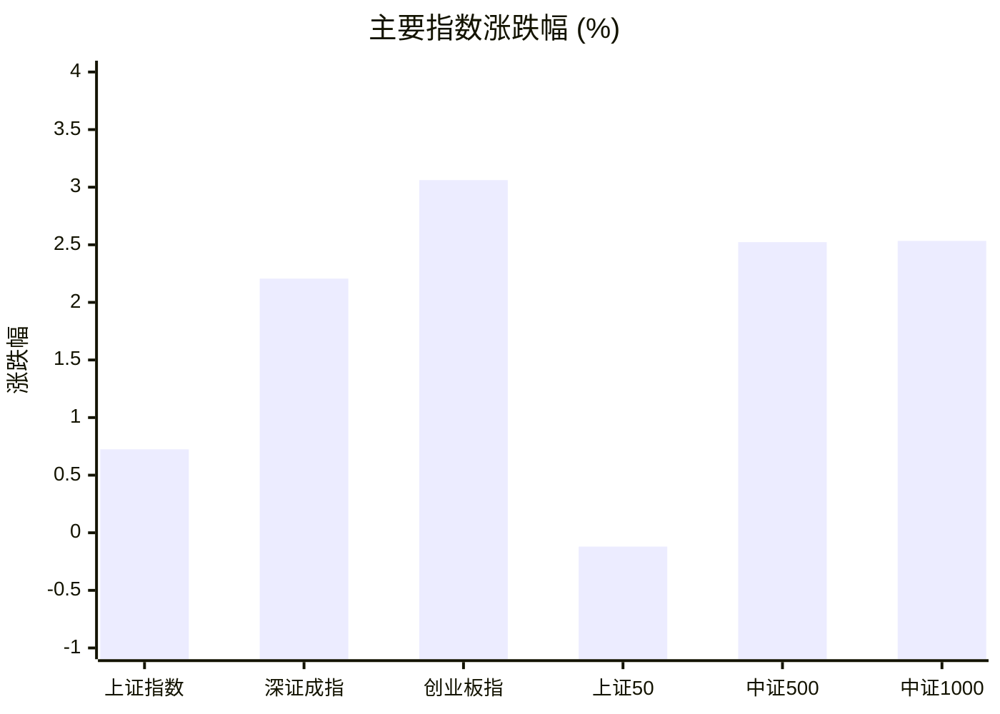
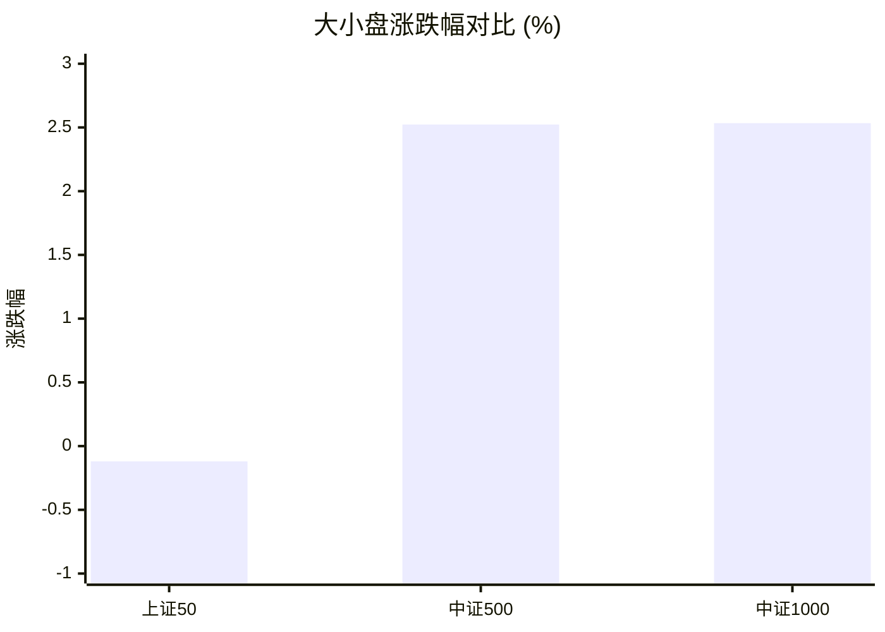
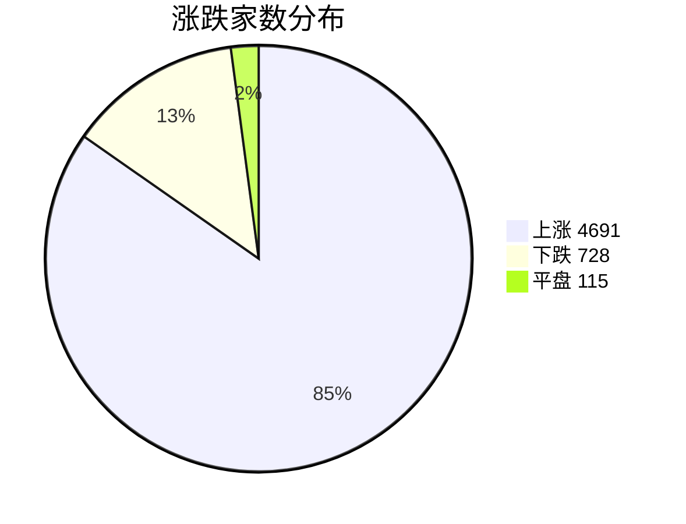
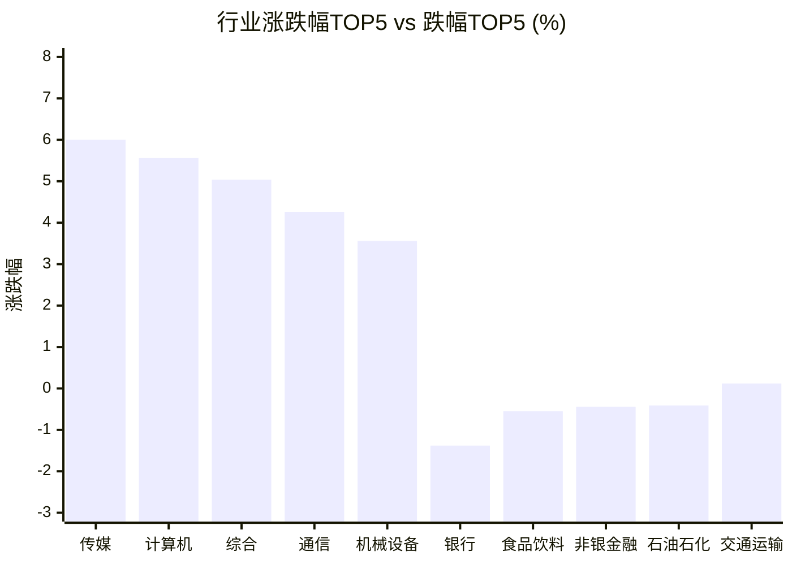

# 📊 A股收盘简报 | 2026-07-31 周五

---

## 📈 一、大盘概况

2026年07月31日 是 A 股交易日，收盘数据已可用。

### 主要指数表现

| 指数 | 收盘价 | 涨跌幅 | 涨跌点 | 成交额(亿) | 前收盘 | 开盘 | 最高 | 最低 |
|------|--------|--------|--------|-----------|--------|------|------|------|
| 上证指数 | 3832.26 | **▲+0.72%** | +27.57 | 11876.82亿 | 3804.69 | 3833.54 | 3847.09 | 3822.37 |
| 深证成指 | 13578.93 | **▲+2.21%** | +293.13 | 13542.67亿 | 13285.80 | 13690.00 | 13841.96 | 13578.93 |
| 创业板指 | 3343.96 | **▲+3.06%** | +99.34 | 6712.27亿 | 3244.62 | 3411.61 | 3464.90 | 3343.96 |
| 上证50 | 2922.97 | **▼0.12%** | -3.51 | 2404.01亿 | 2926.48 | 2944.94 | 2946.17 | 2919.41 |
| 中证500 | 7493.99 | **▲+2.52%** | +184.41 | 5139.56亿 | 7309.58 | 7537.85 | 7638.78 | 7487.43 |
| 中证1000 | 7075.51 | **▲+2.53%** | +174.85 | 4986.02亿 | 6900.66 | 7082.75 | 7218.06 | 7071.05 |

### 市场整体成交

- **沪深合计成交额**: **25419.48亿**
- **较前日放量** 1991.39亿（+8.5%）

---

## 📊 二、指数涨跌幅对比

---

## 📊 三、市值结构 — 大小盘对比

| 指数 | 涨跌幅 | 特征 |
|------|--------|------|
| 上证50 | **▼0.12%** | 超大盘 |
| 中证500 | **▲+2.52%** | 中盘 |
| 中证1000 | **▲+2.53%** | 小盘 |

> 📌 **小盘强势领跑**，中证500/中证1000涨幅远超上证50，资金向中小市值扩散。

---

## 📉 四、市场广度
### 涨跌家数分布

### 关键统计

| 指标 | 数值 |
|------|------|
| 上涨家数 | 4691 |
| 下跌家数 | 728 |
| 平盘家数 | 115 |
| 涨停家数 | 103 |
| 跌停家数 | 0 |
| 全市场中位数 | **▲+2.03%** |

---
## 🏢 五、行业表现

### 🔥 涨幅榜 TOP 10

| 排名 | 行业(申万一级) | 涨跌幅 |
|------|---------------|--------|
| 🥇 | 传媒(申万) | **▲+6.00%** |
| 🥈 | 计算机(申万) | **▲+5.56%** |
| 🥉 | 综合(申万) | **▲+5.04%** |
| 4 | 通信(申万) | **▲+4.26%** |
| 5 | 机械设备(申万) | **▲+3.56%** |
| 6 | 电子(申万) | **▲+3.53%** |
| 7 | 社会服务(申万) | **▲+2.57%** |
| 8 | 环保(申万) | **▲+2.19%** |
| 9 | 汽车(申万) | **▲+2.13%** |
| 10 | 国防军工(申万) | **▲+1.99%** |

### ❄️ 跌幅榜 TOP 10

| 排名 | 行业(申万一级) | 涨跌幅 |
|------|---------------|--------|
| 31 | 银行(申万) | **▼1.38%** |
| 30 | 食品饮料(申万) | **▼0.55%** |
| 29 | 非银金融(申万) | **▼0.44%** |
| 28 | 石油石化(申万) | **▼0.41%** |
| 27 | 交通运输(申万) | **▲+0.12%** |
| 26 | 家用电器(申万) | **▲+0.13%** |
| 25 | 煤炭(申万) | **▲+0.15%** |
| 24 | 钢铁(申万) | **▲+0.17%** |
| 23 | 公用事业(申万) | **▲+0.24%** |
| 22 | 农林牧渔(申万) | **▲+0.53%** |

> 📈 **行业普涨**，多数板块收红。 涨幅第一：**传媒(申万)**（+6.00%）。 跌幅第一：**银行(申万)**（-1.38%）。

---

## 💡 六、热门概念

| 概念 | 涨跌幅 |
|------|--------|
| Kimi指数 | **▲+10.19%** |
| 拼多多合作商指数 | **▲+9.46%** |
| ChatGPT指数 | **▲+7.70%** |
| 多模态模型指数 | **▲+7.35%** |
| 智能体指数 | **▲+7.21%** |
| seedance视频大模型指数 | **▲+7.20%** |
| 抖音豆包指数 | **▲+7.18%** |
| MLOps指数 | **▲+7.12%** |
| AIGC指数 | **▲+7.05%** |
| 外骨骼机器人指数 | **▲+6.93%** |

> 📌 今日热门概念集中在 **Kimi指数**（+10.19%） 等方向。

---

## 💰 七、资金流向

### 主力资金概况

| 指标 | 数值(亿元) |
|------|------|
| 主力资金净流入 | 1093.94 |

### 资金流入行业 TOP5

| 行业 | 净流入(亿元) |
|------|--------|
| 计算机 | 223.05 |
| 传媒 | 137.09 |
| 机械设备 | 125.95 |
| 电子 | 97.93 |
| 通信 | 84.91 |

> 🟢 **主力资金大幅净流入**，市场做多意愿强烈。

---

## 🌍 八、周边市场

| 指数 | 涨跌幅 |
|------|--------|
| 日经225 | **▲+4.03%** |
| 纳斯达克指数 | **▲+2.78%** |
| 标普500 | **▲+1.66%** |
| 道琼斯工业平均 | **▲+1.19%** |
| 恒生指数 | **▼0.07%** |

> 📌 全球市场多数上涨，外围情绪偏暖。

---

## 📊 九、期货市场

| 品种 | 涨跌幅 |
|------|--------|
| IC2608 | **▲+1.62%** |
| IC2609 | **▲+1.66%** |
| IC2612 | **▲+1.76%** |
| IC2703 | **▲+1.99%** |
| IF2608 | **▲+0.57%** |
| IF2609 | **▲+0.55%** |
| IF2612 | **▲+0.59%** |
| IF2703 | **▲+0.70%** |
| IH2608 | **▲+0.23%** |
| IH2609 | **▲+0.18%** |

---

## 📰 十、财经要闻

- 热门财讯播报（2026年7月31日）
- 今日A股市场重要快讯汇总｜2026年7月31日
- A股盘前市场要闻速递（2026-07-28）
- A股早报2026年7月31日星期五
- A股每日市场要闻回顾（2026-07-20）

---

## 🤖 十一、盘面结论

> 分析来源：AI Agent

一句话定性：市场呈现由成长与中小市值驱动的普涨修复，权重方向相对偏弱。

- 证据：深证成指、创业板指分别上涨 2.21%、3.06%，中证500和中证1000均上涨逾 2.5%，而上证50下跌 0.12%，显示风格明显偏向中小市值与成长板块。
- 证据：4691 家上涨、728 家下跌、103 家涨停且无跌停，全市场中位数上涨 2.03%，盘面广度与指数上涨相互印证。
- 证据：沪深成交额为 25419.48 亿元，较前日增加 1991.39 亿元；计算机、传媒、机械设备、电子和通信同时位列资金流入行业前列，资金数据与成长方向的行业表现同向。

---

## 🎯 十二、主线轮动

1. **AI 应用与数字内容方向（加速）**：传媒上涨 6.00%、计算机上涨 5.56%、通信上涨 4.26%，Kimi、ChatGPT、多模态模型、智能体和 AIGC 等概念均位居涨幅榜；计算机和传媒分别获得 223.05 亿元、137.09 亿元主力资金净流入。盘面已验证的条件是相关行业继续居于涨幅及资金流入前列；若行业强度和资金流入排名同步回落，则该加速状态失效。
2. **高端制造与机器人相关方向（待确认）**：机械设备上涨 3.56%、电子上涨 3.53%，外骨骼机器人概念上涨 6.93%，机械设备净流入 125.95 亿元。当前仅有单日行业、概念和资金数据的共振，尚不足以确认持续主线；下一交易日若机械设备、电子维持领先并继续获得行业净流入，可进一步确认，反之则仍按分化处理。

---

## 🔍 十三、明日关注

1. **观察对象：AI 应用与数字内容方向。** 确认信号：计算机、传媒继续处于行业涨幅和资金流入前列，相关概念保持领先；失效信号：上述行业强度与资金流入排名同步回落。
2. **观察对象：中小市值相对强度。** 确认信号：中证500、中证1000继续强于上证50，且上涨家数保持显著多于下跌家数；失效信号：中小市值相对上证50转弱，同时市场广度明显收窄。
3. **观察对象：成交与广度的配合。** 确认信号：沪深成交额延续较前日提升，且上涨家数占优、涨停家数维持活跃；失效信号：成交缩减并伴随上涨家数优势减弱。

---

## 📌 数据来源与免责声明

- **数据来源**：万得 Wind 金融数据服务
- **数据日期**：2026-07-31 收盘
- **生成时间**：2026年07月31日
- **免责声明**：本简报基于 Wind 数据自动生成，AI 分析部分（如有）仅供参考，不构成任何投资建议。市场有风险，投资需谨慎。
