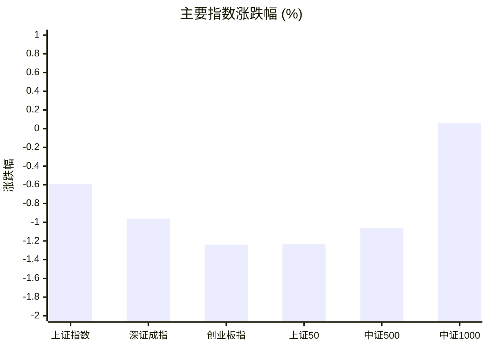
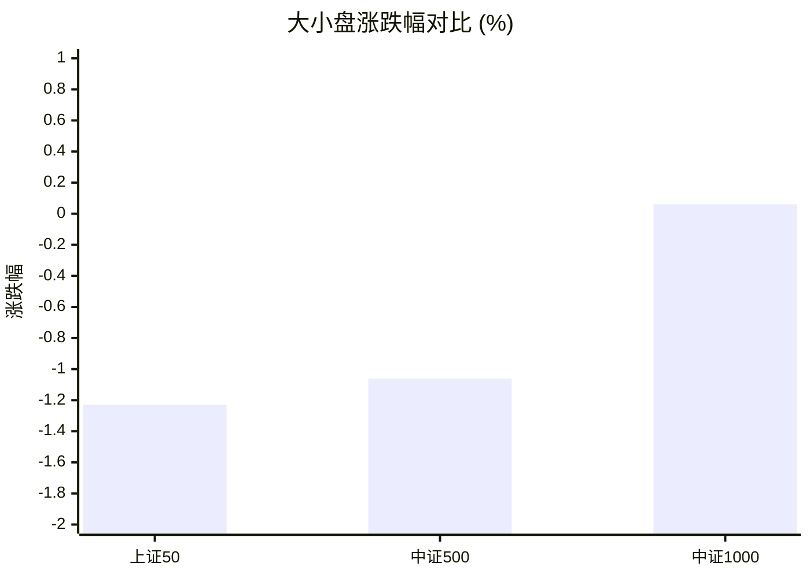
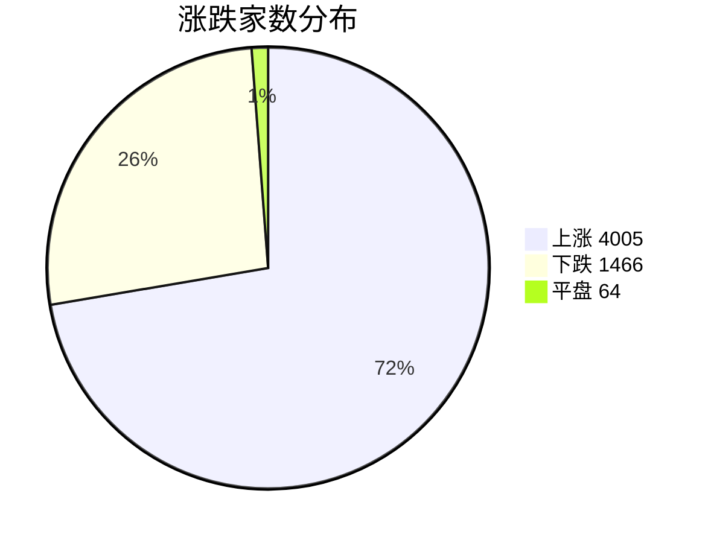
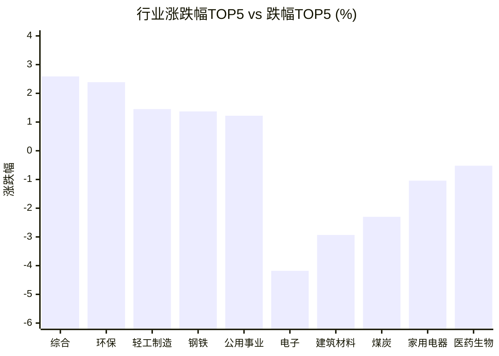

# 📊 A股收盘简报 | 2026-08-03 周一

---

## 📈 一、大盘概况

2026年08月03日 是 A 股交易日，收盘数据已可用。

### 主要指数表现

| 指数 | 收盘价 | 涨跌幅 | 涨跌点 | 成交额(亿) | 前收盘 | 开盘 | 最高 | 最低 |
|------|--------|--------|--------|-----------|--------|------|------|------|
| 上证指数 | 3809.66 | **▼0.59%** | -22.60 | 9522.57亿 | 3832.26 | 3812.61 | 3827.64 | 3797.64 |
| 深证成指 | 13448.29 | **▼0.96%** | -130.64 | 10451.29亿 | 13578.93 | 13497.10 | 13570.51 | 13407.99 |
| 创业板指 | 3302.55 | **▼1.24%** | -41.41 | 4865.04亿 | 3343.96 | 3320.09 | 3342.17 | 3280.84 |
| 上证50 | 2887.05 | **▼1.23%** | -35.92 | 1850.11亿 | 2922.97 | 2908.51 | 2912.21 | 2873.56 |
| 中证500 | 7414.52 | **▼1.06%** | -79.47 | 4095.92亿 | 7493.99 | 7457.12 | 7499.58 | 7397.94 |
| 中证1000 | 7079.78 | **▲+0.06%** | +4.27 | 3911.83亿 | 7075.51 | 7055.27 | 7118.10 | 7042.89 |

### 市场整体成交

- **沪深合计成交额**: **19973.86亿**
- **较前日缩量** 5445.62亿（-21.4%）

---

## 📊 二、指数涨跌幅对比

---

## 📊 三、市值结构 — 大小盘对比

| 指数 | 涨跌幅 | 特征 |
|------|--------|------|
| 上证50 | **▼1.23%** | 超大盘 |
| 中证500 | **▼1.06%** | 中盘 |
| 中证1000 | **▲+0.06%** | 小盘 |

> 📌 **小盘强势领跑**，中证500/中证1000涨幅远超上证50，资金向中小市值扩散。

---

## 📉 四、市场广度
### 涨跌家数分布

### 关键统计

| 指标 | 数值 |
|------|------|
| 上涨家数 | 4005 |
| 下跌家数 | 1466 |
| 平盘家数 | 64 |
| 涨停家数 | 83 |
| 跌停家数 | 9 |
| 全市场中位数 | **▲+1.34%** |

---
## 🏢 五、行业表现

### 🔥 涨幅榜 TOP 10

| 排名 | 行业(申万一级) | 涨跌幅 |
|------|---------------|--------|
| 🥇 | 综合(申万) | **▲+2.59%** |
| 🥈 | 环保(申万) | **▲+2.39%** |
| 🥉 | 轻工制造(申万) | **▲+1.45%** |
| 4 | 钢铁(申万) | **▲+1.37%** |
| 5 | 公用事业(申万) | **▲+1.22%** |
| 6 | 电力设备(申万) | **▲+1.12%** |
| 7 | 交通运输(申万) | **▲+0.98%** |
| 8 | 国防军工(申万) | **▲+0.92%** |
| 9 | 房地产(申万) | **▲+0.83%** |
| 10 | 纺织服饰(申万) | **▲+0.82%** |

### ❄️ 跌幅榜 TOP 10

| 排名 | 行业(申万一级) | 涨跌幅 |
|------|---------------|--------|
| 31 | 电子(申万) | **▼4.18%** |
| 30 | 建筑材料(申万) | **▼2.93%** |
| 29 | 煤炭(申万) | **▼2.30%** |
| 28 | 家用电器(申万) | **▼1.04%** |
| 27 | 医药生物(申万) | **▼0.52%** |
| 26 | 有色金属(申万) | **▼0.40%** |
| 25 | 美容护理(申万) | **▼0.31%** |
| 24 | 机械设备(申万) | **▲+0.01%** |
| 23 | 食品饮料(申万) | **▲+0.12%** |
| 22 | 石油石化(申万) | **▲+0.16%** |

> 📈 **行业普涨**，多数板块收红。 涨幅第一：**综合(申万)**（+2.59%）。 跌幅第一：**电子(申万)**（-4.18%）。

---

## 💡 六、热门概念

| 概念 | 涨跌幅 |
|------|--------|
| 核聚变指数 | **▲+5.04%** |
| 核电指数 | **▲+4.69%** |
| 光伏玻璃指数 | **▲+3.95%** |
| 太空算力指数 | **▲+3.54%** |
| 最小市值指数 | **▲+3.54%** |
| 光热发电指数 | **▲+3.40%** |
| 数字孪生指数 | **▲+3.32%** |
| 光伏屋顶指数 | **▲+3.26%** |
| 智能电网指数 | **▲+3.24%** |
| 虚拟电厂指数 | **▲+3.16%** |

> 📌 今日热门概念集中在 **核聚变指数**（+5.04%） 等方向。

---

## 💰 七、资金流向

### 主力资金概况

| 指标 | 数值(亿元) |
|------|------|
| 主力资金净流入 | 76.64 |

### 资金流入行业 TOP5

| 行业 | 净流入(亿元) |
|------|--------|
| 电力设备 | 72.55 |
| 机械设备 | 48.16 |
| 公用事业 | 37.19 |
| 通信 | 30.57 |
| 基础化工 | 27.10 |

> 🟢 **主力资金小幅净流入**。

---

## 🌍 八、周边市场

| 指数 | 涨跌幅 |
|------|--------|
| 纳斯达克指数 | **▲+1.00%** |
| 标普500 | **▲+0.70%** |
| 道琼斯工业平均 | **▲+0.53%** |
| 恒生指数 | **▲+0.48%** |
| 日经225 | **▼0.94%** |

> 📌 全球市场多数上涨，外围情绪偏暖。

---

## 📊 九、期货市场

| 品种 | 涨跌幅 |
|------|--------|
| IC2608 | **▼1.18%** |
| IC2609 | **▼1.09%** |
| IC2612 | **▼1.04%** |
| IC2703 | **▼0.99%** |
| IF2608 | **▼0.89%** |
| IF2609 | **▼0.79%** |
| IF2612 | **▼0.70%** |
| IF2703 | **▼0.75%** |
| IH2608 | **▼1.29%** |
| IH2609 | **▼1.26%** |

---

## 📰 十、财经要闻

- 【A股午间收盘快报】 沪指下跌0.59% 两市半日缩量超4200亿元 风电设备、核能核电走强
- 科创综指跌3.39%，沪指险守3800点，超4000只个股上涨；核电、AI应用板块走强；半导体产业链下挫，兆易创新跌停 | A股收盘
- A股收盘综述：沪指跌0.59%，市场逾4000股上涨
- A股每日行情复盘（8月3日）
- 2026年A股半年报盘点（8月3日）

---

## 🤖 十一、盘面结论

> 分析来源：AI Agent

**一句话定性：指数走弱而个股普涨，盘面呈现明显的结构性分化。**

- **证据**：上证指数、深证成指、创业板指、上证50和中证500分别下跌0.59%、0.96%、1.24%、1.23%和1.06%，仅中证1000上涨0.06%，大盘权重与中盘指数承压更明显。
- **证据**：全市场上涨4005家、下跌1466家、平盘64家，涨跌幅中位数为+1.34%，涨停83家、跌停9家，个股层面的多头占优与指数表现并不一致。
- **证据**：两市成交额19973.86亿元，较前日缩量5445.62亿元（-21.4%）；主力资金净流入76.64亿元。量能回落下的结构分化，意味着强势方向仍需后续成交和相对强度验证。

---

## 🎯 十二、主线轮动

### 能源电力链：加速，盘面已验证

- **盘面证据**：核聚变指数上涨5.04%、核电指数上涨4.69%，光伏玻璃、光热发电、光伏屋顶和虚拟电厂均进入热门概念前十；申万电力设备上涨1.12%、公用事业上涨1.22%，且分别位列资金流入行业第一和第三。
- **催化验证**：报告中的新闻标题可作为候选解释，但未以其作为事实或涨跌原因；本条仅由概念、行业和资金的同向数据验证。
- **确认条件**：下一交易日同类报告中，相关概念保持前列，电力设备与公用事业继续相对强于主要指数，且资金流入行业排名仍居前。
- **失效条件**：相关概念和行业转为下跌或显著落后主要指数，或资金流入排名不再支持该方向。

### 科技硬件：分化偏退潮，待确认

- **盘面证据**：申万电子下跌4.18%，为行业跌幅第一；创业板指下跌1.24%，弱于上证指数，显示成长风格当天承压。
- **催化验证**：报告未提供与电子板块走势一致的结构化催化数据，因此不对下跌原因作归因。
- **确认条件**：下一交易日电子行业跌幅收敛并恢复相对强势，同时创业板指不再弱于主要指数。
- **失效条件**：电子继续位居行业跌幅前列，且创业板指持续弱于主要指数。

---

## 🔍 十三、明日关注

1. **观察对象：市场广度与成交。** 确认信号：上涨家数继续多于下跌家数、全市场中位数保持为正，且两市成交不再继续缩量；失效信号：下跌家数反超上涨家数或中位数转负，并伴随成交进一步回落。
2. **观察对象：能源电力链。** 确认信号：核聚变、核电等概念仍居涨幅前列，电力设备和公用事业保持相对主要指数的强势，资金流入排名继续支持；失效信号：概念与相关行业转弱并落后主要指数，或资金流入排名不再支持。
3. **观察对象：大小盘相对强弱。** 确认信号：中证1000继续相对强于上证50和中证500；失效信号：中证1000转弱，或上证50、中证500重新取得更强表现。

---

## 📌 数据来源与免责声明

- **数据来源**：万得 Wind 金融数据服务
- **数据日期**：2026-08-03 收盘
- **生成时间**：2026年08月03日
- **免责声明**：本简报基于 Wind 数据自动生成，AI 分析部分（如有）仅供参考，不构成任何投资建议。市场有风险，投资需谨慎。
