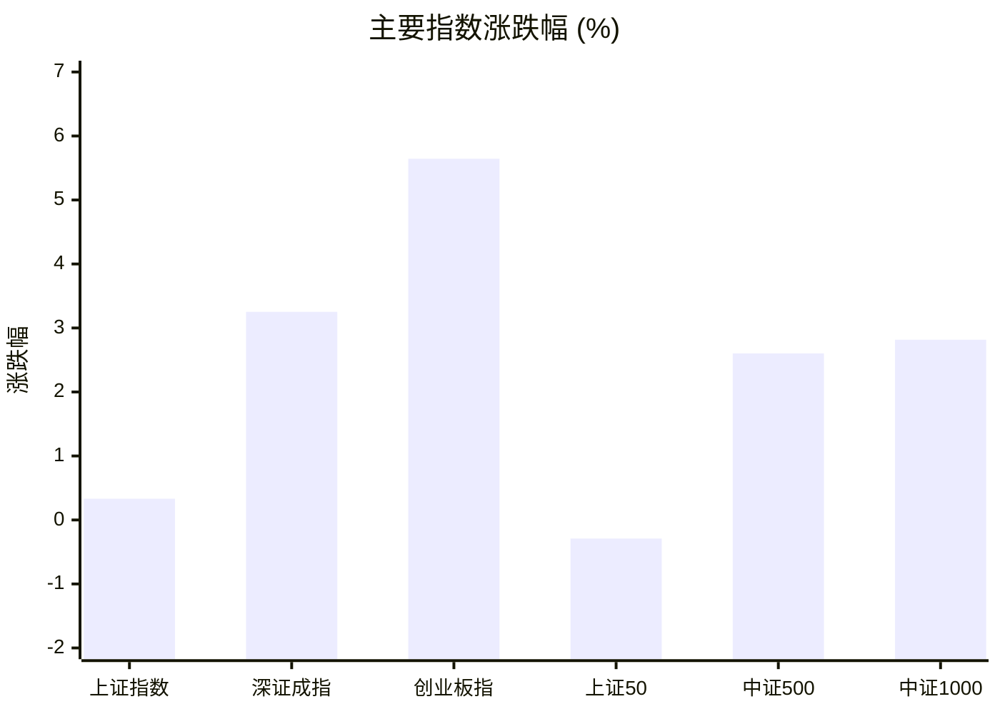
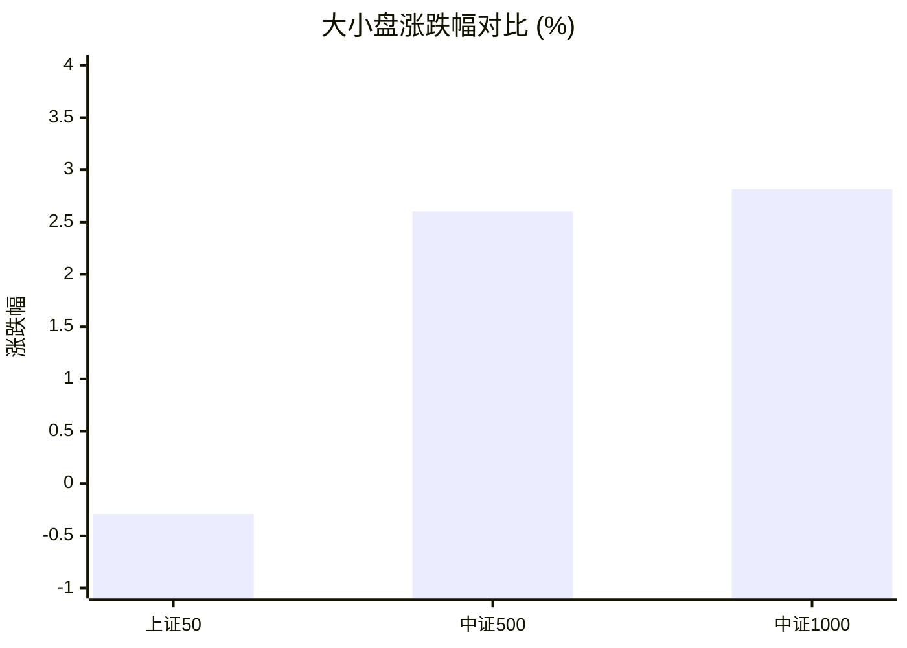
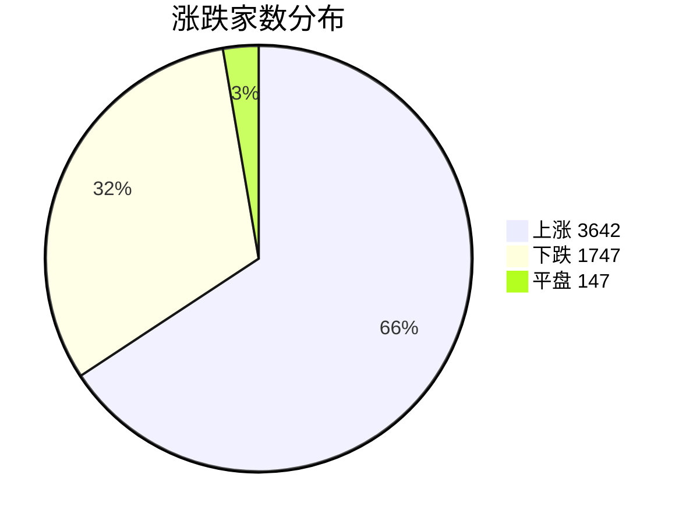
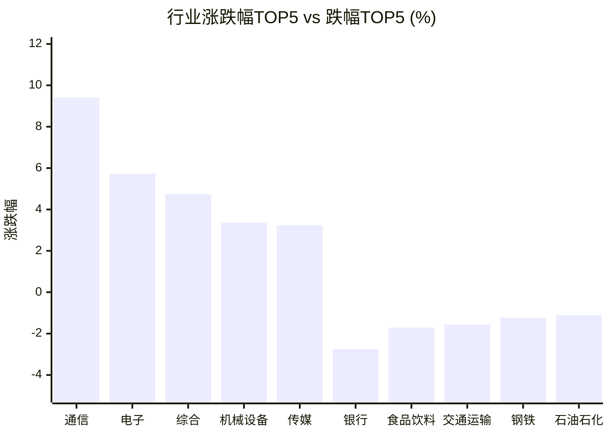

# 📊 A股收盘简报 | 2026-08-04 周二

---

## 📈 一、大盘概况

2026年08月04日 是 A 股交易日，收盘数据已可用。

### 主要指数表现

| 指数 | 收盘价 | 涨跌幅 | 涨跌点 | 成交额(亿) | 前收盘 | 开盘 | 最高 | 最低 |
|------|--------|--------|--------|-----------|--------|------|------|------|
| 上证指数 | 3822.28 | **▲+0.33%** | +12.62 | 10083.83亿 | 3809.66 | 3816.37 | 3831.94 | 3799.52 |
| 深证成指 | 13885.71 | **▲+3.25%** | +437.42 | 12052.09亿 | 13448.29 | 13572.95 | 13936.52 | 13537.76 |
| 创业板指 | 3488.97 | **▲+5.64%** | +186.42 | 6016.13亿 | 3302.55 | 3353.51 | 3510.51 | 3342.41 |
| 上证50 | 2878.67 | **▼0.29%** | -8.38 | 1951.11亿 | 2887.05 | 2890.99 | 2892.40 | 2867.93 |
| 中证500 | 7607.49 | **▲+2.60%** | +192.97 | 4437.92亿 | 7414.52 | 7467.08 | 7645.48 | 7450.32 |
| 中证1000 | 7279.19 | **▲+2.82%** | +199.41 | 4343.10亿 | 7079.78 | 7128.49 | 7307.17 | 7102.46 |

### 市场整体成交

- **沪深合计成交额**: **22135.92亿**
- **较前日放量** 2162.06亿（+10.8%）

---

## 📊 二、指数涨跌幅对比

---

## 📊 三、市值结构 — 大小盘对比

| 指数 | 涨跌幅 | 特征 |
|------|--------|------|
| 上证50 | **▼0.29%** | 超大盘 |
| 中证500 | **▲+2.60%** | 中盘 |
| 中证1000 | **▲+2.82%** | 小盘 |

> 📌 **小盘强势领跑**，中证500/中证1000涨幅远超上证50，资金向中小市值扩散。

---

## 📉 四、市场广度
### 涨跌家数分布

### 关键统计

| 指标 | 数值 |
|------|------|
| 上涨家数 | 3642 |
| 下跌家数 | 1747 |
| 平盘家数 | 147 |
| 涨停家数 | 141 |
| 跌停家数 | 1 |
| 全市场中位数 | **▲+0.97%** |

---
## 🏢 五、行业表现

### 🔥 涨幅榜 TOP 10

| 排名 | 行业(申万一级) | 涨跌幅 |
|------|---------------|--------|
| 🥇 | 通信(申万) | **▲+9.41%** |
| 🥈 | 电子(申万) | **▲+5.73%** |
| 🥉 | 综合(申万) | **▲+4.73%** |
| 4 | 机械设备(申万) | **▲+3.37%** |
| 5 | 传媒(申万) | **▲+3.24%** |
| 6 | 计算机(申万) | **▲+2.89%** |
| 7 | 建筑材料(申万) | **▲+2.34%** |
| 8 | 医药生物(申万) | **▲+2.21%** |
| 9 | 有色金属(申万) | **▲+1.54%** |
| 10 | 电力设备(申万) | **▲+1.36%** |

### ❄️ 跌幅榜 TOP 10

| 排名 | 行业(申万一级) | 涨跌幅 |
|------|---------------|--------|
| 31 | 银行(申万) | **▼2.75%** |
| 30 | 食品饮料(申万) | **▼1.71%** |
| 29 | 交通运输(申万) | **▼1.56%** |
| 28 | 钢铁(申万) | **▼1.23%** |
| 27 | 石油石化(申万) | **▼1.11%** |
| 26 | 农林牧渔(申万) | **▼1.10%** |
| 25 | 非银金融(申万) | **▼1.03%** |
| 24 | 美容护理(申万) | **▼0.80%** |
| 23 | 公用事业(申万) | **▼0.73%** |
| 22 | 煤炭(申万) | **▼0.60%** |

> 📊 **行业分化明显**，17涨/14跌。 涨幅第一：**通信(申万)**（+9.41%）。 跌幅第一：**银行(申万)**（-2.75%）。

---

## 💡 六、热门概念

| 概念 | 涨跌幅 |
|------|--------|
| 光芯片指数 | **▲+9.71%** |
| 光模块(CPO)指数 | **▲+9.02%** |
| 覆铜板指数 | **▲+8.57%** |
| 光电路交换机(OCS)指数 | **▲+8.46%** |
| 光通信指数 | **▲+8.16%** |
| 氮化铝指数 | **▲+8.16%** |
| CRO指数 | **▲+7.94%** |
| 半导体设备指数 | **▲+7.61%** |
| 玻璃基板指数 | **▲+7.50%** |
| 先进封装指数 | **▲+7.49%** |

> 📌 今日热门概念集中在 **光芯片指数**（+9.71%） 等方向。

---

## 💰 七、资金流向

### 主力资金概况

| 指标 | 数值(亿元) |
|------|------|
| 主力资金净流入 | 1180.58 |

### 资金流入行业 TOP5

| 行业 | 净流入(亿元) |
|------|--------|
| 电子 | 518.61 |
| 通信 | 200.67 |
| 计算机 | 109.86 |
| 医药生物 | 102.06 |
| 机械设备 | 99.21 |

> 🟢 **主力资金大幅净流入**，市场做多意愿强烈。

---

## 🌍 八、周边市场

| 指数 | 涨跌幅 |
|------|--------|
| 纳斯达克指数 | **▲+2.13%** |
| 标普500 | **▲+1.48%** |
| 道琼斯工业平均 | **▲+1.32%** |
| 日经225 | **▲+0.32%** |
| 恒生指数 | **▼0.64%** |

> 📌 全球市场多数上涨，外围情绪偏暖。

---

## 📊 九、期货市场

| 品种 | 涨跌幅 |
|------|--------|
| IC2608 | **▲+2.31%** |
| IC2609 | **▲+2.27%** |
| IC2612 | **▲+2.28%** |
| IC2703 | **▲+2.37%** |
| IF2608 | **▲+1.08%** |
| IF2609 | **▲+1.02%** |
| IF2612 | **▲+1.01%** |
| IF2703 | **▲+0.97%** |
| IH2608 | **▼0.19%** |
| IH2609 | **▼0.17%** |

---

## 📰 十、财经要闻

- 【A股午间收盘快报】 创业板指涨4.83% 全市场超3700股飘红 CPO概念、CRO领涨
- 陆家嘴财经早餐2026年8月4日星期二
- 金十数据全球财经早餐 | 2026年8月4日
- 财联社8月4日午间新闻精选
- 2026年A股半年报盘点（8月4日）

---

## 🤖 十一、盘面结论

> 分析来源：AI Agent

**一句话定性：市场呈现以成长方向领涨的结构性普涨，指数与行业强弱分化仍然突出。**

- **证据**：深证成指、创业板指分别上涨 3.25% 和 5.64%，中证500、中证1000分别上涨 2.60% 和 2.82%，而上证50下跌 0.29%，中小市值相对强于超大盘。
- **证据**：3642 家上涨、1747 家下跌，涨停 141 家、跌停 1 家，全市场涨跌幅中位数为 +0.97%，盘面广度偏强。
- **证据**：两市成交额 22135.92 亿元，较前日增加 2162.06 亿元；通信、电子分别上涨 9.41% 和 5.73%，且对应主力资金净流入 200.67 亿元和 518.61 亿元。上述数据支持成长板块占优的判断，但不等同于其后续表现已获确认。

---

## 🎯 十二、主线轮动

1. **光通信与半导体链，生命周期判断：加速，但需下一交易日确认。**
   - **盘面证据**：通信、电子位列行业涨幅前二；光芯片、光模块(CPO)、覆铜板、光电路交换机(OCS)、光通信均位列热门概念前列，涨幅在 8% 以上；电子、通信同时位列主力资金净流入行业前二。
   - **催化验证**：财经要闻中的相关标题只能作为候选解释，报告未提供可独立验证的事件事实，故不据此认定上涨原因。
   - **确认条件**：通信、电子继续位居行业强势组，相关概念维持相对强势，且二者仍出现在行业资金净流入靠前位置。
   - **失效条件**：通信或电子转弱至行业跌幅组，或光通信、半导体相关概念不再维持强势。
2. **医药与 CRO，生命周期判断：发酵，待确认。**
   - **盘面证据**：医药生物上涨 2.21%，CRO 概念上涨 7.94%，医药生物主力资金净流入 102.06 亿元。
   - **催化验证**：报告未提供可验证的医药行业事件，财经要闻不作为上涨原因的事实依据。
   - **确认条件**：医药生物保持行业上涨组，CRO 概念继续相对活跃，且医药生物维持行业资金净流入。
   - **失效条件**：医药生物进入行业跌幅组，或 CRO 概念由强转弱并失去相对表现。

---

## 🔍 十三、明日关注

1. **观察对象：通信、电子与光通信/半导体相关概念。** 确认信号：通信、电子继续处于行业强势组，相关概念维持强势，且行业资金净流入靠前；失效信号：任一核心行业转入跌幅组，相关概念同步走弱。
2. **观察对象：中小盘相对超大盘的风格差异。** 确认信号：中证500、中证1000继续强于上证50；失效信号：上证50转强并与中证500、中证1000的相对强弱关系反转。
3. **观察对象：市场广度与成交额。** 确认信号：上涨家数继续多于下跌家数、涨停与跌停表现维持偏强结构，且两市成交额不较前日缩减；失效信号：下跌家数超过上涨家数且成交额缩减。

---

## 📌 数据来源与免责声明

- **数据来源**：万得 Wind 金融数据服务
- **数据日期**：2026-08-04 收盘
- **生成时间**：2026年08月04日
- **免责声明**：本简报基于 Wind 数据自动生成，AI 分析部分（如有）仅供参考，不构成任何投资建议。市场有风险，投资需谨慎。
