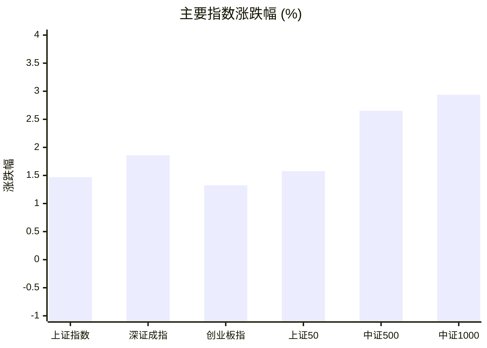
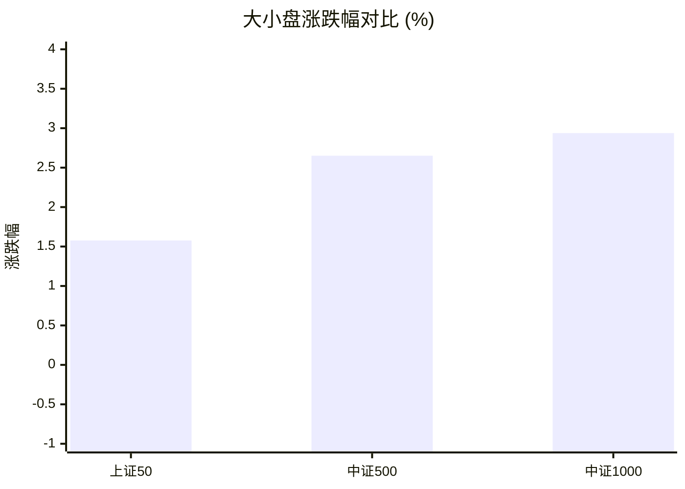
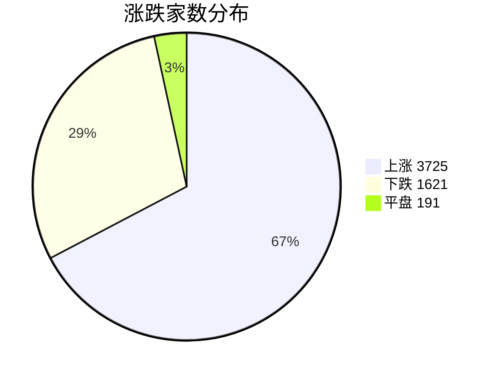
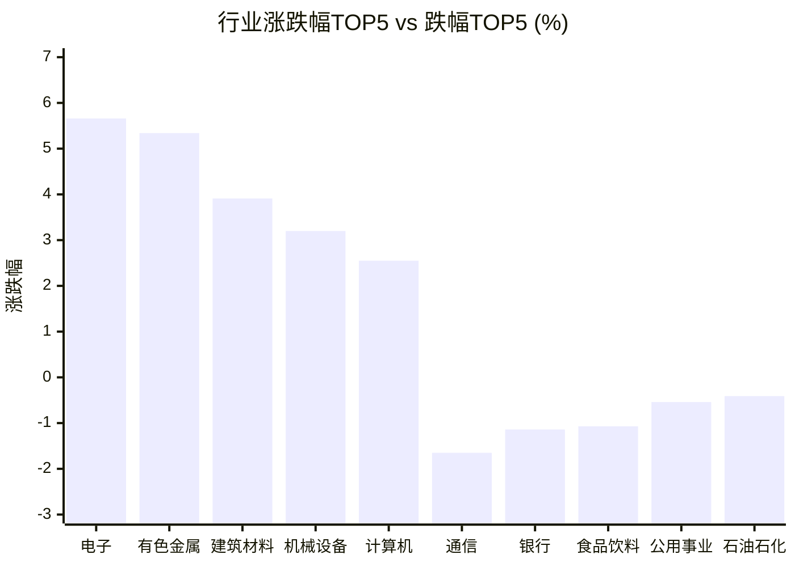

# 📊 A股收盘简报 | 2026-08-05 周三

---

## 📈 一、大盘概况

2026年08月05日 是 A 股交易日，收盘数据已可用。

### 主要指数表现

| 指数 | 收盘价 | 涨跌幅 | 涨跌点 | 成交额(亿) | 前收盘 | 开盘 | 最高 | 最低 |
|------|--------|--------|--------|-----------|--------|------|------|------|
| 上证指数 | 3878.43 | **▲+1.47%** | +56.15 | 12087.23亿 | 3822.28 | 3815.12 | 3884.40 | 3815.12 |
| 深证成指 | 14144.20 | **▲+1.86%** | +258.49 | 14509.11亿 | 13885.71 | 13644.83 | 14246.38 | 13644.83 |
| 创业板指 | 3535.14 | **▲+1.32%** | +46.17 | 7205.46亿 | 3488.97 | 3372.08 | 3584.06 | 3372.04 |
| 上证50 | 2924.06 | **▲+1.58%** | +45.39 | 2371.16亿 | 2878.67 | 2882.51 | 2932.40 | 2882.51 |
| 中证500 | 7809.21 | **▲+2.65%** | +201.72 | 5269.23亿 | 7607.49 | 7567.96 | 7845.39 | 7567.96 |
| 中证1000 | 7493.05 | **▲+2.94%** | +213.86 | 5116.49亿 | 7279.19 | 7253.22 | 7523.50 | 7253.22 |

### 市场整体成交

- **沪深合计成交额**: **26596.35亿**
- **较前日放量** 4460.43亿（+20.2%）

---

## 📊 二、指数涨跌幅对比

---

## 📊 三、市值结构 — 大小盘对比

| 指数 | 涨跌幅 | 特征 |
|------|--------|------|
| 上证50 | **▲+1.58%** | 超大盘 |
| 中证500 | **▲+2.65%** | 中盘 |
| 中证1000 | **▲+2.94%** | 小盘 |

> 📌 **小盘强势领跑**，中证500/中证1000涨幅远超上证50，资金向中小市值扩散。

---

## 📉 四、市场广度
### 涨跌家数分布

### 关键统计

| 指标 | 数值 |
|------|------|
| 上涨家数 | 3725 |
| 下跌家数 | 1621 |
| 平盘家数 | 191 |
| 涨停家数 | 105 |
| 跌停家数 | 1 |
| 全市场中位数 | **▲+0.93%** |

---
## 🏢 五、行业表现

### 🔥 涨幅榜 TOP 10

| 排名 | 行业(申万一级) | 涨跌幅 |
|------|---------------|--------|
| 🥇 | 电子(申万) | **▲+5.66%** |
| 🥈 | 有色金属(申万) | **▲+5.34%** |
| 🥉 | 建筑材料(申万) | **▲+3.91%** |
| 4 | 机械设备(申万) | **▲+3.20%** |
| 5 | 计算机(申万) | **▲+2.55%** |
| 6 | 基础化工(申万) | **▲+2.48%** |
| 7 | 电力设备(申万) | **▲+2.24%** |
| 8 | 国防军工(申万) | **▲+2.10%** |
| 9 | 汽车(申万) | **▲+1.62%** |
| 10 | 房地产(申万) | **▲+1.56%** |

### ❄️ 跌幅榜 TOP 10

| 排名 | 行业(申万一级) | 涨跌幅 |
|------|---------------|--------|
| 31 | 通信(申万) | **▼1.65%** |
| 30 | 银行(申万) | **▼1.14%** |
| 29 | 食品饮料(申万) | **▼1.07%** |
| 28 | 公用事业(申万) | **▼0.54%** |
| 27 | 石油石化(申万) | **▼0.41%** |
| 26 | 美容护理(申万) | **▲+0.08%** |
| 25 | 煤炭(申万) | **▲+0.10%** |
| 24 | 钢铁(申万) | **▲+0.32%** |
| 23 | 商贸零售(申万) | **▲+0.34%** |
| 22 | 传媒(申万) | **▲+0.43%** |

> 📈 **行业普涨**，多数板块收红。 涨幅第一：**电子(申万)**（+5.66%）。 跌幅第一：**通信(申万)**（-1.65%）。

---

## 💡 六、热门概念

| 概念 | 涨跌幅 |
|------|--------|
| 六氟化钨指数 | **▲+10.50%** |
| 氮化铝指数 | **▲+8.35%** |
| 半导体设备指数 | **▲+8.23%** |
| 覆铜板指数 | **▲+8.07%** |
| 半导体材料指数 | **▲+7.68%** |
| 半导体硅片指数 | **▲+7.56%** |
| 玻璃纤维指数 | **▲+7.48%** |
| 对日反制指数 | **▲+7.33%** |
| 磷化铟指数 | **▲+7.26%** |
| 工业气体指数 | **▲+7.23%** |

> 📌 今日热门概念集中在 **六氟化钨指数**（+10.50%） 等方向。

---

## 💰 七、资金流向

### 主力资金概况

| 指标 | 数值(亿元) |
|------|------|
| 主力资金净流入 | 1290.72 |

### 资金流入行业 TOP5

| 行业 | 净流入(亿元) |
|------|--------|
| 电子 | 448.41 |
| 计算机 | 159.11 |
| 有色金属 | 155.32 |
| 电力设备 | 91.59 |
| 机械设备 | 82.48 |

> 🟢 **主力资金大幅净流入**，市场做多意愿强烈。

---

## 🌍 八、周边市场

| 指数 | 涨跌幅 |
|------|--------|
| 日经225 | **▲+3.66%** |
| 纳斯达克指数 | **▲+2.59%** |
| 标普500 | **▲+1.79%** |
| 道琼斯工业平均 | **▲+1.71%** |
| 恒生指数 | **▲+0.24%** |

> 📌 全球市场多数上涨，外围情绪偏暖。

---

## 📊 九、期货市场

| 品种 | 涨跌幅 |
|------|--------|
| IC2608 | **▲+2.60%** |
| IC2609 | **▲+2.60%** |
| IC2612 | **▲+2.62%** |
| IC2703 | **▲+2.63%** |
| IF2608 | **▲+1.32%** |
| IF2609 | **▲+1.28%** |
| IF2612 | **▲+1.20%** |
| IF2703 | **▲+1.30%** |
| IH2608 | **▲+1.37%** |
| IH2609 | **▲+1.35%** |

---

## 📰 十、财经要闻

- 【A股午间收盘快报】 科创50指数上涨5.18% 全市场超3900股飘红 半导体产业链爆发
- 超3700只个股飘红！中际旭创成交额675亿，再创天量，A股第一；万亿工业富联，2分钟涨停；光纤大牛股涨停｜A股收盘
- A股每日行情复盘（8月5日）
- A股盘前市场要闻速递（2026-08-05）
- 陆家嘴财经早餐2026年8月5日星期三

---

## 🤖 十一、盘面结论

> 分析来源：AI Agent

一句话定性：市场呈现放量普涨且小盘更强的风险偏好扩散格局，但通信、银行和食品饮料走弱，内部仍有分化。

- 证据：六个主要指数全部收涨，上证指数涨 1.47%，中证500和中证1000分别涨 2.65%和 2.94%，均高于上证50的 1.58%；这是中小市值相对占优的盘面表现。
- 证据：沪深合计成交额 26596.35 亿元，较前日增加 4460.43 亿元（+20.2%）；上涨、下跌、平盘家数分别为 3725、1621、191，涨停 105 家、跌停 1 家，全市场中位数为 +0.93%。量能和广度共同支持当日普涨判断。
- 证据：电子和有色金属行业分别上涨 5.66%和 5.34%，电子、计算机、有色金属位列主力资金净流入行业前三；主力资金净流入合计 1290.72 亿元。该组合显示成长与资源方向获得了报告数据的同步支持。

---

## 🎯 十二、主线轮动

1. **半导体产业链，生命周期：加速。** 盘面证据是电子行业上涨 5.66%，半导体设备、覆铜板、半导体材料和半导体硅片概念均进入热门概念前列，涨幅在 7.56%至 8.23%之间；电子行业同时录得 448.41 亿元主力资金净流入。催化解释仅待后续盘面验证，确认条件是电子行业继续位于强势行业且相关半导体概念保持强势，失效条件是电子行业转弱并跌出当日强势行业。
2. **有色与材料链，生命周期：发酵。** 盘面证据是有色金属行业上涨 5.34%，建筑材料上涨 3.91%，六氟化钨、氮化铝、玻璃纤维和工业气体等材料相关概念位居热门概念前列；有色金属行业净流入 155.32 亿元。催化解释仅待后续盘面验证，确认条件是有色金属与材料相关概念继续同步走强，失效条件是有色金属行业转弱且材料概念不再居于强势列表。

---

## 🔍 十三、明日关注

1. **观察对象：市场量价与广度。** 确认信号：沪深成交额维持放量，同时上涨家数继续显著多于下跌家数、涨停家数维持活跃。失效信号：成交额明显回落且下跌家数明显增多、跌停家数上升。
2. **观察对象：半导体产业链强度。** 确认信号：电子行业继续保持强势，半导体设备、覆铜板、半导体材料或半导体硅片等概念继续出现在强势概念列表。失效信号：电子行业走弱，相关概念集体退出强势列表。
3. **观察对象：中小市值相对表现。** 确认信号：中证500和中证1000继续跑赢上证50，且中小盘相关行业维持普涨。失效信号：上证50相对转强，而中证500和中证1000明显落后或转跌。

---

## 📌 数据来源与免责声明

- **数据来源**：万得 Wind 金融数据服务
- **数据日期**：2026-08-05 收盘
- **生成时间**：2026年08月05日
- **免责声明**：本简报基于 Wind 数据自动生成，AI 分析部分（如有）仅供参考，不构成任何投资建议。市场有风险，投资需谨慎。
