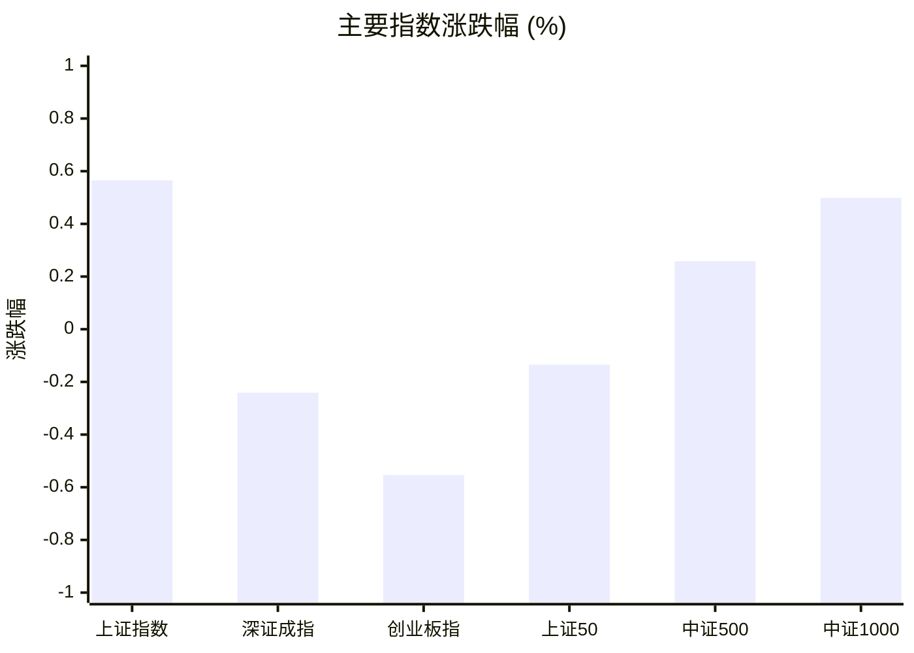
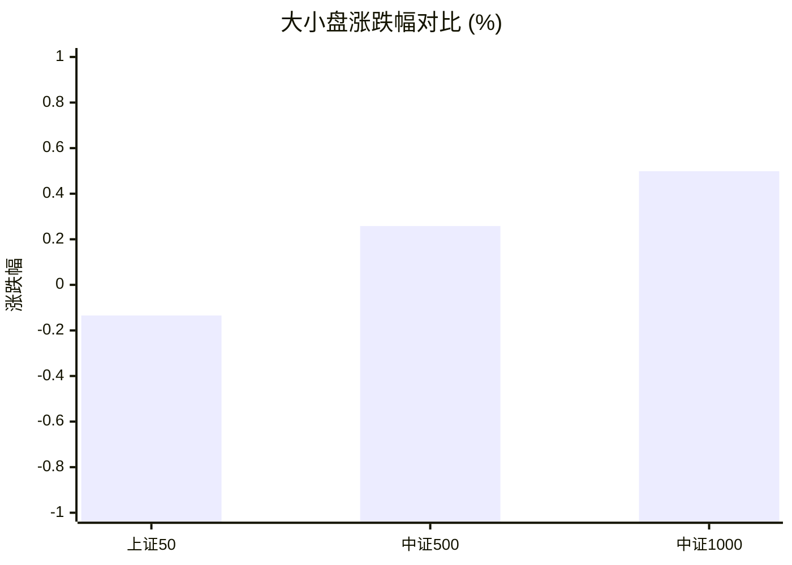
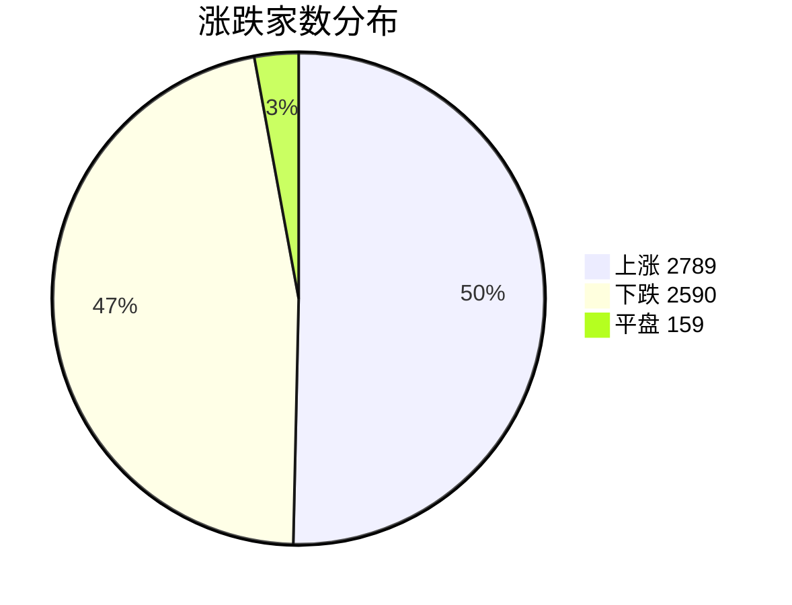
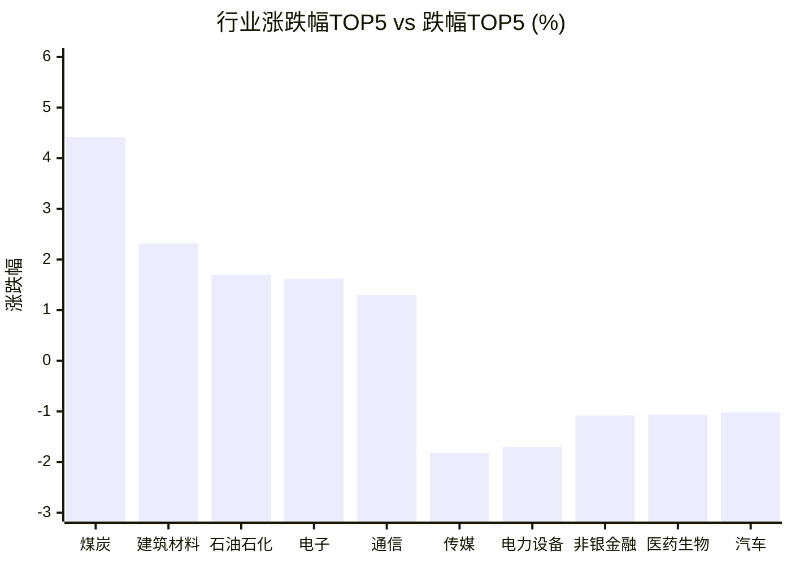

# 📊 A股收盘简报 | 2026-08-06 周四

---

## ⚠️ 数据完整性

⚠️ **报告不完整：重要数据缺失，未提供基于缺失数据的行情结论。**

| 数据域 | 状态 | 级别 |
|--------|------|------|
| 资金流向 | 部分可用（1 条资金流有效，31 条候选行被拒绝） | 重要 |

---

## 📈 一、大盘概况

2026年08月06日 是 A 股交易日，收盘数据已可用。

### 主要指数表现

| 指数 | 收盘价 | 涨跌幅 | 涨跌点 | 成交额(亿) | 前收盘 | 开盘 | 最高 | 最低 |
|------|--------|--------|--------|-----------|--------|------|------|------|
| 上证指数 | 3900.35 | **▲+0.57%** | +21.92 | 11668.19亿 | 3878.43 | 3864.27 | 3902.05 | 3864.27 |
| 深证成指 | 14110.12 | **▼0.24%** | -34.08 | 13619.63亿 | 14144.20 | 13981.44 | 14252.14 | 13922.41 |
| 创业板指 | 3515.56 | **▼0.55%** | -19.58 | 6579.08亿 | 3535.14 | 3472.15 | 3574.41 | 3444.36 |
| 上证50 | 2920.13 | **▼0.13%** | -3.93 | 1938.31亿 | 2924.06 | 2913.41 | 2925.67 | 2906.45 |
| 中证500 | 7829.36 | **▲+0.26%** | +20.15 | 4943.75亿 | 7809.21 | 7737.59 | 7868.85 | 7722.57 |
| 中证1000 | 7530.43 | **▲+0.50%** | +37.38 | 5286.47亿 | 7493.05 | 7440.01 | 7564.69 | 7434.49 |

### 市场整体成交

- **沪深合计成交额**: **25287.81亿**
- **较前日缩量** 1308.53亿（-4.9%）

---

## 📊 二、指数涨跌幅对比

---

## 📊 三、市值结构 — 大小盘对比

| 指数 | 涨跌幅 | 特征 |
|------|--------|------|
| 上证50 | **▼0.13%** | 超大盘 |
| 中证500 | **▲+0.26%** | 中盘 |
| 中证1000 | **▲+0.50%** | 小盘 |

> 📌 **小盘强势领跑**，中证500/中证1000涨幅远超上证50，资金向中小市值扩散。

---

## 📉 四、市场广度
### 涨跌家数分布

### 关键统计

| 指标 | 数值 |
|------|------|
| 上涨家数 | 2789 |
| 下跌家数 | 2590 |
| 平盘家数 | 159 |
| 涨停家数 | 83 |
| 跌停家数 | 1 |
| 全市场中位数 | **▲+0.05%** |

---
## 🏢 五、行业表现

### 🔥 涨幅榜 TOP 10

| 排名 | 行业(申万一级) | 涨跌幅 |
|------|---------------|--------|
| 🥇 | 煤炭(申万) | **▲+4.42%** |
| 🥈 | 建筑材料(申万) | **▲+2.32%** |
| 🥉 | 石油石化(申万) | **▲+1.70%** |
| 4 | 电子(申万) | **▲+1.62%** |
| 5 | 通信(申万) | **▲+1.30%** |
| 6 | 基础化工(申万) | **▲+1.16%** |
| 7 | 纺织服饰(申万) | **▲+0.94%** |
| 8 | 有色金属(申万) | **▲+0.92%** |
| 9 | 机械设备(申万) | **▲+0.73%** |
| 10 | 房地产(申万) | **▲+0.62%** |

### ❄️ 跌幅榜 TOP 10

| 排名 | 行业(申万一级) | 涨跌幅 |
|------|---------------|--------|
| 31 | 传媒(申万) | **▼1.82%** |
| 30 | 电力设备(申万) | **▼1.70%** |
| 29 | 非银金融(申万) | **▼1.08%** |
| 28 | 医药生物(申万) | **▼1.06%** |
| 27 | 汽车(申万) | **▼1.02%** |
| 26 | 美容护理(申万) | **▼0.99%** |
| 25 | 钢铁(申万) | **▼0.77%** |
| 24 | 综合(申万) | **▼0.74%** |
| 23 | 商贸零售(申万) | **▼0.67%** |
| 22 | 社会服务(申万) | **▼0.56%** |

> 📊 **行业分化明显**，15涨/16跌。 涨幅第一：**煤炭(申万)**（+4.42%）。 跌幅第一：**传媒(申万)**（-1.82%）。

---

## 💡 六、热门概念

| 概念 | 涨跌幅 |
|------|--------|
| 六氟化钨指数 | **▲+9.59%** |
| 工业气体指数 | **▲+6.19%** |
| 射频及天线指数 | **▲+6.17%** |
| 煤炭开采精选指数 | **▲+5.70%** |
| 半导体材料指数 | **▲+4.96%** |
| 氮化铝指数 | **▲+4.82%** |
| 先进封装指数 | **▲+4.09%** |
| 磷化铟指数 | **▲+4.01%** |
| 玻璃纤维指数 | **▲+3.94%** |
| 覆铜板指数 | **▲+3.89%** |

> 📌 今日热门概念集中在 **六氟化钨指数**（+9.59%） 等方向。

---

## 💰 七、资金流向

> ⚠️ 数据状态：部分可用（1 条资金流有效，31 条候选行被拒绝）。本节不展示默认值，也不据此生成行情结论。

---

## 🌍 八、周边市场

| 指数 | 涨跌幅 |
|------|--------|
| 道琼斯工业平均 | **▲+0.49%** |
| 标普500 | **▼0.17%** |
| 纳斯达克指数 | **▼0.83%** |
| 日经225 | **▼0.93%** |
| 恒生指数 | **▼1.69%** |

> 📌 全球市场多数下跌，外围情绪偏弱。

---

## 📊 九、期货市场

| 品种 | 涨跌幅 |
|------|--------|
| IC2608 | **▲+0.10%** |
| IC2609 | **▼0.01%** |
| IC2612 | **▼0.26%** |
| IC2703 | **▼0.38%** |
| IF2608 | **▼0.07%** |
| IF2609 | **▼0.10%** |
| IF2612 | **▼0.22%** |
| IF2703 | **▼0.26%** |
| IH2608 | **▲+0.05%** |
| IH2609 | **▲+0.01%** |

---

## 📰 十、财经要闻

- 沪指飘红，煤炭、PCB板块走强，教育、汽车整车股下挫 | A股收盘
- 收盘｜上证指数涨0.57% 煤炭股走强
- 陆家嘴财经早餐2026年8月6日星期四
- 金十数据全球财经早餐 | 2026年8月6日
- 2026年A股半年度业绩预告盘点（8月6日）

---

## 🤖 十一、盘面结论

> 分析来源：AI Agent
> 分析范围：未使用资金流向数据。

一句话定性：市场呈现小盘偏强、指数与行业分化并存的结构性修复，整体扩散力度仍待确认。

- **指数与风格证据**：上证指数上涨 0.57%，中证500和中证1000分别上涨 0.26% 和 0.50%；深证成指、创业板指和上证50则分别下跌 0.24%、0.55% 和 0.13%。这是中小市值相对占优、权重与成长内部仍有分歧的盘面事实。
- **广度证据**：全市场上涨 2789 家、下跌 2590 家，涨跌幅中位数为 +0.05%，涨停 83 家、跌停 1 家。Agent 判断，个股多空接近平衡而极端下行个股较少，修复的持续性仍需下一交易日广度验证。
- **行业证据**：31 个申万一级行业中 15 涨、16 跌；煤炭上涨 4.42%，建筑材料和石油石化分别上涨 2.32% 和 1.70%，传媒和电力设备则分别下跌 1.82% 和 1.70%。行业涨跌分布说明当日不是全面普涨。

---

## 🎯 十二、主线轮动

1. **资源与材料方向：发酵，盘面已验证。**
   - **盘面证据**：煤炭、建筑材料、石油石化分别位居行业涨幅前三，基础化工和有色金属亦收涨；工业气体、煤炭开采精选、玻璃纤维等概念位列热门概念涨幅前列。
   - **催化验证**：当日行业及概念数据同向走强，构成盘面验证；具体驱动原因未由结构化数据确认。
   - **确认条件**：下一交易日煤炭、建材、石油石化中多数仍位于行业涨幅前列，且相关概念继续保持强势。
   - **失效条件**：上述行业转入跌幅靠前位置，或相关概念不再出现在强势方向。

2. **电子与通信材料方向：加速，盘面已验证。**
   - **盘面证据**：电子上涨 1.62%、通信上涨 1.30%；六氟化钨、射频及天线、半导体材料、先进封装、氮化铝等概念涨幅居前。
   - **催化验证**：行业与多个相关概念同向上涨，构成盘面验证；新闻标题不作为上涨原因。
   - **确认条件**：下一交易日电子、通信维持行业强势，半导体材料或先进封装等概念继续位居热门概念前列。
   - **失效条件**：电子、通信转为行业弱势，且相关概念同步回落出强势名单。

---

## 🔍 十三、明日关注

1. **观察对象：中小盘相对强度。** 确认信号：中证500、中证1000继续强于上证50，且维持收涨；失效信号：中证500、中证1000不再相对占优或同步转弱。
2. **观察对象：资源与材料行业的延续性。** 确认信号：煤炭、建筑材料、石油石化中多数继续位居行业涨幅前列；失效信号：这些行业转入行业跌幅靠前位置。
3. **观察对象：电子与通信主题的扩散。** 确认信号：电子、通信继续收涨，半导体材料或先进封装等概念仍在热门概念前列；失效信号：行业与相关概念同步走弱。

---

## 📌 数据来源与免责声明

- **数据来源**：万得 Wind 金融数据服务
- **数据日期**：2026-08-06 收盘
- **生成时间**：2026年08月06日
- **免责声明**：本简报基于 Wind 数据自动生成，AI 分析部分（如有）仅供参考，不构成任何投资建议。市场有风险，投资需谨慎。
