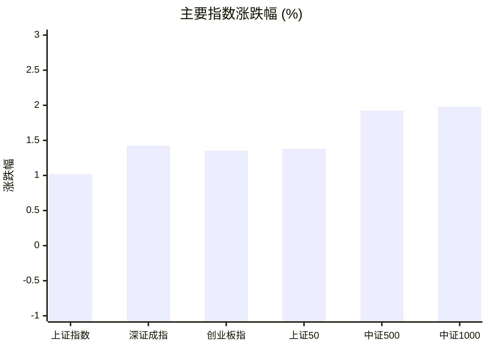
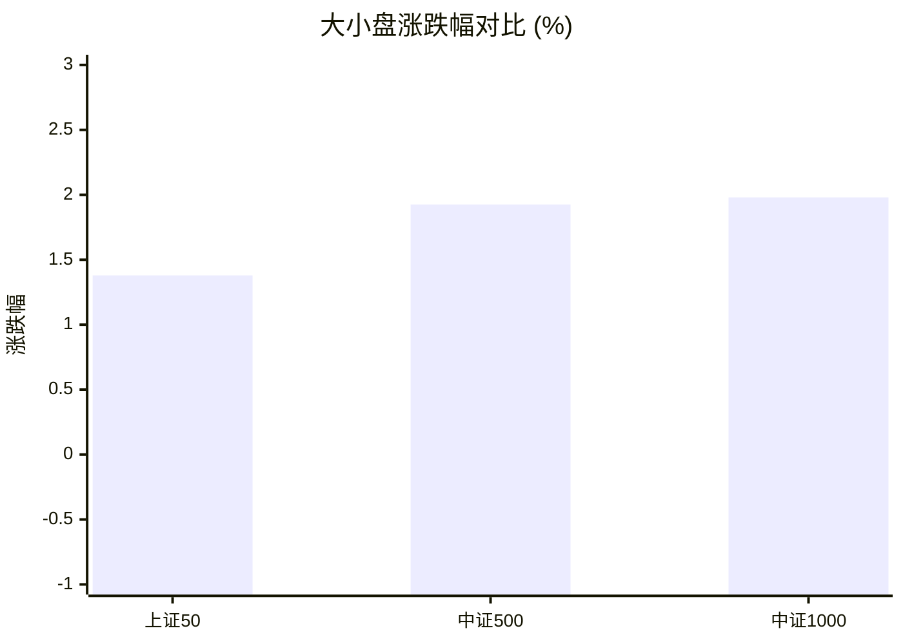
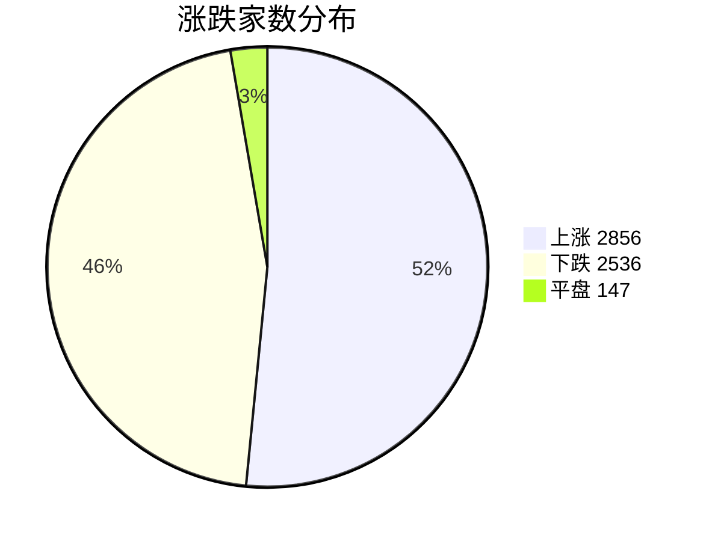
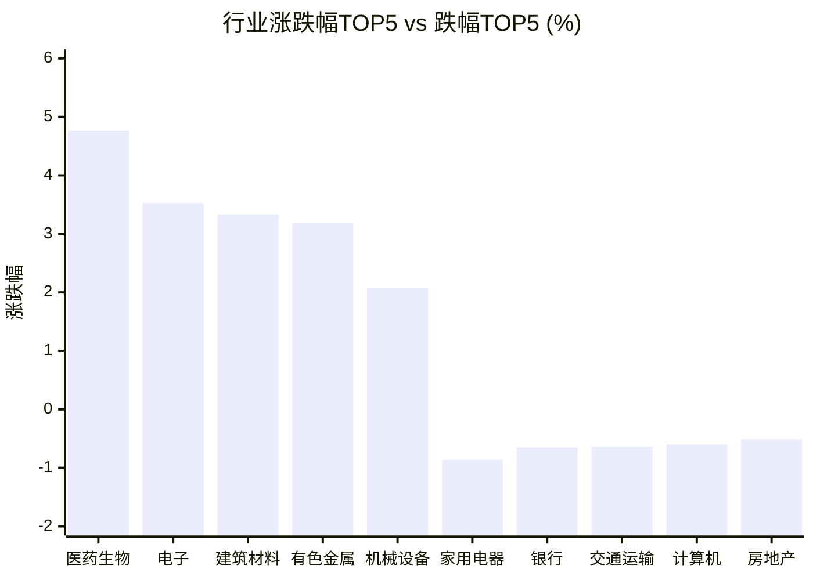

# 📊 A股收盘简报 | 2026-08-07 周五

---

## 📈 一、大盘概况

2026年08月07日 是 A 股交易日，收盘数据已可用。

### 主要指数表现

| 指数 | 收盘价 | 涨跌幅 | 涨跌点 | 成交额(亿) | 前收盘 | 开盘 | 最高 | 最低 |
|------|--------|--------|--------|-----------|--------|------|------|------|
| 上证指数 | 3940.04 | **▲+1.02%** | +39.69 | 12095.44亿 | 3900.35 | 3896.49 | 3940.93 | 3885.62 |
| 深证成指 | 14311.01 | **▲+1.42%** | +200.89 | 14548.76亿 | 14110.12 | 14152.78 | 14396.07 | 14049.34 |
| 创业板指 | 3563.12 | **▲+1.35%** | +47.56 | 7301.04亿 | 3515.56 | 3537.44 | 3613.87 | 3507.62 |
| 上证50 | 2960.42 | **▲+1.38%** | +40.29 | 2034.85亿 | 2920.13 | 2917.44 | 2960.94 | 2913.59 |
| 中证500 | 7980.12 | **▲+1.93%** | +150.76 | 5252.81亿 | 7829.36 | 7828.79 | 7983.17 | 7763.53 |
| 中证1000 | 7679.53 | **▲+1.98%** | +149.10 | 5684.15亿 | 7530.43 | 7534.24 | 7685.57 | 7448.46 |

### 市场整体成交

- **沪深合计成交额**: **26644.20亿**
- **较前日放量** 1356.38亿（+5.4%）

---

## 📊 二、指数涨跌幅对比

---

## 📊 三、市值结构 — 大小盘对比

| 指数 | 涨跌幅 | 特征 |
|------|--------|------|
| 上证50 | **▲+1.38%** | 超大盘 |
| 中证500 | **▲+1.93%** | 中盘 |
| 中证1000 | **▲+1.98%** | 小盘 |

> 📌 **小盘强势领跑**，中证500/中证1000涨幅远超上证50，资金向中小市值扩散。

---

## 📉 四、市场广度
### 涨跌家数分布

### 关键统计

| 指标 | 数值 |
|------|------|
| 上涨家数 | 2856 |
| 下跌家数 | 2536 |
| 平盘家数 | 147 |
| 涨停家数 | 75 |
| 跌停家数 | 4 |
| 全市场中位数 | **▲+0.12%** |

---
## 🏢 五、行业表现

### 🔥 涨幅榜 TOP 10

| 排名 | 行业(申万一级) | 涨跌幅 |
|------|---------------|--------|
| 🥇 | 医药生物(申万) | **▲+4.77%** |
| 🥈 | 电子(申万) | **▲+3.53%** |
| 🥉 | 建筑材料(申万) | **▲+3.33%** |
| 4 | 有色金属(申万) | **▲+3.19%** |
| 5 | 机械设备(申万) | **▲+2.08%** |
| 6 | 国防军工(申万) | **▲+1.47%** |
| 7 | 基础化工(申万) | **▲+1.23%** |
| 8 | 电力设备(申万) | **▲+1.19%** |
| 9 | 综合(申万) | **▲+0.77%** |
| 10 | 美容护理(申万) | **▲+0.72%** |

### ❄️ 跌幅榜 TOP 10

| 排名 | 行业(申万一级) | 涨跌幅 |
|------|---------------|--------|
| 31 | 家用电器(申万) | **▼0.86%** |
| 30 | 银行(申万) | **▼0.65%** |
| 29 | 交通运输(申万) | **▼0.64%** |
| 28 | 计算机(申万) | **▼0.60%** |
| 27 | 房地产(申万) | **▼0.51%** |
| 26 | 商贸零售(申万) | **▼0.42%** |
| 25 | 煤炭(申万) | **▼0.34%** |
| 24 | 纺织服饰(申万) | **▼0.27%** |
| 23 | 非银金融(申万) | **▼0.26%** |
| 22 | 农林牧渔(申万) | **▼0.21%** |

> 📊 **行业分化明显**，17涨/14跌。 涨幅第一：**医药生物(申万)**（+4.77%）。 跌幅第一：**家用电器(申万)**（-0.86%）。

---

## 💡 六、热门概念

| 概念 | 涨跌幅 |
|------|--------|
| CRO指数 | **▲+12.08%** |
| 覆铜板指数 | **▲+9.88%** |
| 医疗服务精选指数 | **▲+9.26%** |
| ADC指数 | **▲+8.57%** |
| 电路板指数 | **▲+8.02%** |
| 创新药指数 | **▲+7.31%** |
| 减肥药指数 | **▲+6.97%** |
| 玻璃纤维指数 | **▲+5.39%** |
| 玻璃基板指数 | **▲+5.22%** |
| 氮化铝指数 | **▲+5.10%** |

> 📌 今日热门概念集中在 **CRO指数**（+12.08%） 等方向。

---

## 💰 七、资金流向

### 主力资金概况

| 指标 | 数值(亿元) |
|------|------|
| 主力资金净流入 | 831.61 |

### 资金流入行业 TOP5

| 行业 | 净流入(亿元) |
|------|--------|
| 电子 | 315.71 |
| 医药生物 | 226.56 |
| 有色金属 | 164.49 |
| 电力设备 | 63.11 |
| 机械设备 | 56.39 |

> 🟢 **主力资金大幅净流入**，市场做多意愿强烈。

---

## 🌍 八、周边市场

| 指数 | 涨跌幅 |
|------|--------|
| 恒生指数 | **▲+0.47%** |
| 纳斯达克指数 | **▼0.06%** |
| 日经225 | **▼0.12%** |
| 标普500 | **▼0.18%** |
| 道琼斯工业平均 | **▼0.85%** |

> 📌 全球市场多数下跌，外围情绪偏弱。

---

## 📊 九、期货市场

| 品种 | 涨跌幅 |
|------|--------|
| IC2608 | **▲+2.16%** |
| IC2609 | **▲+2.13%** |
| IC2612 | **▲+2.11%** |
| IC2703 | **▲+2.11%** |
| IF2608 | **▲+1.00%** |
| IF2609 | **▲+0.95%** |
| IF2612 | **▲+0.85%** |
| IF2703 | **▲+0.81%** |
| IH2608 | **▲+1.35%** |
| IH2609 | **▲+1.36%** |

---

## 📰 十、财经要闻

- 8月7日A股宽基指数全线上涨，科创50涨幅居首（+2.51%），沪深300涨幅最小（+0.93%）
- 【A股午间收盘快报】 创业板指上涨1.75% CRO概念领涨 PCB板块掀涨停潮
- A股每日行情复盘（8月7日）
- 金十数据全球财经早餐 | 2026年8月7日
- A股大盘涨超1%！近3000只个股飘红

---

## 🤖 十一、盘面结论

> 分析来源：AI Agent

一句话定性：市场呈现放量上涨、但个股强度并不均衡的偏强格局，中小市值与医药、电子方向相对占优。

- 证据：六个主要指数均收涨，沪深合计成交额为 26644.20 亿，较前日增加 1356.38 亿；指数走强获得成交额同步放大的支持。
- 证据：中证500和中证1000分别上涨 1.93% 和 1.98%，高于上证50的 1.38%；市场广度为 2856 家上涨、2536 家下跌，中位数仅为 +0.12%，说明指数强势与个股收益强度之间仍有分化。
- 证据：申万行业中 17 涨、14 跌，医药生物和电子分别上涨 4.77% 和 3.53%；主力资金净流入 831.61 亿元，电子、医药生物的行业净流入居前。上述数据与强势方向一致，但不构成对后续走势的保证。

---

## 🎯 十二、主线轮动

1. **创新药与 CRO，生命周期判断：加速。** 盘面证据是医药生物上涨 4.77%，CRO指数上涨 12.08%，医疗服务精选指数、ADC指数和创新药指数亦位列热门概念涨幅榜。催化验证：报告未提供可确认的结构化催化事件，仅以次日行业及概念表现作验证；确认条件为医药生物继续位居行业涨幅前列且 CRO 仍在热门概念涨幅榜，失效条件为医药生物转跌且 CRO 退出热门概念涨幅榜。
2. **电子与 PCB 材料，生命周期判断：加速。** 盘面证据是电子上涨 3.53%，覆铜板指数上涨 9.88%、电路板指数上涨 8.02%，且电子行业净流入 315.71 亿元居首。催化验证：报告未提供可确认的结构化催化事件，仅以次日行业、概念和资金数据作验证；确认条件为电子继续位居行业涨幅前列，覆铜板或电路板仍在热门概念涨幅榜且电子维持行业资金流入前列，失效条件为电子转跌并退出行业资金流入前列。

---

## 🔍 十三、明日关注

1. **观察对象：中证500和中证1000相对上证50的表现。** 确认信号：中证500或中证1000的涨幅继续高于上证50；失效信号：上证50的涨幅重新高于两者。
2. **观察对象：医药生物与 CRO 概念强度。** 确认信号：医药生物继续位居行业涨幅前列，且 CRO 仍在热门概念涨幅榜；失效信号：医药生物转跌且 CRO 退出热门概念涨幅榜。
3. **观察对象：电子、覆铜板和电路板方向的承接。** 确认信号：电子继续位居行业涨幅前列，覆铜板或电路板仍在热门概念涨幅榜且电子维持行业资金流入前列；失效信号：电子转跌并退出行业资金流入前列。

---

## 📌 数据来源与免责声明

- **数据来源**：万得 Wind 金融数据服务
- **数据日期**：2026-08-07 收盘
- **生成时间**：2026年08月07日
- **免责声明**：本简报基于 Wind 数据自动生成，AI 分析部分（如有）仅供参考，不构成任何投资建议。市场有风险，投资需谨慎。
