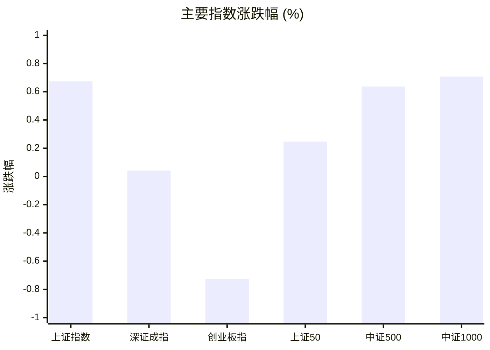
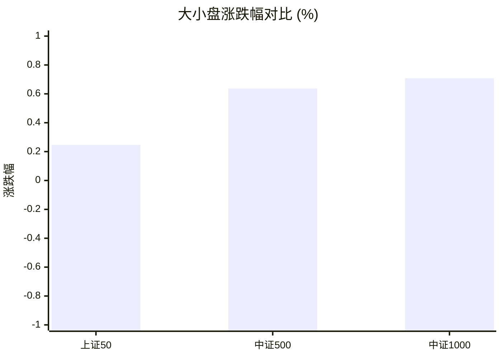
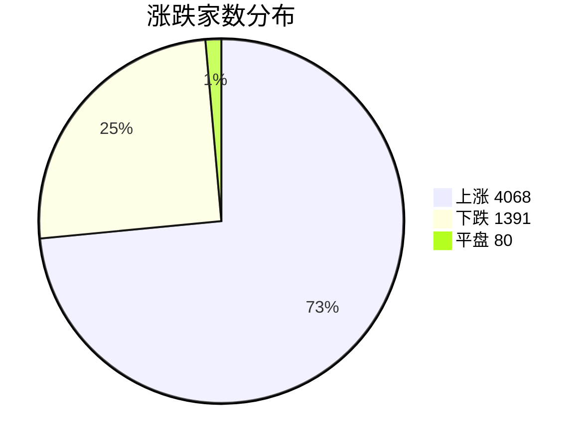
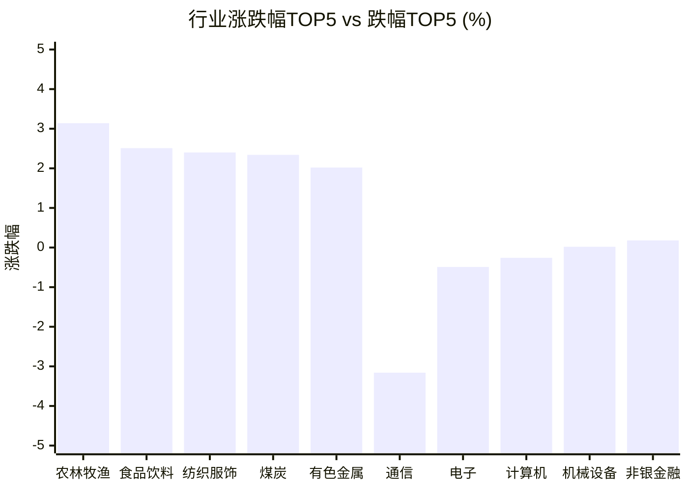

# 📊 A股收盘简报 | 2026-08-10 周一

---

## 📈 一、大盘概况

2026年08月10日 是 A 股交易日，收盘数据已可用。

### 主要指数表现

| 指数 | 收盘价 | 涨跌幅 | 涨跌点 | 成交额(亿) | 前收盘 | 开盘 | 最高 | 最低 |
|------|--------|--------|--------|-----------|--------|------|------|------|
| 上证指数 | 3966.59 | **▲+0.67%** | +26.55 | 11668.93亿 | 3940.04 | 3943.82 | 3967.59 | 3938.63 |
| 深证成指 | 14316.96 | **▲+0.04%** | +5.95 | 13562.10亿 | 14311.01 | 14348.95 | 14373.77 | 14102.66 |
| 创业板指 | 3537.21 | **▼0.73%** | -25.91 | 6578.74亿 | 3563.12 | 3567.05 | 3575.59 | 3470.95 |
| 上证50 | 2967.73 | **▲+0.25%** | +7.31 | 2097.69亿 | 2960.42 | 2963.24 | 2980.64 | 2954.62 |
| 中证500 | 8030.95 | **▲+0.64%** | +50.83 | 4904.34亿 | 7980.12 | 8003.92 | 8031.16 | 7910.84 |
| 中证1000 | 7733.90 | **▲+0.71%** | +54.37 | 5299.04亿 | 7679.53 | 7723.38 | 7736.10 | 7621.65 |

### 市场整体成交

- **沪深合计成交额**: **25231.03亿**
- **较前日缩量** 1413.17亿（-5.3%）

---

## 📊 二、指数涨跌幅对比

---

## 📊 三、市值结构 — 大小盘对比

| 指数 | 涨跌幅 | 特征 |
|------|--------|------|
| 上证50 | **▲+0.25%** | 超大盘 |
| 中证500 | **▲+0.64%** | 中盘 |
| 中证1000 | **▲+0.71%** | 小盘 |

> 📌 **风格分化明显**，大小盘走势不一致。

---

## 📉 四、市场广度
### 涨跌家数分布

### 关键统计

| 指标 | 数值 |
|------|------|
| 上涨家数 | 4068 |
| 下跌家数 | 1391 |
| 平盘家数 | 80 |
| 涨停家数 | 103 |
| 跌停家数 | 6 |
| 全市场中位数 | **▲+1.26%** |

---
## 🏢 五、行业表现

### 🔥 涨幅榜 TOP 10

| 排名 | 行业(申万一级) | 涨跌幅 |
|------|---------------|--------|
| 🥇 | 农林牧渔(申万) | **▲+3.14%** |
| 🥈 | 食品饮料(申万) | **▲+2.51%** |
| 🥉 | 纺织服饰(申万) | **▲+2.40%** |
| 4 | 煤炭(申万) | **▲+2.34%** |
| 5 | 有色金属(申万) | **▲+2.02%** |
| 6 | 社会服务(申万) | **▲+1.98%** |
| 7 | 轻工制造(申万) | **▲+1.91%** |
| 8 | 美容护理(申万) | **▲+1.79%** |
| 9 | 基础化工(申万) | **▲+1.68%** |
| 10 | 房地产(申万) | **▲+1.63%** |

### ❄️ 跌幅榜 TOP 10

| 排名 | 行业(申万一级) | 涨跌幅 |
|------|---------------|--------|
| 31 | 通信(申万) | **▼3.16%** |
| 30 | 电子(申万) | **▼0.49%** |
| 29 | 计算机(申万) | **▼0.26%** |
| 28 | 机械设备(申万) | **▲+0.02%** |
| 27 | 非银金融(申万) | **▲+0.18%** |
| 26 | 建筑材料(申万) | **▲+0.35%** |
| 25 | 银行(申万) | **▲+0.45%** |
| 24 | 电力设备(申万) | **▲+0.71%** |
| 23 | 建筑装饰(申万) | **▲+0.75%** |
| 22 | 公用事业(申万) | **▲+0.89%** |

> 📈 **行业普涨**，多数板块收红。 涨幅第一：**农林牧渔(申万)**（+3.14%）。 跌幅第一：**通信(申万)**（-3.16%）。

---

## 💡 六、热门概念

| 概念 | 涨跌幅 |
|------|--------|
| 鸡产业指数 | **▲+5.44%** |
| 黄金珠宝指数 | **▲+4.37%** |
| 乳业指数 | **▲+3.99%** |
| 猪产业指数 | **▲+3.90%** |
| 医疗服务精选指数 | **▲+3.78%** |
| 最小市值指数 | **▲+3.61%** |
| CRO指数 | **▲+3.58%** |
| 中航系指数 | **▲+3.57%** |
| 水产指数 | **▲+3.42%** |
| 小金属指数 | **▲+3.40%** |

> 📌 今日热门概念集中在 **鸡产业指数**（+5.44%） 等方向。

---

## 💰 七、资金流向

### 主力资金概况

| 指标 | 数值(亿元) |
|------|------|
| 主力资金净流入 | -89.40 |

### 资金流入行业 TOP5

| 行业 | 净流入(亿元) |
|------|--------|
| 医药生物 | 68.83 |
| 基础化工 | 35.13 |
| 食品饮料 | 33.71 |
| 农林牧渔 | 24.09 |
| 银行 | 18.68 |

> 🔴 **主力资金小幅净流出**。

---

## 🌍 八、周边市场

| 指数 | 涨跌幅 |
|------|--------|
| 日经225 | **▲+2.08%** |
| 纳斯达克指数 | **▲+1.30%** |
| 恒生指数 | **▲+1.05%** |
| 标普500 | **▲+0.62%** |
| 道琼斯工业平均 | **▲+0.28%** |

> 📌 全球市场多数上涨，外围情绪偏暖。

---

## 📊 九、期货市场

| 品种 | 涨跌幅 |
|------|--------|
| IC2608 | **▲+0.51%** |
| IC2609 | **▲+0.33%** |
| IC2612 | **▲+0.21%** |
| IC2703 | **▲+0.05%** |
| IF2608 | **▲+0.19%** |
| IF2609 | **▲+0.19%** |
| IF2612 | **▲+0.19%** |
| IF2703 | **▲+0.09%** |
| IH2608 | **▲+0.41%** |
| IH2609 | **▲+0.39%** |

---

## 📰 十、财经要闻

- A股收评：沪指收涨0.67%，全市场超4000只个股上涨
- A股每日行情复盘（8月10日）
- A股收评：沪指震荡反弹涨0.67% ，乳业、中兵系、贵金属等概念走强
- A股反弹，超100股涨停，消费板块爆发，一鸣食品10天飙涨90%，军工概念多股涨停
- 金十数据全球财经早餐 | 2026年8月10日

---

## 🤖 十一、盘面结论

> 分析来源：AI Agent

一句话定性：市场呈现普涨基础上的结构分化，消费农业与资源化工方向走强，而成长板块仍在承压。

- 证据：上证指数上涨 0.67%，中证500和中证1000分别上涨 0.64% 和 0.71%，但创业板指下跌 0.73%，指数间表现并不一致。
- 证据：全市场上涨 4068 家、下跌 1391 家，涨停 103 家、跌停 6 家，中位数上涨 1.26%，说明上涨覆盖面较广。
- 证据：沪深成交额为 25231.03 亿元，较前日减少 1413.17 亿元；主力资金净流出 89.40 亿元。量能与资金总量未同步转强，判断反弹的持续性仍需后续交易日确认。

---

## 🎯 十二、主线轮动

**消费农业方向｜加速**：农林牧渔、食品饮料分别上涨 3.14% 和 2.51%，鸡产业、乳业、猪产业概念分别上涨 5.44%、3.99% 和 3.90%；食品饮料与农林牧渔也位列资金净流入行业。催化验证：目前仅有行业、概念与资金数据的同向盘面验证，未据新闻标题判断驱动。确认条件：相关行业和概念在下一交易日继续居于涨幅与资金净流入前列；失效条件：行业涨幅排序明显回落，且概念表现转弱。

**资源化工方向｜加速**：煤炭、有色金属、基础化工分别上涨 2.34%、2.02% 和 1.68%，黄金珠宝、小金属概念分别上涨 4.37% 和 3.40%，基础化工净流入 35.13 亿元。催化验证：盘面已有行业、概念与可用资金数据支持，未将新闻作为涨跌原因。确认条件：有色、煤炭、化工及相关概念继续保持相对强势，基础化工维持资金净流入；失效条件：上述行业与概念同步回落，并退出资金净流入前列。

---

## 🔍 十三、明日关注

1. **观察对象：市场广度与成交额。**确认信号：上涨家数继续明显多于下跌家数，涨停与跌停数量维持有利结构，且沪深成交额不再继续缩减；失效信号：下跌家数明显增加、涨停减少或跌停增加，同时成交额继续走低。
2. **观察对象：消费农业主线。**确认信号：农林牧渔、食品饮料及鸡产业、乳业、猪产业概念延续相对强势，并保持资金净流入；失效信号：相关行业和概念转弱，且资金净流入排名回落。
3. **观察对象：成长板块修复。**确认信号：通信、电子、计算机由行业跌幅端回升，创业板指相对主要指数的表现改善；失效信号：通信、电子、计算机继续处于行业跌幅端，创业板指继续弱于其他主要指数。

---

## 📌 数据来源与免责声明

- **数据来源**：万得 Wind 金融数据服务
- **数据日期**：2026-08-10 收盘
- **生成时间**：2026年08月10日
- **免责声明**：本简报基于 Wind 数据自动生成，AI 分析部分（如有）仅供参考，不构成任何投资建议。市场有风险，投资需谨慎。
