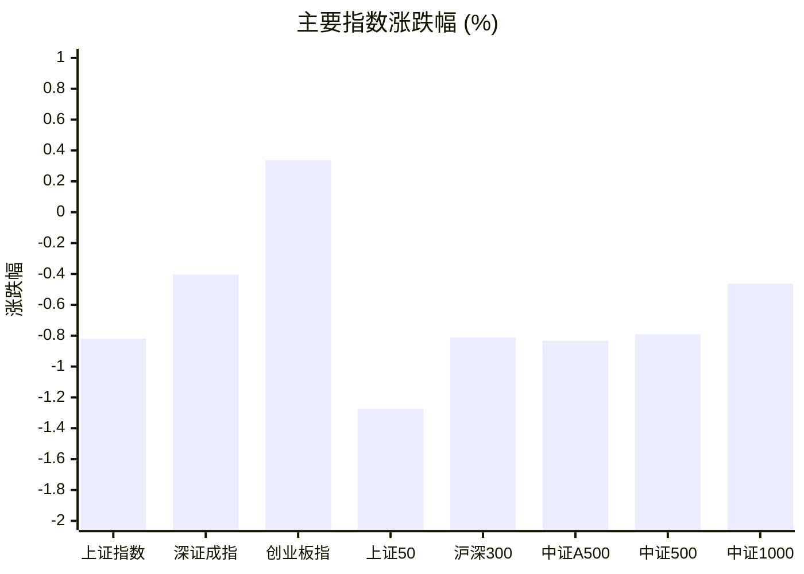
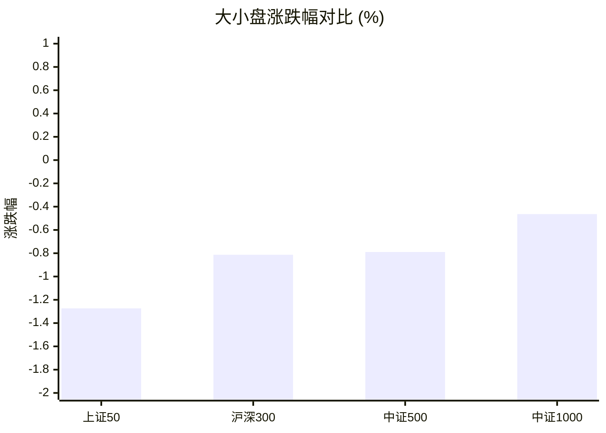
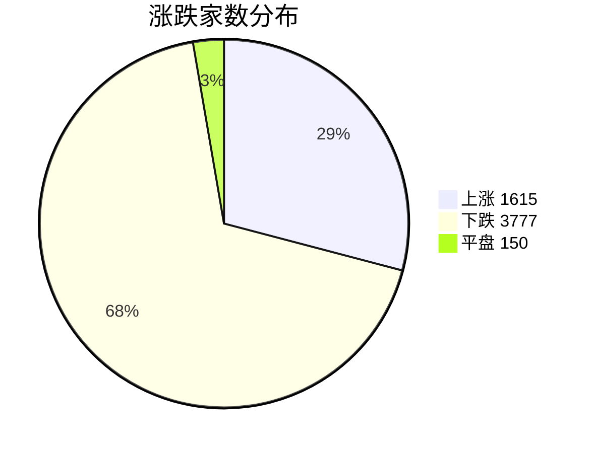
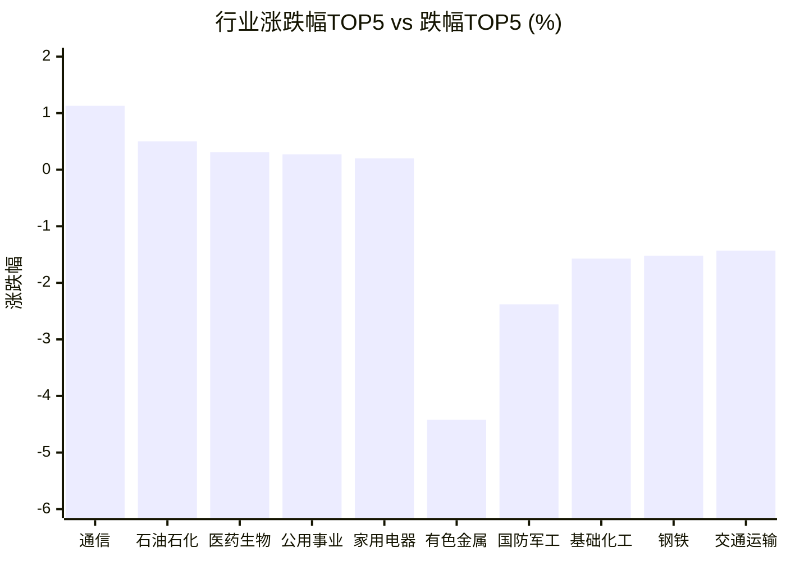

# 📊 A股收盘简报 | 2026-08-11 周二

---

## ⚠️ 数据完整性

⚠️ 以下可选数据未能取得或解析，相关章节已明确标注。

| 数据域 | 状态 | 级别 |
|--------|------|------|
| 周边市场 | 解析失败（返回数据无法解析为报告所需字段） | 可选 |

---

## 📈 一、大盘概况

2026年08月11日 是 A 股交易日，收盘数据已可用。

### 主要指数表现

| 指数 | 收盘价 | 涨跌幅 | 涨跌点 | 成交额(亿) | 前收盘 | 开盘 | 最高 | 最低 |
|------|--------|--------|--------|-----------|--------|------|------|------|
| 上证指数 | 3934.09 | **▼0.82%** | -32.50 | 10667.37亿 | 3966.59 | 3950.71 | 3966.39 | 3930.64 |
| 深证成指 | 14259.44 | **▼0.40%** | -57.52 | 12542.49亿 | 14316.96 | 14266.44 | 14447.10 | 14201.29 |
| 创业板指 | 3549.16 | **▲+0.34%** | +11.95 | 5975.24亿 | 3537.21 | 3533.89 | 3601.59 | 3517.57 |
| 上证50 | 2929.93 | **▼1.27%** | -37.80 | 1815.12亿 | 2967.73 | 2956.60 | 2971.40 | 2928.19 |
| 沪深300 | 4663.79 | **▼0.81%** | -38.23 | 6453.85亿 | 4702.02 | 4689.45 | 4715.88 | 4660.47 |
| 中证A500 | 5792.47 | **▼0.83%** | -48.63 | 9169.31亿 | 5841.10 | 5819.93 | 5864.43 | 5786.98 |
| 中证500 | 7967.54 | **▼0.79%** | -63.41 | 4528.00亿 | 8030.95 | 7979.28 | 8078.36 | 7947.67 |
| 中证1000 | 7698.05 | **▼0.46%** | -35.85 | 5152.82亿 | 7733.90 | 7686.04 | 7789.21 | 7642.44 |

### 市场整体成交

- **沪深合计成交额**: **23209.86亿**
- **较前日缩量** 2021.17亿（-8.0%）

---

## 📊 二、指数涨跌幅对比

---

## 📊 三、市值结构 — 大小盘对比

| 指数 | 涨跌幅 | 特征 |
|------|--------|------|
| 上证50 | **▼1.27%** | 超大盘 |
| 沪深300 | **▼0.81%** | 大盘 |
| 中证500 | **▼0.79%** | 中盘 |
| 中证1000 | **▼0.46%** | 小盘 |

> 📌 **小盘强势领跑**，中证500/中证1000涨幅远超上证50，资金向中小市值扩散。

---

## 📉 四、市场广度
### 涨跌家数分布

### 关键统计

| 指标 | 数值 |
|------|------|
| 上涨家数 | 1615 |
| 下跌家数 | 3777 |
| 平盘家数 | 150 |
| 涨停家数 | 60 |
| 跌停家数 | 2 |
| 全市场中位数 | **▼0.68%** |

---
## 🏢 五、行业表现

### 🔥 涨幅榜 TOP 10

| 排名 | 行业(申万一级) | 涨跌幅 |
|------|---------------|--------|
| 🥇 | 通信(申万) | **▲+1.13%** |
| 🥈 | 石油石化(申万) | **▲+0.50%** |
| 🥉 | 医药生物(申万) | **▲+0.31%** |
| 4 | 公用事业(申万) | **▲+0.27%** |
| 5 | 家用电器(申万) | **▲+0.20%** |
| 6 | 纺织服饰(申万) | **▲+0.11%** |
| 7 | 房地产(申万) | **▼0.01%** |
| 8 | 银行(申万) | **▼0.02%** |
| 9 | 建筑装饰(申万) | **▼0.06%** |
| 10 | 电力设备(申万) | **▼0.20%** |

### ❄️ 跌幅榜 TOP 10

| 排名 | 行业(申万一级) | 涨跌幅 |
|------|---------------|--------|
| 31 | 有色金属(申万) | **▼4.42%** |
| 30 | 国防军工(申万) | **▼2.38%** |
| 29 | 基础化工(申万) | **▼1.57%** |
| 28 | 钢铁(申万) | **▼1.52%** |
| 27 | 交通运输(申万) | **▼1.43%** |
| 26 | 农林牧渔(申万) | **▼1.21%** |
| 25 | 社会服务(申万) | **▼1.21%** |
| 24 | 非银金融(申万) | **▼0.92%** |
| 23 | 美容护理(申万) | **▼0.90%** |
| 22 | 电子(申万) | **▼0.87%** |

> 📉 **行业普跌**，多数板块调整。 涨幅第一：**通信(申万)**（+1.13%）。 跌幅第一：**有色金属(申万)**（-4.42%）。

---

## 💡 六、热门概念

| 概念 | 涨跌幅 |
|------|--------|
| 光伏逆变器指数 | **▲+2.27%** |
| 宇树机器人指数 | **▲+2.07%** |
| 工业母机指数 | **▲+1.90%** |
| 氮化铝指数 | **▲+1.83%** |
| CRO指数 | **▲+1.52%** |
| 射频及天线指数 | **▲+1.50%** |
| 减肥药指数 | **▲+1.32%** |
| 东数西算指数 | **▲+1.16%** |
| 外骨骼机器人指数 | **▲+1.16%** |
| ADC指数 | **▲+1.11%** |

> 📌 今日热门概念集中在 **光伏逆变器指数**（+2.27%） 等方向。

---

## 💰 七、资金流向

### 主力资金概况

| 指标 | 数值(亿元) |
|------|------|
| 主力资金净流入 | 116.68 |

### 资金流入行业 TOP5

| 行业 | 净流入(亿元) |
|------|--------|
| 医药生物 | 102.56 |
| 电子 | 63.84 |
| 通信 | 57.33 |
| 电力设备 | 43.04 |
| 机械设备 | 23.09 |

> 🟢 **主力资金大幅净流入**，市场做多意愿强烈。

---

## 🌍 八、周边市场

> ⚠️ 数据状态：解析失败（返回数据无法解析为报告所需字段）。本节不展示默认值，也不据此生成行情结论。

---

## 📊 九、期货市场

| 品种 | 涨跌幅 |
|------|--------|
| IC2608 | **▼0.06%** |
| IC2609 | **▲+0.01%** |
| IC2612 | **▼0.08%** |
| IC2703 | **▼0.11%** |
| IF2608 | **▼0.37%** |
| IF2609 | **▼0.32%** |
| IF2612 | **▼0.32%** |
| IF2703 | **▼0.35%** |
| IH2608 | **▼0.93%** |
| IH2609 | **▼0.87%** |

---

## 📰 十、财经要闻

- 超3700股飘绿！贵金属、稀土领跌；人形机器人、创新药、MLCC概念走强，百花医药6连板｜A股收盘
- 2026年A股半年报盘点（8月11日）
- 国内股指、国债、商品期货收盘综述（8月11日）
- 财联社8月11日午间新闻精选
- 【早盘提示08月11日】当前国内PTA装置整体开工负荷偏低，下游工厂成品库存偏高、成品产销偏弱，PTA企业主动压低开工率，PX调整回落

---

## 🤖 十一、盘面结论

> 分析来源：AI Agent

一句话定性：市场处于普遍回调中的结构性分化，成长方向仍有局部承接，但尚未形成全面修复。

- 证据：八个主要指数中仅创业板指上涨 0.34%，上证50下跌 1.27%、上证指数下跌 0.82%，大盘权重调整更明显。
- 证据：全市场上涨 1,615 家、下跌 3,777 家，涨跌幅中位数为 -0.68%，说明多数股票承压；60 家涨停、2 家跌停则显示局部活跃度仍在。
- 证据：沪深合计成交额 23,209.86 亿元，较前日缩量 8.0%；主力资金净流入 116.68 亿元，流入集中于医药生物、电子、通信和电力设备，属于结构性信号，尚不足以单独确认市场整体转强。

---

## 🎯 十二、主线轮动

### 科技制造与新能源设备：分化中的发酵

- 盘面证据：通信行业上涨 1.13%；光伏逆变器、宇树机器人、工业母机、氮化铝等概念涨幅居前。电子、通信、电力设备位列行业资金流入前列。
- 生命周期判断：分化中的发酵。行业与概念数据同向，盘面已验证局部活跃，但市场广度偏弱，尚不能外推为全面风险偏好回升。
- 催化验证：未将新闻标题作为涨跌原因；下一交易日需由通信、电子、电力设备的行业表现、相关概念涨跌幅和行业资金流向继续同向验证。
- 确认条件：上述行业继续位于行业涨幅或资金流入前列，且相关概念维持正向表现。
- 失效条件：上述行业转入跌幅前列，相关概念走弱且不再获得行业资金流入支持。

### 医药创新链：待确认的相对强势

- 盘面证据：医药生物行业上涨 0.31%，并获 102.56 亿元行业资金净流入；CRO、减肥药和 ADC 概念分别上涨 1.52%、1.32% 和 1.11%。
- 生命周期判断：待确认的相对强势。行业、概念与资金数据同向，但医药生物涨幅未显著扩大，延续性仍待观察。
- 催化验证：未将新闻标题作为涨跌原因；下一交易日需由医药生物行业涨跌幅、创新药相关概念表现和行业资金流向共同验证。
- 确认条件：医药生物维持行业涨幅前列，相关概念延续正向表现且仍位列行业资金流入前列。
- 失效条件：医药生物转弱，相关概念回落且行业资金流入消失或转为净流出。

---

## 🔍 十三、明日关注

1. **观察对象：市场广度与权重指数。** 确认信号：上涨家数相对下跌家数改善，且上证50、沪深300止跌或转强；失效信号：下跌家数继续明显多于上涨家数，且权重指数延续走弱。
2. **观察对象：科技制造与新能源设备方向。** 确认信号：通信、电子或电力设备继续位于行业涨幅或资金流入前列，机器人、光伏逆变器、工业母机等概念保持正向表现；失效信号：相关行业和概念同步走弱，且不再出现在行业资金流入前列。
3. **观察对象：医药创新链。** 确认信号：医药生物保持行业相对强势，CRO、减肥药、ADC 等概念延续正向表现，并继续获得行业资金流入；失效信号：医药生物及相关概念转弱，行业资金流入消失或转为净流出。

---

## 📌 数据来源与免责声明

- **数据来源**：万得 Wind 金融数据服务
- **数据日期**：2026-08-11 收盘
- **生成时间**：2026年08月11日
- **免责声明**：本简报基于 Wind 数据自动生成，AI 分析部分（如有）仅供参考，不构成任何投资建议。市场有风险，投资需谨慎。
