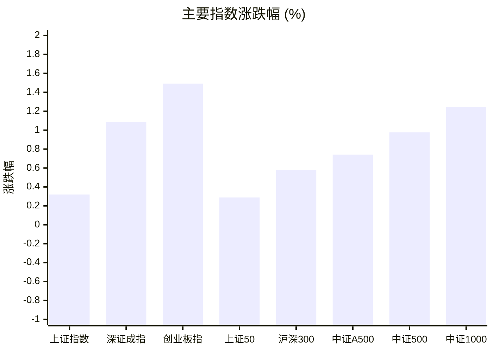
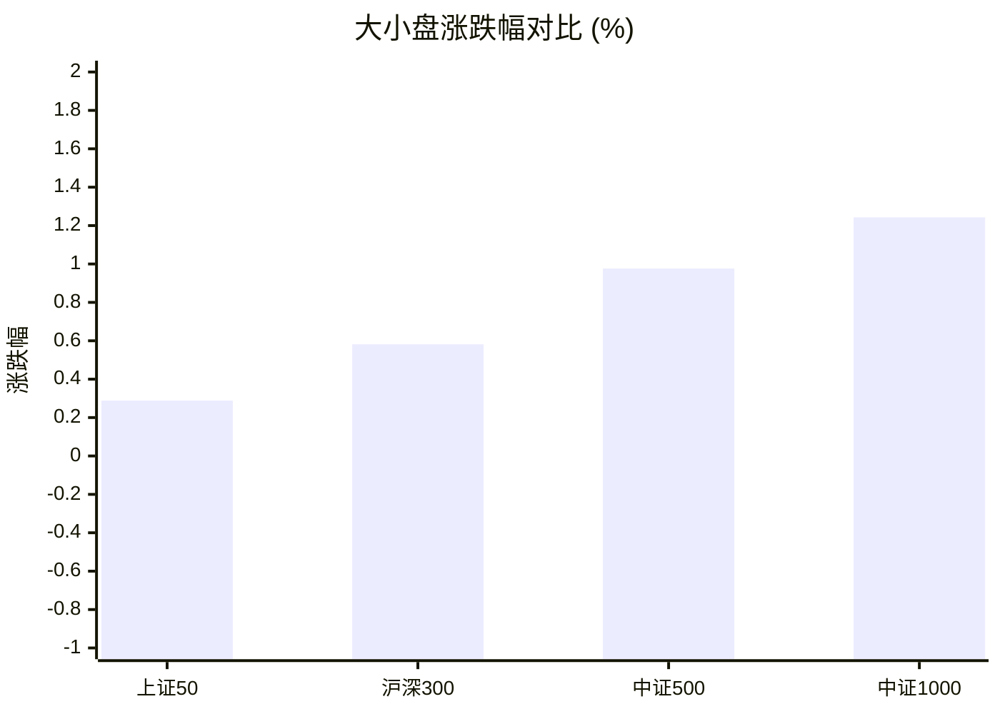
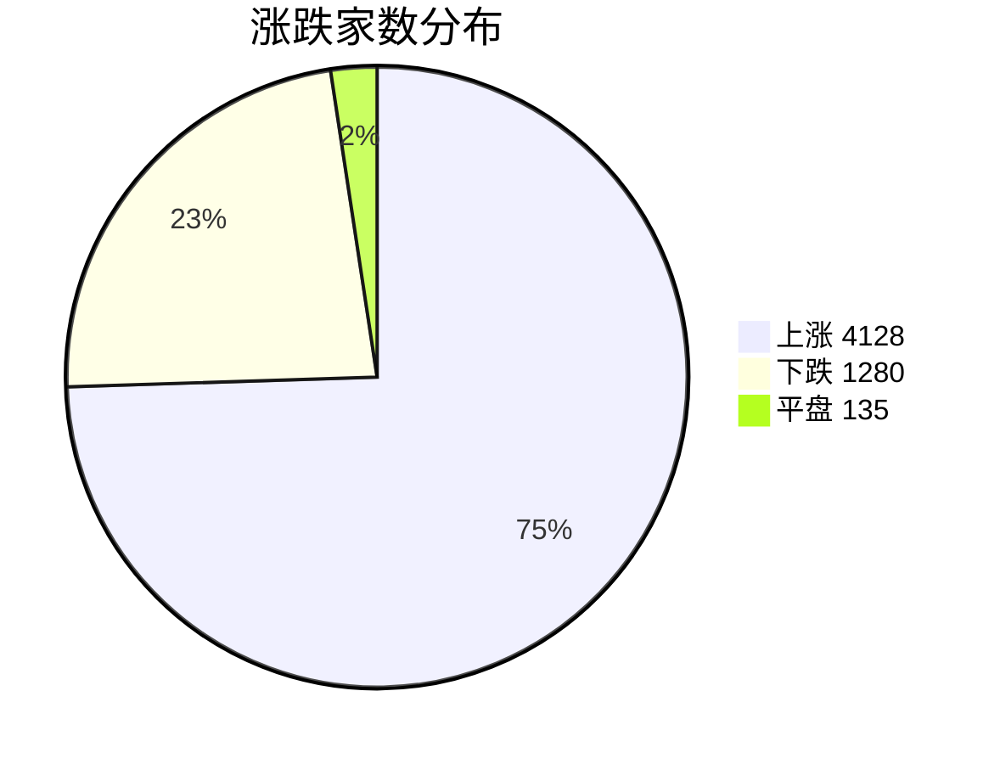
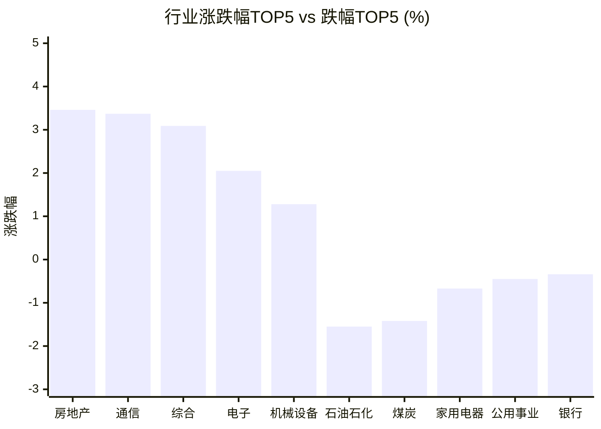

# 📊 A股收盘简报 | 2026-08-12 周三

---

## 📈 一、大盘概况

2026年08月12日 是 A 股交易日，收盘数据已可用。

### 主要指数表现

| 指数 | 收盘价 | 涨跌幅 | 涨跌点 | 成交额(亿) | 前收盘 | 开盘 | 最高 | 最低 |
|------|--------|--------|--------|-----------|--------|------|------|------|
| 上证指数 | 3946.68 | **▲+0.32%** | +12.59 | 9861.22亿 | 3934.09 | 3933.55 | 3950.62 | 3927.55 |
| 深证成指 | 14414.43 | **▲+1.09%** | +154.99 | 11663.01亿 | 14259.44 | 14253.12 | 14467.00 | 14237.20 |
| 创业板指 | 3602.08 | **▲+1.49%** | +52.92 | 5615.00亿 | 3549.16 | 3542.13 | 3625.27 | 3540.95 |
| 上证50 | 2938.39 | **▲+0.29%** | +8.46 | 1558.42亿 | 2929.93 | 2931.32 | 2944.00 | 2925.04 |
| 沪深300 | 4690.92 | **▲+0.58%** | +27.13 | 5753.26亿 | 4663.79 | 4660.47 | 4700.43 | 4657.69 |
| 中证A500 | 5835.38 | **▲+0.74%** | +42.91 | 8253.88亿 | 5792.47 | 5791.93 | 5849.83 | 5786.83 |
| 中证500 | 8045.31 | **▲+0.98%** | +77.77 | 4088.69亿 | 7967.54 | 7978.04 | 8067.53 | 7961.83 |
| 中证1000 | 7793.72 | **▲+1.24%** | +95.67 | 4798.05亿 | 7698.05 | 7704.96 | 7805.27 | 7692.44 |

### 市场整体成交

- **沪深合计成交额**: **21524.23亿**
- **较前日缩量** 1685.63亿（-7.3%）

---

## 📊 二、指数涨跌幅对比

---

## 📊 三、市值结构 — 大小盘对比

| 指数 | 涨跌幅 | 特征 |
|------|--------|------|
| 上证50 | **▲+0.29%** | 超大盘 |
| 沪深300 | **▲+0.58%** | 大盘 |
| 中证500 | **▲+0.98%** | 中盘 |
| 中证1000 | **▲+1.24%** | 小盘 |

> 📌 **小盘强势领跑**，中证500/中证1000涨幅远超上证50，资金向中小市值扩散。

---

## 📉 四、市场广度
### 涨跌家数分布

### 关键统计

| 指标 | 数值 |
|------|------|
| 上涨家数 | 4128 |
| 下跌家数 | 1280 |
| 平盘家数 | 135 |
| 涨停家数 | 97 |
| 跌停家数 | 0 |
| 全市场中位数 | **▲+0.83%** |

---
## 🏢 五、行业表现

### 🔥 涨幅榜 TOP 10

| 排名 | 行业(申万一级) | 涨跌幅 |
|------|---------------|--------|
| 🥇 | 房地产(申万) | **▲+3.46%** |
| 🥈 | 通信(申万) | **▲+3.37%** |
| 🥉 | 综合(申万) | **▲+3.09%** |
| 4 | 电子(申万) | **▲+2.05%** |
| 5 | 机械设备(申万) | **▲+1.28%** |
| 6 | 电力设备(申万) | **▲+1.27%** |
| 7 | 轻工制造(申万) | **▲+1.26%** |
| 8 | 环保(申万) | **▲+1.22%** |
| 9 | 有色金属(申万) | **▲+1.17%** |
| 10 | 社会服务(申万) | **▲+1.15%** |

### ❄️ 跌幅榜 TOP 10

| 排名 | 行业(申万一级) | 涨跌幅 |
|------|---------------|--------|
| 31 | 石油石化(申万) | **▼1.55%** |
| 30 | 煤炭(申万) | **▼1.42%** |
| 29 | 家用电器(申万) | **▼0.67%** |
| 28 | 公用事业(申万) | **▼0.45%** |
| 27 | 银行(申万) | **▼0.34%** |
| 26 | 医药生物(申万) | **▼0.09%** |
| 25 | 美容护理(申万) | **▲+0.11%** |
| 24 | 农林牧渔(申万) | **▲+0.13%** |
| 23 | 非银金融(申万) | **▲+0.30%** |
| 22 | 交通运输(申万) | **▲+0.38%** |

> 📈 **行业普涨**，多数板块收红。 涨幅第一：**房地产(申万)**（+3.46%）。 跌幅第一：**石油石化(申万)**（-1.55%）。

---

## 💡 六、热门概念

| 概念 | 涨跌幅 |
|------|--------|
| 光通信指数 | **▲+4.99%** |
| 房地产精选指数 | **▲+4.28%** |
| 上海微电子指数 | **▲+4.00%** |
| 光模块(CPO)指数 | **▲+3.84%** |
| 一级地产商指数 | **▲+3.84%** |
| HBM指数 | **▲+3.66%** |
| 光芯片指数 | **▲+3.48%** |
| 光电路交换机(OCS)指数 | **▲+3.46%** |
| 城中村改造指数 | **▲+3.45%** |
| 电子布指数 | **▲+3.34%** |

> 📌 今日热门概念集中在 **光通信指数**（+4.99%） 等方向。

---

## 💰 七、资金流向

### 主力资金概况

| 指标 | 数值(亿元) |
|------|------|
| 主力资金净流入 | 736.33 |

### 资金流入行业 TOP5

| 行业 | 净流入(亿元) |
|------|--------|
| 电子 | 147.71 |
| 通信 | 128.15 |
| 机械设备 | 81.88 |
| 电力设备 | 80.22 |
| 医药生物 | 56.59 |

> 🟢 **主力资金大幅净流入**，市场做多意愿强烈。

---

## 🌍 八、周边市场

| 指数 | 涨跌幅 |
|------|--------|
| 日经225 | **▲+0.83%** |
| 标普500 | **▼0.32%** |
| 道琼斯工业平均 | **▼0.34%** |
| 纳斯达克指数 | **▼0.60%** |
| 恒生指数 | **▼0.96%** |

> 📌 全球市场多数下跌，外围情绪偏弱。

---

## 📊 九、期货市场

| 品种 | 涨跌幅 |
|------|--------|
| IC2608 | **▲+0.49%** |
| IC2609 | **▲+0.53%** |
| IC2612 | **▲+0.48%** |
| IC2703 | **▲+0.52%** |
| IF2608 | **▲+0.32%** |
| IF2609 | **▲+0.30%** |
| IF2612 | **▲+0.26%** |
| IF2703 | **▲+0.29%** |
| IH2608 | **▲+0.09%** |
| IH2609 | **▲+0.05%** |

---

## 📰 十、财经要闻

- 【A股午间收盘快报】 创业板指上涨1.73% 全市场近3700股飘红 光纤、CPO概念领涨
- 陆家嘴财经早餐2026年8月12日星期三
- A股低开高走：算力硬件产业链反弹，超4100股收涨
- 热门财讯播报（2026年08月12日）
- 金十数据全球财经早餐 | 2026年8月12日

---

## 🤖 十一、盘面结论

> 分析来源：AI Agent

**一句话定性：市场呈现放量基数上的普涨与成长风格占优，通信硬件和地产方向带动结构性扩散。**

- **广度证据：**上涨 4,128 家、下跌 1,280 家，涨停 97 家且跌停为 0 家；全市场涨跌幅中位数为 +0.83%，多头覆盖面较广。
- **风格证据：**中证1000上涨 1.24%、中证500上涨 0.98%，均高于上证50的 0.29%；创业板指上涨 1.49%，成长与中小市值表现更强。
- **结构与资金证据：**通信、电子行业分别上涨 3.37% 和 2.05%，主力资金净流入 736.33 亿元，其中电子、通信分别净流入 147.71 亿元和 128.15 亿元。沪深合计成交额为 21,524.23 亿元，较前日缩量 7.3%，量能未随上涨继续放大。

---

## 🎯 十二、主线轮动

### 1. 通信硬件与光通信

- **生命周期：**加速（Agent 判断）。
- **盘面证据：**通信行业上涨 3.37%，光通信指数上涨 4.99%，光模块(CPO)指数上涨 3.84%，光芯片指数上涨 3.48%；通信行业主力资金净流入 128.15 亿元。
- **催化验证：**财经要闻中出现算力硬件产业链及光纤、CPO相关表述，但仅作为候选解释；行业、概念及资金流数据同向，盘面已验证该方向活跃。
- **确认信号：**下一交易日通信行业继续居涨幅前列，光通信、CPO等概念保持强势，且通信资金流向延续净流入。
- **失效信号：**通信行业与相关概念显著转弱，或通信资金流向转为净流出。

### 2. 房地产及城市更新相关方向

- **生命周期：**发酵（Agent 判断）。
- **盘面证据：**房地产行业上涨 3.46%，居申万一级行业首位；房地产精选指数上涨 4.28%，一级地产商指数上涨 3.84%，城中村改造指数上涨 3.45%。
- **催化验证：**报告未提供与该方向对应、且能与结构化行情直接验证的明确事件数据，因此不对上涨原因作事实归因；盘面已验证其当日强势。
- **确认信号：**下一交易日房地产行业及房地产精选、一级地产商、城中村改造等概念继续位于涨幅前列。
- **失效信号：**房地产行业和上述相关概念同步转弱，未能维持相对强势。

---

## 🔍 十三、明日关注

1. **观察对象：**市场广度与中小盘风格。**确认信号：**上涨家数继续明显高于下跌家数，中证500和中证1000维持相对上证50的强势。**失效信号：**下跌家数明显增加，且中小盘指数转弱至不及上证50。
2. **观察对象：**通信硬件与光通信主线。**确认信号：**通信行业及光通信、光模块(CPO)等概念继续居强，通信资金流向保持净流入。**失效信号：**通信行业与相关概念同步走弱，或通信资金流向转为净流出。
3. **观察对象：**地产方向的持续性与量能配合。**确认信号：**房地产行业及房地产精选、一级地产商、城中村改造等概念保持相对强势，沪深合计成交额不再继续缩减。**失效信号：**地产行业和相关概念转弱，且沪深合计成交额继续缩减。

---

## 📌 数据来源与免责声明

- **数据来源**：万得 Wind 金融数据服务
- **数据日期**：2026-08-12 收盘
- **生成时间**：2026年08月12日
- **免责声明**：本简报基于 Wind 数据自动生成，AI 分析部分（如有）仅供参考，不构成任何投资建议。市场有风险，投资需谨慎。
