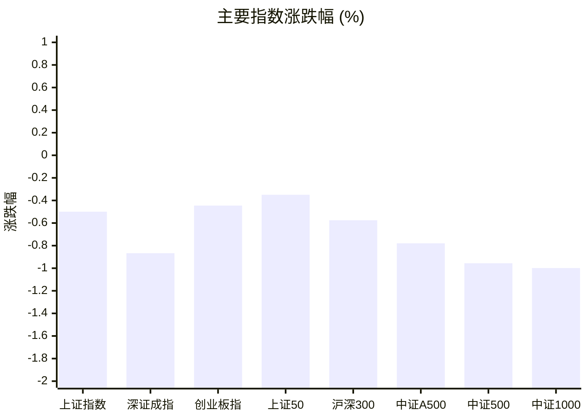
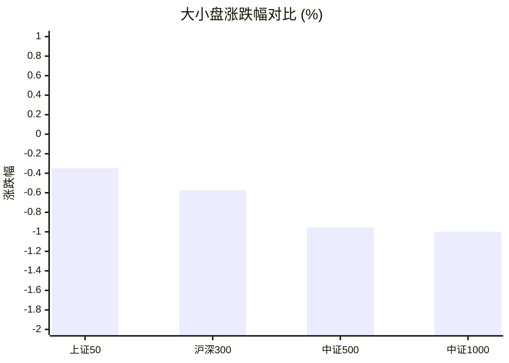
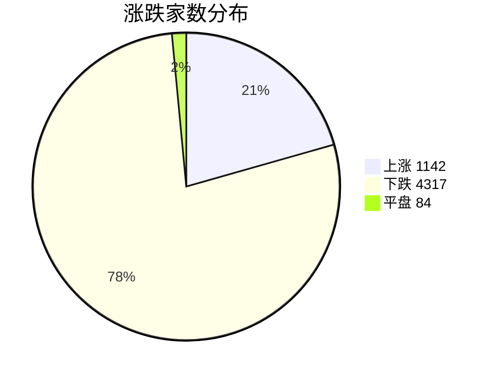
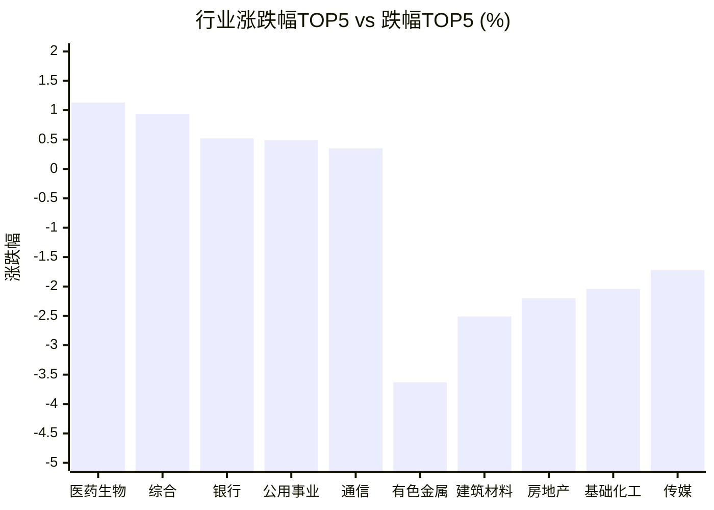

# 📊 A股收盘简报 | 2026-08-13 周四

---

## 📈 一、大盘概况

2026年08月13日 是 A 股交易日，收盘数据已可用。

### 主要指数表现

| 指数 | 收盘价 | 涨跌幅 | 涨跌点 | 成交额(亿) | 前收盘 | 开盘 | 最高 | 最低 |
|------|--------|--------|--------|-----------|--------|------|------|------|
| 上证指数 | 3926.96 | **▼0.50%** | -19.72 | 11642.03亿 | 3946.68 | 3957.16 | 3968.48 | 3924.64 |
| 深证成指 | 14289.44 | **▼0.87%** | -124.99 | 13867.14亿 | 14414.43 | 14536.48 | 14584.30 | 14289.01 |
| 创业板指 | 3586.04 | **▼0.45%** | -16.04 | 6614.87亿 | 3602.08 | 3656.88 | 3681.80 | 3585.27 |
| 上证50 | 2928.12 | **▼0.35%** | -10.27 | 1901.77亿 | 2938.39 | 2945.50 | 2960.24 | 2925.80 |
| 沪深300 | 4663.95 | **▼0.57%** | -26.97 | 6907.16亿 | 4690.92 | 4716.97 | 4727.23 | 4661.88 |
| 中证A500 | 5789.89 | **▼0.78%** | -45.49 | 9852.53亿 | 5835.38 | 5869.57 | 5886.49 | 5788.21 |
| 中证500 | 7968.38 | **▼0.96%** | -76.93 | 4970.28亿 | 8045.31 | 8096.85 | 8142.33 | 7966.87 |
| 中证1000 | 7715.89 | **▼1.00%** | -77.83 | 5647.58亿 | 7793.72 | 7847.24 | 7880.22 | 7714.37 |

### 市场整体成交

- **沪深合计成交额**: **25509.17亿**
- **较前日放量** 3984.94亿（+18.5%）

---

## 📊 二、指数涨跌幅对比

---

## 📊 三、市值结构 — 大小盘对比

| 指数 | 涨跌幅 | 特征 |
|------|--------|------|
| 上证50 | **▼0.35%** | 超大盘 |
| 沪深300 | **▼0.57%** | 大盘 |
| 中证500 | **▼0.96%** | 中盘 |
| 中证1000 | **▼1.00%** | 小盘 |

> 📌 **大盘蓝筹占优**，上证50领涨，市场偏好核心资产。

---

## 📉 四、市场广度
### 涨跌家数分布

### 关键统计

| 指标 | 数值 |
|------|------|
| 上涨家数 | 1142 |
| 下跌家数 | 4317 |
| 平盘家数 | 84 |
| 涨停家数 | 62 |
| 跌停家数 | 4 |
| 全市场中位数 | **▼1.48%** |

---
## 🏢 五、行业表现

### 🔥 涨幅榜 TOP 10

| 排名 | 行业(申万一级) | 涨跌幅 |
|------|---------------|--------|
| 🥇 | 医药生物(申万) | **▲+1.13%** |
| 🥈 | 综合(申万) | **▲+0.93%** |
| 🥉 | 银行(申万) | **▲+0.52%** |
| 4 | 公用事业(申万) | **▲+0.49%** |
| 5 | 通信(申万) | **▲+0.35%** |
| 6 | 食品饮料(申万) | **▲+0.34%** |
| 7 | 非银金融(申万) | **▲+0.31%** |
| 8 | 农林牧渔(申万) | **▼0.41%** |
| 9 | 家用电器(申万) | **▼0.51%** |
| 10 | 电力设备(申万) | **▼0.58%** |

### ❄️ 跌幅榜 TOP 10

| 排名 | 行业(申万一级) | 涨跌幅 |
|------|---------------|--------|
| 31 | 有色金属(申万) | **▼3.63%** |
| 30 | 建筑材料(申万) | **▼2.51%** |
| 29 | 房地产(申万) | **▼2.20%** |
| 28 | 基础化工(申万) | **▼2.04%** |
| 27 | 传媒(申万) | **▼1.72%** |
| 26 | 纺织服饰(申万) | **▼1.71%** |
| 25 | 石油石化(申万) | **▼1.62%** |
| 24 | 轻工制造(申万) | **▼1.55%** |
| 23 | 钢铁(申万) | **▼1.51%** |
| 22 | 社会服务(申万) | **▼1.50%** |

> 📉 **行业普跌**，多数板块调整。 涨幅第一：**医药生物(申万)**（+1.13%）。 跌幅第一：**有色金属(申万)**（-3.63%）。

---

## 💡 六、热门概念

| 概念 | 涨跌幅 |
|------|--------|
| CRO指数 | **▲+3.73%** |
| 医疗服务精选指数 | **▲+3.00%** |
| 光电路交换机(OCS)指数 | **▲+2.83%** |
| 超节点指数 | **▲+2.28%** |
| 创新药指数 | **▲+2.27%** |
| 基因检测指数 | **▲+2.07%** |
| 生物科技等权指数 | **▲+1.79%** |
| 服务器指数 | **▲+1.68%** |
| ADC指数 | **▲+1.52%** |
| 流感指数 | **▲+1.45%** |

> 📌 今日热门概念集中在 **CRO指数**（+3.73%） 等方向。

---

## 💰 七、资金流向

### 主力资金概况

| 指标 | 数值(亿元) |
|------|------|
| 主力资金净流入 | -178.96 |

### 资金流入行业 TOP5

| 行业 | 净流入(亿元) |
|------|--------|
| 医药生物 | 117.50 |
| 公用事业 | 33.43 |
| 计算机 | 28.48 |
| 电力设备 | 16.56 |
| 非银金融 | 16.09 |

> 🔴 **主力资金大幅净流出**，市场谨慎情绪升温。

---

## 🌍 八、周边市场

| 指数 | 涨跌幅 |
|------|--------|
| 日经225 | **▲+1.16%** |
| 纳斯达克指数 | **▲+0.54%** |
| 标普500 | **▲+0.26%** |
| 道琼斯工业平均 | **▼0.04%** |
| 恒生指数 | **▼0.31%** |

> 📌 全球市场多数上涨，外围情绪偏暖。

---

## 📊 九、期货市场

| 品种 | 涨跌幅 |
|------|--------|
| IC2608 | **▼0.59%** |
| IC2609 | **▼0.62%** |
| IC2612 | **▼0.64%** |
| IC2703 | **▼0.65%** |
| IF2608 | **▼0.41%** |
| IF2609 | **▼0.41%** |
| IF2612 | **▼0.31%** |
| IF2703 | **▼0.25%** |
| IH2608 | **▼0.33%** |
| IH2609 | **▼0.33%** |

---

## 📰 十、财经要闻

- 【A股午间收盘快报】 创业板指上涨1.61% CRO板块领涨 医药股集体走强
- 陆家嘴财经早餐2026年8月13日星期四
- A股高开，算力硬件产业链走强
- 财联社8月13日午间新闻精选
- A股市场结构性机会渐近，南方基金旗下A股ETF南方(认购代码：515443)发售中

---

## 🤖 十一、盘面结论

> 分析来源：AI Agent

**一句话定性：市场处于放量下跌中的强分化状态，小盘与资源周期方向承压，医药和部分大盘防御方向逆势承接。**

- **指数与风格证据：**八项主要指数均收跌，上证50跌幅为0.35%，小盘代表中证1000下跌1.00%，大盘相对抗跌而小盘调整更深。
- **广度与量能证据：**全市场1142家上涨、4317家下跌，中位数下跌1.48%；沪深成交额25509.17亿元，较前日增加3984.94亿元，说明下跌伴随交易活跃度抬升。
- **结构与资金证据：**医药生物上涨1.13%，CRO指数上涨3.73%，同时医药生物获117.50亿元主力资金净流入；有色金属下跌3.63%，全市场主力资金净流出178.96亿元，显示资金集中于少数逆势方向而非普遍扩散。

---

## 🎯 十二、主线轮动

### 医药产业链：发酵阶段

- **盘面证据：**医药生物位居申万一级行业涨幅首位，上涨1.13%；CRO、医疗服务精选、创新药、基因检测等相关概念均位列热门概念前列，其中CRO指数上涨3.73%。
- **资金与催化验证：**医药生物主力资金净流入117.50亿元。报告未提供可独立验证的事件催化，新闻标题不作为事实依据，后续以行业与相关概念的持续相对强势验证。
- **确认条件：**医药生物保持行业前列，CRO、创新药等相关概念继续相对主要指数走强，且资金流入延续。
- **失效条件：**医药生物转为明显下跌，相关概念不再居热门概念前列，或行业资金由净流入转为净流出。

### 大盘防御方向：待确认

- **盘面证据：**上证50下跌0.35%，优于中证500的0.96%和中证1000的1.00%；行业中银行上涨0.52%、公用事业上涨0.49%，在普跌环境中相对抗跌。
- **催化验证：**报告未提供可独立验证的催化信息，当前仅能将其视为盘面相对强弱，不将新闻标题解释为上涨原因。
- **确认条件：**上证50继续相对中证500和中证1000占优，银行、公用事业维持正收益或继续位于行业涨幅前列。
- **失效条件：**大盘指数跌幅扩大并弱于中小盘，且银行、公用事业同步转弱至行业后列。

---

## 🔍 十三、明日关注

1. **观察对象：**市场广度与小盘风格。**确认信号：**上涨家数增加、全市场中位数改善，且中证500和中证1000相对主要大盘指数止跌转强。**失效信号：**下跌家数继续显著占优，中位数维持明显负值，小盘指数继续弱于上证50和沪深300。
2. **观察对象：**医药产业链。**确认信号：**医药生物继续位于行业涨幅前列，CRO、创新药等相关概念保持相对强势，并有行业资金净流入配合。**失效信号：**医药生物转弱，相关概念退出热门概念前列，或行业资金转为净流出。
3. **观察对象：**大盘防御方向。**确认信号：**上证50持续跑赢中证500和中证1000，银行、公用事业维持相对抗跌。**失效信号：**中小盘反超大盘，且银行、公用事业由上涨转为明显下跌。

---

## 📌 数据来源与免责声明

- **数据来源**：万得 Wind 金融数据服务
- **数据日期**：2026-08-13 收盘
- **生成时间**：2026年08月13日
- **免责声明**：本简报基于 Wind 数据自动生成，AI 分析部分（如有）仅供参考，不构成任何投资建议。市场有风险，投资需谨慎。
