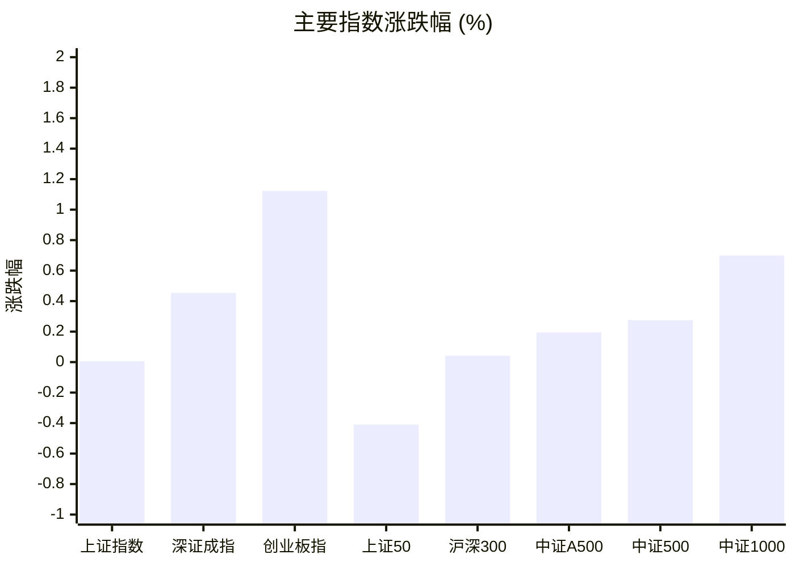
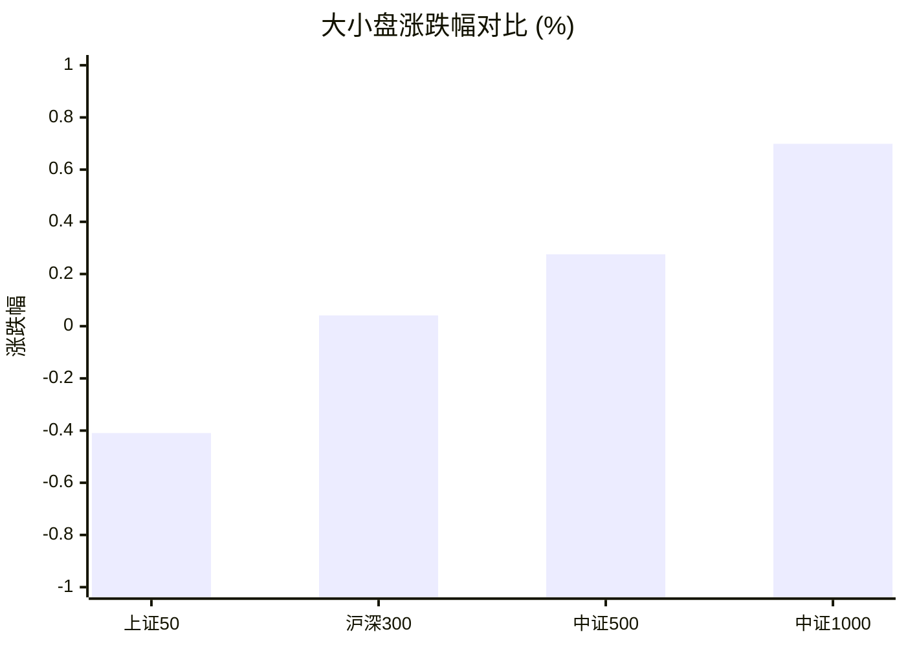
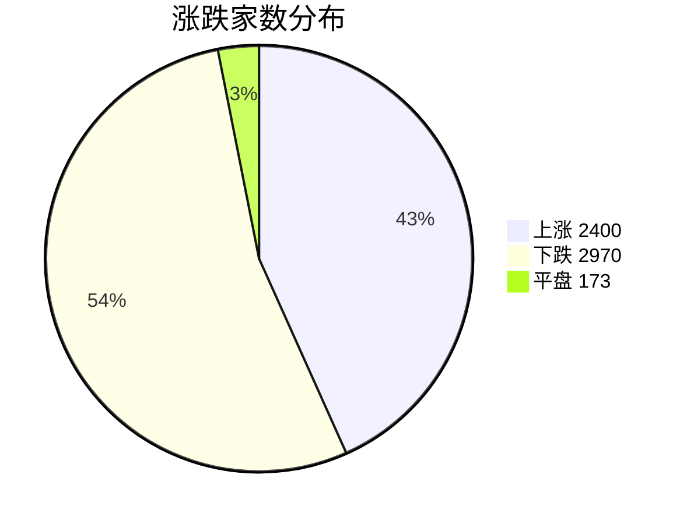
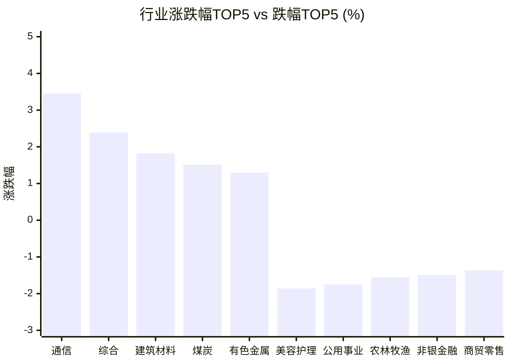

# 📊 A股收盘简报 | 2026-08-14 周五

---

## ⚠️ 数据完整性

⚠️ **报告不完整：重要数据缺失，未提供基于缺失数据的行情结论。**

| 数据域 | 状态 | 级别 |
|--------|------|------|
| 资金流向 | 部分可用（1 条资金流有效，31 条候选行被拒绝） | 重要 |

---

## 📈 一、大盘概况

2026年08月14日 是 A 股交易日，收盘数据已可用。

### 主要指数表现

| 指数 | 收盘价 | 涨跌幅 | 涨跌点 | 成交额(亿) | 前收盘 | 开盘 | 最高 | 最低 |
|------|--------|--------|--------|-----------|--------|------|------|------|
| 上证指数 | 3927.18 | **▲+0.01%** | +0.22 | 9903.72亿 | 3926.96 | 3930.02 | 3932.64 | 3903.70 |
| 深证成指 | 14354.31 | **▲+0.45%** | +64.87 | 11524.71亿 | 14289.44 | 14335.41 | 14384.18 | 14203.99 |
| 创业板指 | 3626.30 | **▲+1.12%** | +40.26 | 5533.89亿 | 3586.04 | 3610.19 | 3633.03 | 3578.61 |
| 上证50 | 2916.13 | **▼0.41%** | -11.99 | 1523.72亿 | 2928.12 | 2931.94 | 2932.84 | 2905.11 |
| 沪深300 | 4665.88 | **▲+0.04%** | +1.93 | 5497.70亿 | 4663.95 | 4672.98 | 4676.71 | 4637.13 |
| 中证A500 | 5801.17 | **▲+0.19%** | +11.28 | 8023.16亿 | 5789.89 | 5802.46 | 5812.34 | 5752.84 |
| 中证500 | 7990.33 | **▲+0.28%** | +21.95 | 4089.94亿 | 7968.38 | 7989.65 | 8005.15 | 7897.24 |
| 中证1000 | 7769.82 | **▲+0.70%** | +53.93 | 4822.68亿 | 7715.89 | 7750.99 | 7784.38 | 7673.44 |

### 市场整体成交

- **沪深合计成交额**: **21428.43亿**
- **较前日缩量** 4080.74亿（-16.0%）

---

## 📊 二、指数涨跌幅对比

---

## 📊 三、市值结构 — 大小盘对比

| 指数 | 涨跌幅 | 特征 |
|------|--------|------|
| 上证50 | **▼0.41%** | 超大盘 |
| 沪深300 | **▲+0.04%** | 大盘 |
| 中证500 | **▲+0.28%** | 中盘 |
| 中证1000 | **▲+0.70%** | 小盘 |

> 📌 **小盘强势领跑**，中证500/中证1000涨幅远超上证50，资金向中小市值扩散。

---

## 📉 四、市场广度
### 涨跌家数分布

### 关键统计

| 指标 | 数值 |
|------|------|
| 上涨家数 | 2400 |
| 下跌家数 | 2970 |
| 平盘家数 | 173 |
| 涨停家数 | 64 |
| 跌停家数 | 13 |
| 全市场中位数 | **▼0.20%** |

---
## 🏢 五、行业表现

### 🔥 涨幅榜 TOP 10

| 排名 | 行业(申万一级) | 涨跌幅 |
|------|---------------|--------|
| 🥇 | 通信(申万) | **▲+3.45%** |
| 🥈 | 综合(申万) | **▲+2.39%** |
| 🥉 | 建筑材料(申万) | **▲+1.82%** |
| 4 | 煤炭(申万) | **▲+1.51%** |
| 5 | 有色金属(申万) | **▲+1.30%** |
| 6 | 电子(申万) | **▲+1.30%** |
| 7 | 机械设备(申万) | **▲+1.01%** |
| 8 | 环保(申万) | **▲+0.48%** |
| 9 | 国防军工(申万) | **▲+0.44%** |
| 10 | 钢铁(申万) | **▲+0.29%** |

### ❄️ 跌幅榜 TOP 10

| 排名 | 行业(申万一级) | 涨跌幅 |
|------|---------------|--------|
| 31 | 美容护理(申万) | **▼1.86%** |
| 30 | 公用事业(申万) | **▼1.75%** |
| 29 | 农林牧渔(申万) | **▼1.56%** |
| 28 | 非银金融(申万) | **▼1.49%** |
| 27 | 商贸零售(申万) | **▼1.37%** |
| 26 | 食品饮料(申万) | **▼1.12%** |
| 25 | 房地产(申万) | **▼0.98%** |
| 24 | 医药生物(申万) | **▼0.82%** |
| 23 | 交通运输(申万) | **▼0.67%** |
| 22 | 家用电器(申万) | **▼0.66%** |

> 📊 **行业分化明显**，14涨/17跌。 涨幅第一：**通信(申万)**（+3.45%）。 跌幅第一：**美容护理(申万)**（-1.86%）。

---

## 💡 六、热门概念

| 概念 | 涨跌幅 |
|------|--------|
| 稀土指数 | **▲+5.40%** |
| 氮化铝指数 | **▲+4.99%** |
| 光通信指数 | **▲+4.17%** |
| 覆铜板指数 | **▲+3.60%** |
| 玻璃纤维指数 | **▲+3.38%** |
| F5G指数 | **▲+3.24%** |
| 电子布指数 | **▲+3.06%** |
| 光模块(CPO)指数 | **▲+2.78%** |
| 稀土永磁指数 | **▲+2.70%** |
| 光电路交换机(OCS)指数 | **▲+2.69%** |

> 📌 今日热门概念集中在 **稀土指数**（+5.40%） 等方向。

---

## 💰 七、资金流向

> ⚠️ 数据状态：部分可用（1 条资金流有效，31 条候选行被拒绝）。本节不展示默认值，也不据此生成行情结论。

---

## 🌍 八、周边市场

| 指数 | 涨跌幅 |
|------|--------|
| 纳斯达克指数 | **▲+0.81%** |
| 标普500 | **▲+0.65%** |
| 日经225 | **▲+0.59%** |
| 道琼斯工业平均 | **▲+0.13%** |
| 恒生指数 | **▼1.12%** |

> 📌 全球市场多数上涨，外围情绪偏暖。

---

## 📊 九、期货市场

| 品种 | 涨跌幅 |
|------|--------|
| IC2608 | **▼0.55%** |
| IC2609 | **▼0.59%** |
| IC2612 | **▼0.60%** |
| IC2703 | **▼0.58%** |
| IF2608 | **▼0.41%** |
| IF2609 | **▼0.36%** |
| IF2612 | **▼0.38%** |
| IF2703 | **▼0.46%** |
| IH2608 | **▼0.66%** |
| IH2609 | **▼0.61%** |

---

## 📰 十、财经要闻

- A股高开，存储芯片、半导体板块走强
- A股收评：沪指涨0.01%，创业板指涨1.12%，激光产业、玻纤、CPO等概念走强
- 【A股午间收盘快报】 创业板指上涨0.65% AI硬件走强 影视股回落
- A股午盘 | 沪指跌0.21%创指涨0.65% CPO稀土领涨
- A股早报2026年8月14日星期五

---

## 🤖 十一、盘面结论

> 分析来源：AI Agent
> 分析范围：未使用资金流向数据。

一句话定性：市场呈现指数偏强、个股承压的结构性分化，成长与小盘相对占优，但整体扩散度尚未同步转强。

- **证据**：创业板指上涨 1.12%，中证1000上涨 0.70%，而上证50下跌 0.41%，大小盘表现出现明显分化。
- **证据**：全市场上涨 2400 家、下跌 2970 家，中位数为 -0.20%，说明指数上涨未转化为多数个股同步走强。
- **证据**：沪深合计成交额 21428.43 亿元，较前日缩量 16.0%；申万一级行业为 14 涨、17 跌，通信上涨 3.45%领涨而美容护理下跌 1.86%。

上述判断仅基于指数、成交、广度、行业与概念数据；资金流向数据不完整，未据此作出任何资金面推断。

---

## 🎯 十二、主线轮动

1. **通信与光通信产业链**｜**生命周期：发酵并待确认**。盘面证据是通信行业上涨 3.45%居申万一级行业首位，光通信指数上涨 4.17%，光模块(CPO)指数上涨 2.78%，均位列热门概念。催化验证：报告未提供可单独验证的结构化催化事实，相关性仅按当日盘面表现记录。确认条件：通信继续位于行业涨幅榜前列，且光通信或光模块(CPO)继续列入热门概念。失效条件：通信退出行业涨幅榜，或光通信与光模块(CPO)均退出热门概念榜。

2. **稀土主题**｜**生命周期：发酵待确认**。盘面证据是稀土指数上涨 5.40%居热门概念首位，稀土永磁指数上涨 2.70%，主题内部有同步表现。催化验证：报告未提供可单独验证的结构化催化事实，暂不将新闻标题视为涨跌原因。确认条件：稀土指数与稀土永磁指数继续同时列入热门概念榜。失效条件：二者不再同时列入热门概念榜。

---

## 🔍 十三、明日关注

1. **观察对象：市场广度与指数分化。** 确认信号：上涨家数重新高于下跌家数，且全市场中位数由负转正。失效信号：下跌家数继续高于上涨家数，且全市场中位数维持为负。
2. **观察对象：通信与光通信产业链。** 确认信号：通信保持行业涨幅榜前列，光通信或光模块(CPO)继续出现在热门概念榜。失效信号：通信退出行业涨幅榜，且光通信与光模块(CPO)均退出热门概念榜。
3. **观察对象：稀土主题。** 确认信号：稀土指数与稀土永磁指数继续同时列入热门概念榜。失效信号：两者不再同时列入热门概念榜。

---

## 📌 数据来源与免责声明

- **数据来源**：万得 Wind 金融数据服务
- **数据日期**：2026-08-14 收盘
- **生成时间**：2026年08月14日
- **免责声明**：本简报基于 Wind 数据自动生成，AI 分析部分（如有）仅供参考，不构成任何投资建议。市场有风险，投资需谨慎。
