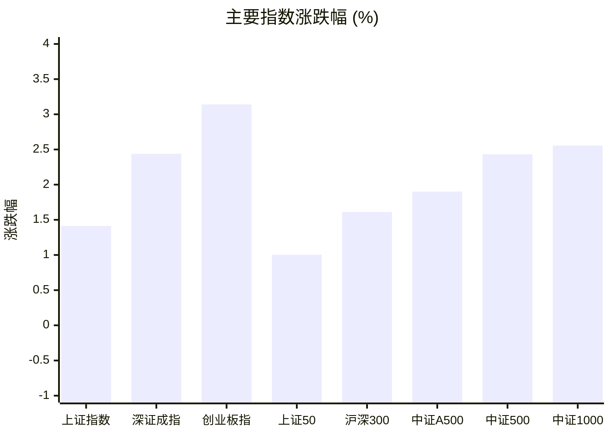
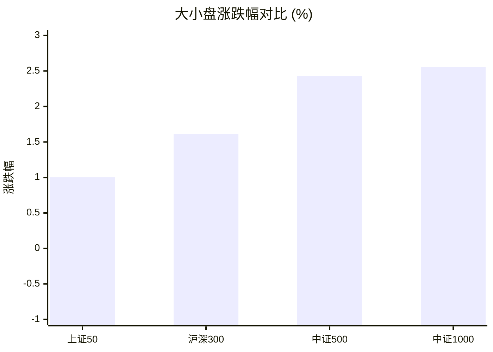
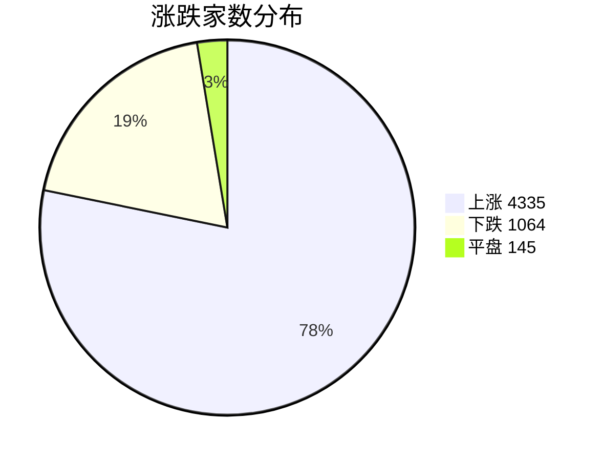
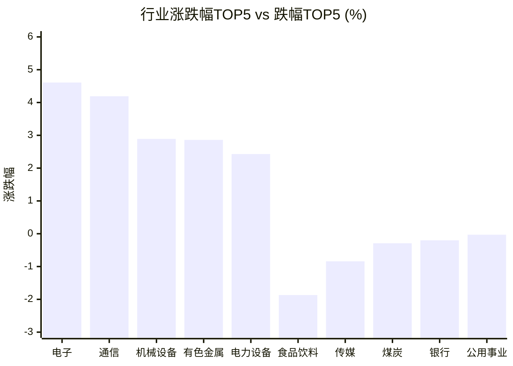

# 📊 A股收盘简报 | 2026-08-17 周一

---

## 📈 一、大盘概况

2026年08月17日 是 A 股交易日，收盘数据已可用。

### 主要指数表现

| 指数 | 收盘价 | 涨跌幅 | 涨跌点 | 成交额(亿) | 前收盘 | 开盘 | 最高 | 最低 |
|------|--------|--------|--------|-----------|--------|------|------|------|
| 上证指数 | 3982.65 | **▲+1.41%** | +55.47 | 11128.19亿 | 3927.18 | 3930.10 | 3983.51 | 3924.47 |
| 深证成指 | 14704.27 | **▲+2.44%** | +349.96 | 12746.39亿 | 14354.31 | 14399.20 | 14704.55 | 14348.47 |
| 创业板指 | 3740.16 | **▲+3.14%** | +113.86 | 6290.69亿 | 3626.30 | 3632.78 | 3740.16 | 3604.17 |
| 上证50 | 2945.41 | **▲+1.00%** | +29.28 | 1789.16亿 | 2916.13 | 2913.68 | 2946.42 | 2907.71 |
| 沪深300 | 4741.10 | **▲+1.61%** | +75.22 | 6576.02亿 | 4665.88 | 4672.28 | 4742.40 | 4662.72 |
| 中证A500 | 5911.44 | **▲+1.90%** | +110.27 | 9286.29亿 | 5801.17 | 5811.69 | 5912.38 | 5799.64 |
| 中证500 | 8184.64 | **▲+2.43%** | +194.31 | 4486.08亿 | 7990.33 | 8007.87 | 8184.64 | 7992.36 |
| 中证1000 | 7968.38 | **▲+2.56%** | +198.56 | 5238.62亿 | 7769.82 | 7797.18 | 7968.38 | 7750.43 |

### 市场整体成交

- **沪深合计成交额**: **23874.57亿**
- **较前日放量** 2446.14亿（+11.4%）

---

## 📊 二、指数涨跌幅对比

---

## 📊 三、市值结构 — 大小盘对比

| 指数 | 涨跌幅 | 特征 |
|------|--------|------|
| 上证50 | **▲+1.00%** | 超大盘 |
| 沪深300 | **▲+1.61%** | 大盘 |
| 中证500 | **▲+2.43%** | 中盘 |
| 中证1000 | **▲+2.56%** | 小盘 |

> 📌 **小盘强势领跑**，中证500/中证1000涨幅远超上证50，资金向中小市值扩散。

---

## 📉 四、市场广度
### 涨跌家数分布

### 关键统计

| 指标 | 数值 |
|------|------|
| 上涨家数 | 4335 |
| 下跌家数 | 1064 |
| 平盘家数 | 145 |
| 涨停家数 | 110 |
| 跌停家数 | 1 |
| 全市场中位数 | **▲+1.34%** |

---
## 🏢 五、行业表现

### 🔥 涨幅榜 TOP 10

| 排名 | 行业(申万一级) | 涨跌幅 |
|------|---------------|--------|
| 🥇 | 电子(申万) | **▲+4.61%** |
| 🥈 | 通信(申万) | **▲+4.19%** |
| 🥉 | 机械设备(申万) | **▲+2.89%** |
| 4 | 有色金属(申万) | **▲+2.86%** |
| 5 | 电力设备(申万) | **▲+2.43%** |
| 6 | 建筑材料(申万) | **▲+2.32%** |
| 7 | 基础化工(申万) | **▲+2.31%** |
| 8 | 综合(申万) | **▲+2.24%** |
| 9 | 国防军工(申万) | **▲+1.66%** |
| 10 | 汽车(申万) | **▲+1.59%** |

### ❄️ 跌幅榜 TOP 10

| 排名 | 行业(申万一级) | 涨跌幅 |
|------|---------------|--------|
| 31 | 食品饮料(申万) | **▼1.87%** |
| 30 | 传媒(申万) | **▼0.84%** |
| 29 | 煤炭(申万) | **▼0.29%** |
| 28 | 银行(申万) | **▼0.20%** |
| 27 | 公用事业(申万) | **▼0.03%** |
| 26 | 美容护理(申万) | **▲+0.18%** |
| 25 | 家用电器(申万) | **▲+0.40%** |
| 24 | 房地产(申万) | **▲+0.47%** |
| 23 | 钢铁(申万) | **▲+0.64%** |
| 22 | 非银金融(申万) | **▲+0.65%** |

> 📈 **行业普涨**，多数板块收红。 涨幅第一：**电子(申万)**（+4.61%）。 跌幅第一：**食品饮料(申万)**（-1.87%）。

---

## 💡 六、热门概念

| 概念 | 涨跌幅 |
|------|--------|
| 培育钻石指数 | **▲+6.60%** |
| 氮化铝指数 | **▲+6.06%** |
| HBM指数 | **▲+5.99%** |
| GPU指数 | **▲+5.70%** |
| 光芯片指数 | **▲+5.67%** |
| 先进封装指数 | **▲+5.65%** |
| 超硬材料指数 | **▲+5.57%** |
| 玻璃基板指数 | **▲+5.50%** |
| 国家大基金指数 | **▲+5.42%** |
| 长鑫存储指数 | **▲+5.32%** |

> 📌 今日热门概念集中在 **培育钻石指数**（+6.60%） 等方向。

---

## 💰 七、资金流向

### 主力资金概况

| 指标 | 数值(亿元) |
|------|------|
| 主力资金净流入 | 1184.23 |

### 资金流入行业 TOP5

| 行业 | 净流入(亿元) |
|------|--------|
| 电子 | 545.67 |
| 电力设备 | 134.70 |
| 机械设备 | 92.41 |
| 有色金属 | 73.71 |
| 基础化工 | 65.00 |

> 🟢 **主力资金大幅净流入**，市场做多意愿强烈。

---

## 🌍 八、周边市场

| 指数 | 涨跌幅 |
|------|--------|
| 恒生指数 | **▲+1.34%** |
| 日经225 | **▲+0.74%** |
| 标普500 | **▼0.17%** |
| 道琼斯工业平均 | **▼0.20%** |
| 纳斯达克指数 | **▼0.28%** |

> 📌 全球市场多数下跌，外围情绪偏弱。

---

## 📊 九、期货市场

| 品种 | 涨跌幅 |
|------|--------|
| IC2608 | **▲+2.66%** |
| IC2609 | **▲+2.65%** |
| IC2612 | **▲+2.44%** |
| IC2703 | **▲+2.46%** |
| IF2608 | **▲+1.66%** |
| IF2609 | **▲+1.65%** |
| IF2612 | **▲+1.61%** |
| IF2703 | **▲+1.65%** |
| IH2608 | **▲+0.95%** |
| IH2609 | **▲+1.00%** |

---

## 📰 十、财经要闻

- 市场震荡上行，超4300只个股上涨，沪深300指数上涨1.6%，关注沪深300ETF易方达（510310）后续走势
- 超4300股上涨，创业板指涨超3%！半导体、算力硬件、医药股走强，白酒、影视板块下挫 | A股收盘
- 财闻ETF日报｜A股市场走牛，科创成长ETF领涨
- 操盘必读：影响股市利好或利空消息\_2026年8月17日\_财经新闻
- 【浙商私享家||收盘】A股普涨上行

---

## 🤖 十一、盘面结论

> 分析来源：AI Agent

一句话定性：市场在放量中呈现普涨格局，成长与科技制造方向领跑，资金流和行业表现对这一判断形成同向支持。

- 证据：八个主要指数均收涨，创业板指上涨 3.14%，中证1000上涨 2.56%，均强于上证50的 1.00%；这是成长与中小市值相对占优的盘面表现。
- 证据：沪深合计成交额为 23874.57 亿元，较前日增加 2446.14 亿元（+11.4%）；上涨 4335 家、下跌 1064 家，涨停 110 家、跌停 1 家，全市场中位数上涨 1.34%，表明上涨覆盖面较广。
- 证据：电子、通信分别上涨 4.61% 和 4.19%，HBM、GPU、光芯片、先进封装等概念位居涨幅前列；主力资金净流入 1184.23 亿元，其中电子净流入 545.67 亿元，行业与资金数据同向支持科技制造走强。

---

## 🎯 十二、主线轮动

1. **科技硬件与通信**：生命周期判断为**加速**。盘面证据是电子、通信领涨，HBM、GPU、光芯片和先进封装等概念同步居前，电子净流入 545.67 亿元。催化验证：报告结构化数据未提供可验证的单一催化事件，保持未验证。确认条件：下一交易日电子、通信仍位居行业涨幅前列，相关概念维持强势且电子继续位居资金流入行业前列；失效条件：电子、通信不再领涨，相关概念同步退出涨幅前列且电子退出资金流入行业前列。
2. **先进制造与资源材料**：生命周期判断为**发酵**。盘面证据是电力设备、机械设备、有色金属和基础化工分别上涨 2.43%、2.89%、2.86% 和 2.31%，并进入资金流入行业前列。催化验证：报告未提供可验证的单一催化事件，保持未验证。确认条件：上述行业继续维持行业涨幅前列，并继续出现在资金流入行业前列；失效条件：上述行业普遍回落至行业涨幅后段，且退出资金流入行业前列。

---

## 🔍 十三、明日关注

1. **观察对象：科技硬件与通信。**确认信号：电子、通信继续位居行业涨幅前列，HBM、GPU、光芯片和先进封装等概念维持强势，电子继续位居资金流入行业前列。失效信号：电子、通信回落至行业涨幅后段，相关概念同步退出涨幅前列且电子退出资金流入行业前列。
2. **观察对象：先进制造与资源材料。**确认信号：电力设备、机械设备、有色金属和基础化工继续处于行业涨幅前列，并维持资金流入行业前列。失效信号：这些行业普遍回落至行业涨幅后段，且退出资金流入行业前列。
3. **观察对象：市场广度与量能。**确认信号：上涨家数继续多于下跌家数，涨停家数明显高于跌停家数，沪深合计成交额维持较前一交易日放量。失效信号：下跌家数多于上涨家数，跌停家数明显增加，且沪深合计成交额转为较前一交易日缩量。

---

## 📌 数据来源与免责声明

- **数据来源**：万得 Wind 金融数据服务
- **数据日期**：2026-08-17 收盘
- **生成时间**：2026年08月17日
- **免责声明**：本简报基于 Wind 数据自动生成，AI 分析部分（如有）仅供参考，不构成任何投资建议。市场有风险，投资需谨慎。
