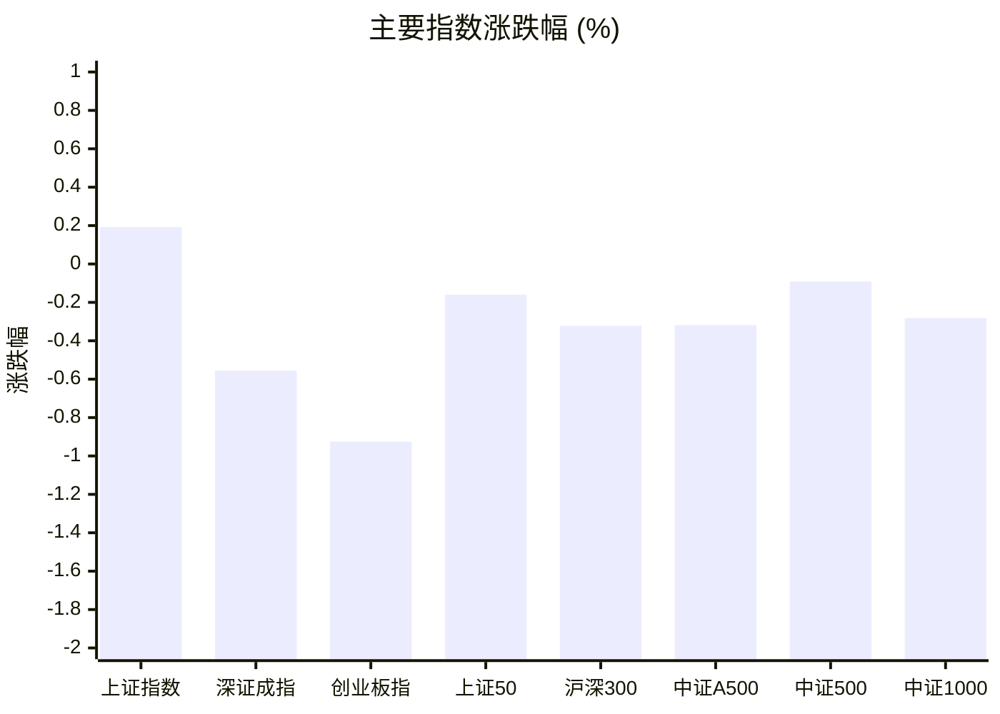
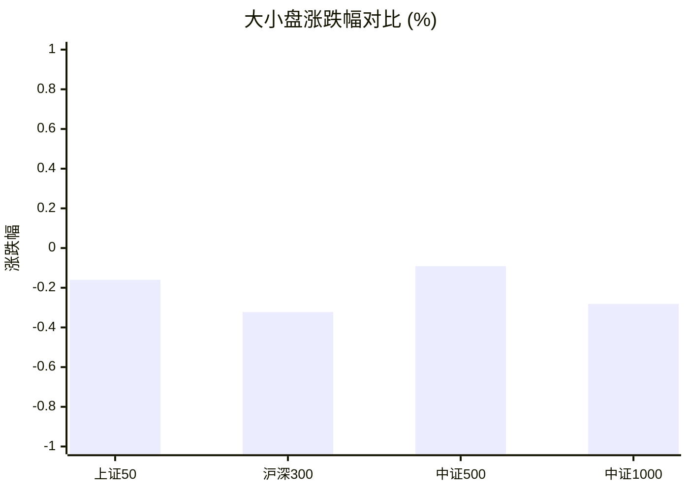
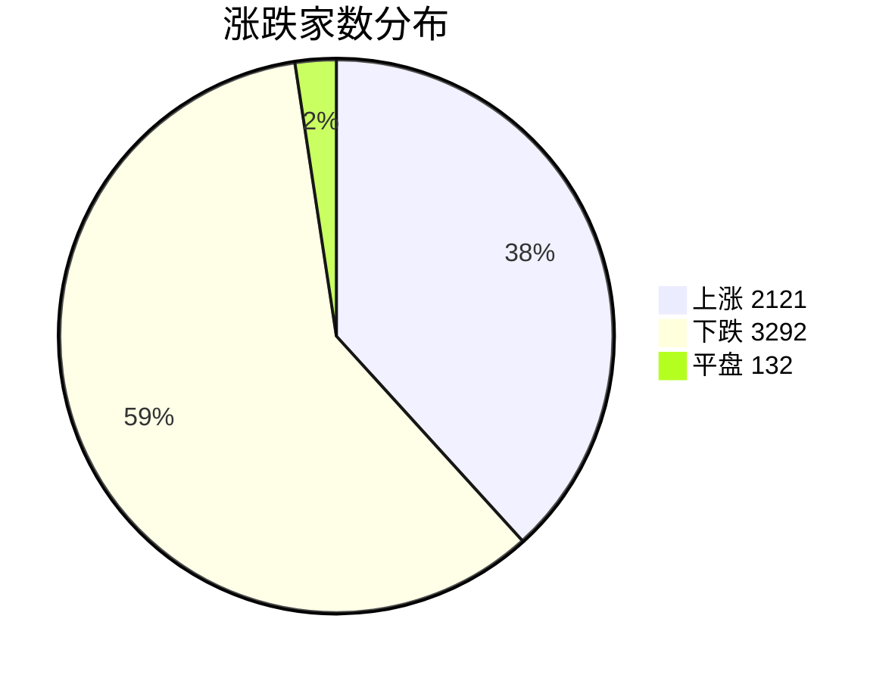
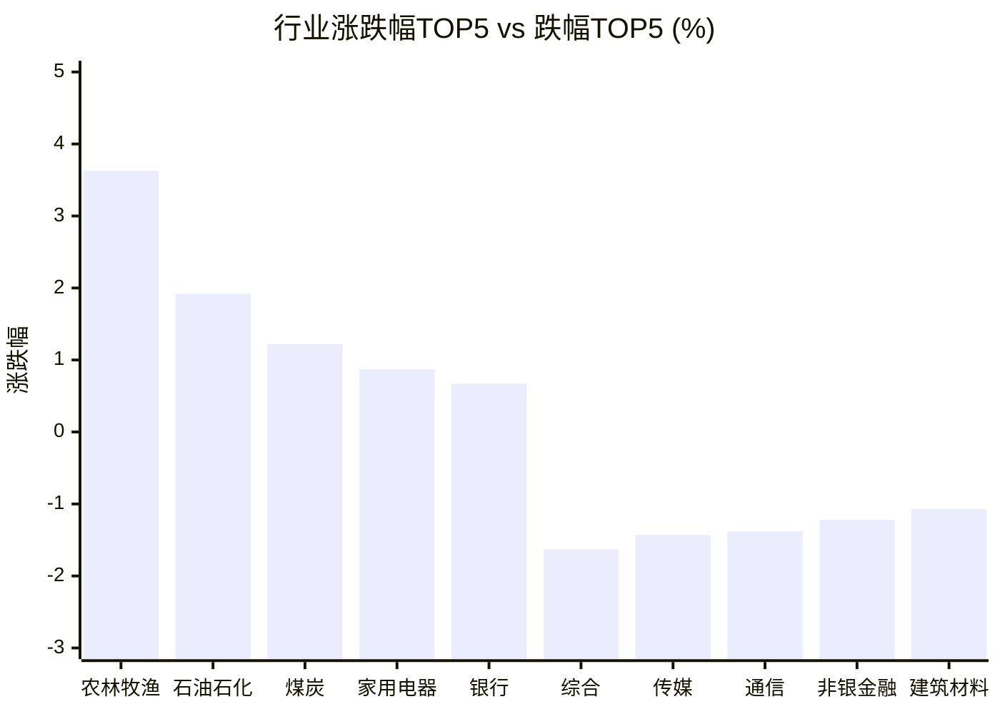

# 📊 A股收盘简报 | 2026-08-18 周二

---

## 📈 一、大盘概况

2026年08月18日 是 A 股交易日，收盘数据已可用。

### 主要指数表现

| 指数 | 收盘价 | 涨跌幅 | 涨跌点 | 成交额(亿) | 前收盘 | 开盘 | 最高 | 最低 |
|------|--------|--------|--------|-----------|--------|------|------|------|
| 上证指数 | 3990.30 | **▲+0.19%** | +7.65 | 11351.88亿 | 3982.65 | 3979.49 | 3994.18 | 3955.60 |
| 深证成指 | 14622.50 | **▼0.56%** | -81.77 | 12655.87亿 | 14704.27 | 14692.03 | 14733.90 | 14459.72 |
| 创业板指 | 3705.56 | **▼0.93%** | -34.60 | 6060.83亿 | 3740.16 | 3730.99 | 3747.53 | 3662.45 |
| 上证50 | 2940.70 | **▼0.16%** | -4.71 | 1673.77亿 | 2945.41 | 2940.53 | 2944.60 | 2917.33 |
| 沪深300 | 4725.81 | **▼0.32%** | -15.29 | 6198.29亿 | 4741.10 | 4734.07 | 4744.01 | 4687.53 |
| 中证A500 | 5892.61 | **▼0.32%** | -18.83 | 8893.48亿 | 5911.44 | 5904.07 | 5918.75 | 5835.75 |
| 中证500 | 8177.18 | **▼0.09%** | -7.46 | 4586.88亿 | 8184.64 | 8178.84 | 8211.31 | 8069.82 |
| 中证1000 | 7945.96 | **▼0.28%** | -22.42 | 5392.22亿 | 7968.38 | 7969.37 | 7995.50 | 7842.25 |

### 市场整体成交

- **沪深合计成交额**: **24007.75亿**
- **较前日放量** 133.17亿（+0.6%）

---

## 📊 二、指数涨跌幅对比

---

## 📊 三、市值结构 — 大小盘对比

| 指数 | 涨跌幅 | 特征 |
|------|--------|------|
| 上证50 | **▼0.16%** | 超大盘 |
| 沪深300 | **▼0.32%** | 大盘 |
| 中证500 | **▼0.09%** | 中盘 |
| 中证1000 | **▼0.28%** | 小盘 |

> 📌 **大小盘涨跌幅接近**，市场风格均衡。

---

## 📉 四、市场广度

### 涨跌家数分布

### 关键统计

| 指标 | 数值 |
|------|------|
| 上涨家数 | 2121 |
| 下跌家数 | 3292 |
| 平盘家数 | 132 |
| 涨停家数 | 81 |
| 跌停家数 | 6 |
| 全市场中位数 | **▼0.47%** |

---

## 🏢 五、行业表现

### 🔥 涨幅榜 TOP 10

| 排名 | 行业(申万一级) | 涨跌幅 |
|------|---------------|--------|
| 🥇 | 农林牧渔(申万) | **▲+3.63%** |
| 🥈 | 石油石化(申万) | **▲+1.92%** |
| 🥉 | 煤炭(申万) | **▲+1.22%** |
| 4 | 家用电器(申万) | **▲+0.87%** |
| 5 | 银行(申万) | **▲+0.67%** |
| 6 | 机械设备(申万) | **▲+0.38%** |
| 7 | 交通运输(申万) | **▲+0.36%** |
| 8 | 食品饮料(申万) | **▲+0.36%** |
| 9 | 基础化工(申万) | **▲+0.32%** |
| 10 | 商贸零售(申万) | **▲+0.26%** |

### ❄️ 跌幅榜 TOP 10

| 排名 | 行业(申万一级) | 涨跌幅 |
|------|---------------|--------|
| 31 | 综合(申万) | **▼1.63%** |
| 30 | 传媒(申万) | **▼1.43%** |
| 29 | 通信(申万) | **▼1.38%** |
| 28 | 非银金融(申万) | **▼1.22%** |
| 27 | 建筑材料(申万) | **▼1.07%** |
| 26 | 计算机(申万) | **▼0.93%** |
| 25 | 环保(申万) | **▼0.85%** |
| 24 | 美容护理(申万) | **▼0.82%** |
| 23 | 医药生物(申万) | **▼0.74%** |
| 22 | 电力设备(申万) | **▼0.66%** |

> 📊 **行业分化明显**，11涨/20跌。 涨幅第一：**农林牧渔(申万)**（+3.63%）。 跌幅第一：**综合(申万)**（-1.63%）。

---

## 💡 六、热门概念

| 概念 | 涨跌幅 |
|------|--------|
| 生物育种指数 | **▲+7.02%** |
| 反关税指数 | **▲+6.99%** |
| 一号文件指数 | **▲+6.26%** |
| 半导体硅片指数 | **▲+3.90%** |
| 人造肉 | **▲+3.53%** |
| 猪产业指数 | **▲+3.03%** |
| 乡村振兴指数 | **▲+2.93%** |
| 半导体设备指数 | **▲+2.63%** |
| 玻璃基板指数 | **▲+2.47%** |
| 碳化硅指数 | **▲+2.39%** |

> 📌 今日热门概念集中在 **生物育种指数**（+7.02%） 等方向。

---

## 💰 七、资金流向

### 主力资金概况

| 指标 | 数值(亿元) |
|------|------|
| 主力资金净流入 | -359.43 |

### 资金流入行业 TOP5

| 行业 | 净流入(亿元) |
|------|--------|
| 农林牧渔 | 54.27 |
| 基础化工 | 25.89 |
| 银行 | 18.46 |
| 机械设备 | 17.46 |
| 石油石化 | 8.67 |

> 🔴 **主力资金大幅净流出**，市场谨慎情绪升温。

---

## 🌍 八、周边市场

| 指数 | 涨跌幅 |
|------|--------|
| 恒生指数 | **▲+0.07%** |
| 纳斯达克指数 | **▼0.32%** |
| 道琼斯工业平均 | **▼0.51%** |
| 标普500 | **▼0.52%** |
| 日经225 | **▼2.54%** |

> 📌 全球市场多数下跌，外围情绪偏弱。

---

## 📊 九、期货市场

| 品种 | 涨跌幅 |
|------|--------|
| IH2703 | **▼0.04%** |
| IH2608 | **▼0.10%** |
| IH2612 | **▼0.10%** |
| IH2609 | **▼0.19%** |
| IC2608 | **▼0.31%** |
| IF2608 | **▼0.37%** |
| IM2608 | **▼0.44%** |
| IF2703 | **▼0.49%** |
| IF2609 | **▼0.50%** |
| IF2612 | **▼0.52%** |

---

## 📰 十、财经要闻

- A股每日行情复盘（8月18日）
- 热门财讯播报（2026年08月18日）
- 陆家嘴财经早餐2026年8月18日星期二
- 财联社8月18日午间新闻精选
- 收盘｜沪指涨0.19% 种植业板块走强

---

## 🤖 十一、盘面结论

> 分析来源：AI Agent

**一句话定性：** 指数表面平稳但全市场偏弱，沪指小幅收涨未扭转下跌家数占优与成长板块走弱的结构。

- **证据：** 上证指数上涨 0.19%，其余七项主要指数收跌，其中创业板指下跌 0.93%；沪深合计成交额 24007.75 亿元，较前日小幅放量 0.6%。
- **证据：** 全市场上涨 2121 家、下跌 3292 家，涨跌幅中位数为 -0.47%；行业表现为 11 涨、20 跌，传媒、通信、非银金融与计算机位居跌幅前列。
- **判断：** 农林牧渔与资源方向的强势更接近局部承接，尚不足以改变全市场风险偏好偏谨慎的判断；主力资金净流出 359.43 亿元与这一结构相互印证。

---

## 🎯 十二、主线轮动

### 农业与生物育种｜生命周期：发酵

- **盘面证据：** 农林牧渔上涨 3.63%，位居申万一级行业首位；生物育种、一号文件、猪产业和乡村振兴等概念均列涨幅前列，农林牧渔获 54.27 亿元行业净流入。
- **催化验证：** 未验证；本报告不以财经要闻标题推断上涨原因。
- **确认条件：** 农林牧渔继续位居行业涨幅前列，相关概念维持强势，且行业净流入仍列前位。
- **失效条件：** 农林牧渔转为下跌或退出行业涨幅前列，相关概念同步走弱，且不再出现行业净流入。

### 能源资源｜生命周期：待确认

- **盘面证据：** 石油石化上涨 1.92%、煤炭上涨 1.22%，石油石化录得 8.67 亿元行业净流入。
- **催化验证：** 未验证；本报告未以新闻标题作为涨跌原因。
- **确认条件：** 石油石化和煤炭继续同向位居行业涨幅前列，石油石化保持行业净流入。
- **失效条件：** 两个行业不再同向走强或转为下跌，且石油石化不再出现行业净流入。

---

## 🔍 十三、明日关注

1. **观察对象：** 全市场广度。**确认信号：** 上涨家数反超下跌家数，且全市场涨跌幅中位数转正。**失效信号：** 下跌家数继续多于上涨家数，且中位数维持为负。
2. **观察对象：** 农林牧渔与生物育种相关概念。**确认信号：** 农林牧渔继续位居行业涨幅前列，相关概念保持领涨，行业净流入仍列前位。**失效信号：** 行业转为下跌或退出涨幅前列，相关概念同步走弱且行业不再净流入。
3. **观察对象：** 成长风格修复。**确认信号：** 深证成指、创业板指止跌并相对上证指数改善，通信与计算机不再位居行业跌幅前列。**失效信号：** 深证成指和创业板指继续弱于上证指数，通信与计算机仍处行业跌幅前列。

---

## 📌 数据来源与免责声明

- **数据来源**：万得 Wind 金融数据服务
- **数据日期**：2026-08-18 收盘
- **生成时间**：2026年08月18日
- **免责声明**：本简报基于 Wind 数据自动生成，AI 分析部分（如有）仅供参考，不构成任何投资建议。市场有风险，投资需谨慎。
