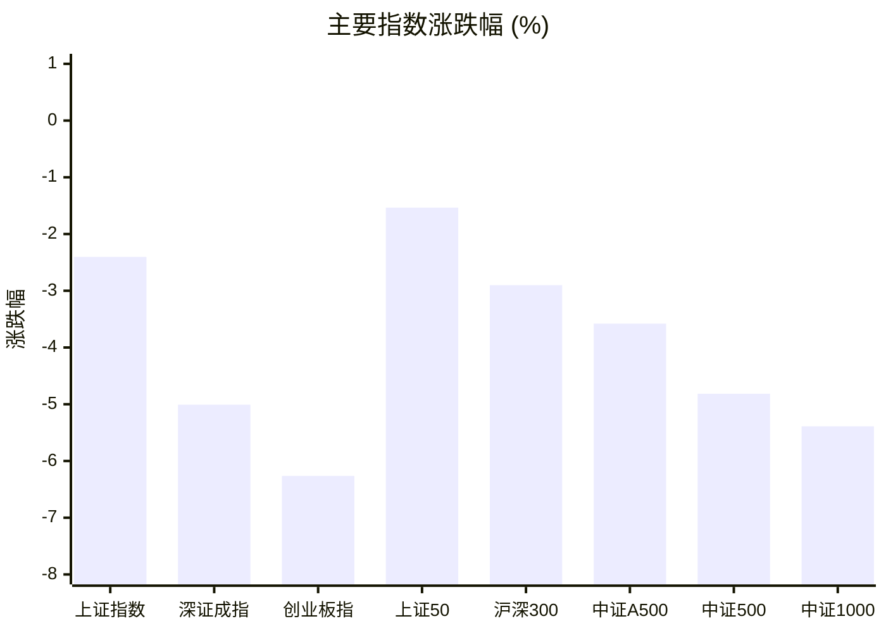
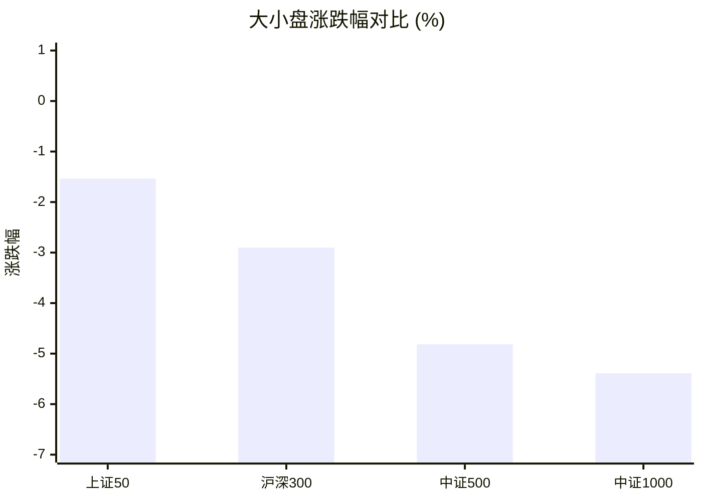
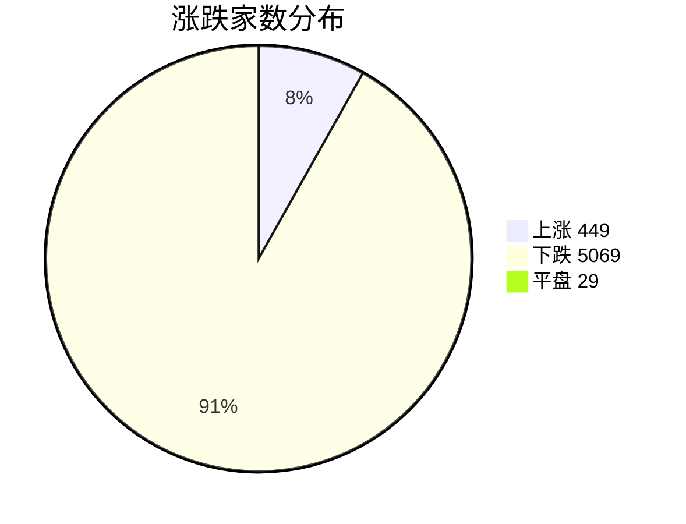
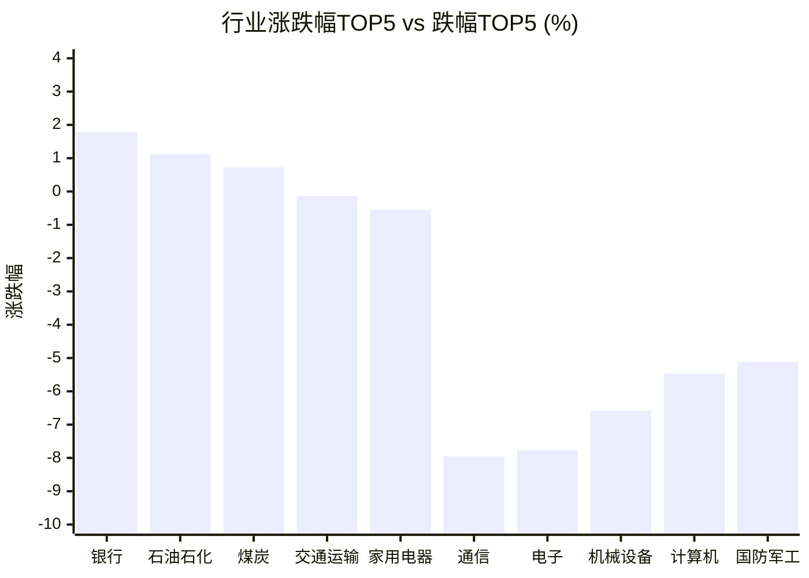

# 📊 A股收盘简报 | 2026-08-19 周三

---

## ⚠️ 数据完整性

⚠️ **报告不完整：重要数据缺失，未提供基于缺失数据的行情结论。**

| 数据域 | 状态 | 级别 |
|--------|------|------|
| 资金流向 | 部分可用（32 条资金流有效，1 条候选行被拒绝） | 重要 |

---

## 📈 一、大盘概况

2026年08月19日 是 A 股交易日，收盘数据已可用。

### 主要指数表现

| 指数 | 收盘价 | 涨跌幅 | 涨跌点 | 成交额(亿) | 前收盘 | 开盘 | 最高 | 最低 |
|------|--------|--------|--------|-----------|--------|------|------|------|
| 上证指数 | 3894.42 | **▼2.40%** | -95.88 | 12181.08亿 | 3990.30 | 3952.12 | 3961.14 | 3879.58 |
| 深证成指 | 13890.15 | **▼5.01%** | -732.35 | 12929.35亿 | 14622.50 | 14316.98 | 14367.37 | 13842.32 |
| 创业板指 | 3473.49 | **▼6.26%** | -232.07 | 6336.22亿 | 3705.56 | 3605.52 | 3622.50 | 3455.48 |
| 上证50 | 2895.57 | **▼1.53%** | -45.13 | 1935.74亿 | 2940.70 | 2913.75 | 2918.06 | 2875.75 |
| 沪深300 | 4588.70 | **▼2.90%** | -137.11 | 7052.54亿 | 4725.81 | 4660.06 | 4674.38 | 4568.07 |
| 中证A500 | 5681.74 | **▼3.58%** | -210.87 | 9776.14亿 | 5892.61 | 5797.35 | 5814.70 | 5657.21 |
| 中证500 | 7783.46 | **▼4.81%** | -393.72 | 4783.45亿 | 8177.18 | 8029.52 | 8050.08 | 7762.29 |
| 中证1000 | 7517.77 | **▼5.39%** | -428.19 | 5347.63亿 | 7945.96 | 7795.26 | 7821.18 | 7490.21 |

### 市场整体成交

- **沪深合计成交额**: **25110.43亿**
- **较前日放量** 1102.68亿（+4.6%）

---

## 📊 二、指数涨跌幅对比

---

## 📊 三、市值结构 — 大小盘对比

| 指数 | 涨跌幅 | 特征 |
|------|--------|------|
| 上证50 | **▼1.53%** | 超大盘 |
| 沪深300 | **▼2.90%** | 大盘 |
| 中证500 | **▼4.81%** | 中盘 |
| 中证1000 | **▼5.39%** | 小盘 |

> 📌 **大盘蓝筹占优**，上证50领涨，市场偏好核心资产。

---

## 📉 四、市场广度
### 涨跌家数分布

### 关键统计

| 指标 | 数值 |
|------|------|
| 上涨家数 | 449 |
| 下跌家数 | 5069 |
| 平盘家数 | 29 |
| 涨停家数 | 38 |
| 跌停家数 | 130 |
| 全市场中位数 | **▼3.92%** |

---
## 🏢 五、行业表现

### 🔥 涨幅榜 TOP 10

| 排名 | 行业(申万一级) | 涨跌幅 |
|------|---------------|--------|
| 🥇 | 银行(申万) | **▲+1.78%** |
| 🥈 | 石油石化(申万) | **▲+1.12%** |
| 🥉 | 煤炭(申万) | **▲+0.73%** |
| 4 | 交通运输(申万) | **▼0.14%** |
| 5 | 家用电器(申万) | **▼0.55%** |
| 6 | 食品饮料(申万) | **▼0.66%** |
| 7 | 非银金融(申万) | **▼0.78%** |
| 8 | 公用事业(申万) | **▼1.19%** |
| 9 | 钢铁(申万) | **▼1.66%** |
| 10 | 房地产(申万) | **▼1.96%** |

### ❄️ 跌幅榜 TOP 10

| 排名 | 行业(申万一级) | 涨跌幅 |
|------|---------------|--------|
| 31 | 通信(申万) | **▼7.95%** |
| 30 | 电子(申万) | **▼7.77%** |
| 29 | 机械设备(申万) | **▼6.58%** |
| 28 | 计算机(申万) | **▼5.47%** |
| 27 | 国防军工(申万) | **▼5.11%** |
| 26 | 建筑材料(申万) | **▼5.07%** |
| 25 | 汽车(申万) | **▼4.14%** |
| 24 | 电力设备(申万) | **▼4.06%** |
| 23 | 综合(申万) | **▼3.93%** |
| 22 | 有色金属(申万) | **▼3.56%** |

> 📉 **行业普跌**，多数板块调整。 涨幅第一：**银行(申万)**（+1.78%）。 跌幅第一：**通信(申万)**（-7.95%）。

---

## 💡 六、热门概念

| 概念 | 涨跌幅 |
|------|--------|
| 银行精选指数 | **▲+1.84%** |
| 央企银行指数 | **▲+1.80%** |
| 航运精选指数 | **▲+0.95%** |
| 保险精选指数 | **▲+0.20%** |
| 央企指数 | **▲+0.07%** |
| 南京市国资指数 | **▲+0.05%** |
| 金特估指数 | **▼0.12%** |
| 央企煤炭指数 | **▼0.29%** |
| 煤炭开采精选指数 | **▼0.31%** |
| 房地产精选指数 | **▼0.40%** |

> 📌 今日热门概念集中在 **银行精选指数**（+1.84%） 等方向。

---

## 💰 七、资金流向

> ⚠️ 数据状态：部分可用（32 条资金流有效，1 条候选行被拒绝）。本节不展示默认值，也不据此生成行情结论。

---

## 🌍 八、周边市场

| 指数 | 涨跌幅 |
|------|--------|
| 恒生指数 | **▲+0.09%** |
| 道琼斯工业平均 | **▼0.22%** |
| 标普500 | **▼0.69%** |
| 纳斯达克指数 | **▼1.33%** |
| 日经225 | **▼3.16%** |

> 📌 全球市场多数下跌，外围情绪偏弱。

---

## 📊 九、期货市场

| 品种 | 涨跌幅 |
|------|--------|
| IH2703 | **▼1.37%** |
| IH2608 | **▼1.42%** |
| IH2609 | **▼1.42%** |
| IH2612 | **▼1.47%** |
| IF2703 | **▼2.22%** |
| IF2612 | **▼2.29%** |
| IF2609 | **▼2.38%** |
| IF2608 | **▼2.41%** |
| IC2612 | **▼3.70%** |
| IC2609 | **▼3.78%** |

---

## 📰 十、财经要闻

- A股每日行情复盘（8月19日）
- 陆家嘴财经早餐2026年8月19日星期三
- 国内股指、国债、商品期货收盘综述（8月19日）
- A股盘前市场要闻速递（2026-08-19）
- 操盘必读：影响股市利好或利空消息\_2026年8月19日\_财经新闻

---

## 🤖 十一、盘面结论

> 分析来源：AI Agent
> 分析范围：未使用资金流向数据。

一句话定性：市场呈现放量普跌与小盘、高弹性板块承压更重的风险收缩格局。

- 证据：八项主要指数全部收跌，创业板指下跌 6.26%，中证1000下跌 5.39%，均弱于上证50的 1.53%跌幅；这是大盘相对占优的盘面表现。
- 证据：Wind 全市场统计为上涨 449 家、下跌 5069 家、平盘 29 家，涨停 38 家、跌停 130 家，涨跌幅中位数为 -3.92%，下跌覆盖面显著占优。
- 证据：沪深成交额 25110.43 亿元，较前日增加 1102.68 亿元；行业仅银行、石油石化和煤炭上涨，通信、电子、机械设备、计算机等跌幅居前。成交放大与普跌并存，但本报告未使用资金流向数据，不对资金行为作推断。

---

## 🎯 十二、主线轮动

### 1. 银行与资源防御方向：待确认

- 盘面证据：银行、石油石化、煤炭分别上涨 1.78%、1.12%、0.73%；银行精选指数和央企银行指数分别上涨 1.84%、1.80%。
- 催化验证：报告中的新闻标题不作为该方向的事实解释，未作催化归因。
- 确认条件：下一交易日同类行业榜中，银行、石油石化、煤炭仍处于相对靠前位置，且银行相关概念继续保持正收益。
- 失效条件：上述行业及银行相关概念转为明显落后，或不再保有相对强势。

### 2. 通信、电子与计算机方向：退潮观察

- 盘面证据：通信下跌 7.95%、电子下跌 7.77%、机械设备下跌 6.58%、计算机下跌 5.47%；中证500和中证1000的跌幅亦显著大于上证50。
- 催化验证：报告未以新闻标题解释板块下跌，故不作消息驱动判断。
- 确认条件：下一交易日上述行业继续位列行业跌幅靠前位置，且中小盘指数继续弱于上证50。
- 失效条件：上述行业止跌并回到行业相对靠前位置，且中小盘相对上证50的弱势收敛。

---

## 🔍 十三、明日关注

1. **观察对象：全市场广度。** 确认信号：上涨家数增加、下跌家数减少，且涨跌幅中位数较今日改善。失效信号：下跌家数继续占绝对多数，涨跌幅中位数继续走弱。
2. **观察对象：大小盘相对表现。** 确认信号：中证500、中证1000相对上证50的跌幅收敛或转为更强。失效信号：中证500、中证1000继续显著弱于上证50。
3. **观察对象：防御与成长行业的相对排序。** 确认信号：银行、石油石化、煤炭维持相对强势，同时通信、电子、计算机的跌幅收敛。失效信号：防御行业失去相对强势，且成长行业继续居于跌幅前列。

---

## 📌 数据来源与免责声明

- **数据来源**：万得 Wind 金融数据服务
- **数据日期**：2026-08-19 收盘
- **生成时间**：2026年08月19日
- **免责声明**：本简报基于 Wind 数据自动生成，AI 分析部分（如有）仅供参考，不构成任何投资建议。市场有风险，投资需谨慎。
