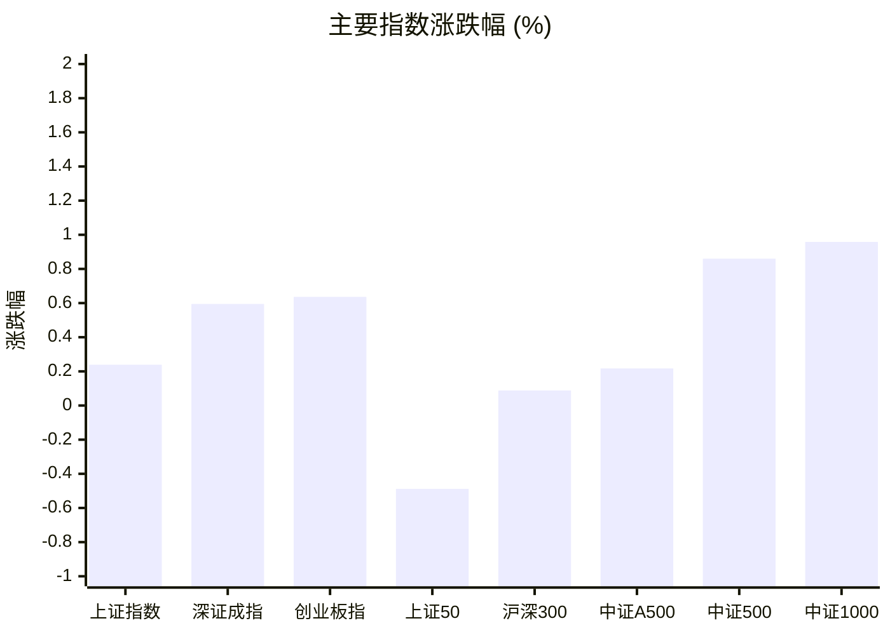
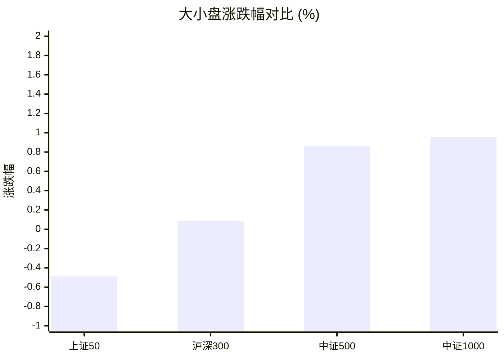
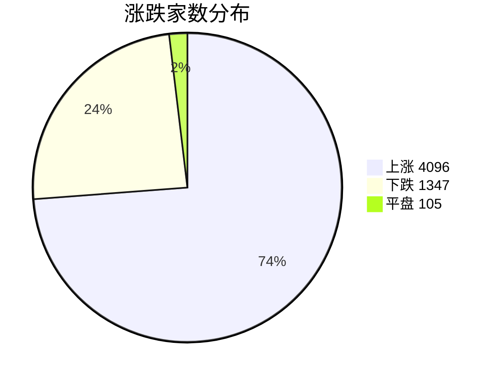
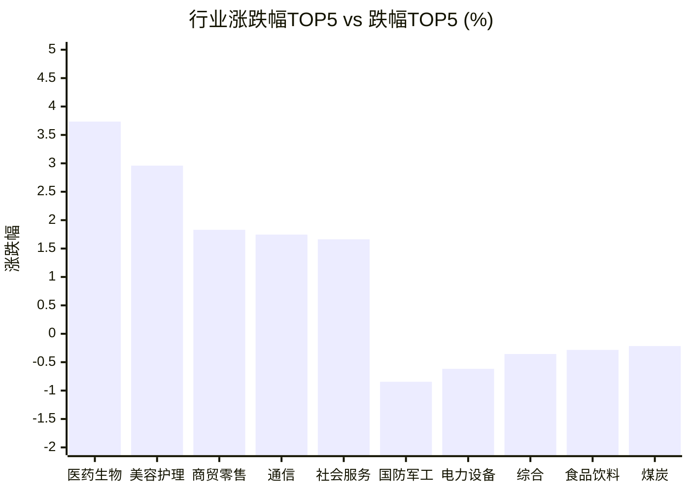

# 📊 A股收盘简报 | 2026-08-20 周四

---

## 📈 一、大盘概况

2026年08月20日 是 A 股交易日，收盘数据已可用。

### 主要指数表现

| 指数 | 收盘价 | 涨跌幅 | 涨跌点 | 成交额(亿) | 前收盘 | 开盘 | 最高 | 最低 |
|------|--------|--------|--------|-----------|--------|------|------|------|
| 上证指数 | 3903.72 | **▲+0.24%** | +9.30 | 10185.68亿 | 3894.42 | 3907.21 | 3925.06 | 3888.10 |
| 深证成指 | 13972.78 | **▲+0.59%** | +82.63 | 10607.95亿 | 13890.15 | 14032.97 | 14101.14 | 13870.18 |
| 创业板指 | 3495.59 | **▲+0.64%** | +22.10 | 5227.27亿 | 3473.49 | 3517.65 | 3531.92 | 3459.57 |
| 上证50 | 2881.44 | **▼0.49%** | -14.13 | 1692.34亿 | 2895.57 | 2902.96 | 2911.72 | 2872.97 |
| 沪深300 | 4592.75 | **▲+0.09%** | +4.05 | 5540.21亿 | 4588.70 | 4613.30 | 4631.13 | 4569.23 |
| 中证A500 | 5694.08 | **▲+0.22%** | +12.34 | 7850.40亿 | 5681.74 | 5724.56 | 5746.82 | 5661.25 |
| 中证500 | 7850.40 | **▲+0.86%** | +66.94 | 3934.85亿 | 7783.46 | 7864.68 | 7923.91 | 7796.28 |
| 中证1000 | 7589.78 | **▲+0.96%** | +72.01 | 4687.36亿 | 7517.77 | 7602.50 | 7656.61 | 7541.48 |

### 市场整体成交

- **沪深合计成交额**: **20793.63亿**

---

## 📊 二、指数涨跌幅对比

---

## 📊 三、市值结构 — 大小盘对比

| 指数 | 涨跌幅 | 特征 |
|------|--------|------|
| 上证50 | **▼0.49%** | 超大盘 |
| 沪深300 | **▲+0.09%** | 大盘 |
| 中证500 | **▲+0.86%** | 中盘 |
| 中证1000 | **▲+0.96%** | 小盘 |

> 📌 **小盘强势领跑**，中证500/中证1000涨幅远超上证50，资金向中小市值扩散。

---

## 📉 四、市场广度
### 涨跌家数分布

### 关键统计

| 指标 | 数值 |
|------|------|
| 上涨家数 | 4096 |
| 下跌家数 | 1347 |
| 平盘家数 | 105 |
| 涨停家数 | 84 |
| 跌停家数 | 13 |
| 全市场中位数 | **▲+1.17%** |

---
## 🏢 五、行业表现

### 🔥 涨幅榜 TOP 10

| 排名 | 行业(申万一级) | 涨跌幅 |
|------|---------------|--------|
| 🥇 | 医药生物(申万) | **▲+3.73%** |
| 🥈 | 美容护理(申万) | **▲+2.96%** |
| 🥉 | 商贸零售(申万) | **▲+1.83%** |
| 4 | 通信(申万) | **▲+1.75%** |
| 5 | 社会服务(申万) | **▲+1.66%** |
| 6 | 农林牧渔(申万) | **▲+1.54%** |
| 7 | 建筑装饰(申万) | **▲+1.32%** |
| 8 | 有色金属(申万) | **▲+1.20%** |
| 9 | 轻工制造(申万) | **▲+1.14%** |
| 10 | 纺织服饰(申万) | **▲+1.08%** |

### ❄️ 跌幅榜 TOP 10

| 排名 | 行业(申万一级) | 涨跌幅 |
|------|---------------|--------|
| 31 | 国防军工(申万) | **▼0.85%** |
| 30 | 电力设备(申万) | **▼0.62%** |
| 29 | 综合(申万) | **▼0.36%** |
| 28 | 食品饮料(申万) | **▼0.28%** |
| 27 | 煤炭(申万) | **▼0.22%** |
| 26 | 公用事业(申万) | **▼0.16%** |
| 25 | 石油石化(申万) | **▼0.06%** |
| 24 | 非银金融(申万) | **▲+0.07%** |
| 23 | 电子(申万) | **▲+0.13%** |
| 22 | 建筑材料(申万) | **▲+0.13%** |

> 📈 **行业普涨**，多数板块收红。 涨幅第一：**医药生物(申万)**（+3.73%）。 跌幅第一：**国防军工(申万)**（-0.85%）。

---

## 💡 六、热门概念

| 概念 | 涨跌幅 |
|------|--------|
| 疫苗指数 | **▲+11.14%** |
| 基因检测指数 | **▲+7.09%** |
| ADC指数 | **▲+6.96%** |
| 生物科技等权指数 | **▲+6.95%** |
| CRO指数 | **▲+6.45%** |
| 医疗服务精选指数 | **▲+6.28%** |
| 创新药指数 | **▲+6.05%** |
| 体外诊断指数 | **▲+5.99%** |
| 血液制品指数 | **▲+5.13%** |
| 医疗器械精选指数 | **▲+4.71%** |

> 📌 今日热门概念集中在 **疫苗指数**（+11.14%） 等方向。

---

## 💰 七、资金流向

### 主力资金概况

| 指标 | 数值(亿元) |
|------|------|
| 主力资金净流入 | 15.32 |

### 资金流入行业 TOP5

| 行业 | 净流入(亿元) |
|------|--------|
| 医药生物 | 81.91 |
| 有色金属 | 21.50 |
| 通信 | 10.69 |
| 汽车 | 10.24 |
| 传媒 | 6.46 |

> 🟢 **主力资金小幅净流入**。

---

## 🌍 八、周边市场

| 指数 | 涨跌幅 |
|------|--------|
| 恒生指数 | **▲+0.80%** |
| 纳斯达克指数 | **▼1.00%** |
| 道琼斯工业平均 | **▼1.32%** |
| 标普500 | **▼0.87%** |
| 日经225 | **▲+1.36%** |

> 📌 全球市场多数下跌，外围情绪偏弱。

---

## 📊 九、期货市场

| 品种 | 涨跌幅 |
|------|--------|
| IM2608 | **▲+0.75%** |
| IC2608 | **▲+0.70%** |
| IM2703 | **▲+0.88%** |
| IC2612 | **▲+0.74%** |
| IF2609 | **▲+0.24%** |
| IC2703 | **▲+0.73%** |
| IF2612 | **▲+0.31%** |
| IH2608 | **▲+0.10%** |
| IH2703 | **▲+0.16%** |
| IM2609 | **▲+0.76%** |

---

## 📰 十、财经要闻

- A股每日行情复盘（8月20日）
- 财联社8月20日午间新闻精选
- A股收盘，宇树市值跌超1600亿
- QFII最新重仓股曝光 A股市场下探空间有限
- A股、港股收盘，贵金属大涨

---

## 🤖 十一、盘面结论

> 分析来源：AI Agent

**一句话定性：市场呈现广度较强的小盘成长普涨，主线集中度高于指数涨幅。**

- **指数与风格证据**：上证指数上涨 0.24%、深证成指上涨 0.59%、创业板指上涨 0.64%；中证500上涨 0.86%、中证1000上涨 0.96%，而上证50下跌 0.49%，小盘相对大盘明显占优。
- **广度证据**：上涨 4096 家、下跌 1347 家、平盘 105 家，涨停 84 家、跌停 13 家，全市场中位数上涨 1.17%，个股表现强于主要指数，普涨特征明确。
- **行业与资金证据**：行业表现为多数收红，医药生物上涨 3.73%；主力资金净流入 15.32 亿元，其中医药生物净流入 81.91 亿元。成交额为 20793.63 亿元，市场活跃度较高，但主力资金净流入规模相对有限，强势延续仍需观察。

---

## 🎯 十二、主线轮动

> 分析来源：AI Agent

1. **医药生物—创新药与医疗服务，生命周期：加速。**
   - **盘面证据**：医药生物行业上涨 3.73%，位列行业涨幅第一；疫苗指数上涨 11.14%、基因检测上涨 7.09%、ADC上涨 6.96%、创新药上涨 6.05%；医药生物行业主力净流入 81.91 亿元，行业、概念和资金方向一致，盘面已验证。
   - **催化验证**：结构化行情数据已验证该方向强势；财经要闻仅作候选解释，未据此补充因果事实。
   - **确认条件**：下一交易日医药生物继续位于行业涨幅前列，相关医药概念保持强势，且行业资金净流入延续。
   - **失效条件**：医药生物及相关概念同步转弱并跌出涨幅前列，行业资金转为净流出。

2. **小盘成长扩散，生命周期：发酵。**
   - **盘面证据**：中证500上涨 0.86%、中证1000上涨 0.96%，均强于上证50的 -0.49%；通信行业上涨 1.75%，有色金属上涨 1.20%，相关行业也出现在资金流入前列，市场中位数上涨 1.17%。
   - **催化验证**：小盘指数、市场广度与部分成长行业同向，风格扩散已获盘面验证；尚无足够数据确认其为单一行业主线。
   - **确认条件**：中证500和中证1000继续相对强势，市场中位数保持正值，且上涨家数继续占优。
   - **失效条件**：小盘指数相对优势消失，市场中位数转负并伴随下跌家数重新占优。

---

## 🔍 十三、明日关注

> 分析来源：AI Agent

1. **观察对象：医药生物及创新药、疫苗等概念。** 确认信号：医药生物继续位居行业涨幅前列，相关概念同步走强且行业资金净流入延续。失效信号：医药行业和相关概念同步转弱，行业资金转为净流出。
2. **观察对象：中证500、中证1000代表的小盘风格。** 确认信号：中证500和中证1000继续强于上证50，市场中位数保持正值。失效信号：小盘指数相对优势消失，市场中位数转负且下跌家数占优。
3. **观察对象：普涨格局与成交额。** 确认信号：上涨家数继续明显多于下跌家数，涨停家数保持高于跌停家数，成交额维持在较高水平。失效信号：上涨家数优势收窄、跌停家数上升且成交额明显走弱。

---

## 📌 数据来源与免责声明

- **数据来源**：万得 Wind 金融数据服务
- **数据日期**：2026-08-20 收盘
- **生成时间**：2026年08月22日
- **免责声明**：本简报基于 Wind 数据自动生成，AI 分析部分（如有）仅供参考，不构成任何投资建议。市场有风险，投资需谨慎。
