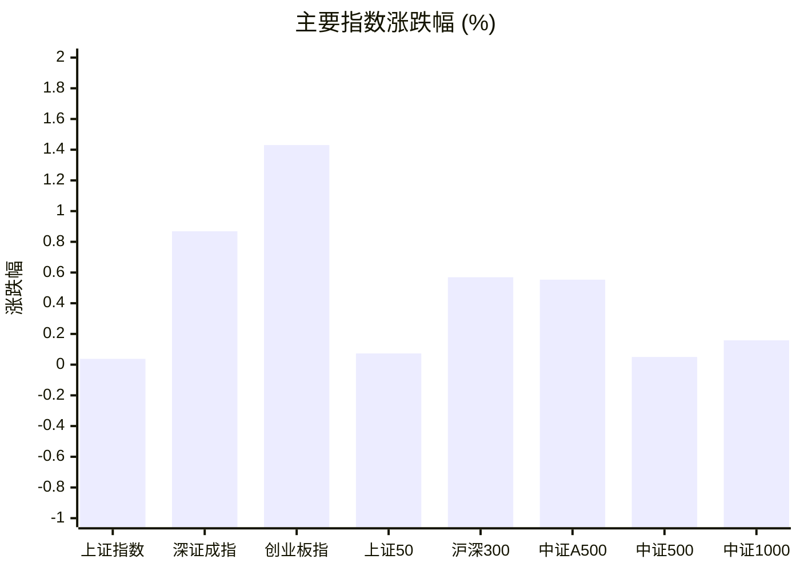
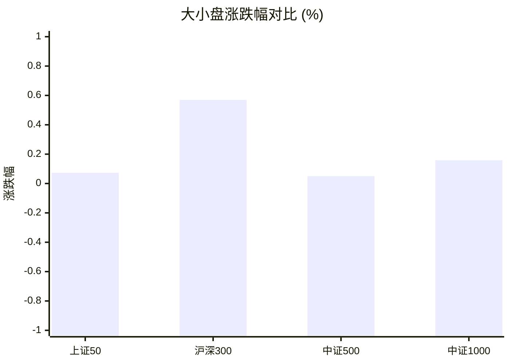
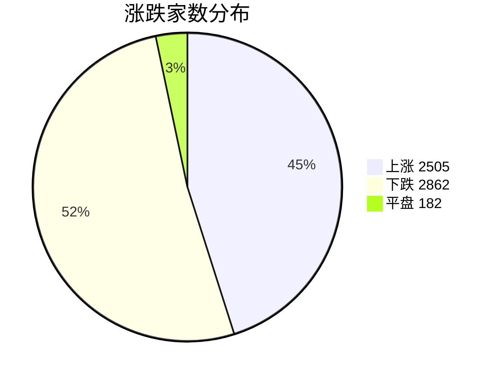
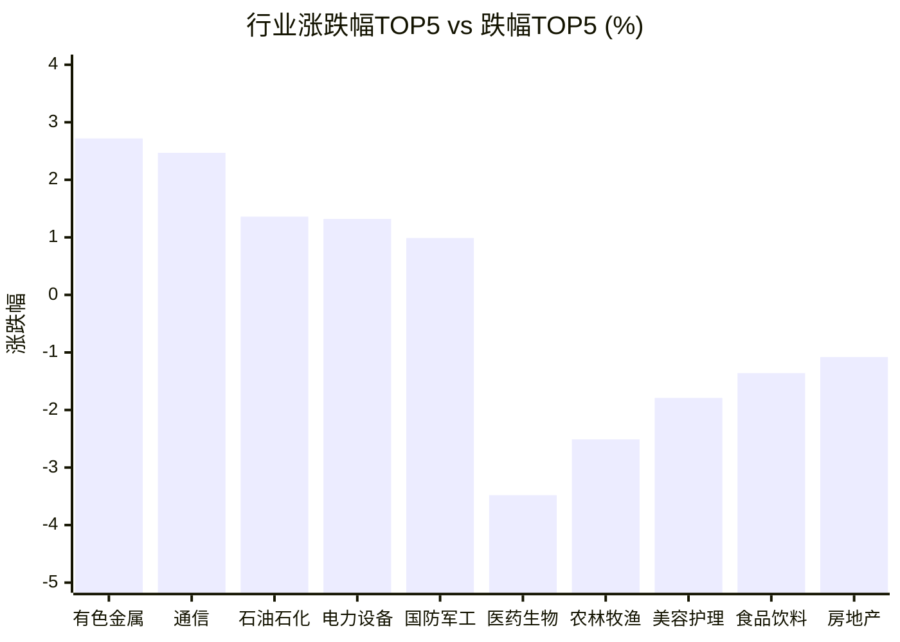

# 📊 A股收盘简报 | 2026-08-21 周五

---

## 📈 一、大盘概况

2026年08月21日 是 A 股交易日，收盘数据已可用。

### 主要指数表现

| 指数 | 收盘价 | 涨跌幅 | 涨跌点 | 成交额(亿) | 前收盘 | 开盘 | 最高 | 最低 |
|------|--------|--------|--------|-----------|--------|------|------|------|
| 上证指数 | 3905.20 | **▲+0.04%** | +1.48 | 8834.23亿 | 3903.72 | 3891.18 | 3912.13 | 3883.79 |
| 深证成指 | 14094.17 | **▲+0.87%** | +121.39 | 9958.41亿 | 13972.78 | 13935.64 | 14132.04 | 13866.39 |
| 创业板指 | 3545.58 | **▲+1.43%** | +49.99 | 4912.56亿 | 3495.59 | 3495.11 | 3563.06 | 3478.52 |
| 上证50 | 2883.55 | **▲+0.07%** | +2.11 | 1376.10亿 | 2881.44 | 2875.65 | 2891.59 | 2872.13 |
| 沪深300 | 4618.90 | **▲+0.57%** | +26.15 | 5055.01亿 | 4592.75 | 4585.44 | 4629.00 | 4579.26 |
| 中证A500 | 5725.60 | **▲+0.55%** | +31.52 | 7161.38亿 | 5694.08 | 5680.98 | 5740.61 | 5669.40 |
| 中证500 | 7854.33 | **▲+0.05%** | +3.93 | 3589.45亿 | 7850.40 | 7812.26 | 7877.34 | 7756.28 |
| 中证1000 | 7601.80 | **▲+0.16%** | +12.02 | 4159.35亿 | 7589.78 | 7555.55 | 7634.08 | 7472.49 |

### 市场整体成交

- **沪深合计成交额**: **18792.64亿**
- **较前日缩量** 2000.99亿（-9.6%）

---

## 📊 二、指数涨跌幅对比

---

## 📊 三、市值结构 — 大小盘对比

| 指数 | 涨跌幅 | 特征 |
|------|--------|------|
| 上证50 | **▲+0.07%** | 超大盘 |
| 沪深300 | **▲+0.57%** | 大盘 |
| 中证500 | **▲+0.05%** | 中盘 |
| 中证1000 | **▲+0.16%** | 小盘 |

> 📌 **大小盘涨跌幅接近**，市场风格均衡。

---

## 📉 四、市场广度
### 涨跌家数分布

### 关键统计

| 指标 | 数值 |
|------|------|
| 上涨家数 | 2505 |
| 下跌家数 | 2862 |
| 平盘家数 | 182 |
| 涨停家数 | 58 |
| 跌停家数 | 15 |
| 全市场中位数 | **▼0.11%** |

---
## 🏢 五、行业表现

### 🔥 涨幅榜 TOP 10

| 排名 | 行业(申万一级) | 涨跌幅 |
|------|---------------|--------|
| 🥇 | 有色金属(申万) | **▲+2.72%** |
| 🥈 | 通信(申万) | **▲+2.47%** |
| 🥉 | 石油石化(申万) | **▲+1.36%** |
| 4 | 电力设备(申万) | **▲+1.32%** |
| 5 | 国防军工(申万) | **▲+0.99%** |
| 6 | 电子(申万) | **▲+0.98%** |
| 7 | 机械设备(申万) | **▲+0.65%** |
| 8 | 非银金融(申万) | **▲+0.59%** |
| 9 | 煤炭(申万) | **▲+0.47%** |
| 10 | 基础化工(申万) | **▲+0.34%** |

### ❄️ 跌幅榜 TOP 10

| 排名 | 行业(申万一级) | 涨跌幅 |
|------|---------------|--------|
| 31 | 医药生物(申万) | **▼3.48%** |
| 30 | 农林牧渔(申万) | **▼2.51%** |
| 29 | 美容护理(申万) | **▼1.79%** |
| 28 | 食品饮料(申万) | **▼1.36%** |
| 27 | 房地产(申万) | **▼1.08%** |
| 26 | 家用电器(申万) | **▼0.93%** |
| 25 | 商贸零售(申万) | **▼0.92%** |
| 24 | 传媒(申万) | **▼0.74%** |
| 23 | 社会服务(申万) | **▼0.50%** |
| 22 | 公用事业(申万) | **▼0.47%** |

> 📊 **行业分化明显**，16涨/15跌。 涨幅第一：**有色金属(申万)**（+2.72%）。 跌幅第一：**医药生物(申万)**（-3.48%）。

---

## 💡 六、热门概念

| 概念 | 涨跌幅 |
|------|--------|
| 锂矿指数 | **▲+4.96%** |
| 氮化铝指数 | **▲+4.70%** |
| 六氟化钨指数 | **▲+4.15%** |
| 稳定币指数 | **▲+3.38%** |
| 氦气指数 | **▲+2.92%** |
| 工业金属精选指数 | **▲+2.81%** |
| 盐湖提锂指数 | **▲+2.80%** |
| 铜产业指数 | **▲+2.67%** |
| 算力金属指数 | **▲+2.66%** |
| 黄金珠宝指数 | **▲+2.61%** |

> 📌 今日热门概念集中在 **锂矿指数**（+4.96%） 等方向。

---

## 💰 七、资金流向

### 主力资金概况

| 指标 | 数值(亿元) |
|------|------|
| 主力资金净流入 | 516.11 |

### 资金流入行业 TOP5

| 行业 | 净流入(亿元) |
|------|--------|
| 电子 | 168.08 |
| 有色金属 | 131.03 |
| 电力设备 | 87.84 |
| 机械设备 | 72.84 |
| 通信 | 62.45 |

> 🟢 **主力资金大幅净流入**，市场做多意愿强烈。

---

## 🌍 八、周边市场

| 指数 | 涨跌幅 |
|------|--------|
| 恒生指数 | **▲+1.21%** |
| 日经225 | **▼0.30%** |
| 标普500 | **▼0.87%** |
| 纳斯达克指数 | **▼1.00%** |
| 道琼斯工业平均 | **▼1.32%** |

> 📌 全球市场多数下跌，外围情绪偏弱。

---

## 📊 九、期货市场

| 品种 | 涨跌幅 |
|------|--------|
| IC2609 | **▲+0.23%** |
| IC2610 | +0.00% |
| IC2612 | **▲+0.11%** |
| IC2703 | **▼0.02%** |
| IF2608 | **▲+0.78%** |
| IF2609 | **▲+0.65%** |
| IF2612 | **▲+0.55%** |
| IF2703 | **▲+0.42%** |
| IH2608 | **▲+0.20%** |
| IH2609 | **▲+0.22%** |

---

## 📰 十、财经要闻

- A股、港股收盘，贵金属大涨
- A股资金流向2026年8月21日星期五
- A股每日行情复盘（8月21日）
- 【A股收评】创业板指震荡反弹涨超1% 沪深两市成交额跌破2万亿
- 财联社8月21日午间新闻精选

---

## 🤖 十一、盘面结论

> 分析来源：AI Agent

**一句话定性：指数偏强但个股偏弱，属于成长风格带动的结构性反弹，而非普涨。**

- **指数与广度证据**：创业板指上涨 1.43%、深证成指上涨 0.87%，而上证指数仅上涨 0.04%；上涨 2505 家、下跌 2862 家，全市场中位数为 -0.11%，说明指数上行尚未扩散到多数个股。
- **量能证据**：沪深合计成交额 18792.64 亿，较前日缩量 2000.99 亿（-9.6%），反弹的持续性仍需量能配合。
- **结构证据**：行业 16 涨 15 跌；有色金属上涨 2.72%、通信上涨 2.47%，医药生物下跌 3.48%。主力资金净流入 516.11 亿元，电子、有色金属和电力设备位居行业净流入前列，资金与强势方向存在同向表现，但不能据此确认趋势已经反转。

---

## 🎯 十二、主线轮动

> 分析来源：AI Agent

1. **有色金属—锂矿及工业金属，生命周期：发酵。**
   - **盘面证据**：有色金属行业上涨 2.72%；锂矿指数上涨 4.96%、盐湖提锂上涨 2.80%、铜产业上涨 2.67%、工业金属精选上涨 2.81%；有色金属行业主力净流入 131.03 亿元。
   - **催化验证**：上述行业、概念与资金数据同向，盘面已验证；财经要闻仅作为候选解释，未据此补充事实。
   - **确认条件**：下一交易日有色金属继续位于行业涨幅前列，相关锂矿或工业金属概念保持强势，且行业净流入仍为正。
   - **失效条件**：有色金属及相关概念同步转弱并跌出涨幅前列，行业资金转为净流出。

2. **通信—电子—电力设备等成长方向，生命周期：发酵。**
   - **盘面证据**：通信行业上涨 2.47%、电力设备上涨 1.32%、电子上涨 0.98%；氮化铝指数上涨 4.70%、六氟化钨指数上涨 4.15%、算力金属指数上涨 2.66%；电子、电力设备、通信行业分别净流入 168.08、87.84、62.45 亿元。
   - **催化验证**：行业、概念和资金流向同向，盘面已验证；缺少结构化数据支持的消息原因不作结论。
   - **确认条件**：通信、电子或电力设备继续保持行业强势，相关概念同步走强，行业净流入延续。
   - **失效条件**：成长行业整体转跌、相关概念强度消退，且行业资金流向转负。

---

## 🔍 十三、明日关注

> 分析来源：AI Agent

1. **观察对象：有色金属与锂矿链。** 确认信号：下一报告中有色金属及相关概念继续位居涨幅前列，行业资金净流入保持正向。失效信号：行业和概念同步转弱并跌出涨幅前列，资金流向转为净流出。
2. **观察对象：通信、电子、电力设备等成长方向。** 确认信号：相关行业和概念继续走强，且行业净流入延续。失效信号：成长行业普遍转跌、概念强度消退并伴随资金转负。
3. **观察对象：指数强弱、成交额与市场广度。** 确认信号：创业板指和深证成指相对强势延续，成交额止跌回升，涨跌家数和中位数同步改善。失效信号：成长指数相对优势消失，成交额继续缩减且下跌家数和负中位数进一步恶化。

---

## 📌 数据来源与免责声明

- **数据来源**：万得 Wind 金融数据服务
- **数据日期**：2026-08-21 收盘
- **生成时间**：2026年08月21日
- **免责声明**：本简报基于 Wind 数据自动生成，AI 分析部分（如有）仅供参考，不构成任何投资建议。市场有风险，投资需谨慎。
