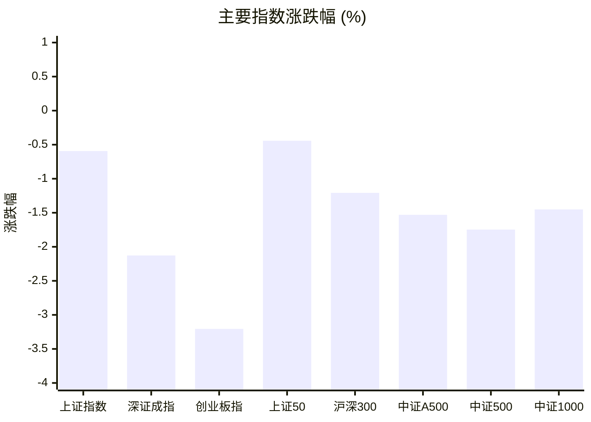
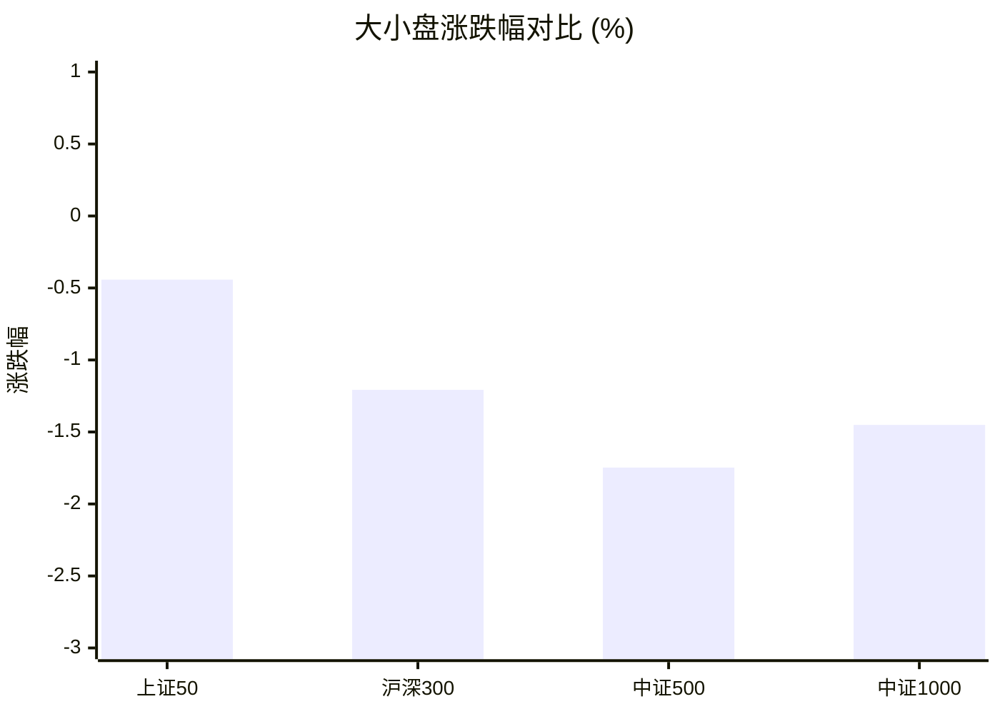
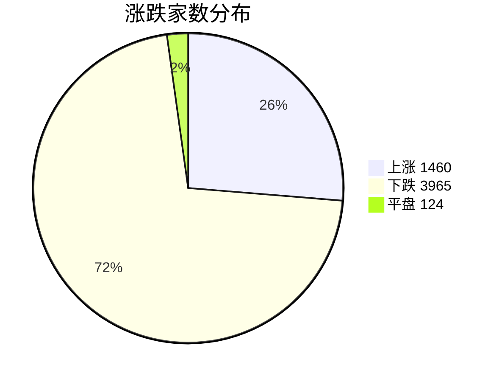
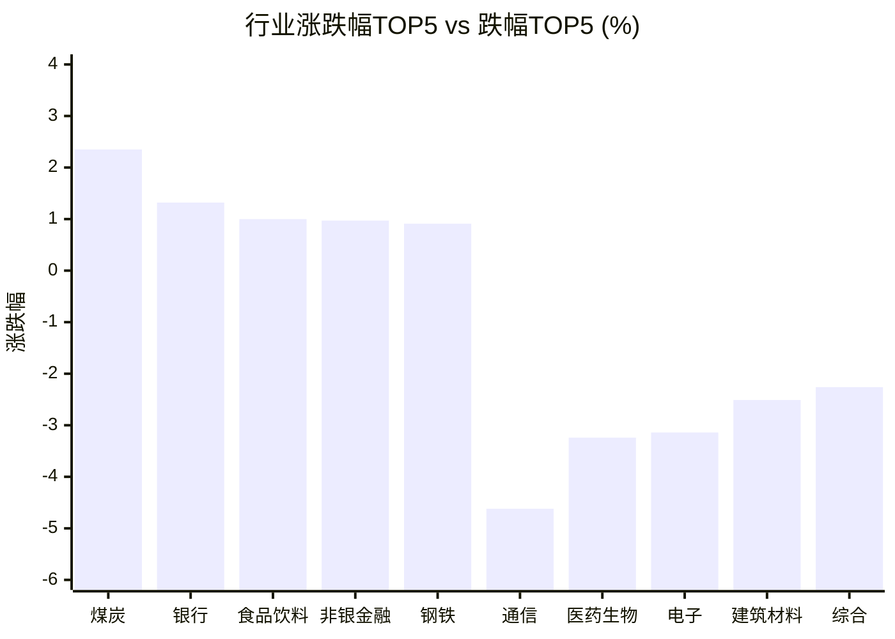

# 📊 A股收盘简报 | 2026-08-24 周一

---

## 📈 一、大盘概况

2026年08月24日 是 A 股交易日，收盘数据已可用。

### 主要指数表现

| 指数 | 收盘价 | 涨跌幅 | 涨跌点 | 成交额(亿) | 前收盘 | 开盘 | 最高 | 最低 |
|------|--------|--------|--------|-----------|--------|------|------|------|
| 上证指数 | 3882.01 | **▼0.59%** | -23.19 | 9520.39亿 | 3905.20 | 3902.70 | 3910.24 | 3855.35 |
| 深证成指 | 13794.29 | **▼2.13%** | -299.88 | 10554.17亿 | 14094.17 | 14118.02 | 14118.15 | 13616.75 |
| 创业板指 | 3431.89 | **▼3.21%** | -113.69 | 5058.28亿 | 3545.58 | 3550.25 | 3551.51 | 3376.64 |
| 上证50 | 2870.80 | **▼0.44%** | -12.75 | 1748.22亿 | 2883.55 | 2882.64 | 2888.42 | 2857.30 |
| 沪深300 | 4563.13 | **▼1.21%** | -55.77 | 5904.26亿 | 4618.90 | 4620.95 | 4621.39 | 4527.49 |
| 中证A500 | 5637.96 | **▼1.53%** | -87.64 | 7948.17亿 | 5725.60 | 5729.39 | 5729.80 | 5585.31 |
| 中证500 | 7717.09 | **▼1.75%** | -137.24 | 3675.54亿 | 7854.33 | 7861.05 | 7865.54 | 7615.45 |
| 中证1000 | 7491.49 | **▼1.45%** | -110.31 | 4335.55亿 | 7601.80 | 7614.89 | 7633.34 | 7377.72 |

### 市场整体成交

- **沪深合计成交额**: **20074.56亿**
- **较前日放量** 1281.92亿（+6.8%）

---

## 📊 二、指数涨跌幅对比

---

## 📊 三、市值结构 — 大小盘对比

| 指数 | 涨跌幅 | 特征 |
|------|--------|------|
| 上证50 | **▼0.44%** | 超大盘 |
| 沪深300 | **▼1.21%** | 大盘 |
| 中证500 | **▼1.75%** | 中盘 |
| 中证1000 | **▼1.45%** | 小盘 |

> 📌 **大盘蓝筹占优**，上证50领涨，市场偏好核心资产。

---

## 📉 四、市场广度
### 涨跌家数分布

### 关键统计

| 指标 | 数值 |
|------|------|
| 上涨家数 | 1460 |
| 下跌家数 | 3965 |
| 平盘家数 | 124 |
| 涨停家数 | 48 |
| 跌停家数 | 14 |
| 全市场中位数 | **▼1.22%** |

---
## 🏢 五、行业表现

### 🔥 涨幅榜 TOP 10

| 排名 | 行业(申万一级) | 涨跌幅 |
|------|---------------|--------|
| 🥇 | 煤炭(申万) | **▲+2.35%** |
| 🥈 | 银行(申万) | **▲+1.32%** |
| 🥉 | 食品饮料(申万) | **▲+1.00%** |
| 4 | 非银金融(申万) | **▲+0.97%** |
| 5 | 钢铁(申万) | **▲+0.91%** |
| 6 | 公用事业(申万) | **▲+0.58%** |
| 7 | 交通运输(申万) | **▲+0.35%** |
| 8 | 家用电器(申万) | **▲+0.22%** |
| 9 | 有色金属(申万) | **▲+0.13%** |
| 10 | 农林牧渔(申万) | **▲+0.10%** |

### ❄️ 跌幅榜 TOP 10

| 排名 | 行业(申万一级) | 涨跌幅 |
|------|---------------|--------|
| 31 | 通信(申万) | **▼4.62%** |
| 30 | 医药生物(申万) | **▼3.24%** |
| 29 | 电子(申万) | **▼3.14%** |
| 28 | 建筑材料(申万) | **▼2.51%** |
| 27 | 综合(申万) | **▼2.26%** |
| 26 | 计算机(申万) | **▼2.15%** |
| 25 | 机械设备(申万) | **▼1.80%** |
| 24 | 传媒(申万) | **▼1.63%** |
| 23 | 房地产(申万) | **▼1.52%** |
| 22 | 基础化工(申万) | **▼1.44%** |

> 📊 **行业分化明显**，10涨/21跌。 涨幅第一：**煤炭(申万)**（+2.35%）。 跌幅第一：**通信(申万)**（-4.62%）。

---

## 💡 六、热门概念

| 概念 | 涨跌幅 |
|------|--------|
| 央企煤炭指数 | **▲+4.89%** |
| 煤炭开采精选指数 | **▲+2.21%** |
| 黄金珠宝指数 | **▲+1.82%** |
| 保险精选指数 | **▲+1.80%** |
| 稳定币指数 | **▲+1.57%** |
| 央企银行指数 | **▲+1.41%** |
| 白色家电精选指数 | **▲+1.40%** |
| 生物育种指数 | **▲+1.31%** |
| 锂电正极指数 | **▲+1.20%** |
| 一号文件指数 | **▲+1.16%** |

> 📌 今日热门概念集中在 **央企煤炭指数**（+4.89%） 等方向。

---

## 💰 七、资金流向

### 主力资金概况

| 指标 | 数值(亿元) |
|------|------|
| 主力资金净流入 | -414.89 |

### 资金流入行业 TOP5

| 行业 | 净流入(亿元) |
|------|--------|
| 银行 | 46.54 |
| 非银金融 | 25.45 |
| 食品饮料 | 14.87 |
| 公用事业 | 10.17 |
| 交通运输 | 9.07 |

> 🔴 **主力资金大幅净流出**，市场谨慎情绪升温。

---

## 🌍 八、周边市场

| 指数 | 涨跌幅 |
|------|--------|
| 道琼斯工业平均 | **▲+0.98%** |
| 纳斯达克指数 | **▲+0.43%** |
| 标普500 | **▲+0.43%** |
| 日经225 | **▼0.74%** |
| 恒生指数 | **▼1.89%** |

> 📌 全球市场多数上涨，外围情绪偏暖。

---

## 📊 九、期货市场

| 品种 | 涨跌幅 |
|------|--------|
| IC2609 | **▼1.77%** |
| IC2610 | **▼2.64%** |
| IC2612 | **▼1.83%** |
| IC2703 | **▼1.91%** |
| IF2609 | **▼1.12%** |
| IF2610 | **▼1.78%** |
| IF2612 | **▼1.21%** |
| IF2703 | **▼1.33%** |
| IH2609 | **▼0.38%** |
| IH2610 | **▼0.84%** |

---

## 📰 十、财经要闻

- A股每日行情复盘（8月24日）
- 热门财讯播报（2026年08月24日）
- 财经早点｜风格切换，结构均衡
- A股平均股价14.21元 65股股价不足2元
- A股午评：沪指半日跌0.71%，全市场近4300只个股飘绿，玻纤、AMD、生物制品等概念走弱

---

## 🤖 十一、盘面结论

> 分析来源：AI Agent

一句话定性：今日属于放量下跌、权重相对抗跌而成长板块明显承压的结构性弱势行情。

- 证据：沪深合计成交额 20074.56 亿元，较前日放量 1281.92 亿元（+6.8%），但上证指数跌 0.59%，深证成指跌 2.13%，创业板指跌 3.21%。
- 证据：上涨 1460 家、下跌 3965 家、平盘 124 家，全市场涨跌幅中位数为 -1.22%，涨停 48 家、跌停 14 家，空方覆盖面更广。
- 证据：上证50 跌 0.44%，而中证500 跌 1.75%；行业表现为 10 个上涨、21 个下跌，煤炭上涨 2.35%，通信下跌 4.62%。

---

## 🎯 十二、主线轮动

1. **煤炭及相关资源方向｜发酵，待确认**
   - 盘面证据：煤炭（申万）上涨 2.35%，央企煤炭指数上涨 4.89%，煤炭开采精选指数上涨 2.21%，均位居对应榜单前列。
   - 催化验证：结构化行业与概念数据同向，盘面已验证；报告未提供可核验的新增外部催化事实。
   - 确认条件：下一交易日煤炭行业和相关概念继续位于行业、概念涨幅前列，且市场广度不进一步恶化。
   - 失效条件：煤炭行业转跌或跌出行业强势区间，同时相关概念涨幅优势消失。

2. **银行与非银金融｜防御性分化，待确认**
   - 盘面证据：银行上涨 1.32%、非银金融上涨 0.97%；两行业位列资金流入行业前列，分别为 46.54 亿元和 25.45 亿元；上证50 跌幅为 0.44%，小于中证500 的 1.75%。
   - 催化验证：行业涨幅、资金流入和大盘风格数据同向，盘面已验证为相对强势；报告未提供可核验的新增外部催化事实。
   - 确认条件：银行、非银金融继续保持行业相对强势，且上证50 相对中小盘指数的抗跌关系延续。
   - 失效条件：银行与非银金融同步转弱，或权重指数相对中小盘的抗跌关系消失。

---

## 🔍 十三、明日关注

1. **观察对象：市场广度与全市场中位数。** 确认信号：上涨家数回升、下跌家数减少且中位数较今日 -1.22% 收窄。失效信号：下跌家数继续扩大或中位数进一步走弱。
2. **观察对象：煤炭及资源相关方向。** 确认信号：煤炭行业与相关概念继续进入行业、概念涨幅前列。失效信号：煤炭行业转跌且相关概念同步失去强势排名。
3. **观察对象：银行、非银金融与权重风格。** 确认信号：银行和非银金融保持相对强势，且上证50 继续较中证500 抗跌。失效信号：两行业同步转弱或权重相对中小盘的抗跌关系逆转。

---

## 📌 数据来源与免责声明

- **数据来源**：万得 Wind 金融数据服务
- **数据日期**：2026-08-24 收盘
- **生成时间**：2026年08月24日
- **免责声明**：本简报基于 Wind 数据自动生成，AI 分析部分（如有）仅供参考，不构成任何投资建议。市场有风险，投资需谨慎。
