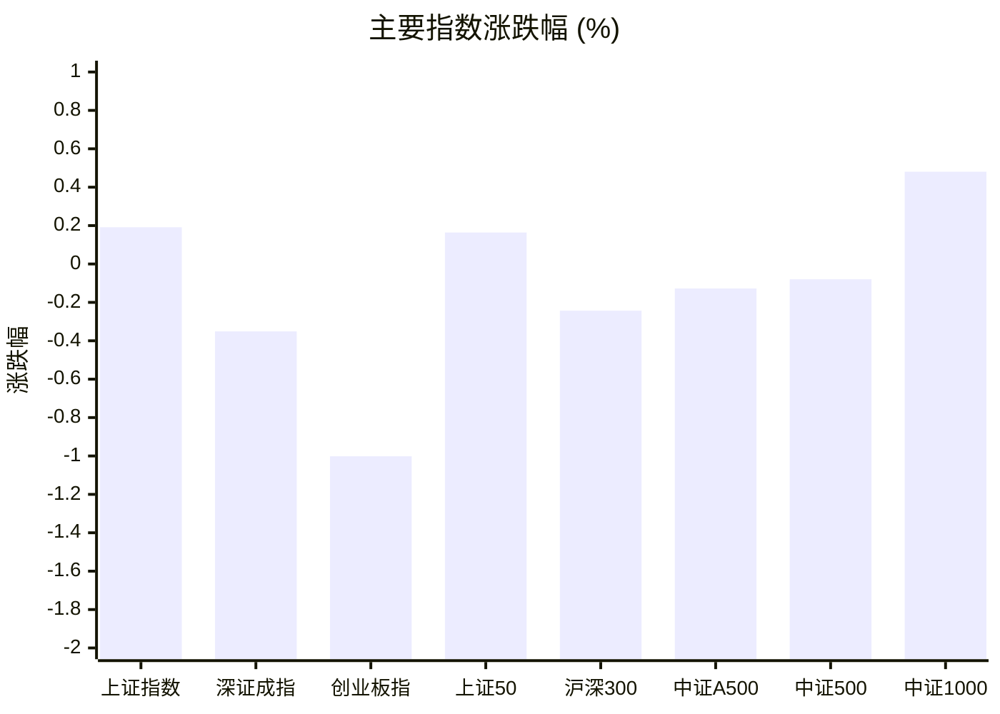
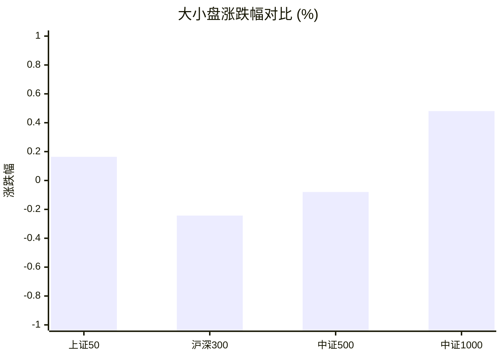
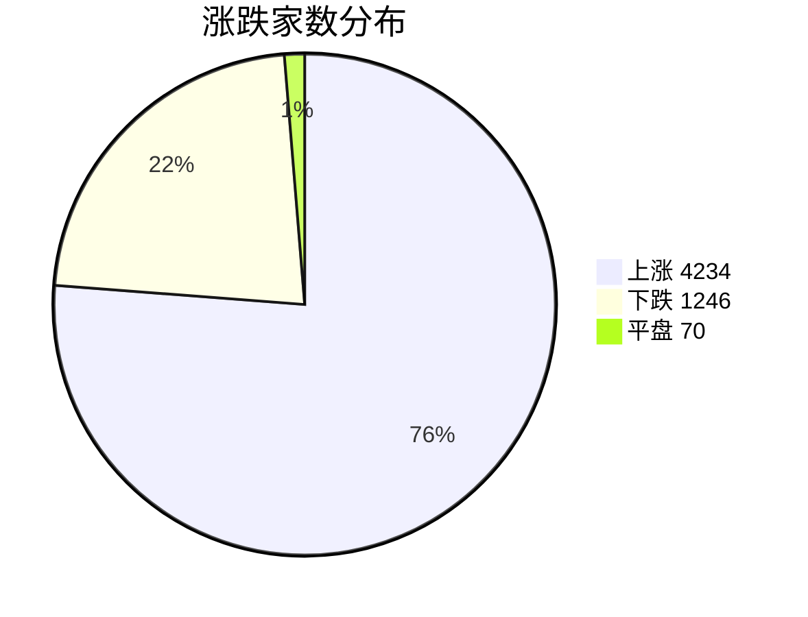
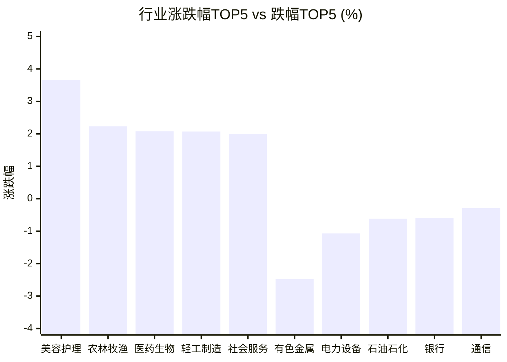

# 📊 A股收盘简报 | 2026-08-25 周二

---

## 📈 一、大盘概况

2026年08月25日 是 A 股交易日，收盘数据已可用。

### 主要指数表现

| 指数 | 收盘价 | 涨跌幅 | 涨跌点 | 成交额(亿) | 前收盘 | 开盘 | 最高 | 最低 |
|------|--------|--------|--------|-----------|--------|------|------|------|
| 上证指数 | 3889.44 | **▲+0.19%** | +7.43 | 8588.74亿 | 3882.01 | 3863.37 | 3896.21 | 3850.86 |
| 深证成指 | 13745.87 | **▼0.35%** | -48.42 | 9729.70亿 | 13794.29 | 13683.91 | 13848.40 | 13568.51 |
| 创业板指 | 3397.52 | **▼1.00%** | -34.37 | 4639.77亿 | 3431.89 | 3403.20 | 3440.65 | 3359.74 |
| 上证50 | 2875.51 | **▲+0.16%** | +4.71 | 1342.92亿 | 2870.80 | 2864.46 | 2881.12 | 2859.29 |
| 沪深300 | 4552.03 | **▼0.24%** | -11.10 | 4804.22亿 | 4563.13 | 4542.24 | 4573.38 | 4523.02 |
| 中证A500 | 5630.78 | **▼0.13%** | -7.18 | 6680.53亿 | 5637.96 | 5607.15 | 5659.72 | 5574.14 |
| 中证500 | 7710.94 | **▼0.08%** | -6.15 | 3262.74亿 | 7717.09 | 7644.20 | 7755.72 | 7572.86 |
| 中证1000 | 7527.50 | **▲+0.48%** | +36.01 | 4017.94亿 | 7491.49 | 7420.77 | 7556.07 | 7347.95 |

### 市场整体成交

- **沪深合计成交额**: **18318.44亿**

---

## 📊 二、指数涨跌幅对比

---

## 📊 三、市值结构 — 大小盘对比

| 指数 | 涨跌幅 | 特征 |
|------|--------|------|
| 上证50 | **▲+0.16%** | 超大盘 |
| 沪深300 | **▼0.24%** | 大盘 |
| 中证500 | **▼0.08%** | 中盘 |
| 中证1000 | **▲+0.48%** | 小盘 |

> 📌 **大小盘涨跌幅接近**，市场风格均衡。

---

## 📉 四、市场广度
### 涨跌家数分布

### 关键统计

| 指标 | 数值 |
|------|------|
| 上涨家数 | 4234 |
| 下跌家数 | 1246 |
| 平盘家数 | 70 |
| 涨停家数 | 70 |
| 跌停家数 | 4 |
| 全市场中位数 | **▲+1.46%** |

---
## 🏢 五、行业表现

### 🔥 涨幅榜 TOP 10

| 排名 | 行业(申万一级) | 涨跌幅 |
|------|---------------|--------|
| 🥇 | 美容护理(申万) | **▲+3.66%** |
| 🥈 | 农林牧渔(申万) | **▲+2.23%** |
| 🥉 | 医药生物(申万) | **▲+2.08%** |
| 4 | 轻工制造(申万) | **▲+2.07%** |
| 5 | 社会服务(申万) | **▲+1.99%** |
| 6 | 商贸零售(申万) | **▲+1.68%** |
| 7 | 传媒(申万) | **▲+1.64%** |
| 8 | 房地产(申万) | **▲+1.58%** |
| 9 | 家用电器(申万) | **▲+1.49%** |
| 10 | 汽车(申万) | **▲+1.40%** |

### ❄️ 跌幅榜 TOP 10

| 排名 | 行业(申万一级) | 涨跌幅 |
|------|---------------|--------|
| 31 | 有色金属(申万) | **▼2.48%** |
| 30 | 电力设备(申万) | **▼1.07%** |
| 29 | 石油石化(申万) | **▼0.61%** |
| 28 | 银行(申万) | **▼0.60%** |
| 27 | 通信(申万) | **▼0.29%** |
| 26 | 煤炭(申万) | **▼0.21%** |
| 25 | 基础化工(申万) | **▼0.09%** |
| 24 | 电子(申万) | **▲+0.10%** |
| 23 | 非银金融(申万) | **▲+0.10%** |
| 22 | 综合(申万) | **▲+0.13%** |

> 📈 **行业普涨**，多数板块收红。 涨幅第一：**美容护理(申万)**（+3.66%）。 跌幅第一：**有色金属(申万)**（-2.48%）。

---

## 💡 六、热门概念

| 概念 | 涨跌幅 |
|------|--------|
| 血液制品指数 | **▲+3.93%** |
| 高送转指数 | **▲+3.80%** |
| ADC指数 | **▲+3.63%** |
| 生物育种指数 | **▲+3.61%** |
| 乳业指数 | **▲+3.51%** |
| SPD指数 | **▲+3.49%** |
| 液冷服务器指数 | **▲+3.48%** |
| 培育钻石指数 | **▲+3.43%** |
| 超硬材料指数 | **▲+3.37%** |
| CRO指数 | **▲+3.36%** |

> 📌 今日热门概念集中在 **血液制品指数**（+3.93%） 等方向。

---

## 💰 七、资金流向

### 主力资金概况

| 指标 | 数值(亿元) |
|------|------|
| 主力资金净流入 | 36.39 |

### 资金流入行业 TOP5

| 行业 | 净流入(亿元) |
|------|--------|
| 机械设备 | 52.51 |
| 医药生物 | 22.27 |
| 计算机 | 13.00 |
| 农林牧渔 | 10.76 |
| 传媒 | 8.47 |

> 🟢 **主力资金小幅净流入**。

---

## 🌍 八、周边市场

| 指数 | 涨跌幅 |
|------|--------|
| 恒生指数 | **▼0.02%** |
| 日经225 | **▲+0.50%** |

> 📌 全球市场涨跌不一。

---

## 📊 九、期货市场

| 品种 | 涨跌幅 |
|------|--------|
| IH2610 | **▲+0.25%** |
| IM2703 | **▲+0.97%** |
| IC2612 | **▲+0.66%** |
| IF2609 | **▲+0.20%** |
| IC2610 | **▲+0.50%** |
| IC2703 | **▲+0.59%** |
| IF2612 | **▲+0.21%** |
| IM2610 | **▲+1.10%** |
| IH2703 | **▲+0.06%** |
| IM2609 | **▲+1.10%** |

---

## 📰 十、财经要闻

- 陆家嘴财经早餐2026年8月25日星期二
- 中国股市每日简报2026年8月25日
- 财联社8月25日午间新闻精选
- 【浙商私享家||收盘】A股指数分化，个股普涨
- 【A股收评】沪指探底回升涨0.19% 两市成交额仅1.83万亿元

---

## 🤖 十一、盘面结论

> 分析来源：AI Agent

**一句话定性：指数分化下的结构性偏强行情，个股与多数行业普遍上涨。**

- **证据 1：**市场广度显示上涨 4234 家、下跌 1246 家、平盘 70 家，涨停 70 家而跌停 4 家；全市场涨跌幅中位数为 **+1.46%**，个股表现明显强于主要指数。
- **证据 2：**上证指数、上证50和中证1000分别上涨 0.19%、0.16%和0.48%，但深证成指、沪深300和创业板指分别下跌 0.35%、0.24%和 1.00%，权重与成长方向出现分化。
- **证据 3：**行业涨幅前十均为上涨，美容护理、农林牧渔、医药生物分别上涨 3.66%、2.23%和 2.08%；有色金属下跌 2.48%，显示强势集中于部分消费、农业和医药方向。

---

## 🎯 十二、主线轮动

### 1. 医药生物与生物医药主题 — 发酵

- **盘面证据：**医药生物行业上涨 **2.08%**；血液制品、ADC、CRO概念分别上涨 **3.93%、3.63%、3.36%**；医药生物行业主力资金净流入 **22.27亿元**。
- **催化验证：**报告财经要闻未提供可核验的具体医药政策或事件，催化因素暂未验证；当前判断仅基于结构化行情与资金数据。
- **确认条件：**下一交易日医药生物行业、相关概念涨幅继续位居前列，且行业资金流向保持净流入。
- **失效条件：**下一交易日医药生物及相关概念转为行业跌幅靠前，或行业资金转为净流出。

### 2. 农林牧渔与消费主题 — 待确认

- **盘面证据：**农林牧渔行业上涨 **2.23%**，生物育种和乳业概念分别上涨 **3.61%**和 **3.51%**；农林牧渔行业主力资金净流入 **10.76亿元**。
- **催化验证：**报告未提供可核验的具体政策或事件催化，暂标记为未验证。
- **确认条件：**下一交易日农林牧渔行业及生物育种、乳业等相关概念仍保持行业或概念涨幅靠前，并继续出现行业资金净流入。
- **失效条件：**相关行业与概念同步转弱、跌入行业跌幅靠前，或行业资金流向转为净流出。

---

## 🔍 十三、明日关注

1. **观察对象：医药生物及血液制品、ADC、CRO概念。** **确认信号：**下一交易日行业和相关概念继续上涨并保持涨幅靠前，行业资金流向为净流入。 **失效信号：**行业或相关概念转跌并进入跌幅靠前，且行业资金转为净流出。
2. **观察对象：农林牧渔、生物育种和乳业。** **确认信号：**下一交易日行业与相关概念继续同步走强，农林牧渔行业资金保持净流入。 **失效信号：**行业与概念涨跌出现明显背离并转弱，或行业资金流向转为净流出。
3. **观察对象：指数风格与市场广度。** **确认信号：**下一交易日中证1000相对主要指数继续偏强，同时上涨家数、中位数和涨停家数维持强势。 **失效信号：**中证1000转弱且上涨家数、中位数或涨停家数同步回落，或跌停家数明显增加。

---

## 📌 数据来源与免责声明

- **数据来源**：万得 Wind 金融数据服务
- **数据日期**：2026-08-25 收盘
- **生成时间**：2026年08月25日
- **免责声明**：本简报基于 Wind 数据自动生成，AI 分析部分（如有）仅供参考，不构成任何投资建议。市场有风险，投资需谨慎。
