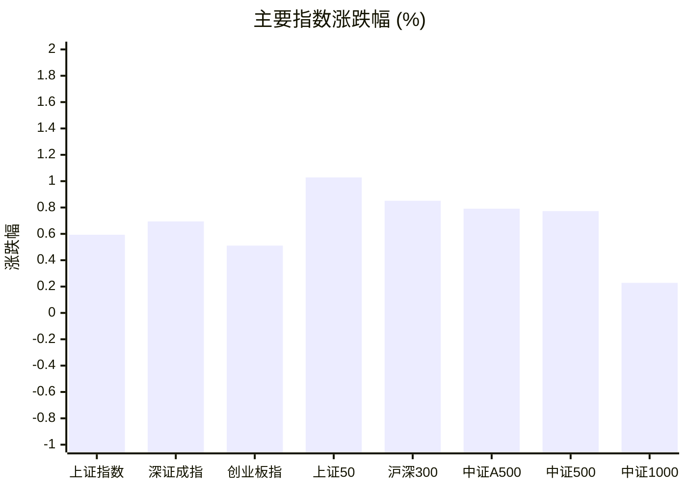
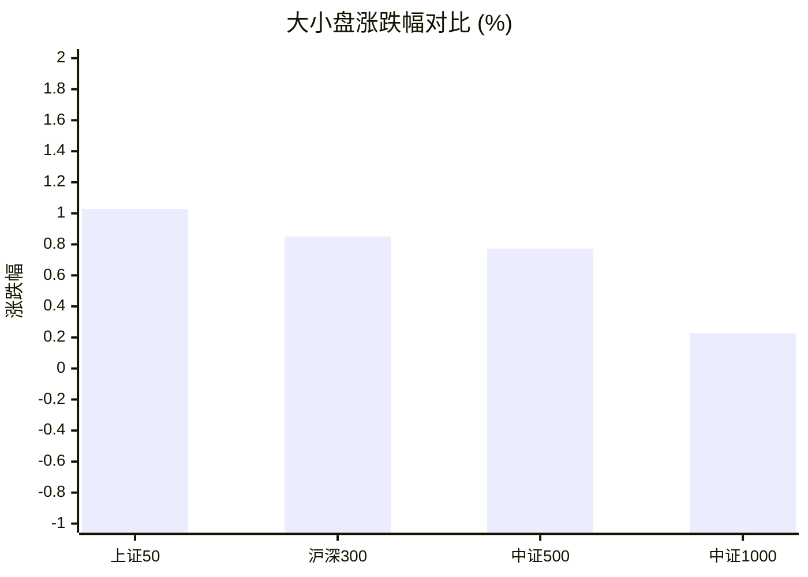
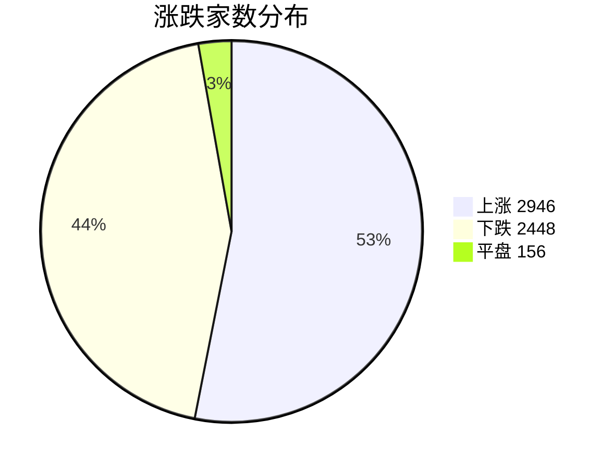
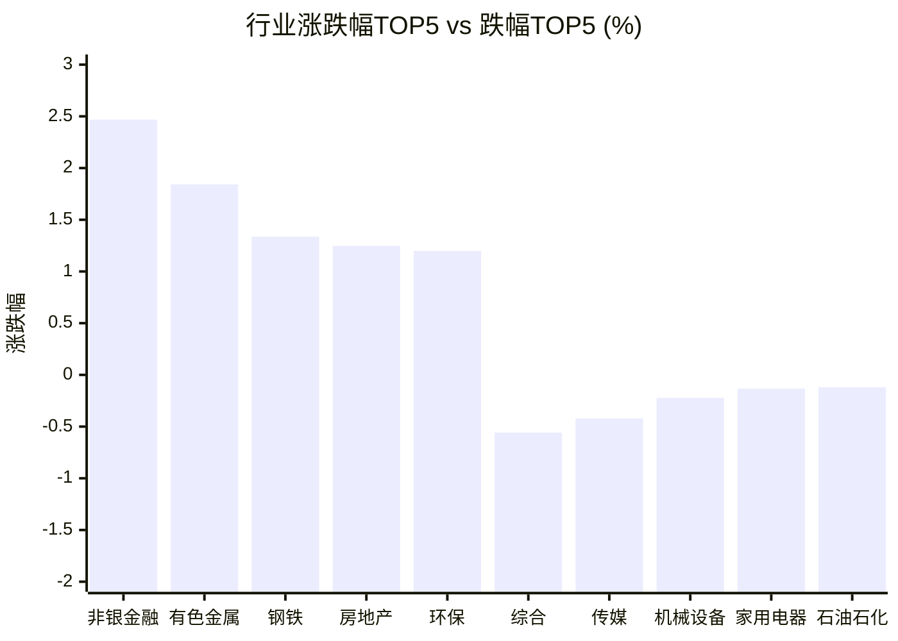

# 📊 A股收盘简报 | 2026-08-26 周三

---

## 📈 一、大盘概况

2026年08月26日 是 A 股交易日，收盘数据已可用。

### 主要指数表现

| 指数 | 收盘价 | 涨跌幅 | 涨跌点 | 成交额(亿) | 前收盘 | 开盘 | 最高 | 最低 |
|------|--------|--------|--------|-----------|--------|------|------|------|
| 上证指数 | 3912.52 | **▲+0.59%** | +23.08 | 8572.23亿 | 3889.44 | 3881.74 | 3926.44 | 3881.74 |
| 深证成指 | 13841.33 | **▲+0.69%** | +95.46 | 9515.00亿 | 13745.87 | 13761.36 | 13948.69 | 13714.05 |
| 创业板指 | 3414.88 | **▲+0.51%** | +17.36 | 4435.81亿 | 3397.52 | 3409.28 | 3455.89 | 3379.14 |
| 上证50 | 2905.08 | **▲+1.03%** | +29.57 | 1401.53亿 | 2875.51 | 2871.89 | 2914.18 | 2870.42 |
| 沪深300 | 4590.79 | **▲+0.85%** | +38.76 | 4890.57亿 | 4552.03 | 4549.43 | 4612.04 | 4542.84 |
| 中证A500 | 5675.34 | **▲+0.79%** | +44.56 | 6664.42亿 | 5630.78 | 5631.60 | 5709.40 | 5624.53 |
| 中证500 | 7770.53 | **▲+0.77%** | +59.59 | 3252.61亿 | 7710.94 | 7714.84 | 7833.60 | 7699.42 |
| 中证1000 | 7544.67 | **▲+0.23%** | +17.17 | 3785.90亿 | 7527.50 | 7536.37 | 7601.84 | 7467.41 |

### 市场整体成交

- **沪深合计成交额**: **18087.23亿**
- **较前日缩量** 231.21亿（-1.3%）

---

## 📊 二、指数涨跌幅对比

---

## 📊 三、市值结构 — 大小盘对比

| 指数 | 涨跌幅 | 特征 |
|------|--------|------|
| 上证50 | **▲+1.03%** | 超大盘 |
| 沪深300 | **▲+0.85%** | 大盘 |
| 中证500 | **▲+0.77%** | 中盘 |
| 中证1000 | **▲+0.23%** | 小盘 |

> 📌 **大盘蓝筹占优**，上证50领涨，市场偏好核心资产。

---

## 📉 四、市场广度
### 涨跌家数分布

### 关键统计

| 指标 | 数值 |
|------|------|
| 上涨家数 | 2946 |
| 下跌家数 | 2448 |
| 平盘家数 | 156 |
| 涨停家数 | 56 |
| 跌停家数 | 2 |
| 全市场中位数 | **▲+0.16%** |

---
## 🏢 五、行业表现

### 🔥 涨幅榜 TOP 10

| 排名 | 行业(申万一级) | 涨跌幅 |
|------|---------------|--------|
| 🥇 | 非银金融(申万) | **▲+2.47%** |
| 🥈 | 有色金属(申万) | **▲+1.84%** |
| 🥉 | 钢铁(申万) | **▲+1.34%** |
| 4 | 房地产(申万) | **▲+1.25%** |
| 5 | 环保(申万) | **▲+1.20%** |
| 6 | 公用事业(申万) | **▲+0.94%** |
| 7 | 轻工制造(申万) | **▲+0.93%** |
| 8 | 基础化工(申万) | **▲+0.88%** |
| 9 | 电力设备(申万) | **▲+0.82%** |
| 10 | 美容护理(申万) | **▲+0.80%** |

### ❄️ 跌幅榜 TOP 10

| 排名 | 行业(申万一级) | 涨跌幅 |
|------|---------------|--------|
| 31 | 综合(申万) | **▼0.56%** |
| 30 | 传媒(申万) | **▼0.42%** |
| 29 | 机械设备(申万) | **▼0.22%** |
| 28 | 家用电器(申万) | **▼0.13%** |
| 27 | 石油石化(申万) | **▼0.12%** |
| 26 | 食品饮料(申万) | **▼0.09%** |
| 25 | 通信(申万) | **▼0.05%** |
| 24 | 纺织服饰(申万) | **▲+0.04%** |
| 23 | 计算机(申万) | **▲+0.06%** |
| 22 | 农林牧渔(申万) | **▲+0.06%** |

> 📈 **行业普涨**，多数板块收红。 涨幅第一：**非银金融(申万)**（+2.47%）。 跌幅第一：**综合(申万)**（-0.56%）。

---

## 💡 六、热门概念

| 概念 | 涨跌幅 |
|------|--------|
| 炒股软件指数 | **▲+4.19%** |
| 工业金属精选指数 | **▲+3.17%** |
| 铜产业指数 | **▲+3.17%** |
| 券商等权指数 | **▲+3.03%** |
| 疫苗指数 | **▲+2.81%** |
| 超导指数 | **▲+2.30%** |
| 金融科技指数 | **▲+2.19%** |
| 保险精选指数 | **▲+2.19%** |
| 镍矿指数 | **▲+2.14%** |
| 磷化工指数 | **▲+2.13%** |

> 📌 今日热门概念集中在 **炒股软件指数**（+4.19%） 等方向。

---

## 💰 七、资金流向

### 主力资金概况

| 指标 | 数值(亿元) |
|------|------|
| 主力资金净流入 | 51.82 |

### 资金流入行业 TOP5

| 行业 | 净流入(亿元) |
|------|--------|
| 电子 | 29.06 |
| 电力设备 | 17.91 |
| 有色金属 | 16.78 |
| 非银金融 | 14.87 |
| 计算机 | 14.36 |

> 🟢 **主力资金小幅净流入**。

---

## 🌍 八、周边市场

| 指数 | 涨跌幅 |
|------|--------|
| 恒生指数 | **▲+0.56%** |
| 日经225 | **▲+0.62%** |

> 📌 全球市场多数上涨，外围情绪偏暖。

---

## 📊 九、期货市场

| 品种 | 涨跌幅 |
|------|--------|
| IH2610 | **▲+1.10%** |
| IM2703 | **▲+0.24%** |
| IC2612 | **▲+0.90%** |
| IF2609 | **▲+0.98%** |
| IC2610 | **▲+0.92%** |
| IC2703 | **▲+0.96%** |
| IF2612 | **▲+1.01%** |
| IM2610 | **▲+0.23%** |
| IH2703 | **▲+1.01%** |
| IM2609 | **▲+0.23%** |

---

## 📰 十、财经要闻

- A股每日行情复盘（8月26日）
- 8月26日A股指数最新估值汇总
- 影响A股市场的外部叙事仍偏短期，A500ETF华夏（512050）近60日资金持续净流入
- 2026年A股半年报盘点（8月26日）
- 陆家嘴财经早餐2026年8月26日星期三

---

## 🤖 十一、盘面结论

> 分析来源：AI Agent

**市场呈现大盘蓝筹占优的温和普涨，量能小幅回落，结构性强势集中于金融与资源相关方向。**

- **指数与风格证据**：八项主要指数均收涨；上证50上涨 1.03%，高于中证1000的 0.23%，大盘风格相对占优。
- **广度证据**：上涨 2946 家、下跌 2448 家，全市场涨跌幅中位数为 +0.16%；涨停 56 家、跌停 2 家，市场整体仍偏多。
- **成交与资金证据**：沪深合计成交 18087.23 亿元，较前日缩量 231.21 亿元；主力资金净流入 51.82 亿元，电子、电力设备、有色金属和非银金融位列流入行业前列。量能回落意味着当日普涨后的持续性仍需下一交易日验证。

---

## 🎯 十二、主线轮动

### 金融及金融科技方向：发酵

- **盘面证据**：非银金融上涨 2.47%，居申万一级行业首位；炒股软件指数上涨 4.19%，券商等权指数上涨 3.03%，金融科技指数上涨 2.19%。非银金融同时位列资金流入行业前列。
- **催化验证**：报告未提供可与该方向同向验证的结构化事件数据，相关消息面解释维持未验证。
- **确认条件**：下一交易日非银金融及券商、金融科技相关概念继续处于涨幅靠前位置，且资金流入行业榜仍出现相关方向。
- **失效条件**：非银金融转入行业跌幅靠前位置，或相关概念退出当日涨幅靠前列表且资金流向未延续。

### 有色金属及工业金属方向：发酵

- **盘面证据**：有色金属上涨 1.84%，位列行业涨幅第二；工业金属精选指数和铜产业指数均上涨 3.17%，镍矿指数上涨 2.14%。有色金属净流入 16.78 亿元，位列资金流入行业前列。
- **催化验证**：报告未提供可验证该方向的结构化事件数据，催化解释维持未验证。
- **确认条件**：有色金属保持行业涨幅靠前，工业金属、铜产业等相关概念继续位于概念涨幅榜前列，且资金流入榜保留有色金属。
- **失效条件**：有色金属转入行业跌幅靠前位置，相关概念退出概念涨幅榜前列且资金流向未延续。

---

## 🔍 十三、明日关注

1. **观察对象：大盘与小盘的相对强弱。** 确认信号：上证50、沪深300继续强于中证1000；失效信号：中证1000转为明显强于上证50和沪深300。
2. **观察对象：金融及金融科技方向的延续性。** 确认信号：非银金融以及炒股软件、券商等权、金融科技相关概念继续位于涨幅靠前位置，且资金流入榜保留相关行业；失效信号：相关行业和概念同步退出涨幅靠前列表，或资金流向未延续。
3. **观察对象：市场广度与成交变化。** 确认信号：上涨家数继续多于下跌家数，且沪深合计成交不再缩量；失效信号：下跌家数多于上涨家数，同时成交继续缩量。

---

## 📌 数据来源与免责声明

- **数据来源**：万得 Wind 金融数据服务
- **数据日期**：2026-08-26 收盘
- **生成时间**：2026年08月26日
- **免责声明**：本简报基于 Wind 数据自动生成，AI 分析部分（如有）仅供参考，不构成任何投资建议。市场有风险，投资需谨慎。
