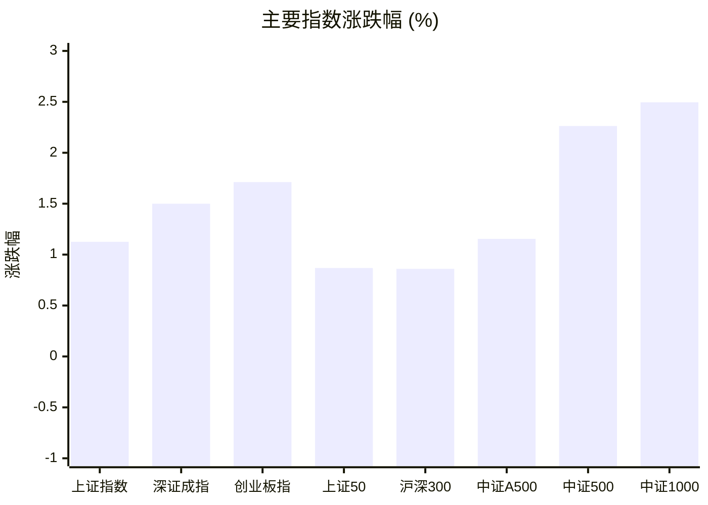
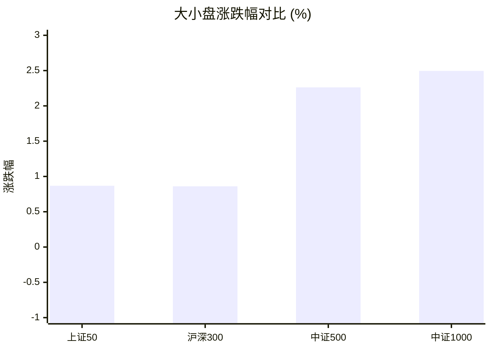
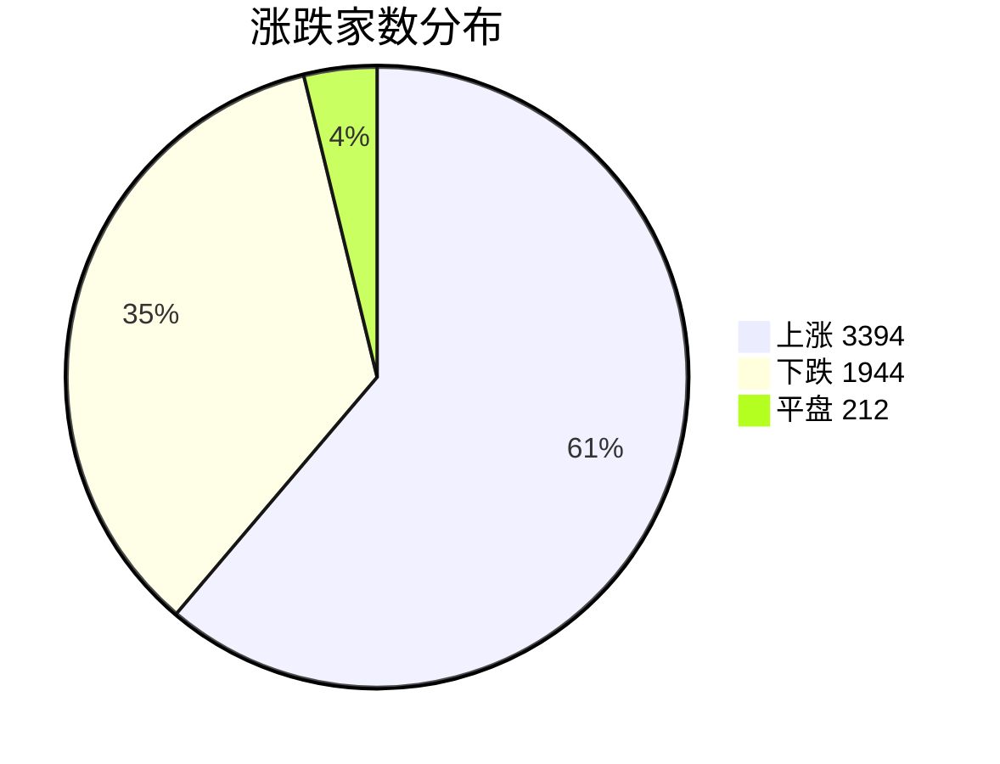
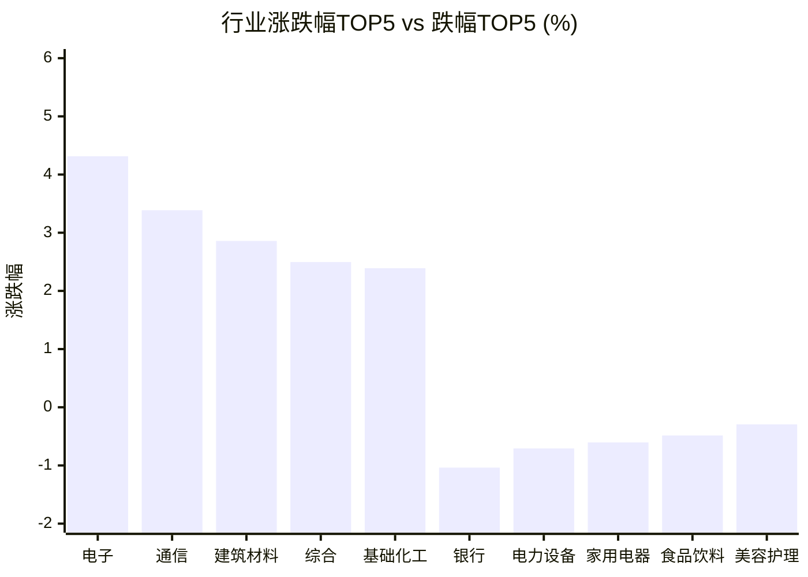

# 📊 A股收盘简报 | 2026-08-27 周四

---

## 📈 一、大盘概况

2026年08月27日 是 A 股交易日，收盘数据已可用。

### 主要指数表现

| 指数 | 收盘价 | 涨跌幅 | 涨跌点 | 成交额(亿) | 前收盘 | 开盘 | 最高 | 最低 |
|------|--------|--------|--------|-----------|--------|------|------|------|
| 上证指数 | 3956.57 | **▲+1.13%** | +44.05 | 10102.27亿 | 3912.52 | 3911.89 | 3958.03 | 3909.31 |
| 深证成指 | 14048.88 | **▲+1.50%** | +207.55 | 11157.00亿 | 13841.33 | 13876.79 | 14049.99 | 13808.62 |
| 创业板指 | 3473.35 | **▲+1.71%** | +58.47 | 5423.20亿 | 3414.88 | 3437.90 | 3474.07 | 3408.80 |
| 上证50 | 2930.31 | **▲+0.87%** | +25.23 | 1583.68亿 | 2905.08 | 2905.25 | 2931.11 | 2905.25 |
| 沪深300 | 4630.28 | **▲+0.86%** | +39.49 | 5871.20亿 | 4590.79 | 4594.48 | 4631.35 | 4584.99 |
| 中证A500 | 5740.88 | **▲+1.15%** | +65.54 | 7913.93亿 | 5675.34 | 5681.84 | 5742.13 | 5666.71 |
| 中证500 | 7946.33 | **▲+2.26%** | +175.80 | 3874.56亿 | 7770.53 | 7786.69 | 7951.05 | 7763.98 |
| 中证1000 | 7732.95 | **▲+2.50%** | +188.28 | 4601.27亿 | 7544.67 | 7551.44 | 7734.31 | 7531.78 |

### 市场整体成交

- **沪深合计成交额**: **21259.27亿**
- **较前日放量** 3172.04亿（+17.5%）

---

## 📊 二、指数涨跌幅对比

---

## 📊 三、市值结构 — 大小盘对比

| 指数 | 涨跌幅 | 特征 |
|------|--------|------|
| 上证50 | **▲+0.87%** | 超大盘 |
| 沪深300 | **▲+0.86%** | 大盘 |
| 中证500 | **▲+2.26%** | 中盘 |
| 中证1000 | **▲+2.50%** | 小盘 |

> 📌 **小盘强势领跑**，中证500/中证1000涨幅远超上证50，资金向中小市值扩散。

---

## 📉 四、市场广度
### 涨跌家数分布

### 关键统计

| 指标 | 数值 |
|------|------|
| 上涨家数 | 3394 |
| 下跌家数 | 1944 |
| 平盘家数 | 212 |
| 涨停家数 | 78 |
| 跌停家数 | 4 |
| 全市场中位数 | **▲+0.53%** |

---
## 🏢 五、行业表现

### 🔥 涨幅榜 TOP 10

| 排名 | 行业(申万一级) | 涨跌幅 |
|------|---------------|--------|
| 🥇 | 电子(申万) | **▲+4.31%** |
| 🥈 | 通信(申万) | **▲+3.39%** |
| 🥉 | 建筑材料(申万) | **▲+2.86%** |
| 4 | 综合(申万) | **▲+2.50%** |
| 5 | 基础化工(申万) | **▲+2.39%** |
| 6 | 机械设备(申万) | **▲+2.36%** |
| 7 | 煤炭(申万) | **▲+2.33%** |
| 8 | 农林牧渔(申万) | **▲+2.27%** |
| 9 | 计算机(申万) | **▲+2.15%** |
| 10 | 石油石化(申万) | **▲+2.06%** |

### ❄️ 跌幅榜 TOP 10

| 排名 | 行业(申万一级) | 涨跌幅 |
|------|---------------|--------|
| 31 | 银行(申万) | **▼1.04%** |
| 30 | 电力设备(申万) | **▼0.71%** |
| 29 | 家用电器(申万) | **▼0.60%** |
| 28 | 食品饮料(申万) | **▼0.48%** |
| 27 | 美容护理(申万) | **▼0.29%** |
| 26 | 交通运输(申万) | **▼0.29%** |
| 25 | 钢铁(申万) | **▼0.24%** |
| 24 | 公用事业(申万) | **▼0.19%** |
| 23 | 建筑装饰(申万) | **▼0.04%** |
| 22 | 轻工制造(申万) | **▲+0.12%** |

> 📈 **行业普涨**，多数板块收红。 涨幅第一：**电子(申万)**（+4.31%）。 跌幅第一：**银行(申万)**（-1.04%）。

---

## 💡 六、热门概念

| 概念 | 涨跌幅 |
|------|--------|
| HBM指数 | **▲+6.88%** |
| 氮化铝指数 | **▲+6.41%** |
| 覆铜板指数 | **▲+5.94%** |
| 半导体硅片指数 | **▲+5.93%** |
| 光模块(CPO)指数 | **▲+5.52%** |
| 光通信指数 | **▲+5.51%** |
| 电路板指数 | **▲+5.50%** |
| 六氟化钨指数 | **▲+5.45%** |
| 存储器指数 | **▲+5.36%** |
| 炒股软件指数 | **▲+5.33%** |

> 📌 今日热门概念集中在 **HBM指数**（+6.88%） 等方向。

---

## 💰 七、资金流向

### 主力资金概况

| 指标 | 数值(亿元) |
|------|------|
| 主力资金净流入 | 332.14 |

### 资金流入行业 TOP5

| 行业 | 净流入(亿元) |
|------|--------|
| 电子 | 215.42 |
| 通信 | 54.73 |
| 计算机 | 30.88 |
| 机械设备 | 21.39 |
| 农林牧渔 | 10.96 |

> 🟢 **主力资金大幅净流入**，市场做多意愿强烈。

---

## 🌍 八、周边市场

| 指数 | 涨跌幅 |
|------|--------|
| 恒生指数 | **▼0.34%** |
| 日经225 | **▼0.20%** |

> 📌 全球市场多数下跌，外围情绪偏弱。

---

## 📊 九、期货市场

| 品种 | 涨跌幅 |
|------|--------|
| IH2610 | **▲+0.82%** |
| IM2703 | **▲+2.85%** |
| IC2612 | **▲+2.79%** |
| IF2609 | **▲+0.82%** |
| IC2610 | **▲+2.68%** |
| IC2703 | **▲+2.99%** |
| IF2612 | **▲+0.90%** |
| IM2610 | **▲+2.71%** |
| IH2703 | **▲+0.79%** |
| IM2609 | **▲+2.66%** |

---

## 📰 十、财经要闻

- 陆家嘴财经早餐2026年8月27日星期四
- A股每日行情复盘（8月27日）
- 热门财讯播报（2026年8月27日）
- 中国股市每日简报2026年8月27日
- 2026年A股半年报盘点（8月27日）

---

## 🤖 十一、盘面结论

> 分析来源：AI Agent

**一句话定性：** 指数普涨且中小盘显著占优，属于放量扩散的结构性强势行情。

**证据：**
- 沪深合计成交额 21259.27 亿，较前日放量 3172.04 亿（+17.5%）；上证指数、深证成指、创业板指分别上涨 1.13%、1.50%、1.71%。
- 中证500 和中证1000 分别上涨 2.26% 和 2.50%，明显高于上证50（+0.87%）和沪深300（+0.86%），小盘风格占优。
- 市场上涨 3394 家、下跌 1944 家，涨停 78 家、跌停 4 家，全市场涨跌幅中位数为 +0.53%，多空结构偏多。

---

## 🎯 十二、主线轮动

1. **半导体与电子硬件：加速。** 电子行业上涨 4.31% 居首，HBM、氮化铝、覆铜板、半导体硅片等概念涨幅均在 5.93% 以上；资金流入行业中电子净流入 215.42 亿元，方向获得行业、概念与资金数据同向验证。催化因素仅作为候选解释，报告未提供可核验的单一消息驱动。确认条件：下一交易日电子行业继续位居涨幅前列且相关概念保持强势、行业资金净流入延续。失效条件：电子行业转为领跌、热门概念普遍回落或行业资金转为净流出。
2. **通信与计算机等数字基础设施：发酵。** 通信行业上涨 3.39%、计算机上涨 2.15%，光模块(CPO)和光通信概念分别上涨 5.52% 和 5.51%；通信、计算机行业资金分别净流入 54.73 亿元和 30.88 亿元，盘面已有结构化验证。确认条件：通信、计算机行业相对强度保持，相关概念涨幅与资金流入同步。失效条件：两行业同时跌入行业后段，或相关概念冲高回落并伴随资金净流出。

---

## 🔍 十三、明日关注

1. **观察对象：市场量能与普涨延续性。** 确认信号：沪深合计成交额继续高于前一交易日，且上涨家数仍多于下跌家数。失效信号：成交额明显回落并出现下跌家数重新占优。
2. **观察对象：电子、通信、计算机主线强度。** 确认信号：上述行业继续位居行业涨幅前列，HBM、光模块(CPO)等相关概念保持强势。失效信号：主线行业同步转弱或热门概念普遍跌幅扩大。
3. **观察对象：中小盘相对大盘的风格差。** 确认信号：中证500、中证1000涨幅继续高于上证50、沪深300。失效信号：中小盘相对收益消失并转为落后大盘指数。

---

## 📌 数据来源与免责声明

- **数据来源**：万得 Wind 金融数据服务
- **数据日期**：2026-08-27 收盘
- **生成时间**：2026年08月27日
- **免责声明**：本简报基于 Wind 数据自动生成，AI 分析部分（如有）仅供参考，不构成任何投资建议。市场有风险，投资需谨慎。
