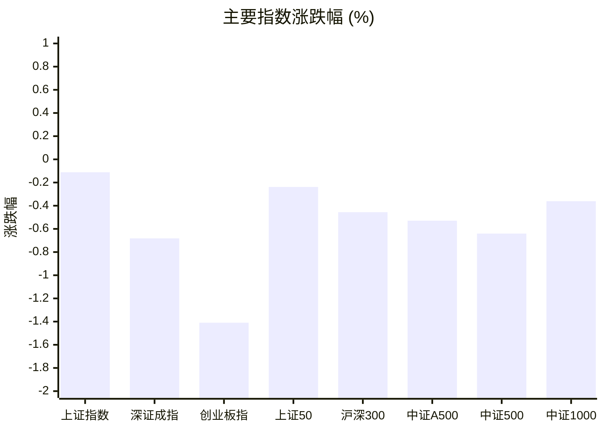
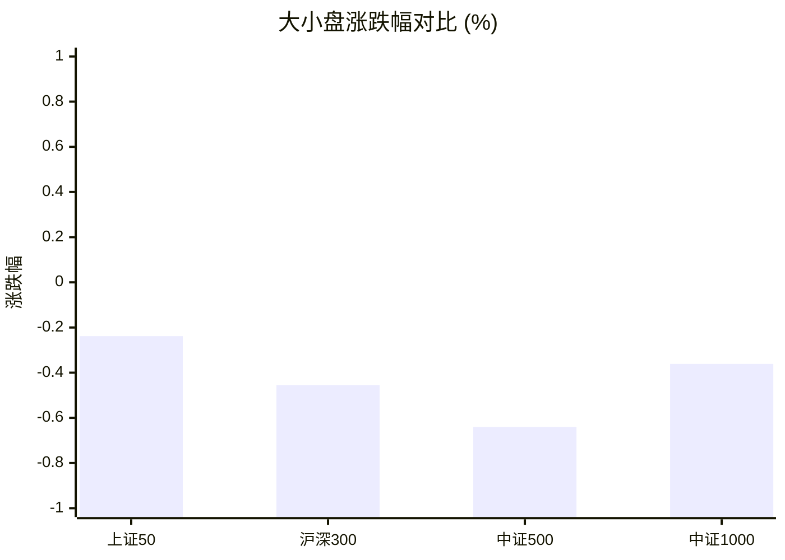
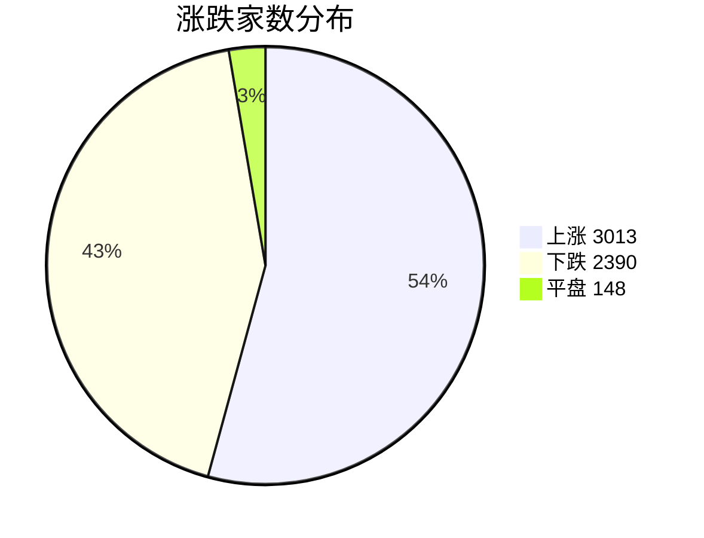
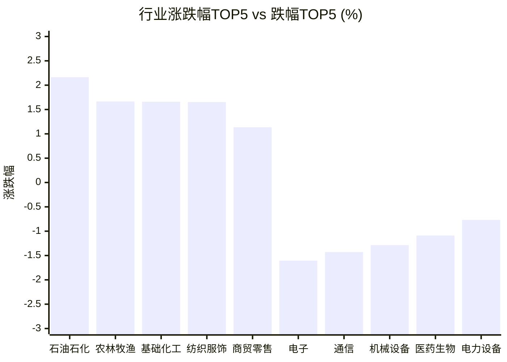

# 📊 A股收盘简报 | 2026-08-28 周五

---

## 📈 一、大盘概况

2026年08月28日 是 A 股交易日，收盘数据已可用。

### 主要指数表现

| 指数 | 收盘价 | 涨跌幅 | 涨跌点 | 成交额(亿) | 前收盘 | 开盘 | 最高 | 最低 |
|------|--------|--------|--------|-----------|--------|------|------|------|
| 上证指数 | 3952.18 | **▼0.11%** | -4.39 | 9703.65亿 | 3956.57 | 3950.24 | 3970.31 | 3947.80 |
| 深证成指 | 13953.07 | **▼0.68%** | -95.81 | 11313.50亿 | 14048.88 | 14019.28 | 14148.68 | 13949.62 |
| 创业板指 | 3424.40 | **▼1.41%** | -48.95 | 5442.55亿 | 3473.35 | 3453.73 | 3521.47 | 3423.07 |
| 上证50 | 2923.33 | **▼0.24%** | -6.98 | 1389.77亿 | 2930.31 | 2920.80 | 2933.47 | 2916.71 |
| 沪深300 | 4609.18 | **▼0.46%** | -21.10 | 5498.13亿 | 4630.28 | 4615.84 | 4643.34 | 4608.46 |
| 中证A500 | 5710.50 | **▼0.53%** | -30.38 | 7591.97亿 | 5740.88 | 5724.84 | 5759.12 | 5709.57 |
| 中证500 | 7895.45 | **▼0.64%** | -50.88 | 3763.04亿 | 7946.33 | 7939.45 | 7986.43 | 7892.51 |
| 中证1000 | 7705.03 | **▼0.36%** | -27.92 | 4657.95亿 | 7732.95 | 7734.19 | 7802.55 | 7702.18 |

### 市场整体成交

- **沪深合计成交额**: **21017.15亿**
- **较前日缩量** 242.12亿（-1.1%）

---

## 📊 二、指数涨跌幅对比

---

## 📊 三、市值结构 — 大小盘对比

| 指数 | 涨跌幅 | 特征 |
|------|--------|------|
| 上证50 | **▼0.24%** | 超大盘 |
| 沪深300 | **▼0.46%** | 大盘 |
| 中证500 | **▼0.64%** | 中盘 |
| 中证1000 | **▼0.36%** | 小盘 |

> 📌 **大小盘涨跌幅接近**，市场风格均衡。

---

## 📉 四、市场广度
### 涨跌家数分布

### 关键统计

| 指标 | 数值 |
|------|------|
| 上涨家数 | 3013 |
| 下跌家数 | 2390 |
| 平盘家数 | 148 |
| 涨停家数 | 83 |
| 跌停家数 | 3 |
| 全市场中位数 | **▲+0.22%** |

---
## 🏢 五、行业表现

### 🔥 涨幅榜 TOP 10

| 排名 | 行业(申万一级) | 涨跌幅 |
|------|---------------|--------|
| 🥇 | 石油石化(申万) | **▲+2.16%** |
| 🥈 | 农林牧渔(申万) | **▲+1.66%** |
| 🥉 | 基础化工(申万) | **▲+1.66%** |
| 4 | 纺织服饰(申万) | **▲+1.65%** |
| 5 | 商贸零售(申万) | **▲+1.14%** |
| 6 | 钢铁(申万) | **▲+0.99%** |
| 7 | 房地产(申万) | **▲+0.84%** |
| 8 | 交通运输(申万) | **▲+0.70%** |
| 9 | 社会服务(申万) | **▲+0.64%** |
| 10 | 有色金属(申万) | **▲+0.62%** |

### ❄️ 跌幅榜 TOP 10

| 排名 | 行业(申万一级) | 涨跌幅 |
|------|---------------|--------|
| 31 | 电子(申万) | **▼1.61%** |
| 30 | 通信(申万) | **▼1.43%** |
| 29 | 机械设备(申万) | **▼1.29%** |
| 28 | 医药生物(申万) | **▼1.09%** |
| 27 | 电力设备(申万) | **▼0.77%** |
| 26 | 综合(申万) | **▼0.45%** |
| 25 | 银行(申万) | **▼0.43%** |
| 24 | 家用电器(申万) | **▼0.32%** |
| 23 | 非银金融(申万) | **▼0.24%** |
| 22 | 环保(申万) | **▼0.19%** |

> 📊 **行业分化明显**，19涨/12跌。 涨幅第一：**石油石化(申万)**（+2.16%）。 跌幅第一：**电子(申万)**（-1.61%）。

---

## 💡 六、热门概念

| 概念 | 涨跌幅 |
|------|--------|
| PEEK材料指数 | **▲+3.90%** |
| 水产指数 | **▲+3.42%** |
| 氟化工指数 | **▲+3.29%** |
| AI办公指数 | **▲+2.78%** |
| 反关税指数 | **▲+2.66%** |
| 一号文件指数 | **▲+2.56%** |
| 智慧农业指数 | **▲+2.55%** |
| 生物育种指数 | **▲+2.47%** |
| 化学原料精选指数 | **▲+2.39%** |
| 黄金珠宝指数 | **▲+2.26%** |

> 📌 今日热门概念集中在 **PEEK材料指数**（+3.90%） 等方向。

---

## 💰 七、资金流向

### 主力资金概况

| 指标 | 数值(亿元) |
|------|------|
| 主力资金净流入 | -131.67 |

### 资金流入行业 TOP5

| 行业 | 净流入(亿元) |
|------|--------|
| 基础化工 | 21.72 |
| 传媒 | 10.88 |
| 计算机 | 9.37 |
| 农林牧渔 | 3.21 |
| 房地产 | 2.10 |

> 🔴 **主力资金大幅净流出**，市场谨慎情绪升温。

---

## 🌍 八、周边市场

| 指数 | 涨跌幅 |
|------|--------|
| 恒生指数 | **▲+0.07%** |
| 日经225 | **▲+0.41%** |

> 📌 全球市场多数上涨，外围情绪偏暖。

---

## 📊 九、期货市场

| 品种 | 涨跌幅 |
|------|--------|
| IH2610 | **▼0.03%** |
| IM2703 | **▲+0.06%** |
| IC2612 | **▼0.18%** |
| IF2609 | **▼0.16%** |
| IC2610 | **▼0.29%** |
| IC2703 | **▼0.12%** |
| IF2612 | **▼0.11%** |
| IM2610 | **▼0.05%** |
| IH2703 | **▼0.14%** |
| IM2609 | **▼0.03%** |

---

## 📰 十、财经要闻

- A股收盘综述：市场冲高回落，创业板指跌1.41%
- A股资金流向2026年8月28日星期五
- A股每日行情复盘（8月28日）
- 陆家嘴财经早餐2026年8月28日星期五
- ETF收评|A股冲高回落，半导体产业链低迷，科创半导体ETF跌3%

---

## 🤖 十一、盘面结论

> 分析来源：AI Agent

**一句话定性：指数偏弱、个股偏暖，属于结构性分化行情。**

- 证据：上证指数跌 0.11%，深证成指跌 0.68%，创业板指跌 1.41%，八个主要指数全部收跌。
- 证据：沪深合计成交额 21017.15 亿元，较前日缩量 1.1%；上涨 3013 家、下跌 2390 家，市场中位数上涨 0.22%，显示指数压力与个股广度并不同步。
- 证据：行业表现为 19 涨 12 跌，石油石化上涨 2.16%，电子下跌 1.61%；主力资金净流出 131.67 亿元，风险偏好仍受抑制。

---

## 🎯 十二、主线轮动

1. **资源与化工方向｜发酵但需确认**
   - 盘面证据：石油石化行业上涨 2.16%，基础化工上涨 1.66%；氟化工概念上涨 3.29%、PEEK 材料上涨 3.90%，且基础化工获行业资金净流入 21.72 亿元，方向获得行业、概念与资金数据的同向支持。
   - 催化验证：结构化数据已验证日内强势；财经要闻未提供可核验的具体政策或供需事实，消息面仅作候选解释。
   - 确认条件：下一交易日资源、基础化工及相关概念继续位居行业或概念涨幅前列，且行业资金流入保持正值。
   - 失效条件：相关行业转为跌幅靠前，或资金流向转为净流出。

2. **电子、通信与成长科技｜分化偏弱**
   - 盘面证据：电子、通信、机械设备分别下跌 1.61%、1.43%、1.29%，创业板指下跌 1.41%；但计算机行业仍有 9.37 亿元资金净流入，说明成长内部并非单边退潮。
   - 催化验证：AI 办公概念上涨 2.78%，但电子与通信行业下跌，板块内部信号不一致，暂未形成统一主线。
   - 确认条件：电子、通信跌幅收窄并出现行业涨幅改善，同时相关概念维持强势。
   - 失效条件：电子、通信继续位居行业跌幅前列，且成长相关概念同步转弱。

---

## 🔍 十三、明日关注

1. **观察对象：指数与成交量。** 确认信号：主要指数跌幅收窄或转涨，且沪深合计成交额较前日回升；失效信号：指数继续普遍收跌并伴随成交额进一步缩量。
2. **观察对象：资源化工主线。** 确认信号：石油石化、基础化工及氟化工/PEEK 材料等方向继续出现在行业或概念涨幅前列，且相关行业资金净流入；失效信号：上述方向转为行业或概念跌幅靠前，或资金净流入消失。
3. **观察对象：成长科技内部强弱。** 确认信号：电子、通信跌幅收窄，同时计算机或 AI 办公等相关概念维持上涨；失效信号：电子、通信继续领跌且成长概念同步转弱。

---

## 📌 数据来源与免责声明

- **数据来源**：万得 Wind 金融数据服务
- **数据日期**：2026-08-28 收盘
- **生成时间**：2026年08月28日
- **免责声明**：本简报基于 Wind 数据自动生成，AI 分析部分（如有）仅供参考，不构成任何投资建议。市场有风险，投资需谨慎。
