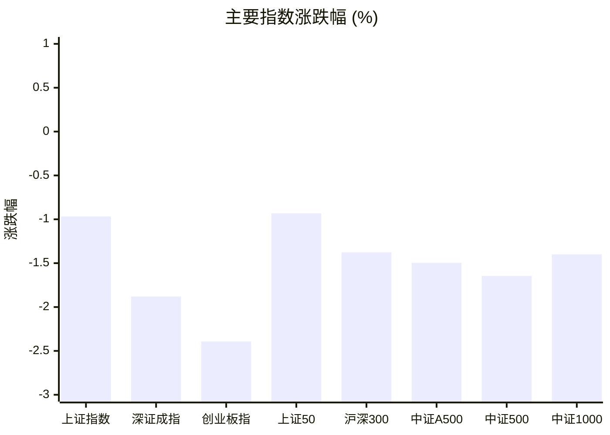
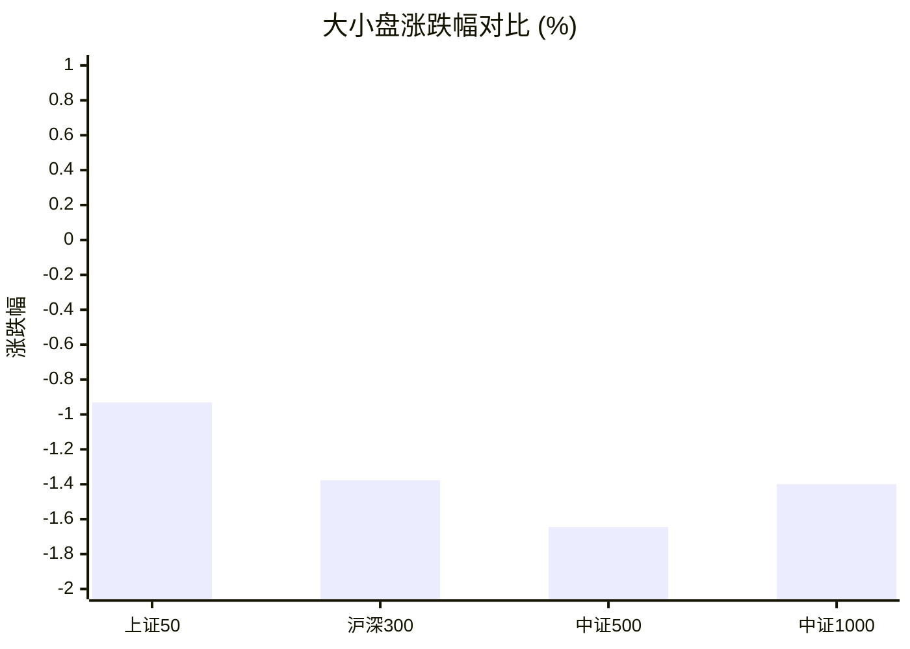
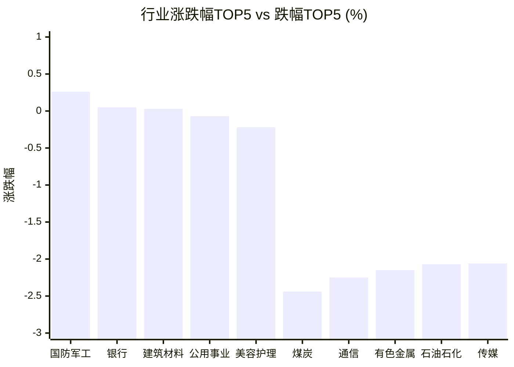

# 📊 A股收盘简报 | 2026-09-02 周三

---

## ✅ 数据完整性

✅ **报告数据完整：主要指数、市场广度、行业表现和资金流向均已提供。**

| 数据域 | 状态 | 级别 |
|--------|------|------|
| 市场广度 | 完整 | 重要 |

---

## 📈 一、大盘概况

2026年09月02日 是 A 股交易日，收盘数据已可用。

### 主要指数表现

| 指数 | 收盘价 | 涨跌幅 | 涨跌点 | 成交额(亿) | 前收盘 | 开盘 | 最高 | 最低 |
|------|--------|--------|--------|-----------|--------|------|------|------|
| 上证指数 | 3941.39 | **▼0.97%** | -38.50 | 8353.68亿 | 3979.89 | 3963.07 | 3965.81 | 3932.25 |
| 深证成指 | 13611.55 | **▼1.88%** | -260.83 | 9558.11亿 | 13872.38 | 13732.18 | 13732.18 | 13549.77 |
| 创业板指 | 3312.24 | **▼2.39%** | -81.19 | 4387.00亿 | 3393.43 | 3347.68 | 3348.69 | 3296.47 |
| 上证50 | 2914.44 | **▼0.93%** | -27.38 | 1244.94亿 | 2941.82 | 2927.81 | 2930.99 | 2905.77 |
| 沪深300 | 4547.96 | **▼1.38%** | -63.48 | 4746.80亿 | 4611.44 | 4581.51 | 4583.27 | 4534.39 |
| 中证A500 | 5613.89 | **▼1.50%** | -85.26 | 6313.31亿 | 5699.15 | 5653.85 | 5655.91 | 5590.01 |
| 中证500 | 7729.23 | **▼1.65%** | -129.29 | 3073.40亿 | 7858.52 | 7781.29 | 7783.05 | 7692.15 |
| 中证1000 | 7583.76 | **▼1.40%** | -107.61 | 3687.44亿 | 7691.37 | 7616.23 | 7624.71 | 7539.08 |

### 市场整体成交

- **沪深合计成交额**: **17911.78亿**
- **较前日缩量** 2422.24亿（-11.9%）

---

## 📊 二、指数涨跌幅对比

---

## 📊 三、市值结构 — 大小盘对比

| 指数 | 涨跌幅 | 特征 |
|------|--------|------|
| 上证50 | **▼0.93%** | 超大盘 |
| 沪深300 | **▼1.38%** | 大盘 |
| 中证500 | **▼1.65%** | 中盘 |
| 中证1000 | **▼1.40%** | 小盘 |

> 📌 **大盘蓝筹占优**，上证50领涨，市场偏好核心资产。

---

## 📉 四、市场广度

| 指标 | 数值 |
|------|------|
| 上涨家数 | 1541 |
| 下跌家数 | 3901 |
| 平盘家数 | 112 |
| 涨停家数 | 55 |
| 跌停家数 | 9 |
| 涨跌幅中位数 | **▼-0.94%** |

> 📉 市场广度偏弱，下跌家数明显多于上涨家数；涨跌幅中位数为 **-0.94%**。

---

## 🏢 五、行业表现

### 🔥 涨幅榜 TOP 10

| 排名 | 行业(申万一级) | 涨跌幅 |
|------|---------------|--------|
| 🥇 | 国防军工(申万) | **▲+0.26%** |
| 🥈 | 银行(申万) | **▲+0.05%** |
| 🥉 | 建筑材料(申万) | **▲+0.03%** |
| 4 | 公用事业(申万) | **▼0.07%** |
| 5 | 美容护理(申万) | **▼0.22%** |
| 6 | 纺织服饰(申万) | **▼0.37%** |
| 7 | 社会服务(申万) | **▼0.39%** |
| 8 | 家用电器(申万) | **▼0.66%** |
| 9 | 食品饮料(申万) | **▼0.71%** |
| 10 | 环保(申万) | **▼0.86%** |

### ❄️ 跌幅榜 TOP 10

| 排名 | 行业(申万一级) | 涨跌幅 |
|------|---------------|--------|
| 31 | 煤炭(申万) | **▼2.44%** |
| 30 | 通信(申万) | **▼2.25%** |
| 29 | 有色金属(申万) | **▼2.15%** |
| 28 | 石油石化(申万) | **▼2.07%** |
| 27 | 传媒(申万) | **▼2.06%** |
| 26 | 农林牧渔(申万) | **▼2.01%** |
| 25 | 电力设备(申万) | **▼1.90%** |
| 24 | 非银金融(申万) | **▼1.80%** |
| 23 | 基础化工(申万) | **▼1.74%** |
| 22 | 综合(申万) | **▼1.70%** |

> 📉 **行业普跌**，多数板块调整。 涨幅第一：**国防军工(申万)**（+0.26%）。 跌幅第一：**煤炭(申万)**（-2.44%）。

---

## 💡 六、热门概念

| 概念 | 涨跌幅 |
|------|--------|
| 玻璃纤维指数 | **▲+2.22%** |
| 近端次新股指数 | **▲+2.19%** |
| 超硬材料指数 | **▲+1.32%** |
| 次新股指数 | **▲+1.29%** |
| 培育钻石指数 | **▲+1.23%** |
| 饲料精选指数 | **▲+1.15%** |
| 军民融合指数 | **▲+1.00%** |
| 航母指数 | **▲+0.95%** |
| 十大军工集团指数 | **▲+0.89%** |
| 中航系指数 | **▲+0.83%** |

> 📌 今日热门概念集中在 **玻璃纤维指数**（+2.22%） 等方向。

---

## 💰 七、资金流向

### 主力资金概况

| 指标 | 数值(亿元) |
|------|------|
| 主力资金净流入 | -201.30 |

### 资金流入行业 TOP5

| 行业 | 净流入(亿元) |
|------|--------|
| 国防军工 | 23.60 |
| 汽车 | 17.88 |
| 建筑材料 | 16.74 |
| 电力设备 | 8.43 |
| 银行 | 5.19 |

> 🔴 **主力资金大幅净流出**，市场谨慎情绪升温。

---

## 🌍 八、周边市场

| 指数 | 涨跌幅 |
|------|--------|
| 恒生指数 | **▼0.07%** |
| 标普500 | **▼0.71%** |
| 道琼斯工业平均 | **▼0.79%** |
| 纳斯达克指数 | **▼1.03%** |
| 日经225 | **▼2.85%** |

> 📌 全球市场多数下跌，外围情绪偏弱。

---

## 📊 九、期货市场

| 品种 | 涨跌幅 |
|------|--------|
| IC2609 | **▼1.61%** |
| IC2610 | **▼1.67%** |
| IC2612 | **▼1.72%** |
| IC2703 | **▼1.80%** |
| IF2609 | **▼1.36%** |
| IF2610 | **▼1.40%** |
| IF2612 | **▼1.45%** |
| IF2703 | **▼1.49%** |
| IH2609 | **▼1.03%** |
| IH2610 | **▼1.01%** |

---

## 📰 十、财经要闻

- A股资金流向2026年9月2日星期三
- A股低开，超4300股下跌
- 陆家嘴财经早餐2026年9月2日星期三
- A股每日行情复盘（9月2日）
- 【浙商私享家||收盘】A股缩量普跌

---

## 🤖 十一、盘面结论

> 分析来源：AI Agent

**一句话定性：普跌背景下的局部结构性行情，防守与少数题材相对抗跌。**

**证据：**

- 八项主要指数全线下跌，跌幅介于 **-0.93% 至 -2.39%**，创业板指跌幅最大；沪深合计成交额 **17911.78亿**，较前日缩量 **11.9%**。
- 市场广度显示上涨 **1541** 家、下跌 **3901** 家，涨跌幅中位数 **-0.94%**；涨停 **55** 家、跌停 **9** 家，整体风险偏好偏弱。
- 行业仅国防军工（**+0.26%**）、银行（**+0.05%**）和建筑材料（**+0.03%**）收涨，煤炭（**-2.44%**）领跌；主力资金净流入为 **-201.30亿元**。

---

## 🎯 十二、主线轮动

> 分析来源：AI Agent

### 1. 国防军工：发酵，盘面已验证

- **盘面证据**：国防军工行业涨幅第一（**+0.26%**）；军民融合（**+1.00%**）、航母（**+0.95%**）、十大军工集团（**+0.89%**）和中航系（**+0.83%**）进入热门概念，资金流入行业排名第一（**+23.60亿元**）。
- **催化验证**：报告财经要闻未提供可核验的具体军工政策或事件，催化因素暂未验证。
- **确认条件**：下一交易日国防军工行业继续位居涨幅靠前，相关军工概念保持正收益，且行业资金流入不转为流出。
- **失效条件**：行业涨幅转负、军工概念同步走弱，或行业资金流向转为净流出。

### 2. 建筑材料/玻璃纤维：待确认

- **盘面证据**：建筑材料行业上涨 **+0.03%**，资金流入 **+16.74亿元**；玻璃纤维概念上涨 **+2.22%**，为热门概念第一。
- **催化验证**：报告财经要闻未提供可核验的行业催化，催化因素暂未验证。
- **确认条件**：建筑材料行业继续维持强于行业整体的表现，玻璃纤维概念保持正收益，且行业资金流向继续为净流入。
- **失效条件**：行业与玻璃纤维概念同步转弱，或行业资金流向转为净流出。

---

## 🔍 十三、明日关注

> 分析来源：AI Agent

1. **观察对象：市场广度。** 确认信号：上涨家数回升、下跌家数减少且涨跌幅中位数改善；失效信号：下跌家数继续占优且中位数进一步走弱。
2. **观察对象：国防军工主线。** 确认信号：国防军工行业和军工概念继续位居涨幅靠前，行业资金保持净流入；失效信号：行业及相关概念同步转负或资金转为净流出。
3. **观察对象：指数与成交。** 确认信号：主要指数跌幅收窄并伴随成交额回升；失效信号：主要指数继续普跌且成交额继续缩量。

---

## 📌 数据来源与免责声明

- **数据来源**：万得 Wind 金融数据服务
- **数据日期**：2026-09-02 收盘
- **生成时间**：2026年09月02日
- **免责声明**：本简报基于 Wind 数据自动生成，AI 分析部分（如有）仅供参考，不构成任何投资建议。市场有风险，投资需谨慎。
