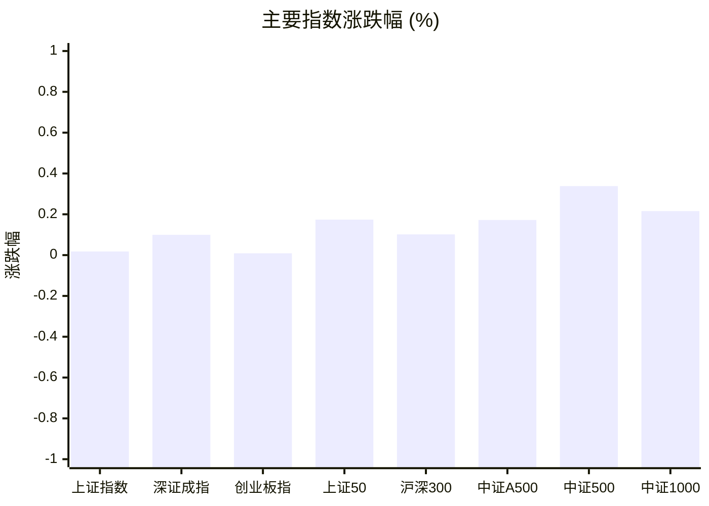
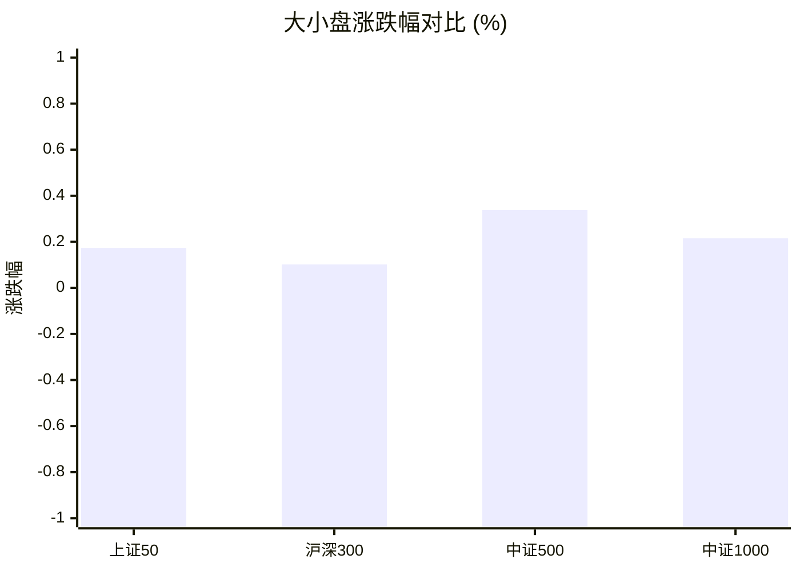
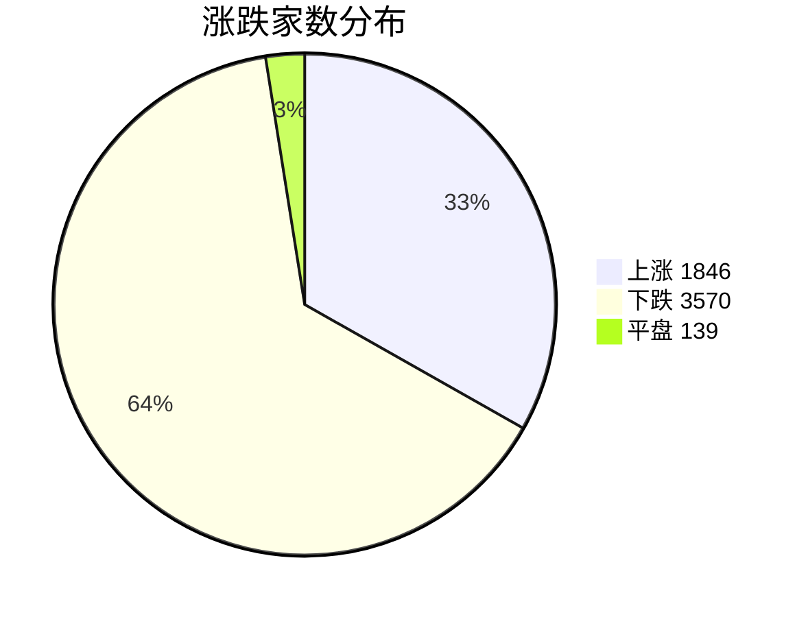
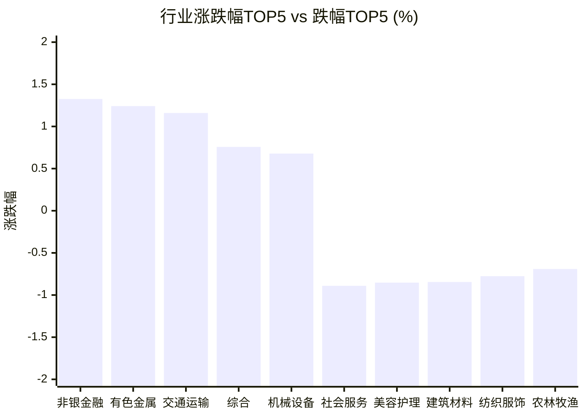

# 📊 A股收盘简报 | 2026-09-03 周四

---

## 📋 数据完整性

✅ **报告数据完整：主要指数、市场广度、行业表现和资金流向均已提供。**

---

## 📈 一、大盘概况

2026年09月03日 是 A 股交易日，收盘数据已可用。

### 主要指数表现

| 指数 | 收盘价 | 涨跌幅 | 涨跌点 | 成交额(亿) | 前收盘 | 开盘 | 最高 | 最低 |
|------|--------|--------|--------|-----------|--------|------|------|------|
| 上证指数 | 3942.09 | **▲+0.02%** | +0.70 | 8198.82亿 | 3941.39 | 3952.79 | 3968.11 | 3930.45 |
| 深证成指 | 13625.12 | **▲+0.10%** | +13.57 | 9390.34亿 | 13611.55 | 13711.07 | 13742.89 | 13531.53 |
| 创业板指 | 3312.54 | **▲+0.01%** | +0.30 | 4306.78亿 | 3312.24 | 3342.09 | 3356.25 | 3285.06 |
| 上证50 | 2919.50 | **▲+0.17%** | +5.06 | 1184.29亿 | 2914.44 | 2924.37 | 2938.36 | 2910.93 |
| 沪深300 | 4552.58 | **▲+0.10%** | +4.62 | 4399.41亿 | 4547.96 | 4570.91 | 4585.99 | 4536.92 |
| 中证A500 | 5623.55 | **▲+0.17%** | +9.66 | 5841.13亿 | 5613.89 | 5646.03 | 5658.11 | 5594.84 |
| 中证500 | 7755.36 | **▲+0.34%** | +26.13 | 2994.26亿 | 7729.23 | 7776.82 | 7799.63 | 7686.44 |
| 中证1000 | 7600.10 | **▲+0.22%** | +16.34 | 3776.38亿 | 7583.76 | 7629.65 | 7657.75 | 7531.67 |

### 市场整体成交

- **沪深合计成交额**: **17589.16亿**
- **较前日缩量** 322.62亿（-1.8%）

---

## 📊 二、指数涨跌幅对比

---

## 📊 三、市值结构 — 大小盘对比

| 指数 | 涨跌幅 | 特征 |
|------|--------|------|
| 上证50 | **▲+0.17%** | 超大盘 |
| 沪深300 | **▲+0.10%** | 大盘 |
| 中证500 | **▲+0.34%** | 中盘 |
| 中证1000 | **▲+0.22%** | 小盘 |

> 📌 **大小盘涨跌幅接近**，市场风格均衡。

---

## 📉 四、市场广度
### 涨跌家数分布

### 关键统计

| 指标 | 数值 |
|------|------|
| 上涨家数 | 1846 |
| 下跌家数 | 3570 |
| 平盘家数 | 139 |
| 涨停家数 | 46 |
| 跌停家数 | 17 |
| 全市场中位数 | **▼0.68%** |

---
## 🏢 五、行业表现

### 🔥 涨幅榜 TOP 10

| 排名 | 行业(申万一级) | 涨跌幅 |
|------|---------------|--------|
| 🥇 | 非银金融(申万) | **▲+1.33%** |
| 🥈 | 有色金属(申万) | **▲+1.24%** |
| 🥉 | 交通运输(申万) | **▲+1.16%** |
| 4 | 综合(申万) | **▲+0.76%** |
| 5 | 机械设备(申万) | **▲+0.68%** |
| 6 | 电力设备(申万) | **▲+0.61%** |
| 7 | 家用电器(申万) | **▲+0.60%** |
| 8 | 汽车(申万) | **▲+0.45%** |
| 9 | 石油石化(申万) | **▲+0.39%** |
| 10 | 房地产(申万) | **▲+0.29%** |

### ❄️ 跌幅榜 TOP 10

| 排名 | 行业(申万一级) | 涨跌幅 |
|------|---------------|--------|
| 31 | 社会服务(申万) | **▼0.89%** |
| 30 | 美容护理(申万) | **▼0.85%** |
| 29 | 建筑材料(申万) | **▼0.85%** |
| 28 | 纺织服饰(申万) | **▼0.78%** |
| 27 | 农林牧渔(申万) | **▼0.69%** |
| 26 | 通信(申万) | **▼0.68%** |
| 25 | 银行(申万) | **▼0.55%** |
| 24 | 计算机(申万) | **▼0.46%** |
| 23 | 传媒(申万) | **▼0.33%** |
| 22 | 钢铁(申万) | **▼0.26%** |

> 📊 **行业分化明显**，12涨/19跌。 涨幅第一：**非银金融(申万)**（+1.33%）。 跌幅第一：**社会服务(申万)**（-0.89%）。

---

## 💡 六、热门概念

| 概念 | 涨跌幅 |
|------|--------|
| 培育钻石指数 | **▲+6.31%** |
| 超硬材料指数 | **▲+3.88%** |
| 航运精选指数 | **▲+3.52%** |
| 液冷服务器指数 | **▲+2.98%** |
| 保险精选指数 | **▲+2.56%** |
| 锗镓锑墨指数 | **▲+2.12%** |
| 离境退税指数 | **▲+1.68%** |
| 工业金属精选指数 | **▲+1.66%** |
| SST(固态变压器)指数 | **▲+1.59%** |
| 房地产精选指数 | **▲+1.45%** |

> 📌 今日热门概念集中在 **培育钻石指数**（+6.31%） 等方向。

---

## 💰 七、资金流向

### 主力资金概况

| 指标 | 数值(亿元) |
|------|------|
| 主力资金净流入 | -59.45 |

### 资金流入行业 TOP5

| 行业 | 净流入(亿元) |
|------|--------|
| 电力设备 | 16.30 |
| 机械设备 | 16.24 |
| 轻工制造 | 8.09 |
| 交通运输 | 6.73 |
| 有色金属 | 5.14 |

> 🔴 **主力资金小幅净流出**，但流入主要集中在电力设备、机械设备等方向。

---

## 🌍 八、周边市场

| 指数 | 涨跌幅 |
|------|--------|
| 恒生指数 | **▼0.39%** |
| 日经225 | **▼0.17%** |

> 📌 全球市场多数下跌，外围情绪偏弱。

---

## 📊 九、期货市场

| 品种 | 涨跌幅 |
|------|--------|
| IH2610 | **▲+0.24%** |
| IM2703 | **▲+0.16%** |
| IC2612 | **▲+0.33%** |
| IF2609 | **▲+0.14%** |
| IC2610 | **▲+0.37%** |
| IC2703 | **▲+0.31%** |
| IF2612 | **▲+0.13%** |
| IM2610 | **▲+0.16%** |
| IH2703 | **▲+0.02%** |
| IM2609 | **▲+0.18%** |

---

## 📰 十、财经要闻

- 【A股收盘快报】A股三大指数震荡整理 成交额不足1.8万亿元 培育钻石概念股大涨
- A股收评：市场全天冲高回落 沪深两市成交额1.76万亿 高位人气股集体调整
- 三大指数微涨，超3500股下跌；液冷服务器、航运、机器人、培育钻石板块走强，农业股下跌 | A股收盘
- 陆家嘴财经早餐2026年9月3日星期四
- A股每日行情复盘（9月3日）

---

## 🤖 十一、盘面结论

> 分析来源：AI Agent

**一句话定性：指数弱修复、个股偏弱，资金局部承接的结构性分化行情。**

- **证据**：主要指数全部小幅收涨，涨幅区间为 +0.01% 至 +0.34%，其中中证500相对占优（+0.34%）。
- **证据**：全市场中位数下跌 0.68%，下跌家数 3570 家、上涨家数 1846 家，涨停 46 家而跌停 17 家，指数上涨没有形成普遍扩散。
- **证据**：沪深合计成交额 17589.16 亿元，较前日缩量 1.8%；行业 12 个上涨、19 个下跌，强弱分化延续。
- **证据**：主力资金净流出 59.45 亿元，但电力设备、机械设备分别净流入 16.30 亿元和 16.24 亿元，资金表现为局部集中而非全面回流。

上述为报告中结构化数据的事实；“弱修复、结构性分化、局部承接”是基于这些事实的判断。

---

## 🎯 十二、主线轮动

1. **设备制造与有色材料｜发酵后分化（待确认）**
   - **盘面证据**：有色金属行业上涨 +1.24%，培育钻石概念上涨 +6.31%，超硬材料 +3.88%，锗镓锑墨 +2.12%，工业金属精选 +1.66%；资金流向中电力设备净流入 16.30 亿元、机械设备净流入 16.24 亿元、有色金属净流入 5.14 亿元。
   - **催化验证**：新闻标题提到培育钻石概念走强，但未提供可核验的具体事件；只能作为候选解释，不能视为已确认催化。
   - **确认条件**：下一交易日相关行业/概念继续位居涨幅前列，且电力设备、机械设备或有色金属保持资金流入前列。
   - **失效条件**：相关行业或概念同步转弱，且资金流入排名明显回落或转为净流出。

2. **非银金融/保险｜发酵（待确认）**
   - **盘面证据**：非银金融行业上涨 +1.33% 居行业首位，保险精选概念上涨 +2.56%；但银行行业下跌 0.55%，金融内部存在分化。
   - **催化验证**：财经要闻未给出可验证的金融行业具体催化，当前仅有板块价格表现支持，未达到催化“盘面已验证”标准。
   - **确认条件**：非银金融和保险精选继续保持行业/概念涨幅前列，并出现更广泛的金融行业同步走强；同时非银金融资金流向不再明显落后。
   - **失效条件**：非银金融转跌或保险精选明显回落，且金融内部强弱分化扩大、资金流向继续偏弱。

---

## 🔍 十三、明日关注

1. **观察对象：市场广度与指数背离。** 确认信号：上涨家数增加、全市场中位数由负转强，同时主要指数继续维持正收益；失效信号：指数仍微涨但下跌家数和中位数继续恶化。
2. **观察对象：设备制造与有色材料的量价资金共振。** 确认信号：相关行业/概念继续位居涨幅前列，且资金流入行业中仍有设备或有色方向；失效信号：板块转弱并伴随资金流入排名明显回落。
3. **观察对象：非银金融与保险的扩散。** 确认信号：非银金融、保险精选继续走强且金融内部上涨范围扩大，资金流向不再明显偏弱；失效信号：非银金融或保险精选回落、银行等金融子行业弱势扩大。

---

## 📌 数据来源与免责声明

- **数据来源**：万得 Wind 金融数据服务
- **数据日期**：2026-09-03 收盘
- **生成时间**：2026年09月04日
- **免责声明**：本简报基于 Wind 数据自动生成，AI 分析部分（如有）仅供参考，不构成任何投资建议。市场有风险，投资需谨慎。
