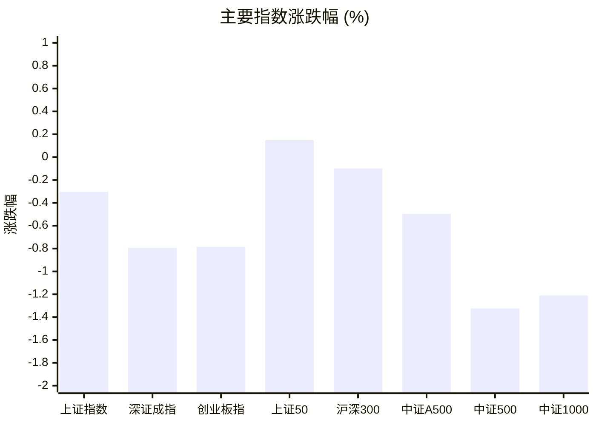
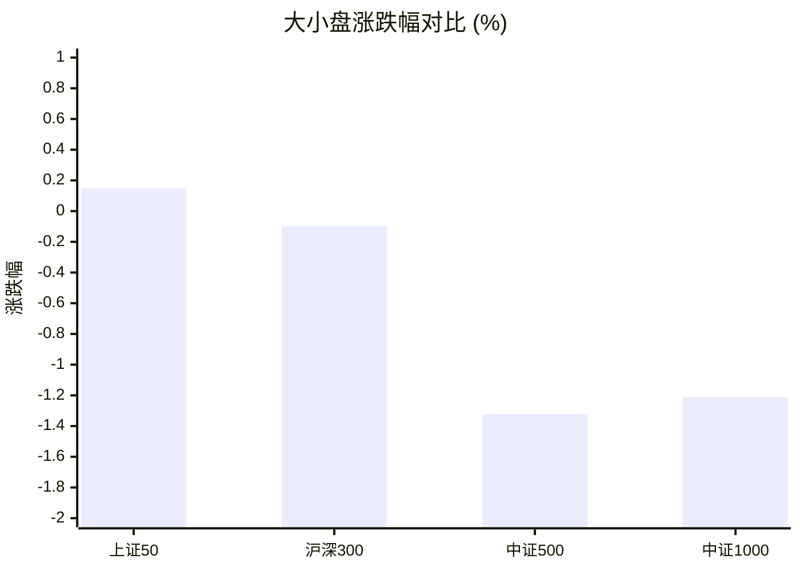
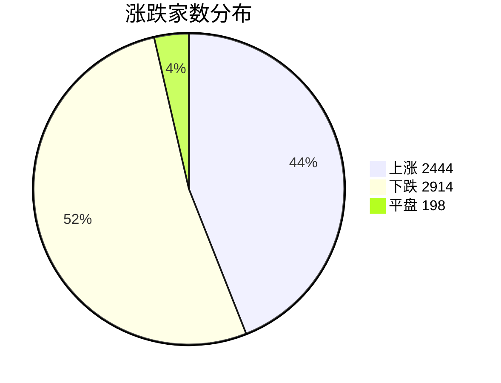
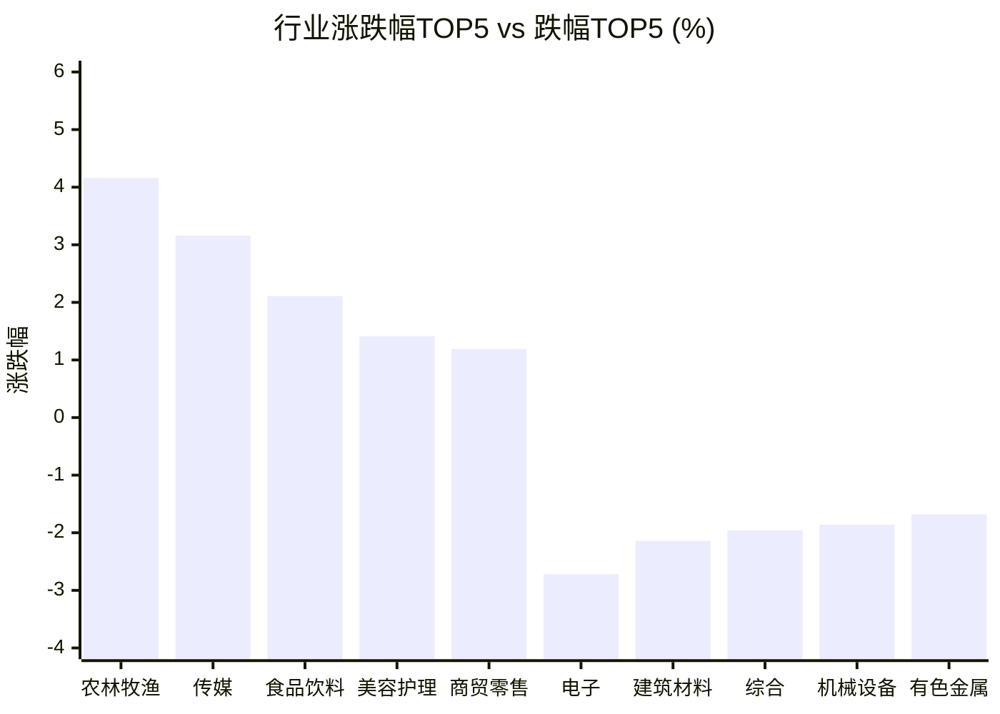

# 📊 A股收盘简报 | 2026-09-04 周五

---

## ⚠️ 数据完整性

⚠️ **报告不完整：重要数据缺失，未提供基于缺失数据的行情结论。**

| 数据域 | 状态 | 级别 |
|--------|------|------|
| 资金流向 | 解析失败（资金流候选行均无法解析） | 重要 |

---

## 📈 一、大盘概况

2026年09月04日 是 A 股交易日，收盘数据已可用。

### 主要指数表现

| 指数 | 收盘价 | 涨跌幅 | 涨跌点 | 成交额(亿) | 前收盘 | 开盘 | 最高 | 最低 |
|------|--------|--------|--------|-----------|--------|------|------|------|
| 上证指数 | 3930.12 | **▼0.30%** | -11.97 | 9382.55亿 | 3942.09 | 3955.55 | 3980.20 | 3915.22 |
| 深证成指 | 13516.97 | **▼0.79%** | -108.15 | 10924.13亿 | 13625.12 | 13725.65 | 13798.36 | 13448.79 |
| 创业板指 | 3286.55 | **▼0.78%** | -25.99 | 4998.09亿 | 3312.54 | 3344.62 | 3370.47 | 3266.80 |
| 上证50 | 2923.81 | **▲+0.15%** | +4.31 | 1403.95亿 | 2919.50 | 2929.15 | 2956.55 | 2914.01 |
| 沪深300 | 4548.05 | **▼0.10%** | -4.53 | 5175.09亿 | 4552.58 | 4575.32 | 4602.20 | 4530.76 |
| 中证A500 | 5595.61 | **▼0.50%** | -27.94 | 6952.34亿 | 5623.55 | 5655.67 | 5683.84 | 5571.57 |
| 中证500 | 7652.69 | **▼1.32%** | -102.67 | 3564.90亿 | 7755.36 | 7806.61 | 7850.40 | 7610.58 |
| 中证1000 | 7508.09 | **▼1.21%** | -92.01 | 4453.49亿 | 7600.10 | 7655.97 | 7717.93 | 7464.98 |

### 市场整体成交

- **沪深合计成交额**: **20306.68亿**
- **较前日放量** 2717.52亿（+15.4%）

---

## 📊 二、指数涨跌幅对比

---

## 📊 三、市值结构 — 大小盘对比

| 指数 | 涨跌幅 | 特征 |
|------|--------|------|
| 上证50 | **▲+0.15%** | 超大盘 |
| 沪深300 | **▼0.10%** | 大盘 |
| 中证500 | **▼1.32%** | 中盘 |
| 中证1000 | **▼1.21%** | 小盘 |

> 📌 **大盘蓝筹占优**，上证50领涨，市场偏好核心资产。

---

## 📉 四、市场广度
### 涨跌家数分布

### 关键统计

| 指标 | 数值 |
|------|------|
| 上涨家数 | 2444 |
| 下跌家数 | 2914 |
| 平盘家数 | 198 |
| 涨停家数 | 42 |
| 跌停家数 | 9 |
| 全市场中位数 | **▼0.17%** |

---
## 🏢 五、行业表现

### 🔥 涨幅榜 TOP 10

| 排名 | 行业(申万一级) | 涨跌幅 |
|------|---------------|--------|
| 🥇 | 农林牧渔(申万) | **▲+4.16%** |
| 🥈 | 传媒(申万) | **▲+3.16%** |
| 🥉 | 食品饮料(申万) | **▲+2.11%** |
| 4 | 美容护理(申万) | **▲+1.41%** |
| 5 | 商贸零售(申万) | **▲+1.19%** |
| 6 | 房地产(申万) | **▲+1.15%** |
| 7 | 国防军工(申万) | **▲+1.08%** |
| 8 | 银行(申万) | **▲+0.87%** |
| 9 | 社会服务(申万) | **▲+0.82%** |
| 10 | 非银金融(申万) | **▲+0.56%** |

### ❄️ 跌幅榜 TOP 10

| 排名 | 行业(申万一级) | 涨跌幅 |
|------|---------------|--------|
| 31 | 电子(申万) | **▼2.72%** |
| 30 | 建筑材料(申万) | **▼2.14%** |
| 29 | 综合(申万) | **▼1.96%** |
| 28 | 机械设备(申万) | **▼1.86%** |
| 27 | 有色金属(申万) | **▼1.68%** |
| 26 | 通信(申万) | **▼1.07%** |
| 25 | 基础化工(申万) | **▼0.90%** |
| 24 | 环保(申万) | **▼0.78%** |
| 23 | 汽车(申万) | **▼0.56%** |
| 22 | 电力设备(申万) | **▼0.53%** |

> 📊 **行业分化明显**，15涨/16跌。 涨幅第一：**农林牧渔(申万)**（+4.16%）。 跌幅第一：**电子(申万)**（-2.72%）。

---

## 💡 六、热门概念

| 概念 | 涨跌幅 |
|------|--------|
| 猪产业指数 | **▲+6.03%** |
| 鸡产业指数 | **▲+4.71%** |
| 稳定币指数 | **▲+4.67%** |
| 生物育种指数 | **▲+4.65%** |
| 两岸融合指数 | **▲+4.37%** |
| 饲料精选指数 | **▲+3.70%** |
| 反关税指数 | **▲+3.59%** |
| 水产指数 | **▲+3.39%** |
| 预制菜等权指数 | **▲+2.99%** |
| 加密货币指数 | **▲+2.98%** |

> 📌 今日热门概念集中在 **猪产业指数**（+6.03%） 等方向。

---

## 💰 七、资金流向

> ⚠️ 数据状态：解析失败（资金流候选行均无法解析）。本节不展示默认值，也不据此生成行情结论。

---

## 🌍 八、周边市场

| 指数 | 涨跌幅 |
|------|--------|
| 恒生指数 | **▲+1.78%** |
| 纳斯达克指数 | **▲+1.40%** |
| 日经225 | **▲+1.26%** |
| 道琼斯工业平均 | **▲+1.18%** |
| 标普500 | **▲+1.06%** |

> 📌 全球市场多数上涨，外围情绪偏暖。

---

## 📊 九、期货市场

| 品种 | 涨跌幅 |
|------|--------|
| IH2610 | **▲+0.28%** |
| IH2609 | **▲+0.27%** |
| IH2612 | **▲+0.24%** |
| IH2703 | **▲+0.19%** |
| IF2703 | **▼0.04%** |
| IF2610 | **▼0.06%** |
| IF2609 | **▼0.08%** |
| IF2612 | **▼0.09%** |
| IC2703 | **▼1.34%** |
| IC2610 | **▼1.36%** |

---

## 📰 十、财经要闻

- A股高开，超4000股上涨
- 陆家嘴财经早餐2026年9月4日星期五
- A股三大指数早盘冲高回落，创业板指涨0.43%，全市场超4100只个股上涨
- 沪指半日涨0.35%，全市场超4100只个股上涨
- A股早报2026年9月4日星期五

---

## 🤖 十一、盘面结论

> 分析来源：AI Agent
> 分析范围：未使用资金流向数据。

**一句话定性：市场呈现放量下的结构性回调，大盘蓝筹相对抗跌，农业与部分消费服务方向逆势活跃。**

- **证据：**上证指数跌 0.30%，深证成指和创业板指分别跌 0.79% 与 0.78%，中证500和中证1000分别跌 1.32% 与 1.21%；上证50则涨 0.15%，大小盘表现明显分化。
- **证据：**全市场上涨 2444 家、下跌 2914 家，中位数跌 0.17%，但涨停 42 家、跌停 9 家，显示整体偏弱中仍有局部进攻空间。
- **证据：**沪深成交额 20306.68 亿元，较前日增加 2717.52 亿元；农林牧渔涨 4.16%、传媒涨 3.16%，电子跌 2.72%，行业分化较大。

上述定性仅依据指数、广度、行业和概念表现，不涉及资金流向判断。

---

## 🎯 十二、主线轮动

### 1. 农业养殖链：发酵

- **盘面证据：**农林牧渔位列申万一级行业第一，涨幅 4.16%；猪产业、鸡产业、生物育种、饲料精选和水产等概念均进入涨幅前列。
- **催化验证：**报告未提供与该方向一致的可验证新闻或政策细节，因此催化因素暂列为未验证。
- **确认条件：**下一交易日行业表现中农林牧渔继续位居涨幅前列，且猪产业、鸡产业等相关概念保持活跃。
- **失效条件：**下一交易日农林牧渔转入行业跌幅前列，或相关概念整体明显弱于市场广度。

### 2. 消费服务方向：待确认

- **盘面证据：**食品饮料涨 2.11%，美容护理涨 1.41%，商贸零售涨 1.19%，社会服务涨 0.82%，多个相关行业同日收涨。
- **催化验证：**报告中的财经要闻未提供可与上述行业表现相互印证的结构化证据，暂不将新闻解释为上涨原因。
- **确认条件：**下一交易日食品饮料、美容护理、商贸零售和社会服务中仍有多项位居行业涨幅前列。
- **失效条件：**下一交易日这些行业多数转入下跌，且市场广度同步走弱。

---

## 🔍 十三、明日关注

1. **观察对象：**大小盘相对表现。**确认信号：**上证50、沪深300继续相对中证500和中证1000抗跌或走强。**失效信号：**中证500和中证1000转为显著强于上证50、沪深300。
2. **观察对象：**农业养殖链。**确认信号：**农林牧渔及猪产业、鸡产业等相关概念继续位居涨幅前列。**失效信号：**农林牧渔转入跌幅前列且相关概念同步走弱。
3. **观察对象：**市场广度与量能。**确认信号：**上涨家数改善、涨停与跌停结构维持偏正面，同时沪深成交额保持活跃。**失效信号：**下跌家数扩大、跌停增加且成交额放大。

---

## 📌 数据来源与免责声明

- **数据来源**：万得 Wind 金融数据服务
- **数据日期**：2026-09-04 收盘
- **生成时间**：2026年09月04日
- **免责声明**：本简报基于 Wind 数据自动生成，AI 分析部分（如有）仅供参考，不构成任何投资建议。市场有风险，投资需谨慎。
