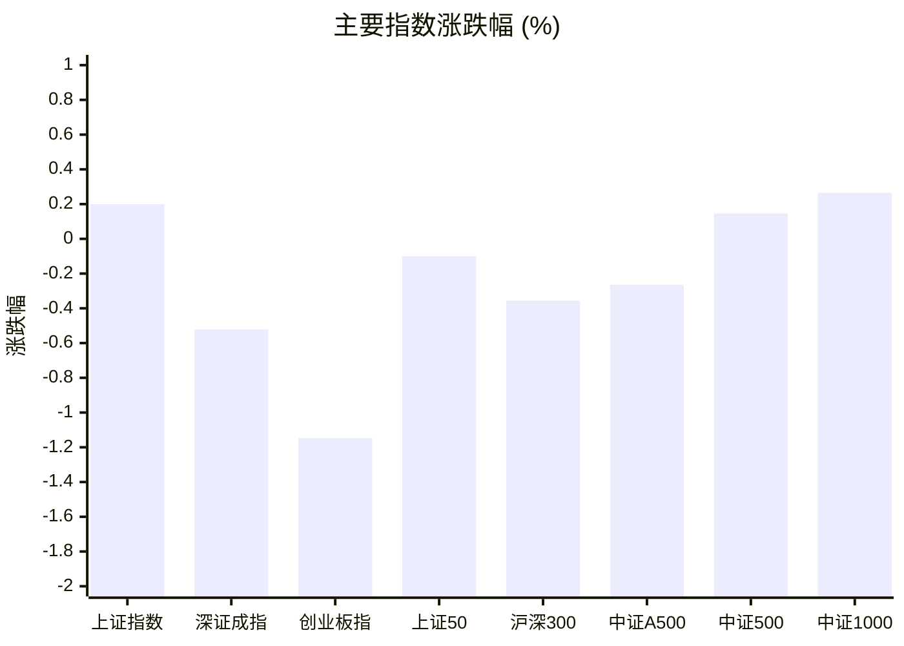
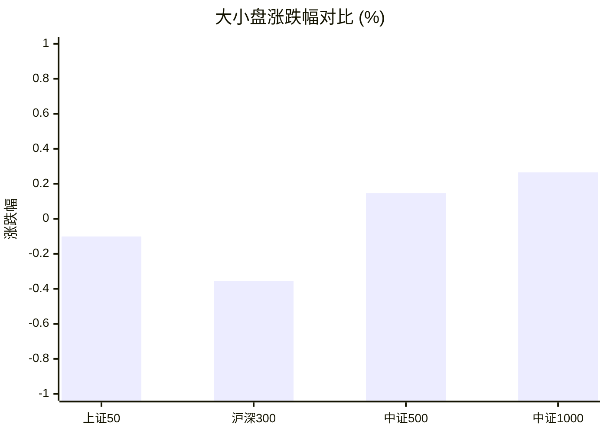
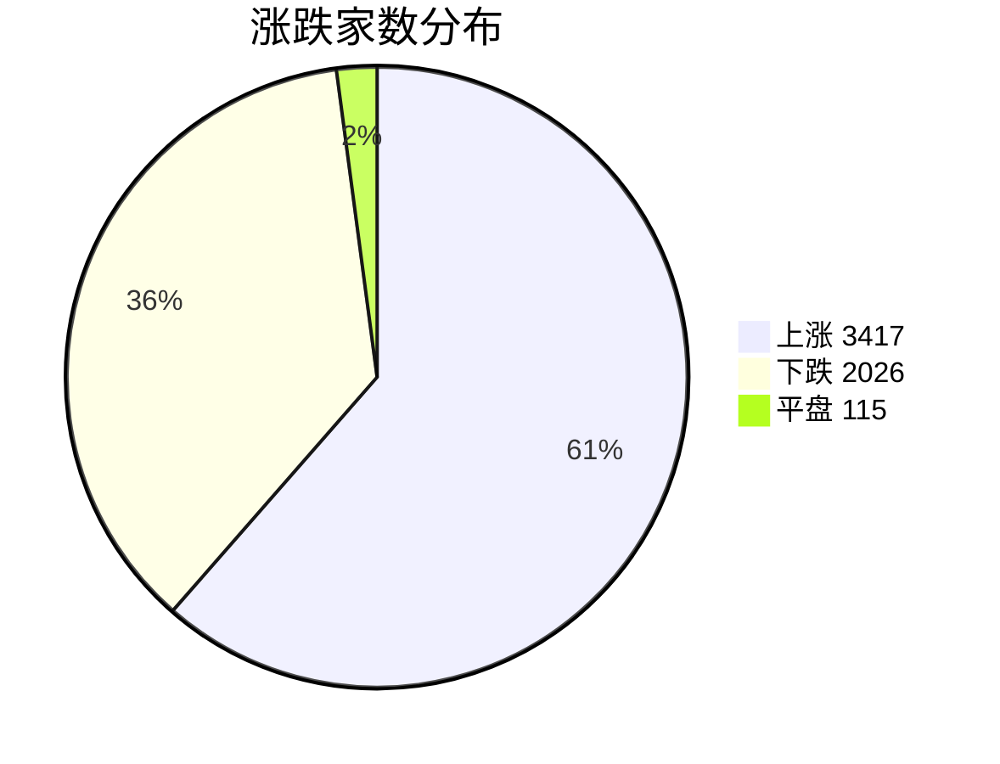
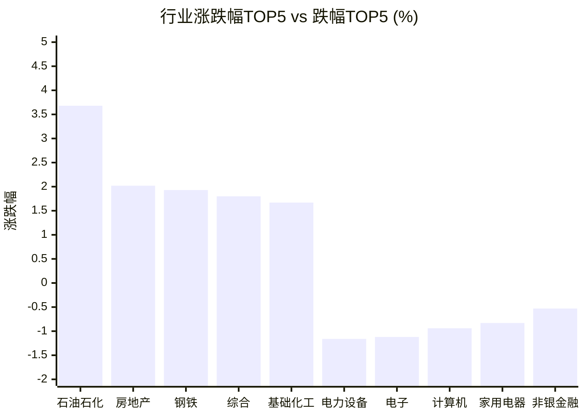

# 📊 A股收盘简报 | 2026-09-08 周二

---

## 📈 一、大盘概况

2026年09月08日 是 A 股交易日，收盘数据已可用。

### 主要指数表现

| 指数 | 收盘价 | 涨跌幅 | 涨跌点 | 成交额(亿) | 前收盘 | 开盘 | 最高 | 最低 |
|------|--------|--------|--------|-----------|--------|------|------|------|
| 上证指数 | 3940.55 | **▲+0.20%** | +7.85 | 9155.66亿 | 3932.70 | 3935.55 | 3951.32 | 3925.72 |
| 深证成指 | 13703.21 | **▼0.52%** | -71.70 | 10447.68亿 | 13774.91 | 13782.86 | 13843.92 | 13655.84 |
| 创业板指 | 3359.72 | **▼1.15%** | -38.96 | 4737.07亿 | 3398.68 | 3394.35 | 3418.48 | 3346.71 |
| 上证50 | 2908.80 | **▼0.10%** | -2.93 | 1310.56亿 | 2911.73 | 2915.16 | 2923.44 | 2901.33 |
| 沪深300 | 4558.74 | **▼0.36%** | -16.28 | 4920.87亿 | 4575.02 | 4575.99 | 4587.73 | 4546.31 |
| 中证A500 | 5630.04 | **▼0.26%** | -14.93 | 6732.09亿 | 5644.97 | 5649.60 | 5669.88 | 5612.80 |
| 中证500 | 7770.73 | **▲+0.15%** | +11.36 | 3388.22亿 | 7759.37 | 7773.28 | 7830.16 | 7736.44 |
| 中证1000 | 7659.61 | **▲+0.27%** | +20.25 | 4320.29亿 | 7639.36 | 7650.06 | 7724.94 | 7622.90 |

### 市场整体成交

- **沪深合计成交额**: **19603.35亿**
- **较前日放量** 143.16亿（+0.7%）

---

## 📊 二、指数涨跌幅对比

---

## 📊 三、市值结构 — 大小盘对比

| 指数 | 涨跌幅 | 特征 |
|------|--------|------|
| 上证50 | **▼0.10%** | 超大盘 |
| 沪深300 | **▼0.36%** | 大盘 |
| 中证500 | **▲+0.15%** | 中盘 |
| 中证1000 | **▲+0.27%** | 小盘 |

> 📌 **风格分化明显**，大小盘走势不一致。

---

## 📉 四、市场广度
### 涨跌家数分布

### 关键统计

| 指标 | 数值 |
|------|------|
| 上涨家数 | 3417 |
| 下跌家数 | 2026 |
| 平盘家数 | 115 |
| 涨停家数 | 75 |
| 跌停家数 | 1 |
| 全市场中位数 | **▲+0.54%** |

---
## 🏢 五、行业表现

### 🔥 涨幅榜 TOP 10

| 排名 | 行业(申万一级) | 涨跌幅 |
|------|---------------|--------|
| 🥇 | 石油石化(申万) | **▲+3.68%** |
| 🥈 | 房地产(申万) | **▲+2.02%** |
| 🥉 | 钢铁(申万) | **▲+1.93%** |
| 4 | 综合(申万) | **▲+1.80%** |
| 5 | 基础化工(申万) | **▲+1.67%** |
| 6 | 农林牧渔(申万) | **▲+1.44%** |
| 7 | 国防军工(申万) | **▲+1.35%** |
| 8 | 煤炭(申万) | **▲+1.35%** |
| 9 | 有色金属(申万) | **▲+1.30%** |
| 10 | 社会服务(申万) | **▲+1.26%** |

### ❄️ 跌幅榜 TOP 10

| 排名 | 行业(申万一级) | 涨跌幅 |
|------|---------------|--------|
| 31 | 电力设备(申万) | **▼1.16%** |
| 30 | 电子(申万) | **▼1.12%** |
| 29 | 计算机(申万) | **▼0.94%** |
| 28 | 家用电器(申万) | **▼0.83%** |
| 27 | 非银金融(申万) | **▼0.53%** |
| 26 | 汽车(申万) | **▼0.37%** |
| 25 | 通信(申万) | **▼0.30%** |
| 24 | 机械设备(申万) | **▼0.27%** |
| 23 | 食品饮料(申万) | **▼0.18%** |
| 22 | 交通运输(申万) | **▲+0.31%** |

> 📈 **行业普涨**，多数板块收红。 涨幅第一：**石油石化(申万)**（+3.68%）。 跌幅第一：**电力设备(申万)**（-1.16%）。

---

## 💡 六、热门概念

| 概念 | 涨跌幅 |
|------|--------|
| 磷化工指数 | **▲+5.06%** |
| CRO指数 | **▲+4.05%** |
| 培育钻石指数 | **▲+4.01%** |
| 人造肉 | **▲+3.42%** |
| 油气开采指数 | **▲+3.31%** |
| 天然气指数 | **▲+3.09%** |
| 医疗服务精选指数 | **▲+3.06%** |
| 反关税指数 | **▲+2.89%** |
| 乡村振兴指数 | **▲+2.81%** |
| 干细胞指数 | **▲+2.59%** |

> 📌 今日热门概念集中在 **磷化工指数**（+5.06%） 等方向。

---

## 💰 七、资金流向

### 主力资金概况

| 指标 | 数值(亿元) |
|------|------|
| 主力资金净流入 | 336.71 |

### 资金流入行业 TOP5

| 行业 | 净流入(亿元) |
|------|--------|
| 基础化工 | 71.81 |
| 有色金属 | 65.71 |
| 农林牧渔 | 41.17 |
| 医药生物 | 40.60 |
| 房地产 | 30.88 |

> 🟢 **主力资金大幅净流入**，市场做多意愿强烈。

---

## 🌍 八、周边市场

| 指数 | 涨跌幅 |
|------|--------|
| 纳斯达克指数 | **▼0.29%** |
| 恒生指数 | **▼0.38%** |
| 标普500 | **▼0.38%** |
| 道琼斯工业平均 | **▼0.51%** |
| 日经225 | **▼1.70%** |

> 📌 全球市场多数下跌，外围情绪偏弱。

---

## 📊 九、期货市场

| 品种 | 涨跌幅 |
|------|--------|
| IM2610 | **▲+0.32%** |
| IM2609 | **▲+0.31%** |
| IC2609 | **▲+0.25%** |
| IM2612 | **▲+0.24%** |
| IC2610 | **▲+0.24%** |
| IM2703 | **▲+0.20%** |
| IC2612 | **▲+0.18%** |
| IC2703 | **▲+0.15%** |
| IH2609 | **▼0.17%** |
| IH2610 | **▼0.19%** |

---

## 📰 十、财经要闻

- 【A股午间收盘快报】 沪指上涨0.36% 全市场超3400股飘红 农业、出版行业走强
- A股收盘综述：主要指数走势分化，创业板指跌1.15%
- A股资金流向2026年9月8日星期二
- A股每日行情复盘（9月8日）
- 陆家嘴财经早餐2026年9月8日星期二

---

## 🤖 十一、盘面结论

> 分析来源：AI Agent

**一句话定性：指数分化下的普涨型结构行情，资金与行业强度偏向资源、化工及地产链，成长权重承压。**

- **证据：**全市场上涨 3417 家、下跌 2026 家，上涨中位数为 +0.54%，75 家涨停、仅 1 家跌停，个股广度明显强于深成指（-0.52%）与创业板指（-1.15%）。
- **证据：**上证指数上涨 0.20%，中证500和中证1000分别上涨 0.15% 与 0.27%，而沪深300下跌 0.36%，显示小中盘相对占优、权重成长偏弱。
- **证据：**石油石化、房地产、钢铁、基础化工位居行业涨幅前列；主力资金净流入 336.71 亿元，其中基础化工、有色金属、农林牧渔和房地产进入行业流入前列。上述数据支持资源与顺周期方向的相对强势判断。

---

## 🎯 十二、主线轮动

### 1. 资源与化工链：加速

- **盘面证据：**石油石化上涨 3.68%，基础化工上涨 1.67%；磷化工指数上涨 5.06%，油气开采指数上涨 3.31%，天然气指数上涨 3.09%。基础化工获主力资金净流入 71.81 亿元、有色金属获净流入 65.71 亿元，行业与资金数据同向，盘面已验证。
- **催化验证：**报告内未提供能够确认基本面或政策催化的结构化字段，相关消息不作为上涨原因。
- **确认条件：**下一交易日行业表现中石油石化、基础化工或有色金属仍居强势行列，且热门概念中资源化工相关方向继续出现。
- **失效条件：**下一交易日上述行业转入跌幅前列，或热门概念与行业强度不再支持资源化工方向。

### 2. 地产与周期品：发酵

- **盘面证据：**房地产上涨 2.02%、钢铁上涨 1.93%，房地产获得主力资金净流入 30.88 亿元；广度为正并且上涨家数占优，说明该方向并非完全脱离市场扩散。
- **催化验证：**报告内仅有新闻标题，未提供可验证的政策或基本面增量，因此不将新闻表述为行情原因。
- **确认条件：**下一交易日房地产与钢铁继续维持行业强势，同时资金流入行业中仍出现相关方向。
- **失效条件：**下一交易日房地产、钢铁同步走弱且资金流入榜不再出现相关行业。

---

## 🔍 十三、明日关注

1. **观察对象：**市场广度与指数分化。**确认信号：**上涨家数继续多于下跌家数，中证500和中证1000相对沪深300保持强势。**失效信号：**下跌家数重新占优，且中小盘指数与沪深300同步转弱。
2. **观察对象：**资源化工链持续性。**确认信号：**石油石化、基础化工或有色金属继续位于行业涨幅前列，资源化工相关概念保持活跃，并获得行业资金流入支持。**失效信号：**相关行业转入跌幅前列，概念表现与资金流向同时走弱。
3. **观察对象：**地产与周期品扩散。**确认信号：**房地产、钢铁继续位于行业强势行列，且房地产等相关行业仍出现在资金流入榜。**失效信号：**房地产与钢铁同步回落至行业弱势区，相关行业不再获得资金流入支持。

---

## 📌 数据来源与免责声明

- **数据来源**：万得 Wind 金融数据服务
- **数据日期**：2026-09-08 收盘
- **生成时间**：2026年09月08日
- **免责声明**：本简报基于 Wind 数据自动生成，AI 分析部分（如有）仅供参考，不构成任何投资建议。市场有风险，投资需谨慎。
