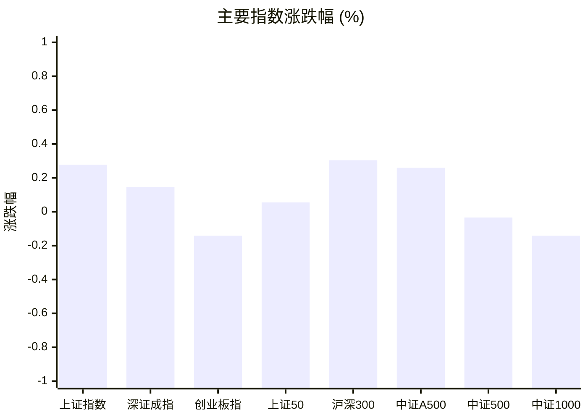
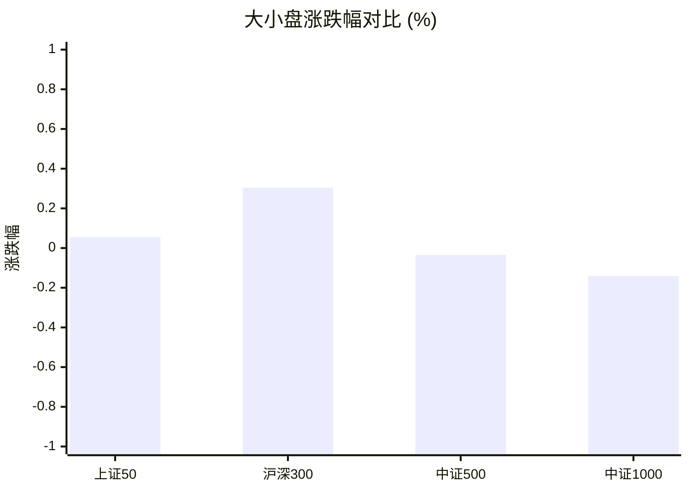
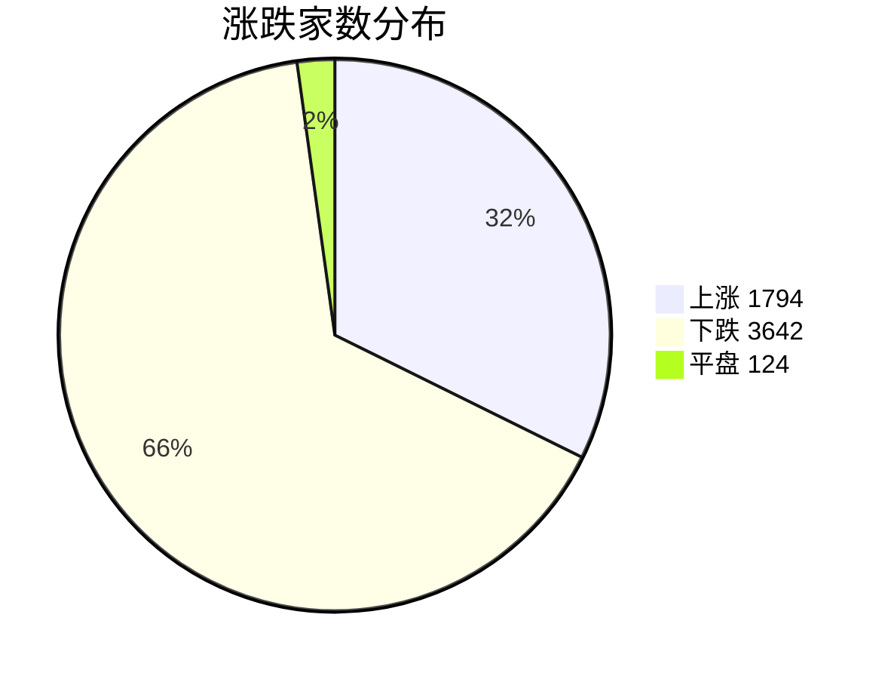
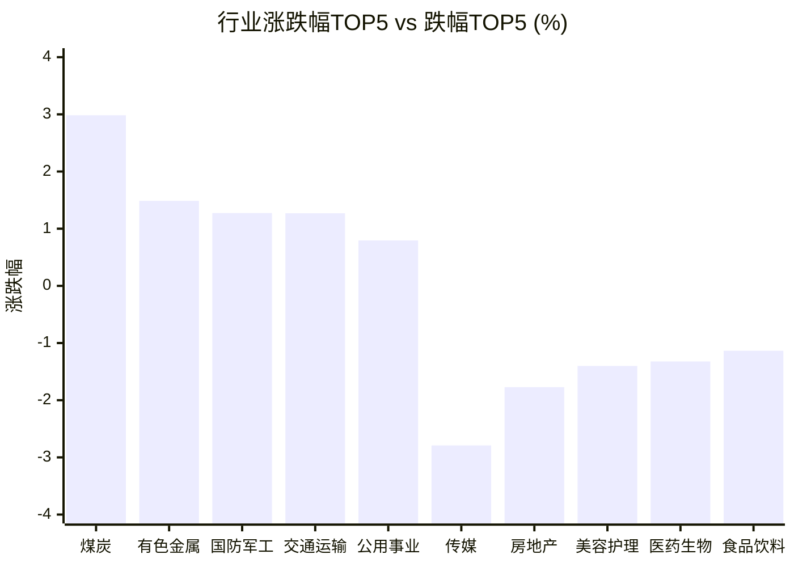

# 📊 A股收盘简报 | 2026-09-09 周三

---

## 📈 一、大盘概况

2026年09月09日 是 A 股交易日，收盘数据已可用。

### 主要指数表现

| 指数 | 收盘价 | 涨跌幅 | 涨跌点 | 成交额(亿) | 前收盘 | 开盘 | 最高 | 最低 |
|------|--------|--------|--------|-----------|--------|------|------|------|
| 上证指数 | 3951.51 | **▲+0.28%** | +10.96 | 8737.35亿 | 3940.55 | 3943.92 | 3958.12 | 3933.47 |
| 深证成指 | 13723.32 | **▲+0.15%** | +20.11 | 9818.72亿 | 13703.21 | 13788.94 | 13788.94 | 13625.12 |
| 创业板指 | 3354.97 | **▼0.14%** | -4.75 | 4333.07亿 | 3359.72 | 3398.22 | 3398.22 | 3327.14 |
| 上证50 | 2910.40 | **▲+0.06%** | +1.60 | 1082.34亿 | 2908.80 | 2911.69 | 2916.30 | 2899.31 |
| 沪深300 | 4572.60 | **▲+0.30%** | +13.86 | 4400.48亿 | 4558.74 | 4578.51 | 4581.90 | 4548.36 |
| 中证A500 | 5644.65 | **▲+0.26%** | +14.61 | 6147.37亿 | 5630.04 | 5655.05 | 5656.40 | 5612.16 |
| 中证500 | 7768.11 | **▼0.03%** | -2.62 | 3233.42亿 | 7770.73 | 7793.04 | 7816.66 | 7723.82 |
| 中证1000 | 7648.80 | **▼0.14%** | -10.81 | 4076.20亿 | 7659.61 | 7676.86 | 7715.08 | 7602.50 |

### 市场整体成交

- **沪深合计成交额**: **18556.07亿**
- **较前日缩量** 1047.28亿（-5.3%）

---

## 📊 二、指数涨跌幅对比

---

## 📊 三、市值结构 — 大小盘对比

| 指数 | 涨跌幅 | 特征 |
|------|--------|------|
| 上证50 | **▲+0.06%** | 超大盘 |
| 沪深300 | **▲+0.30%** | 大盘 |
| 中证500 | **▼0.03%** | 中盘 |
| 中证1000 | **▼0.14%** | 小盘 |

> 📌 **大小盘涨跌幅接近**，市场风格均衡。

---

## 📉 四、市场广度
### 涨跌家数分布

### 关键统计

| 指标 | 数值 |
|------|------|
| 上涨家数 | 1794 |
| 下跌家数 | 3642 |
| 平盘家数 | 124 |
| 涨停家数 | 49 |
| 跌停家数 | 9 |
| 全市场中位数 | **▼0.67%** |

---
## 🏢 五、行业表现

### 🔥 涨幅榜 TOP 10

| 排名 | 行业(申万一级) | 涨跌幅 |
|------|---------------|--------|
| 🥇 | 煤炭(申万) | **▲+2.98%** |
| 🥈 | 有色金属(申万) | **▲+1.49%** |
| 🥉 | 国防军工(申万) | **▲+1.27%** |
| 4 | 交通运输(申万) | **▲+1.27%** |
| 5 | 公用事业(申万) | **▲+0.79%** |
| 6 | 钢铁(申万) | **▲+0.77%** |
| 7 | 综合(申万) | **▲+0.73%** |
| 8 | 农林牧渔(申万) | **▲+0.65%** |
| 9 | 通信(申万) | **▲+0.58%** |
| 10 | 建筑材料(申万) | **▲+0.53%** |

### ❄️ 跌幅榜 TOP 10

| 排名 | 行业(申万一级) | 涨跌幅 |
|------|---------------|--------|
| 31 | 传媒(申万) | **▼2.79%** |
| 30 | 房地产(申万) | **▼1.77%** |
| 29 | 美容护理(申万) | **▼1.40%** |
| 28 | 医药生物(申万) | **▼1.32%** |
| 27 | 食品饮料(申万) | **▼1.13%** |
| 26 | 计算机(申万) | **▼1.08%** |
| 25 | 纺织服饰(申万) | **▼0.68%** |
| 24 | 社会服务(申万) | **▼0.64%** |
| 23 | 商贸零售(申万) | **▼0.46%** |
| 22 | 轻工制造(申万) | **▼0.27%** |

> 📊 **行业分化明显**，16涨/15跌。 涨幅第一：**煤炭(申万)**（+2.98%）。 跌幅第一：**传媒(申万)**（-2.79%）。

---

## 💡 六、热门概念

| 概念 | 涨跌幅 |
|------|--------|
| 培育钻石指数 | **▲+3.99%** |
| 航运精选指数 | **▲+3.39%** |
| 煤炭开采精选指数 | **▲+3.32%** |
| 超硬材料指数 | **▲+3.25%** |
| 高速铜连接指数 | **▲+3.01%** |
| 锗镓锑墨指数 | **▲+2.68%** |
| 工业金属精选指数 | **▲+2.37%** |
| 水产指数 | **▲+2.28%** |
| 央企煤炭指数 | **▲+2.17%** |
| 覆铜板指数 | **▲+2.17%** |

> 📌 今日热门概念集中在 **培育钻石指数**（+3.99%） 等方向。

---

## 💰 七、资金流向

### 主力资金概况

| 指标 | 数值(亿元) |
|------|------|
| 主力资金净流入 | -14.46 |

### 资金流入行业 TOP5

| 行业 | 净流入(亿元) |
|------|--------|
| 电子 | 26.52 |
| 通信 | 23.08 |
| 有色金属 | 16.79 |
| 电力设备 | 13.79 |
| 机械设备 | 10.49 |

> 🔴 **主力资金小幅净流出**。

---

## 🌍 八、周边市场

| 指数 | 涨跌幅 |
|------|--------|
| 恒生指数 | **▼0.17%** |
| 日经225 | **▼0.19%** |

> 📌 全球市场多数下跌，外围情绪偏弱。

---

## 📊 九、期货市场

| 品种 | 涨跌幅 |
|------|--------|
| IH2610 | **▲+0.19%** |
| IM2703 | **▼0.30%** |
| IC2612 | **▼0.09%** |
| IF2609 | **▲+0.37%** |
| IC2610 | **▲+0.01%** |
| IC2703 | **▼0.12%** |
| IF2612 | **▲+0.24%** |
| IM2610 | **▼0.18%** |
| IH2703 | **▲+0.09%** |
| IM2609 | **▼0.12%** |

---

## 📰 十、财经要闻

- 【A股收盘快报】A股三大指数涨跌不一 航海装备与煤炭板块涨幅居前
- A股资金流向2026年9月9日星期三
- 9月9日A股交易日历：经济数据6项、市场大事9项等共60项日程
- A股早报2026年9月9日星期三
- 财联社9月9日午间新闻精选

---

## 🤖 十一、盘面结论

> 分析来源：AI Agent

**一句话定性：缩量下的结构性分化行情，权重相对占优而成长偏弱。**

- **证据 1（指数与风格）**：沪深300上涨 0.30%、中证A500上涨 0.26%，而中证1000下跌 0.14%、创业板指下跌 0.14%，大盘权重相对占优。
- **证据 2（量价与广度）**：沪深合计成交额 18556.07 亿，较前日缩量 5.3%；上涨 1794 家、下跌 3642 家，市场中位数下跌 0.67%，上涨覆盖不足。
- **证据 3（行业结构）**：煤炭、有色金属、国防军工居行业涨幅前列，传媒、房地产、医药生物跌幅靠前，行业表现为 16 涨/15 跌，分化明显。

---

## 🎯 十二、主线轮动

1. **资源品（煤炭、有色金属）｜发酵**
   - **盘面证据**：煤炭行业上涨 2.98%、有色金属上涨 1.49%；煤炭开采精选指数上涨 3.32%、工业金属精选指数上涨 2.37%，培育钻石指数也上涨 3.99%，资源与材料方向在行业和概念层面均有响应。
   - **催化验证**：报告未提供可核验的具体政策或商品价格催化，消息面仅作候选解释，暂不视为已验证原因。
   - **确认条件**：下一交易日资源品继续位于行业或概念涨幅前列，且对应指数/市场广度同步改善。
   - **失效条件**：资源品从涨幅前列回落，同时行业或概念表现转弱并出现更广泛下跌。

2. **大盘权重｜待确认**
   - **盘面证据**：沪深300上涨 0.30%、上证指数上涨 0.28%，上证50上涨 0.06%；股指期货 IF2610 上涨 0.37%，但成交额较前日缩量且主力资金净流出 14.46 亿元，持续性尚未确认。
   - **催化验证**：报告未提供明确、可验证的权重板块催化，暂不判定为消息驱动。
   - **确认条件**：沪深300和上证指数继续保持相对强势，且市场中位数与上涨家数同步改善。
   - **失效条件**：权重指数转跌，或指数维持强势但市场广度和中位数继续走弱。

---

## 🔍 十三、明日关注

1. **观察对象：市场量能与大盘权重。** 确认信号：沪深合计成交额较前日止跌回升，且沪深300、上证指数继续收涨。失效信号：成交额继续缩量并伴随权重指数转跌。
2. **观察对象：资源品主线的延续性。** 确认信号：煤炭、有色金属或对应热门概念再次进入行业/概念涨幅前列。失效信号：资源品同步跌出强势区间，行业和概念排名转弱。
3. **观察对象：市场广度修复。** 确认信号：上涨家数回升、下跌家数减少且全市场中位数较当日改善。失效信号：下跌家数继续占优且中位数进一步走低。

---

## 📌 数据来源与免责声明

- **数据来源**：万得 Wind 金融数据服务
- **数据日期**：2026-09-09 收盘
- **生成时间**：2026年09月10日
- **免责声明**：本简报基于 Wind 数据自动生成，AI 分析部分（如有）仅供参考，不构成任何投资建议。市场有风险，投资需谨慎。
