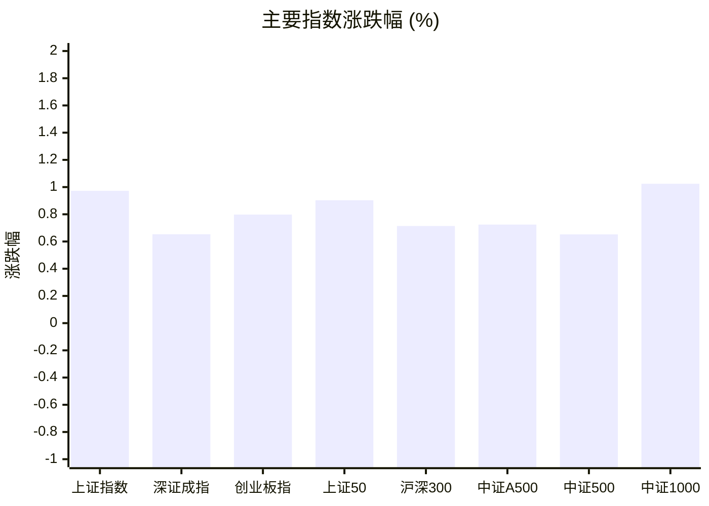
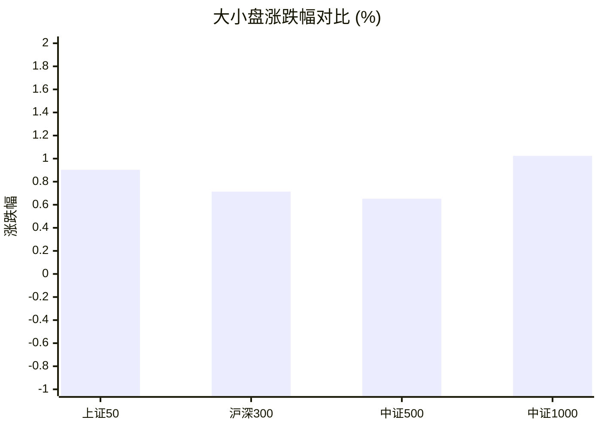
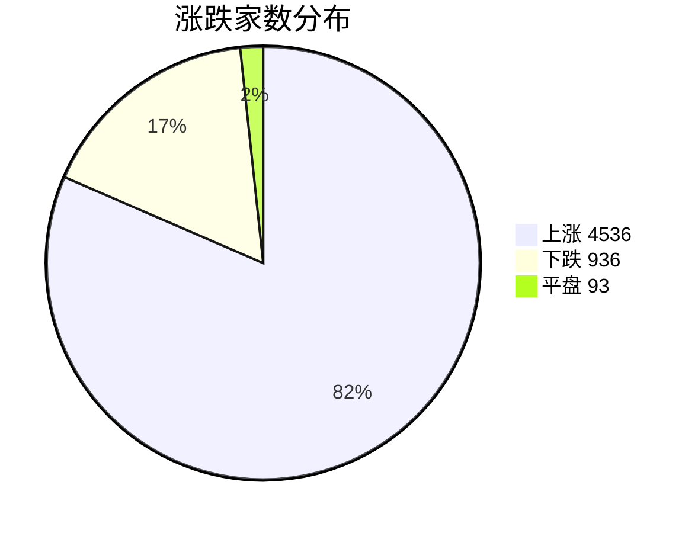
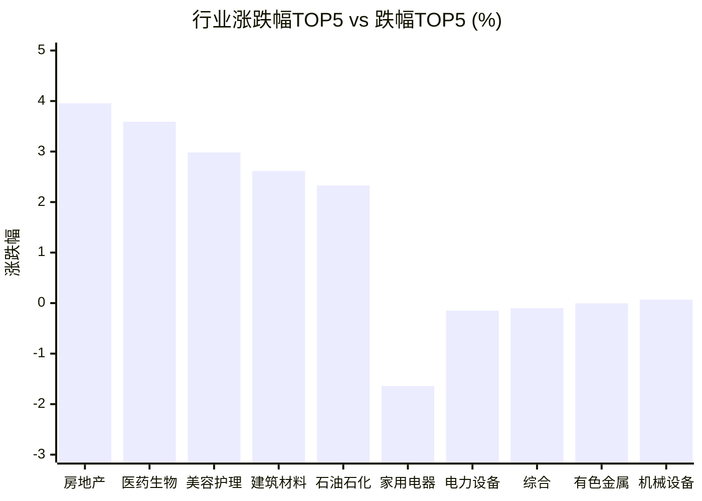

# 📊 A股收盘简报 | 2026-09-21 周一

---

## 📈 一、大盘概况

2026年09月21日 是 A 股交易日，收盘数据已可用。

### 主要指数表现

| 指数 | 收盘价 | 涨跌幅 | 涨跌点 | 成交额(亿) | 前收盘 | 开盘 | 最高 | 最低 |
|------|--------|--------|--------|-----------|--------|------|------|------|
| 上证指数 | 3949.91 | **▲+0.97%** | +38.04 | 9468.19亿 | 3911.87 | 3920.27 | 3950.94 | 3918.13 |
| 深证成指 | 13730.02 | **▲+0.65%** | +89.15 | 10846.94亿 | 13640.87 | 13716.22 | 13779.00 | 13643.95 |
| 创业板指 | 3399.59 | **▲+0.80%** | +26.91 | 5222.22亿 | 3372.68 | 3403.90 | 3429.27 | 3373.93 |
| 上证50 | 2886.61 | **▲+0.90%** | +25.84 | 1248.81亿 | 2860.77 | 2870.72 | 2887.49 | 2867.00 |
| 沪深300 | 4539.57 | **▲+0.71%** | +32.18 | 4954.36亿 | 4507.39 | 4524.34 | 4540.55 | 4512.15 |
| 中证A500 | 5626.57 | **▲+0.72%** | +40.48 | 6917.34亿 | 5586.09 | 5609.83 | 5632.41 | 5593.56 |
| 中证500 | 7850.48 | **▲+0.65%** | +50.87 | 3482.96亿 | 7799.61 | 7829.82 | 7869.35 | 7809.59 |
| 中证1000 | 7766.33 | **▲+1.02%** | +78.74 | 4271.24亿 | 7687.59 | 7723.68 | 7777.91 | 7723.68 |

### 市场整体成交

- **沪深合计成交额**: **20315.13亿**
- **较前日缩量** 455.87亿（-2.2%）

---

## 📊 二、指数涨跌幅对比

---

## 📊 三、市值结构 — 大小盘对比

| 指数 | 涨跌幅 | 特征 |
|------|--------|------|
| 上证50 | **▲+0.90%** | 超大盘 |
| 沪深300 | **▲+0.71%** | 大盘 |
| 中证500 | **▲+0.65%** | 中盘 |
| 中证1000 | **▲+1.02%** | 小盘 |

> 📌 **大小盘涨跌幅接近**，市场风格均衡。

---

## 📉 四、市场广度
### 涨跌家数分布

### 关键统计

| 指标 | 数值 |
|------|------|
| 上涨家数 | 4536 |
| 下跌家数 | 936 |
| 平盘家数 | 93 |
| 涨停家数 | 106 |
| 跌停家数 | 3 |
| 全市场中位数 | **▲+1.54%** |

---
## 🏢 五、行业表现

### 🔥 涨幅榜 TOP 10

| 排名 | 行业(申万一级) | 涨跌幅 |
|------|---------------|--------|
| 🥇 | 房地产(申万) | **▲+3.96%** |
| 🥈 | 医药生物(申万) | **▲+3.59%** |
| 🥉 | 美容护理(申万) | **▲+2.98%** |
| 4 | 建筑材料(申万) | **▲+2.62%** |
| 5 | 石油石化(申万) | **▲+2.33%** |
| 6 | 农林牧渔(申万) | **▲+2.10%** |
| 7 | 煤炭(申万) | **▲+1.98%** |
| 8 | 社会服务(申万) | **▲+1.97%** |
| 9 | 国防军工(申万) | **▲+1.83%** |
| 10 | 商贸零售(申万) | **▲+1.79%** |

### ❄️ 跌幅榜 TOP 10

| 排名 | 行业(申万一级) | 涨跌幅 |
|------|---------------|--------|
| 31 | 家用电器(申万) | **▼1.64%** |
| 30 | 电力设备(申万) | **▼0.15%** |
| 29 | 综合(申万) | **▼0.10%** |
| 28 | 有色金属(申万) | **▼0.00%** |
| 27 | 机械设备(申万) | **▲+0.07%** |
| 26 | 公用事业(申万) | **▲+0.07%** |
| 25 | 食品饮料(申万) | **▲+0.48%** |
| 24 | 银行(申万) | **▲+0.52%** |
| 23 | 电子(申万) | **▲+0.86%** |
| 22 | 建筑装饰(申万) | **▲+0.92%** |

> 📈 **行业普涨**，多数板块收红。 涨幅第一：**房地产(申万)**（+3.96%）。 跌幅第一：**家用电器(申万)**（-1.64%）。

---

## 💡 六、热门概念

| 概念 | 涨跌幅 |
|------|--------|
| ADC指数 | **▲+5.72%** |
| CRO指数 | **▲+5.52%** |
| 饲料精选指数 | **▲+4.73%** |
| 创新药指数 | **▲+4.69%** |
| 医疗服务精选指数 | **▲+4.66%** |
| 生物科技等权指数 | **▲+4.59%** |
| 房地产精选指数 | **▲+4.58%** |
| 维生素指数 | **▲+4.39%** |
| 冰雪旅游指数 | **▲+4.17%** |
| 体外诊断指数 | **▲+4.16%** |

> 📌 今日热门概念集中在 **ADC指数**（+5.72%） 等方向。

---

## 💰 七、资金流向

### 主力资金概况

| 指标 | 数值(亿元) |
|------|------|
| 主力资金净流入 | 116.82 |

### 资金流入行业 TOP5

| 行业 | 净流入(亿元) |
|------|--------|
| 医药生物 | 35.34 |
| 通信 | 22.87 |
| 基础化工 | 11.74 |
| 电子 | 11.49 |
| 计算机 | 10.73 |

> 🟢 **主力资金大幅净流入**，市场做多意愿强烈。

---

## 🌍 八、周边市场

| 指数 | 涨跌幅 |
|------|--------|
| 恒生指数 | **▲+1.18%** |
| 纳斯达克指数 | **▲+2.26%** |
| 道琼斯工业平均 | **▲+0.71%** |
| 标普500 | **▲+1.49%** |

> 📌 全球市场多数上涨，外围情绪偏暖。

---

## 📊 九、期货市场

| 品种 | 涨跌幅 |
|------|--------|
| 沪深300期货 | **▲+0.86%** |
| 中证500期货 | **▲+0.67%** |
| 中证1000期货 | **▲+0.97%** |
| 上证50期货 | **▲+1.17%** |
| TF2703 | **▼0.02%** |
| TS2612 | **▼0.02%** |
| T2703 | **▲+0.00%** |
| TL2706 | **▲+0.20%** |
| TF2612 | **▼0.02%** |
| TL2612 | **▲+0.15%** |

---

## 📰 十、财经要闻

- A股每日市场要闻回顾（2026-09-21）
- 收盘点评 | 央行释放宽松信号，行情逐步向纵深演绎！
- 今日股市收评（2026年9月22日）
- 9月21日A股收评：换挡成功，但没换到底，3949到3980这30个点最难走
- 9月21日农业银行股市行情最新消息：今日收盘上涨1.47%

---

## 🤖 十一、盘面结论

> 分析来源：AI Agent

**一句话定性：** 今日是指数普涨、行业扩散、医药与地产等方向领涨的强势修复行情。

- **指数证据：** 上证指数上涨0.97%，深证成指上涨0.65%，创业板指上涨0.80%；上证50、沪深300、中证500和中证1000分别上涨0.90%、0.71%、0.65%和1.02%，大小盘均收涨且小盘略占优。
- **广度与量能证据：** 上涨4536家、下跌936家，涨停106家、跌停3家，市场中位数上涨1.54%；沪深合计成交额20315.13亿元，较前日缩量455.87亿元，说明上涨覆盖面广但增量成交尚未同步放大。
- **结构与资金证据：** 房地产、医药生物、美容护理位列行业涨幅前三，ADC、CRO、创新药等概念涨幅靠前；主力资金净流入116.82亿元，医药生物净流入35.34亿元。周边市场多数上涨，外围情绪对风险偏好形成支持，但不作为A股上涨原因的单独证明。

---

## 🎯 十二、主线轮动

> 分析来源：AI Agent

1. **医药生物及创新药产业链：生命周期：加速。** 医药生物上涨3.59%并居主力资金流入行业首位，ADC、CRO、创新药、医疗服务精选、生物科技等概念同步位于涨幅前列，行业与概念结构化数据形成共振。财经要闻仅作为候选催化，未单独视为事实。**确认条件：** 下一交易日医药生物继续保持行业涨幅前列，相关医药概念延续强势，且医药资金流入未明显反转。**失效条件：** 医药生物转入行业跌幅前列，或医药概念普遍回落并伴随资金流向转弱。
2. **房地产及地产链：生命周期：发酵。** 房地产上涨3.96%居行业首位，房地产精选指数上涨4.58%，建筑材料上涨2.62%，显示地产及部分相关行业同步走强，但尚缺少更广泛的地产链资金数据支持。**确认条件：** 房地产继续领涨或保持涨幅前列，房地产精选与建筑材料等相关方向同步强势。**失效条件：** 房地产和房地产精选同时转弱，或地产链内部出现明显反向分化。

---

## 🔍 十三、明日关注

1. **观察对象：** 沪深合计成交额与上涨行情的量价配合。**确认信号：** 成交额较前日回升或维持高位，同时主要指数继续收涨。**失效信号：** 成交额继续缩减且主要指数转跌，或上涨家数明显回落。
2. **观察对象：** 医药生物及ADC、CRO、创新药等强势方向。**确认信号：** 医药生物继续位于行业涨幅前列，相关概念保持强势，且医药资金流入延续。**失效信号：** 医药生物转为行业跌幅靠前，概念涨幅普遍收窄，或资金流向转弱。
3. **观察对象：** 房地产与建筑材料的板块联动。**确认信号：** 房地产、房地产精选和建筑材料继续同步走强。**失效信号：** 房地产与房地产精选同时转弱，或建筑材料明显落后并出现板块内分化。

---

## 📌 数据来源与免责声明

- **数据来源**：万得 Wind 金融数据服务
- **数据日期**：2026-09-21 收盘
- **生成时间**：2026年09月22日
- **免责声明**：本简报基于 Wind 数据自动生成，AI 分析部分（如有）仅供参考，不构成任何投资建议。市场有风险，投资需谨慎。
