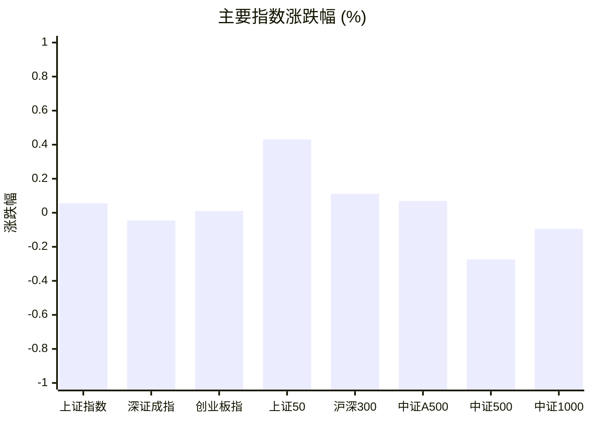
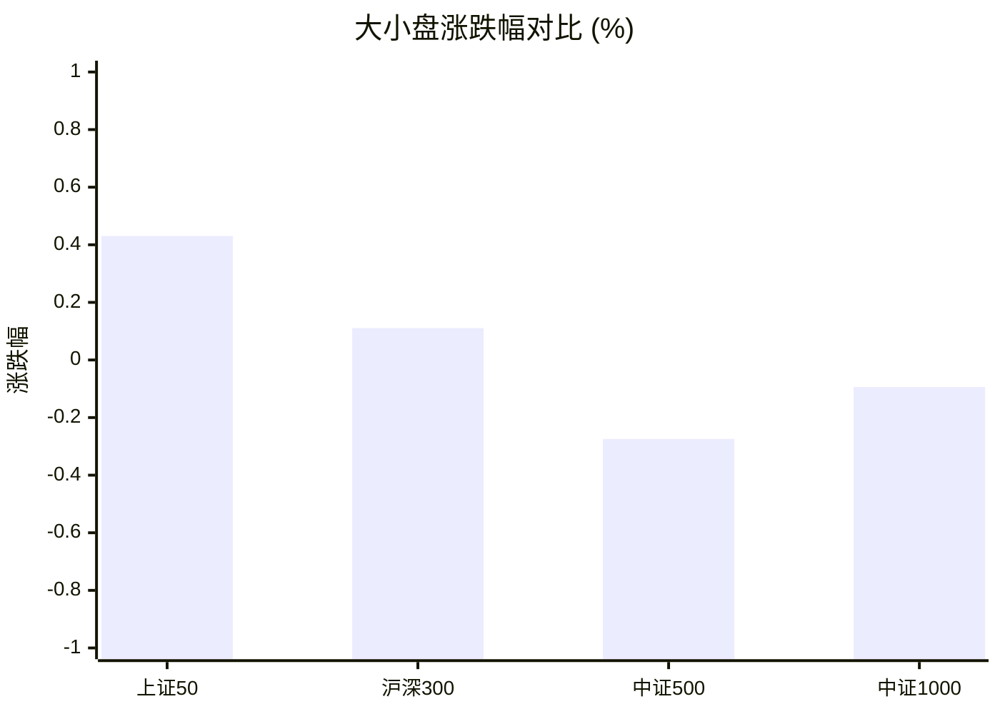
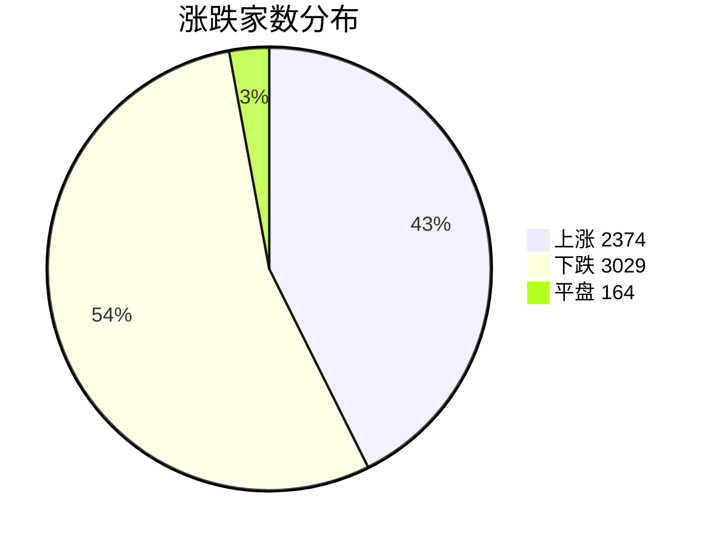
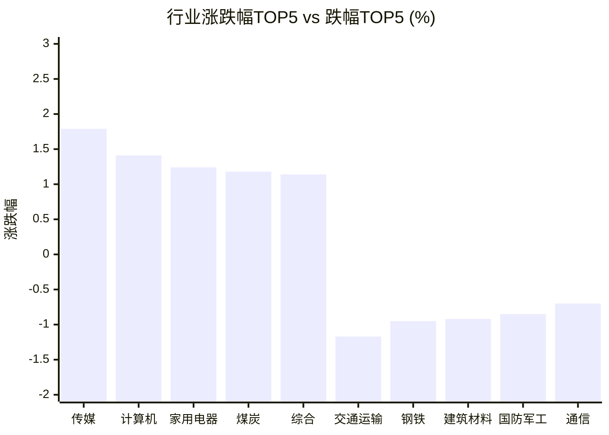

# 📊 A股收盘简报 | 2026-09-22 周二

---

## ⚠️ 数据完整性

⚠️ 以下可选数据未能取得或解析，相关章节已明确标注。

| 数据域 | 状态 | 级别 |
|--------|------|------|
| 周边市场 | 解析失败（返回数据无法解析为报告所需字段） | 可选 |

---

## 📈 一、大盘概况

2026年09月22日 是 A 股交易日，收盘数据已可用。

### 主要指数表现

| 指数 | 收盘价 | 涨跌幅 | 涨跌点 | 成交额(亿) | 前收盘 | 开盘 | 最高 | 最低 |
|------|--------|--------|--------|-----------|--------|------|------|------|
| 上证指数 | 3952.13 | **▲+0.06%** | +2.22 | 10079.96亿 | 3949.91 | 3963.81 | 3967.68 | 3945.42 |
| 深证成指 | 13723.74 | **▼0.05%** | -6.28 | 11275.55亿 | 13730.02 | 13858.62 | 13914.21 | 13691.09 |
| 创业板指 | 3399.93 | **▲+0.01%** | +0.34 | 5412.97亿 | 3399.59 | 3446.33 | 3472.47 | 3387.88 |
| 上证50 | 2899.04 | **▲+0.43%** | +12.43 | 1471.47亿 | 2886.61 | 2905.96 | 2911.93 | 2895.30 |
| 沪深300 | 4544.59 | **▲+0.11%** | +5.02 | 5236.17亿 | 4539.57 | 4569.87 | 4583.38 | 4537.04 |
| 中证A500 | 5630.46 | **▲+0.07%** | +3.89 | 7395.22亿 | 5626.57 | 5670.76 | 5686.72 | 5619.59 |
| 中证500 | 7828.94 | **▼0.27%** | -21.54 | 3652.21亿 | 7850.48 | 7911.64 | 7922.62 | 7808.98 |
| 中证1000 | 7759.03 | **▼0.09%** | -7.30 | 4436.60亿 | 7766.33 | 7819.62 | 7852.23 | 7734.35 |

### 市场整体成交

- **沪深合计成交额**: **21355.50亿**
- **较前日放量** 1040.37亿（+5.1%）

---

## 📊 二、指数涨跌幅对比

---

## 📊 三、市值结构 — 大小盘对比

| 指数 | 涨跌幅 | 特征 |
|------|--------|------|
| 上证50 | **▲+0.43%** | 超大盘 |
| 沪深300 | **▲+0.11%** | 大盘 |
| 中证500 | **▼0.27%** | 中盘 |
| 中证1000 | **▼0.09%** | 小盘 |

> 📌 **大盘蓝筹占优**，上证50领涨，市场偏好核心资产。

---

## 📉 四、市场广度
### 涨跌家数分布

### 关键统计

| 指标 | 数值 |
|------|------|
| 上涨家数 | 2374 |
| 下跌家数 | 3029 |
| 平盘家数 | 164 |
| 涨停家数 | 65 |
| 跌停家数 | 5 |
| 全市场中位数 | **▼0.20%** |

---
## 🏢 五、行业表现

### 🔥 涨幅榜 TOP 10

| 排名 | 行业(申万一级) | 涨跌幅 |
|------|---------------|--------|
| 🥇 | 传媒(申万) | **▲+1.79%** |
| 🥈 | 计算机(申万) | **▲+1.41%** |
| 🥉 | 家用电器(申万) | **▲+1.24%** |
| 4 | 煤炭(申万) | **▲+1.18%** |
| 5 | 综合(申万) | **▲+1.14%** |
| 6 | 房地产(申万) | **▲+0.70%** |
| 7 | 非银金融(申万) | **▲+0.39%** |
| 8 | 轻工制造(申万) | **▲+0.34%** |
| 9 | 医药生物(申万) | **▲+0.28%** |
| 10 | 电子(申万) | **▲+0.23%** |

### ❄️ 跌幅榜 TOP 10

| 排名 | 行业(申万一级) | 涨跌幅 |
|------|---------------|--------|
| 31 | 交通运输(申万) | **▼1.17%** |
| 30 | 钢铁(申万) | **▼0.95%** |
| 29 | 建筑材料(申万) | **▼0.92%** |
| 28 | 国防军工(申万) | **▼0.85%** |
| 27 | 通信(申万) | **▼0.70%** |
| 26 | 纺织服饰(申万) | **▼0.66%** |
| 25 | 机械设备(申万) | **▼0.63%** |
| 24 | 农林牧渔(申万) | **▼0.54%** |
| 23 | 建筑装饰(申万) | **▼0.54%** |
| 22 | 公用事业(申万) | **▼0.48%** |

> 📊 **行业分化明显**，14涨/17跌。 涨幅第一：**传媒(申万)**（+1.79%）。 跌幅第一：**交通运输(申万)**（-1.17%）。

---

## 💡 六、热门概念

| 概念 | 涨跌幅 |
|------|--------|
| 拼多多合作商指数 | **▲+4.60%** |
| AI办公指数 | **▲+4.07%** |
| Kimi指数 | **▲+3.50%** |
| 小红书平台指数 | **▲+2.94%** |
| 虚拟人指数 | **▲+2.78%** |
| 抖音豆包指数 | **▲+2.73%** |
| MCU芯片指数 | **▲+2.54%** |
| AIGC指数 | **▲+2.40%** |
| ChatGPT指数 | **▲+2.40%** |
| 短剧游戏指数 | **▲+2.39%** |

> 📌 今日热门概念集中在 **拼多多合作商指数**（+4.60%） 等方向。

---

## 💰 七、资金流向

### 主力资金概况

| 指标 | 数值(亿元) |
|------|------|
| 主力资金净流入 | 74.57 |

### 资金流入行业 TOP5

| 行业 | 净流入(亿元) |
|------|--------|
| 医药生物 | 83.91 |
| 计算机 | 77.99 |
| 传媒 | 39.33 |
| 房地产 | 26.21 |
| 有色金属 | 13.53 |

> 🟢 **主力资金小幅净流入**。

---

## 🌍 八、周边市场

> ⚠️ 数据状态：解析失败（返回数据无法解析为报告所需字段）。本节不展示默认值，也不据此生成行情结论。

---

## 📊 九、期货市场

| 品种 | 涨跌幅 |
|------|--------|
| 上证50期货 | **▲+0.83%** |
| 沪深300期货 | **▲+0.45%** |
| 中证1000期货 | **▲+0.28%** |
| 中证500期货 | **▲+0.05%** |
| TL2706 | **▲+0.33%** |
| TL2703 | **▲+0.31%** |
| TL2612 | **▲+0.29%** |
| T2612 | **▲+0.08%** |
| T2703 | **▲+0.08%** |
| TF2612 | **▲+0.07%** |

---

## 📰 十、财经要闻

- 操盘必读：影响股市利好或利空消息\_2026年9月22日\_财经新闻
- 热门财讯播报（2026年9月22日）
- A股早报2026年9月22日星期二
- A股收盘综述：节前效应再度显现！中际旭创、新易盛、长飞光纤低迷抑制AI阵营发挥
- A股高开，超3100股上涨

---

## 🤖 十一、盘面结论

> 分析来源：AI Agent

**一句话定性：** 今日是大盘蓝筹相对占优、题材结构活跃但市场广度偏弱的分化行情。

- **指数证据：** 上证50上涨0.43%、沪深300上涨0.11%，而中证500下跌0.27%、中证1000下跌0.09%；上证指数仅上涨0.06%，深证成指下跌0.05%。
- **广度与量能证据：** 沪深合计成交额21355.50亿元，较前日放量1040.37亿元；上涨2374家、下跌3029家，市场中位数下跌0.20%，但涨停65家、跌停5家，说明指数稳定与个股分化并存。
- **结构证据：** 传媒上涨1.79%、计算机上涨1.41%，热门概念中拼多多合作商指数上涨4.60%、AI办公指数上涨4.07%；主力资金净流入74.57亿元，计算机和传媒分别净流入77.99亿元、39.33亿元。周边市场数据解析失败，未纳入判断。

---

## 🎯 十二、主线轮动

> 分析来源：AI Agent

1. **传媒/计算机与AI办公相关方向：生命周期：发酵。** 传媒、计算机位列行业涨幅前二，AI办公、Kimi、AIGC、ChatGPT等概念同步上涨，且计算机、传媒位居主力资金流入行业前列，盘面已有结构化数据支持。新闻仅作为候选催化，未单独视为事实。**确认条件：** 下一交易日传媒和计算机继续位于行业涨幅前列，相关概念保持强势，且资金流入不明显反转。**失效条件：** 相关行业转为跌幅靠前，概念强度明显回落，或资金流向转弱。
2. **大盘蓝筹/核心资产：生命周期：分化中的相对强势。** 上证50上涨0.43%、沪深300上涨0.11%，显著强于中证500下跌0.27%和中证1000下跌0.09%，显示权重风格相对占优，但非银金融仅上涨0.39%，尚不足以证明全面扩散。**确认条件：** 上证50、沪深300继续强于中证500和中证1000，且市场广度同步改善。**失效条件：** 大盘指数相对优势消失，或权重上涨而下跌家数继续扩大。

---

## 🔍 十三、明日关注

1. **观察对象：** 沪深合计成交额与主要指数的量价配合。**确认信号：** 下一交易日成交额继续维持较高水平，同时上证指数、沪深300或上证50的涨跌方向与成交扩张一致。**失效信号：** 成交额回落且主要指数同步转弱。
2. **观察对象：** 传媒、计算机及AI办公等强势方向。**确认信号：** 传媒和计算机继续位于行业涨幅前列，相关概念仍处涨幅靠前位置。**失效信号：** 两个行业同时转入跌幅靠前，或强势概念普遍回落。
3. **观察对象：** 大小盘风格与市场广度。**确认信号：** 上证50、沪深300继续强于中证500、中证1000，且上涨家数回升、市场中位数跌幅收窄或转正。**失效信号：** 权重相对优势消失，同时下跌家数继续高于上涨家数且市场中位数进一步走弱。

---

## 📌 数据来源与免责声明

- **数据来源**：万得 Wind 金融数据服务
- **数据日期**：2026-09-22 收盘
- **生成时间**：2026年09月22日
- **免责声明**：本简报基于 Wind 数据自动生成，AI 分析部分（如有）仅供参考，不构成任何投资建议。市场有风险，投资需谨慎。
