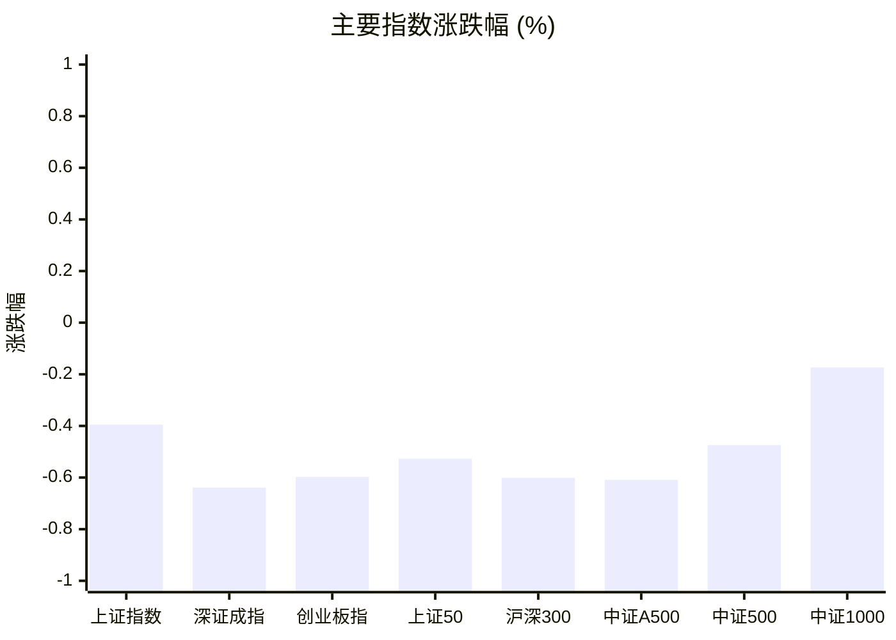
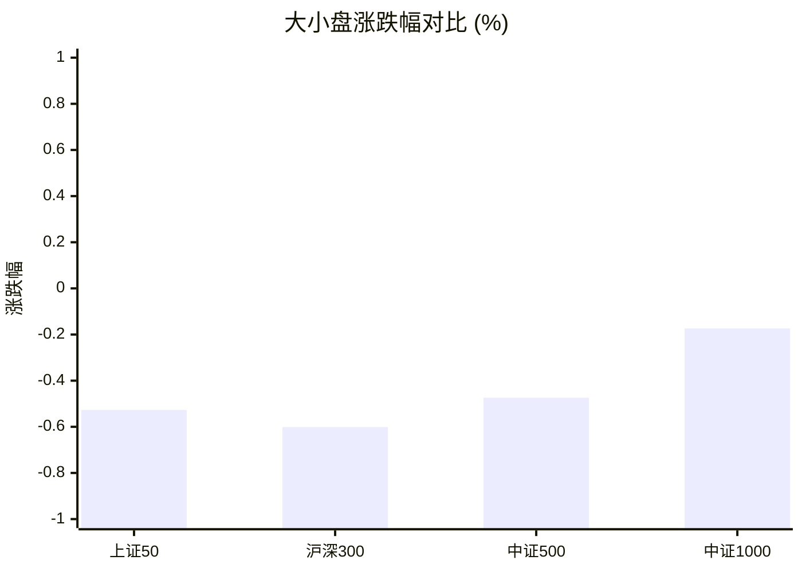
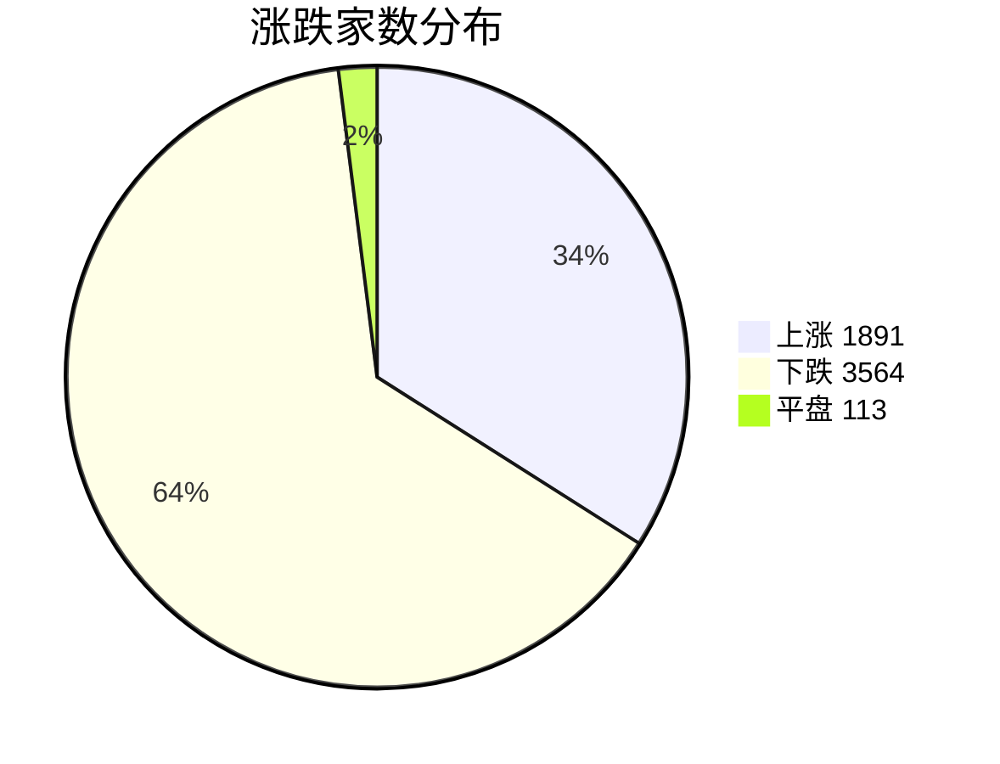
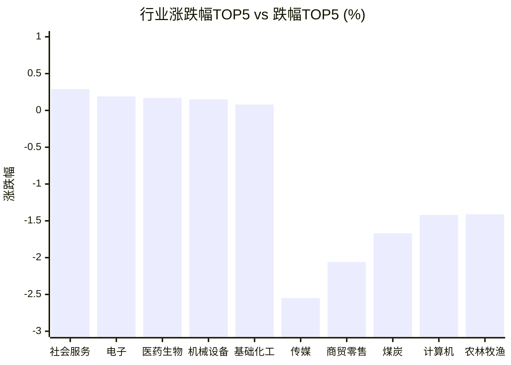

# 📊 A股收盘简报 | 2026-09-23 周三

---

## ⚠️ 数据完整性

⚠️ 以下可选数据未能取得或解析，相关章节已明确标注。

| 数据域 | 状态 | 级别 |
|--------|------|------|
| 周边市场 | 解析失败（返回数据无法解析为报告所需字段） | 可选 |

---

## 📈 一、大盘概况

2026年09月23日 是 A 股交易日，收盘数据已可用。

### 主要指数表现

| 指数 | 收盘价 | 涨跌幅 | 涨跌点 | 成交额(亿) | 前收盘 | 开盘 | 最高 | 最低 |
|------|--------|--------|--------|-----------|--------|------|------|------|
| 上证指数 | 3936.52 | **▼0.39%** | -15.61 | 8341.33亿 | 3952.13 | 3951.37 | 3951.52 | 3934.46 |
| 深证成指 | 13636.07 | **▼0.64%** | -87.67 | 9308.44亿 | 13723.74 | 13742.55 | 13742.55 | 13617.05 |
| 创业板指 | 3379.61 | **▼0.60%** | -20.32 | 4397.77亿 | 3399.93 | 3412.53 | 3412.53 | 3372.95 |
| 上证50 | 2883.77 | **▼0.53%** | -15.27 | 971.86亿 | 2899.04 | 2901.10 | 2901.31 | 2881.92 |
| 沪深300 | 4517.28 | **▼0.60%** | -27.31 | 3782.89亿 | 4544.59 | 4547.61 | 4547.69 | 4513.45 |
| 中证A500 | 5596.18 | **▼0.61%** | -34.28 | 5372.15亿 | 5630.46 | 5636.19 | 5636.62 | 5591.22 |
| 中证500 | 7791.82 | **▼0.47%** | -37.12 | 2735.96亿 | 7828.94 | 7839.94 | 7839.94 | 7781.31 |
| 中证1000 | 7745.56 | **▼0.17%** | -13.47 | 3867.77亿 | 7759.03 | 7762.68 | 7769.96 | 7730.37 |

### 市场整体成交

- **沪深合计成交额**: **17649.76亿**
- **较前日缩量** 3705.74亿（-17.4%）

---

## 📊 二、指数涨跌幅对比

---

## 📊 三、市值结构 — 大小盘对比

| 指数 | 涨跌幅 | 特征 |
|------|--------|------|
| 上证50 | **▼0.53%** | 超大盘 |
| 沪深300 | **▼0.60%** | 大盘 |
| 中证500 | **▼0.47%** | 中盘 |
| 中证1000 | **▼0.17%** | 小盘 |

> 📌 **大小盘涨跌幅接近**，市场风格均衡。

---

## 📉 四、市场广度
### 涨跌家数分布

### 关键统计

| 指标 | 数值 |
|------|------|
| 上涨家数 | 1891 |
| 下跌家数 | 3564 |
| 平盘家数 | 113 |
| 涨停家数 | 51 |
| 跌停家数 | 15 |
| 全市场中位数 | **▼0.61%** |

---
## 🏢 五、行业表现

### 🔥 涨幅榜 TOP 10

| 排名 | 行业(申万一级) | 涨跌幅 |
|------|---------------|--------|
| 🥇 | 社会服务(申万) | **▲+0.29%** |
| 🥈 | 电子(申万) | **▲+0.19%** |
| 🥉 | 医药生物(申万) | **▲+0.17%** |
| 4 | 机械设备(申万) | **▲+0.15%** |
| 5 | 基础化工(申万) | **▲+0.08%** |
| 6 | 房地产(申万) | **▲+0.02%** |
| 7 | 食品饮料(申万) | **▼0.06%** |
| 8 | 家用电器(申万) | **▼0.11%** |
| 9 | 建筑装饰(申万) | **▼0.11%** |
| 10 | 建筑材料(申万) | **▼0.32%** |

### ❄️ 跌幅榜 TOP 10

| 排名 | 行业(申万一级) | 涨跌幅 |
|------|---------------|--------|
| 31 | 传媒(申万) | **▼2.55%** |
| 30 | 商贸零售(申万) | **▼2.06%** |
| 29 | 煤炭(申万) | **▼1.67%** |
| 28 | 计算机(申万) | **▼1.42%** |
| 27 | 农林牧渔(申万) | **▼1.41%** |
| 26 | 国防军工(申万) | **▼1.34%** |
| 25 | 纺织服饰(申万) | **▼1.04%** |
| 24 | 综合(申万) | **▼1.03%** |
| 23 | 公用事业(申万) | **▼1.01%** |
| 22 | 通信(申万) | **▼0.92%** |

> 📉 **行业普跌**，多数板块调整。 涨幅第一：**社会服务(申万)**（+0.29%）。 跌幅第一：**传媒(申万)**（-2.55%）。

---

## 💡 六、热门概念

| 概念 | 涨跌幅 |
|------|--------|
| 玻璃基板指数 | **▲+3.35%** |
| 培育钻石指数 | **▲+2.99%** |
| CRO指数 | **▲+2.43%** |
| HBM指数 | **▲+2.35%** |
| 覆铜板指数 | **▲+2.14%** |
| 水泥制造精选指数 | **▲+2.05%** |
| 超硬材料指数 | **▲+2.05%** |
| 碳化硅指数 | **▲+2.04%** |
| 医疗服务精选指数 | **▲+1.96%** |
| 电路板指数 | **▲+1.66%** |

> 📌 今日热门概念集中在 **玻璃基板指数**（+3.35%） 等方向。

---

## 💰 七、资金流向

### 主力资金概况

| 指标 | 数值(亿元) |
|------|------|
| 主力资金净流入 | 168.02 |

### 资金流入行业 TOP5

| 行业 | 净流入(亿元) |
|------|--------|
| 电子 | 158.87 |
| 机械设备 | 56.80 |
| 医药生物 | 42.74 |
| 房地产 | 32.97 |
| 基础化工 | 30.72 |

> 🟢 **主力资金大幅净流入**，市场做多意愿强烈。

---

## 🌍 八、周边市场

> ⚠️ 数据状态：解析失败（返回数据无法解析为报告所需字段）。本节不展示默认值，也不据此生成行情结论。

---

## 📊 九、期货市场

| 品种 | 涨跌幅 |
|------|--------|
| 中证1000期货 | **▼0.05%** |
| 上证50期货 | **▼0.29%** |
| 中证500期货 | **▼0.36%** |
| 沪深300期货 | **▼0.50%** |
| TS2706 | **▼0.01%** |
| TS2612 | **▼0.03%** |
| TS2703 | **▼0.03%** |
| TF2703 | **▼0.04%** |
| TF2706 | **▼0.04%** |
| TL2612 | **▼0.05%** |

---

## 📰 十、财经要闻

- A股早报2026年9月23日星期三
- 国内财经媒体头版2026年9月23日星期三
- 09月23日投资早报|中金公司今日复牌，川大智胜因被证监会立案，粤芯半导体IPO发行价格为12.01元/股
- 期市早报2026年9月23日星期三
- 两融日报|两融余额二连升，收26563.08亿元（2026.09.22）

---

## 🤖 十一、盘面结论

> 分析来源：AI Agent

**一句话定性：普跌背景下出现局部题材与行业逆势，整体偏弱、结构分化。**

- **证据：**8 个主要指数全部收跌，跌幅介于 0.17% 至 0.64%；上证指数跌 0.39%，深证成指跌 0.64%。
- **证据：**沪深合计成交额 17649.76 亿元，较前日缩量 3705.74 亿元（-17.4%）；下跌 3564 家、上涨 1891 家，全市场涨跌幅中位数为 -0.61%。
- **证据：**行业涨幅榜前三为社会服务（+0.29%）、电子（+0.19%）、医药生物（+0.17%），而传媒（-2.55%）与商贸零售（-2.06%）居跌幅前列；热门概念中玻璃基板指数上涨 3.35%。

**判断：**指数、广度与成交额共同指向风险偏弱；少数行业和概念上涨，尚不足以改变多数个股下跌的盘面。周边市场数据解析失败，不纳入判断。

---

## 🎯 十二、主线轮动

1. **电子及硬科技相关方向｜生命周期：待确认**
   - **盘面证据：**电子行业上涨 0.19%；玻璃基板、HBM、覆铜板、电路板概念分别上涨 3.35%、2.35%、2.14%、1.66%。与此同时，通信行业下跌 0.92%，说明并非相关板块普遍走强。
   - **催化验证：**财经要闻只有标题性信息，不能据此确认催化；当前结构化行情对部分细分方向有响应，但板块广度未得到完整验证。
   - **确认条件：**下一交易日电子行业及上述细分概念仍有相对强度，且行业表现不再明显分化。
   - **失效条件：**电子行业转弱、相关概念普遍回落，或强势仅局限于零散概念而无行业配合。

2. **社会服务与医药生物｜生命周期：待确认**
   - **盘面证据：**社会服务、医药生物分别上涨 0.29%、0.17%；CRO、医疗服务精选概念分别上涨 2.43%、1.96%。
   - **催化验证：**报告没有可验证的结构化催化信息；概念及行业涨幅提供局部盘面响应，但单日表现不足以确认持续主线。
   - **确认条件：**下一交易日相关行业与概念继续同向偏强，行业排名保持靠前。
   - **失效条件：**行业转跌或相关概念同步走弱，局部强势无法延续。

---

## 🔍 十三、明日关注

1. **观察对象：**主要指数与市场广度。**确认信号：**主要指数跌幅收窄或转涨，且上涨家数增加、全市场中位数改善。**失效信号：**主要指数继续普跌，下跌家数占优且中位数走弱。
2. **观察对象：**成交额及市场承接。**确认信号：**成交额相较本日报告回升，同时指数和广度不再同步走弱。**失效信号：**成交继续萎缩且指数、广度仍弱，或放量时下跌扩散。
3. **观察对象：**电子硬科技、社会服务与医药生物的行业/概念联动。**确认信号：**对应行业与报告列示的相关概念延续同向强势。**失效信号：**行业或相关概念转弱、方向间分化加剧。

---

## 📌 数据来源与免责声明

- **数据来源**：万得 Wind 金融数据服务
- **数据日期**：2026-09-23 收盘
- **生成时间**：2026年09月23日
- **免责声明**：本简报基于 Wind 数据自动生成，AI 分析部分（如有）仅供参考，不构成任何投资建议。市场有风险，投资需谨慎。
