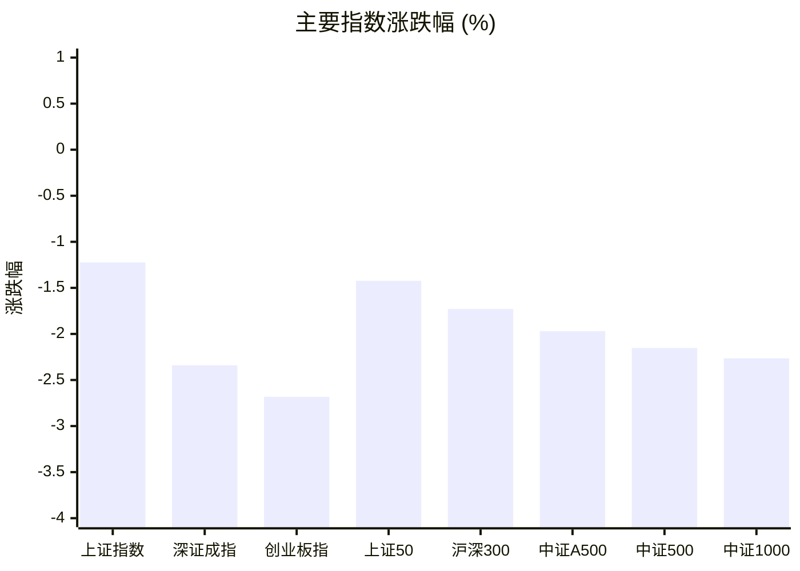
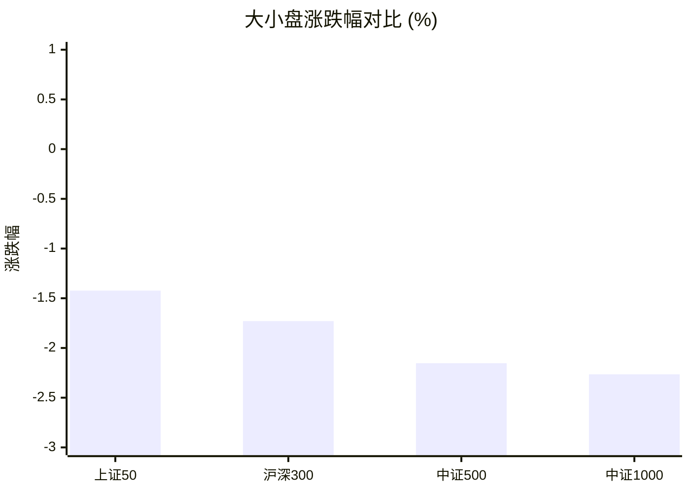
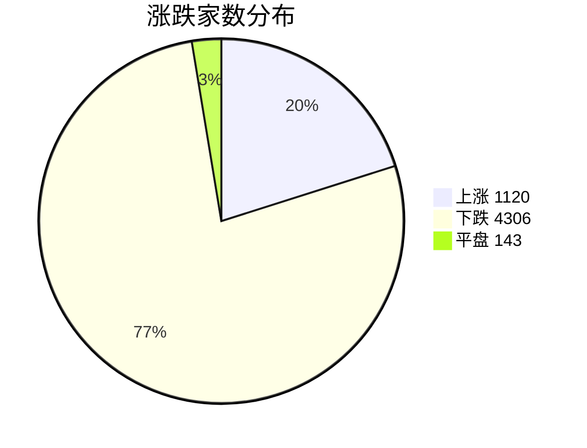
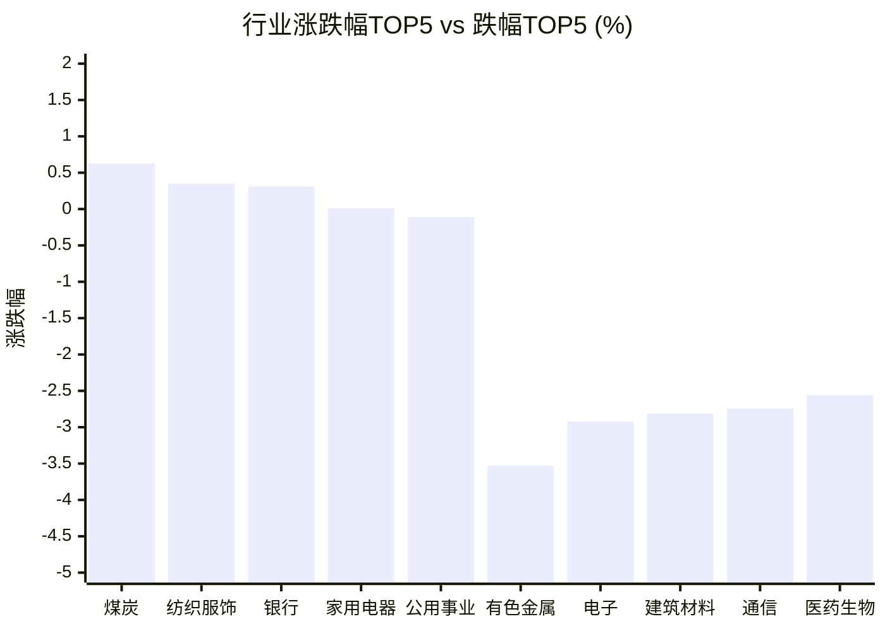

# 📊 A股收盘简报 | 2026-09-24 周四

---

## 📈 一、大盘概况

2026年09月24日 是 A 股交易日，收盘数据已可用。

### 主要指数表现

| 指数 | 收盘价 | 涨跌幅 | 涨跌点 | 成交额(亿) | 前收盘 | 开盘 | 最高 | 最低 |
|------|--------|--------|--------|-----------|--------|------|------|------|
| 上证指数 | 3888.37 | **▼1.22%** | -48.15 | 7836.13亿 | 3936.52 | 3925.32 | 3930.50 | 3888.37 |
| 深证成指 | 13316.97 | **▼2.34%** | -319.10 | 8697.44亿 | 13636.07 | 13575.07 | 13577.86 | 13316.97 |
| 创业板指 | 3288.95 | **▼2.68%** | -90.66 | 4119.41亿 | 3379.61 | 3366.89 | 3371.61 | 3288.95 |
| 上证50 | 2842.74 | **▼1.42%** | -41.03 | 1027.31亿 | 2883.77 | 2874.14 | 2874.14 | 2842.74 |
| 沪深300 | 4439.14 | **▼1.73%** | -78.14 | 3754.62亿 | 4517.28 | 4499.86 | 4500.20 | 4439.14 |
| 中证A500 | 5486.01 | **▼1.97%** | -110.17 | 5222.39亿 | 5596.18 | 5573.28 | 5573.90 | 5486.01 |
| 中证500 | 7624.07 | **▼2.15%** | -167.75 | 2699.23亿 | 7791.82 | 7763.73 | 7774.22 | 7624.07 |
| 中证1000 | 7570.14 | **▼2.26%** | -175.42 | 3433.06亿 | 7745.56 | 7707.87 | 7725.52 | 7569.51 |

### 市场整体成交

- **沪深合计成交额**: **16533.57亿**
- **较前日缩量** 1116.19亿（-6.3%）

---

## 📊 二、指数涨跌幅对比

---

## 📊 三、市值结构 — 大小盘对比

| 指数 | 涨跌幅 | 特征 |
|------|--------|------|
| 上证50 | **▼1.42%** | 超大盘 |
| 沪深300 | **▼1.73%** | 大盘 |
| 中证500 | **▼2.15%** | 中盘 |
| 中证1000 | **▼2.26%** | 小盘 |

> 📌 **大盘蓝筹占优**，上证50领涨，市场偏好核心资产。

---

## 📉 四、市场广度
### 涨跌家数分布

### 关键统计

| 指标 | 数值 |
|------|------|
| 上涨家数 | 1120 |
| 下跌家数 | 4306 |
| 平盘家数 | 143 |
| 涨停家数 | 53 |
| 跌停家数 | 16 |
| 全市场中位数 | **▼1.30%** |

---
## 🏢 五、行业表现

### 🔥 涨幅榜 TOP 10

| 排名 | 行业(申万一级) | 涨跌幅 |
|------|---------------|--------|
| 🥇 | 煤炭(申万) | **▲+0.63%** |
| 🥈 | 纺织服饰(申万) | **▲+0.35%** |
| 🥉 | 银行(申万) | **▲+0.31%** |
| 4 | 家用电器(申万) | **▲+0.01%** |
| 5 | 公用事业(申万) | **▼0.11%** |
| 6 | 石油石化(申万) | **▼0.15%** |
| 7 | 美容护理(申万) | **▼0.28%** |
| 8 | 交通运输(申万) | **▼0.43%** |
| 9 | 轻工制造(申万) | **▼0.82%** |
| 10 | 综合(申万) | **▼0.98%** |

### ❄️ 跌幅榜 TOP 10

| 排名 | 行业(申万一级) | 涨跌幅 |
|------|---------------|--------|
| 31 | 有色金属(申万) | **▼3.53%** |
| 30 | 电子(申万) | **▼2.92%** |
| 29 | 建筑材料(申万) | **▼2.81%** |
| 28 | 通信(申万) | **▼2.74%** |
| 27 | 医药生物(申万) | **▼2.56%** |
| 26 | 房地产(申万) | **▼2.31%** |
| 25 | 基础化工(申万) | **▼1.95%** |
| 24 | 电力设备(申万) | **▼1.95%** |
| 23 | 机械设备(申万) | **▼1.83%** |
| 22 | 计算机(申万) | **▼1.73%** |

> 📉 **行业普跌**，多数板块调整。 涨幅第一：**煤炭(申万)**（+0.63%）。 跌幅第一：**有色金属(申万)**（-3.53%）。

---

## 💡 六、热门概念

| 概念 | 涨跌幅 |
|------|--------|
| 两岸融合指数 | **▲+4.65%** |
| 中船系指数 | **▲+1.70%** |
| 减速器指数 | **▲+1.04%** |
| 央企煤炭指数 | **▲+0.83%** |
| 银行精选指数 | **▲+0.75%** |
| 航运精选指数 | **▲+0.60%** |
| K-12教育指数 | **▲+0.52%** |
| 风力发电指数 | **▲+0.50%** |
| 央企银行指数 | **▲+0.42%** |
| AEBS指数 | **▲+0.39%** |

> 📌 今日热门概念集中在 **两岸融合指数**（+4.65%） 等方向。

---

## 💰 七、资金流向

### 主力资金概况

| 指标 | 数值(亿元) |
|------|------|
| 主力资金净流入 | -487.26 |

### 资金流入行业 TOP5

| 行业 | 净流入(亿元) |
|------|--------|
| 汽车 | 12.08 |
| 银行 | 11.15 |
| 煤炭 | 7.92 |
| 家用电器 | 7.63 |
| 传媒 | 6.32 |

> 🔴 **主力资金大幅净流出**，市场谨慎情绪升温。

---

## 🌍 八、周边市场

| 指数 | 涨跌幅 |
|------|--------|
| 日经225 | **▲+0.76%** |
| 恒生指数 | **▼0.29%** |
| 道琼斯工业平均 | **▼0.68%** |
| 标普500 | **▼0.75%** |
| 纳斯达克指数 | **▼1.13%** |

> 📌 全球市场多数下跌，外围情绪偏弱。

---

## 📊 九、期货市场

| 品种 | 涨跌幅 |
|------|--------|
| IC2610 | **▼2.41%** |
| IC2611 | **▼2.50%** |
| IC2612 | **▼2.63%** |
| IC2703 | **▼2.80%** |
| IF2610 | **▼1.83%** |
| IF2611 | **▼1.83%** |
| IF2612 | **▼1.95%** |
| IF2703 | **▼2.06%** |
| IH2610 | **▼1.62%** |
| IH2611 | **▼1.65%** |

---

## 📰 十、财经要闻

- 诚通证券早报 | 9月24日资讯聚焦一文全掌握
- 整整两年了，A股市值增加了51万亿，你赚钱了吗？
- 人工智能赛道每日简报2026年9月24日
- A股午盘三大指数集体回落 银行逆市上涨0.71%
- A股低开低走，沪指失守3900点，超4300只个股下跌！福建板块突然拉升，多股涨停；地产震荡调整，华丽家族跌停｜A股收盘

---

## 🤖 十一、盘面结论

> 分析来源：AI Agent

一句话定性：今日属于放量偏弱的普跌调整，成长与中小盘跌幅更深，防御与资源相对抗跌。

- 主要指数全线下跌：上证指数跌 1.22%，深证成指跌 2.34%，创业板指跌 2.68%；中证1000 跌 2.26%，弱于上证50 的 1.42%。
- 两市成交额 16533.57 亿元，较前日缩量 1116.19 亿元（-6.3%）；上涨 1120 家、下跌 4306 家、平盘 143 家，涨停 53 家、跌停 16 家，市场中位数下跌 1.30%，市场下跌范围明显占优。
- 行业上煤炭、纺织服饰、银行分别上涨 0.63%、0.35%、0.31%，而有色金属、电子、建筑材料分别下跌 3.53%、2.92%、2.81%；主力资金净流出 487.26 亿元，盘面修复仍需观察。

---

## 🎯 十二、主线轮动

> 分析来源：AI Agent

1. **防御与资源相对强势**：煤炭、银行、家用电器居行业涨幅前列，属于调整日中的相对强度方向；但行业强度尚未扩散，需看到次日继续跑赢主要指数并保持涨幅，若同步转弱则轮动暂未确认。
2. **两岸融合与中船系概念活跃**：两岸融合指数上涨 4.65%、中船系指数上涨 1.70%，是今日概念端的突出方向；若后续概念涨幅收窄且行业数据不能同步改善，则更偏事件驱动的短线表现，主线地位失效。
3. **成长科技方向承压，等待止跌信号**：创业板指跌 2.68%，电子、通信、计算机分别跌 2.92%、2.74%、1.73%，说明高波动成长链条尚未完成企稳；只有当相关指数跌幅收敛、市场广度改善并出现行业相对强度回升时，才可确认修复。

---

## 🔍 十三、明日关注

> 分析来源：AI Agent

1. **观察对象：市场广度与主要指数同步性。** 确认信号：上涨家数回升、下跌家数收敛，且上证指数与中证1000 跌幅同步收窄。失效信号：下跌家数继续显著占优并伴随跌停家数增加。
2. **观察对象：煤炭、银行等相对强势行业。** 确认信号：行业继续位居涨幅前列，并出现更多行业跟随而非单一板块独强。失效信号：煤炭、银行转跌或涨幅快速收窄，同时防御板块普遍走弱。
3. **观察对象：电子、通信、计算机及创业板方向。** 确认信号：相关行业跌幅收敛、创业板指止跌并重新获得相对强度。失效信号：行业跌幅继续扩大、创业板指再度明显弱于上证指数。

---

## 📌 数据来源与免责声明

- **数据来源**：万得 Wind 金融数据服务
- **数据日期**：2026-09-24 收盘
- **生成时间**：2026年09月24日
- **免责声明**：本简报基于 Wind 数据自动生成，AI 分析部分（如有）仅供参考，不构成任何投资建议。市场有风险，投资需谨慎。
